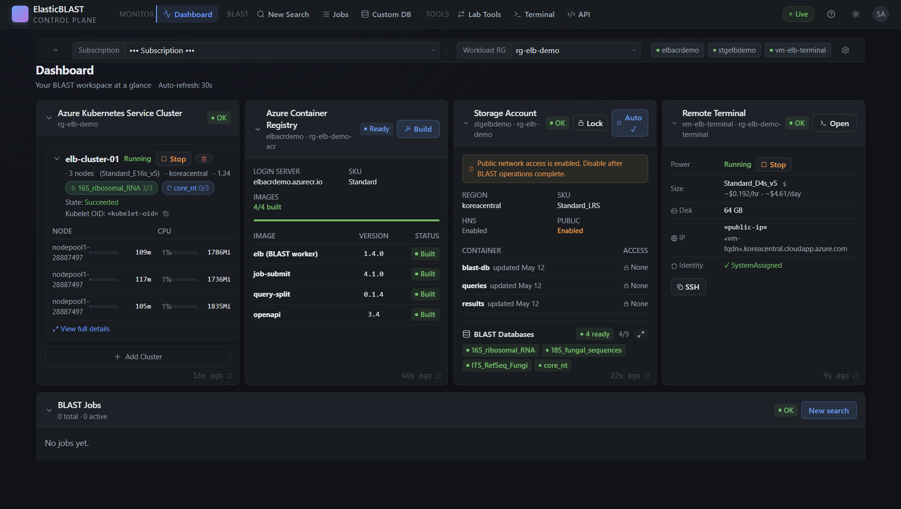

# elastic-blast-azure-functionapp

Browser-only control plane for [ElasticBLAST on Azure](https://github.com/dotnetpower/elastic-blast-azure).

A researcher signs in with `az login` in the browser, provisions a **Remote Terminal** VM
with one click, and monitors AKS / Storage / ACR / Job state from a glassmorphic dashboard.
The user never opens a local terminal during steady state — the local instructions below
are a one-time bring-up for the control plane itself.

> Project charter: [.github/copilot-instructions.md](./.github/copilot-instructions.md)

## Dashboard preview



A single glance shows every moving part of an ElasticBLAST run on Azure:

- **Azure Kubernetes Service Cluster** — node-pool CPU/memory live, cluster
  state, kubelet object id, and which BLAST databases are pre-warmed on each
  cluster (`16S_ribosomal_RNA 3/3`, `core_nt 0/3`). Start/stop/delete actions
  are inline.
- **Azure Container Registry** — login server, SKU, and the four pinned
  ElasticBLAST images (`elb 1.4.0`, `job-submit 4.1.0`, `query-split 0.1.4`,
  `openapi 3.4`) with build status per image. A one-click **Build** kicks off
  `az acr build` via a Durable Functions orchestrator.
- **Storage Account** — region, SKU, HNS state, and the explicit
  `publicNetworkAccess` toggle that ElasticBLAST requires during `submit /
  status / delete`. The **Auto** mode flips it on for the duration of a job
  and back off on completion (see [Storage window §9 of the charter](./.github/copilot-instructions.md)).
  The container row shows blob counts and last-update times for `blast-db`,
  `queries`, and `results`; the BLAST Databases chip row reflects what is
  ready for immediate use.
- **Remote Terminal** — VM power state, size + hourly/daily cost, OS disk
  size, public IP/FQDN, managed-identity status, and **Open / SSH** buttons
  that launch the browser shell (xterm.js over a WebSocket → SSH proxy).
- **BLAST Jobs** — submission history with status, elapsed time, and
  drill-down to per-orchestration event history. The card is empty in this
  screenshot because no jobs were submitted yet.

> Subscription name, public IP, FQDN, and the kubelet object id are masked in
> this screenshot. The dashboard renders the real values when you sign in.

## Layout

```
api/        Azure Functions (Python v2, Durable Functions)
web/        React + Vite + TypeScript SPA (glassmorphic theme)
infra/      Bicep IaC (Function App, Static Web App, Key Vault, Storage)
scripts/    cloud-init for the Remote Terminal VM + dev bootstrap scripts
docs/       Architecture notes + per-feature change log
tests/      pytest (api) + vitest (web)
```

## Architecture Planning

- [Container Apps migration plan](./docs/container-apps-migration.md) - target
  architecture and phased migration from the current Function App backend to
  **a single Azure Container App** that bundles six sidecars: `frontend`
  (nginx serving the React SPA), `api` (FastAPI), Celery `worker`, Celery
  `beat`, a `redis` broker, and a `terminal` shell with the `elastic-blast`
  toolchain. State lives in **Azure Storage** (table + append blobs); Redis
  AOF and the terminal `/home/azureuser` are persisted on Azure Files shares.
  **Every Storage account is `publicNetworkAccess=Disabled` from day 1** and
  is reachable only by the Container App over private endpoints in the
  platform VNet. **All browser uploads and downloads are streamed through the
  api sidecar — no SAS tokens are issued to the browser.** **The browser
  shell is the `terminal` sidecar; there is no Remote Terminal VM, no SSH,
  and no admin password.** No Service Bus, no managed database, no separate
  Redis VM, no Static Web App, no temporary storage public-access window.

## Prerequisites

| Tool         | Minimum  | Notes                                  |
| ------------ | -------- | -------------------------------------- |
| Azure CLI    | 2.81+    | Run `az login` first                   |
| Docker       | 20.x+    | Used to run Azurite (local storage)    |
| Python       | 3.11     | `python3.11 -m venv` must work         |
| Node.js      | 20 LTS   | For the SPA                            |
| Func Core    | 4.x      | `func --version` ≥ 4.0.6800            |
| jq, sshpass  | any      | `sudo apt install jq sshpass`          |

---

## End-to-end walkthrough (verified 2026-04-29 in `koreacentral`)

This is the exact sequence the maintainer uses to: bring up the control plane,
provision a Remote Terminal VM, run a tiny ElasticBLAST job, and tear everything
down. Each step has been executed end-to-end against a real Azure subscription.

### 0. Sign in to Azure

```bash
az login
az account set --subscription "<your-subscription>"
```

### 1. One-shot local bootstrap

Creates the App Registration (with `user_impersonation` scope + ARM permission),
a Key Vault for VM passwords, and writes both
`web/.env.local` and `api/local.settings.json`.

```bash
./scripts/dev/bootstrap-local.sh
```

Then enable dev-bypass for the local Function App (so the API trusts your local
`az login` instead of validating MSAL bearer tokens — production keeps this off):

```bash
jq '.Values.AUTH_DEV_BYPASS = "true"' api/local.settings.json > /tmp/ls.json \
  && mv /tmp/ls.json api/local.settings.json
```

### 2. Start the local stack

Three components in three terminals:

```bash
# Terminal 1 — Azurite (local Azure Storage emulator for Durable Functions)
./scripts/dev/start-azurite.sh

# Terminal 2 — Function App (API on http://localhost:7071)
cd api
python3.11 -m venv .venv && source .venv/bin/activate
pip install -r requirements.txt
func start --port 7071

# Terminal 3 — SPA (http://localhost:8090)
cd web
npm install
npm run dev
```

Smoke-test the API:

```bash
curl http://localhost:7071/api/health
# → {"status": "ok", "version": "0.1.0"}
```

### 3. Provision the Remote Terminal VM

Open <http://localhost:8090> in the browser, sign in, go to **Remote Terminal**,
and click **Start provisioning**. Defaults are: `rg-elb-terminal` /
`koreacentral` / `vm-elb-terminal` / `Standard_D4s_v5` / `azureuser`. The
**Allowed SSH CIDR** is auto-detected from `api.ipify.org`.

Or via CLI:

```bash
SUB=$(az account show --query id -o tsv)
IP=$(curl -s https://api.ipify.org)
curl -s -X POST http://localhost:7071/api/terminal/provision \
  -H "Content-Type: application/json" \
  -d "{
    \"subscription_id\":\"$SUB\",
    \"resource_group\":\"rg-elb-terminal\",
    \"region\":\"koreacentral\",
    \"vm_name\":\"vm-elb-test\",
    \"vm_size\":\"Standard_D4s_v5\",
    \"admin_username\":\"azureuser\",
    \"allowed_ssh_cidr\":\"$IP/32\"
  }" | jq -r .id | tee /tmp/inst.txt

INST=$(cat /tmp/inst.txt)
while :; do
  S=$(curl -s "http://localhost:7071/api/terminal/status/$INST" | jq -r .runtime_status)
  echo "$(date +%T) $S"
  [[ "$S" == "Completed" || "$S" == "Failed" ]] && break
  sleep 30
done
curl -s "http://localhost:7071/api/terminal/status/$INST" | jq .output
```

Provisioning takes ~4 minutes (Ubuntu 22.04 + cloud-init installs Azure CLI,
kubectl, azcopy, Python 3.11 + venv, clones `elastic-blast-azure`, builds
the wheel, and registers env vars). The orchestration polls Run Command for
`cloud-init status --wait` and only returns when the script reports `done`.

Reveal the password (one-shot):

```bash
PWD=$(curl -s http://localhost:7071/api/terminal/vm-elb-test/password | jq -r .password)
echo "$PWD"
```

SSH in (`azureuser` / above password):

```bash
sshpass -p "$PWD" ssh \
  -o StrictHostKeyChecking=no -o UserKnownHostsFile=/dev/null \
  azureuser@elb-term-vm-elb-test.koreacentral.cloudapp.azure.com
```

> The VM uses its system-assigned Managed Identity for Azure CLI and azcopy.
> If the session is not active, run `elb-az-login-mi`. Everything else is
> preinstalled.

### 4. Provision the ElasticBLAST resource plane

These are the steps from `azure-prereq.md` §3, §4, §6, §7. The web app's
`monitor/*` endpoints will display them once they exist; you can run them
from your local laptop today (the orchestrators that wrap these are on the
roadmap — see _Roadmap_ below).

```bash
SUB=$(az account show --query id -o tsv)
REGION=koreacentral
RG=rg-elb
ACR_RG=rg-elbacr
ACR_NAME=elbacr$(echo $RANDOM | cksum | cut -c1-6)
SA_NAME=stelb$(echo $RANDOM | cksum | cut -c1-6)

# Resource groups
az group create -n $RG     -l $REGION -o none
az group create -n $ACR_RG -l $REGION -o none

# ACR
az acr create -g $ACR_RG -n $ACR_NAME --sku Standard -o none

# Storage account + 3 containers
az storage account create -g $RG -n $SA_NAME --hns true -l $REGION --sku Standard_LRS -o none
for c in blast-db queries results; do
  az storage container create --account-name $SA_NAME -n $c --auth-mode login -o none
done
```

### 5. Build the three ACR images (no local Docker required)

```bash
cd ~/dev/elastic-blast-azure   # the sibling repo

az acr build -r $ACR_NAME -t ncbi/elb:1.4.0 \
  -f docker-blast/Dockerfile docker-blast/

az acr build -r $ACR_NAME -t ncbi/elasticblast-query-split:0.1.4 \
  -f docker-qs/Dockerfile docker-qs/

# job-submit needs the templates/ directory rsync'd into the build context
( cd docker-job-submit && cp -r ../src/elastic_blast/templates . \
  && az acr build -r $ACR_NAME -t ncbi/elasticblast-job-submit:4.1.0 \
       -f Dockerfile.azure . ; rm -rf templates )

az acr repository list -n $ACR_NAME -o tsv
# → ncbi/elasticblast-job-submit
#   ncbi/elasticblast-query-split
#   ncbi/elb
```

Image tags must match `api/services/image_tags.py::IMAGE_TAGS` and
`elastic-blast-azure/src/elastic_blast/constants.py`. The dashboard
ACR card highlights mismatches.

### 6. Run a tiny ElasticBLAST job (pdbnt, 1-row query)

```bash
# Open public network access for the storage account (azure-prereq.md §9)
az storage account update -n $SA_NAME --public-network-access Enabled -o none
sleep 15

# Upload pdbnt (~15 MB, ~10s) directly from NCBI S3 to Azure Blob
export AZCOPY_AUTO_LOGIN_TYPE=MSI
LATEST=$(curl -s "https://ncbi-blast-databases.s3.amazonaws.com/latest-dir")
azcopy cp \
  "https://ncbi-blast-databases.s3.amazonaws.com/${LATEST}/*" \
  "https://${SA_NAME}.blob.core.windows.net/blast-db/pdbnt/" \
  --include-pattern "pdbnt.*" --block-size-mb=64

# Tiny query
cat > /tmp/test-query.fa <<'EOF'
>test_query_1
ATGAAACAGCAGCAGAAGCAGCAGCAGCAGCAGCAGCAGCAGCAGCAGCAGCAGCAGCAGCAGCAGCAGCAGCAGCAG
GCATGCATGCATGCATGCATGCATGCATGCATGCATGCATGCATGCATGCATGCATGCATGCATGCATGCATGCATG
EOF
azcopy cp /tmp/test-query.fa "https://${SA_NAME}.blob.core.windows.net/queries/"

# Config
cat > /tmp/test.ini <<EOF
[cloud-provider]
azure-region = koreacentral
azure-acr-resource-group = $ACR_RG
azure-acr-name = $ACR_NAME
azure-resource-group = $RG
azure-storage-account = $SA_NAME
azure-storage-account-container = blast-db

[cluster]
name = elastic-blast-test
machine-type = Standard_D8s_v3
num-nodes = 1
reuse = false

[blast]
program = blastn
db = https://$SA_NAME.blob.core.windows.net/blast-db/pdbnt/pdbnt
queries = https://$SA_NAME.blob.core.windows.net/queries/test-query.fa
results = https://$SA_NAME.blob.core.windows.net/results
options = -evalue 0.01 -outfmt 7
EOF

# Submit
cd ~/dev/elastic-blast-azure
source venv/bin/activate
export ELB_SKIP_DB_VERIFY=true ELB_DISABLE_AUTO_SHUTDOWN=1 \
       PYTHONPATH=src:$PYTHONPATH

python bin/elastic-blast submit --cfg /tmp/test.ini    # ~5-10 min cold start
python bin/elastic-blast status --cfg /tmp/test.ini
```

Watch the AKS cluster come up + jobs run:

```bash
az aks get-credentials -g $RG -n elastic-blast-test --overwrite-existing
kubectl get jobs,pods
```

You should see four jobs in order: `init-pv` → `submit-jobs` →
`blastn-batch-pdbnt-job-000` → `elb-finalizer`, all `Complete 1/1`.

### 7. Inspect results

```bash
# One-time: grant your user data-plane access to the storage account
MY_OID=$(az ad signed-in-user show --query id -o tsv)
az role assignment create \
  --assignee-object-id $MY_OID --assignee-principal-type User \
  --role "Storage Blob Data Contributor" \
  --scope $(az storage account show -g $RG -n $SA_NAME --query id -o tsv) -o none
sleep 15

# Download
mkdir -p /tmp/elb-results
JOB_DIR=$(azcopy list "https://${SA_NAME}.blob.core.windows.net/results/" \
  | grep -oP 'job-[a-f0-9]+' | head -1)
azcopy cp \
  "https://${SA_NAME}.blob.core.windows.net/results/$JOB_DIR/*" \
  /tmp/elb-results/ --recursive
zcat /tmp/elb-results/batch_000-blastn-pdbnt.out.gz
```

Expected output (pdbnt has nothing matching the synthetic query —
zero hits is the correct outcome and proves the full pipeline ran):

```
# BLASTN 2.17.0+
# Query: test_query_1
# Database: pdbnt
# 0 hits found
# BLAST processed 1 queries
```

### 8. Tear everything down

```bash
# 1) ElasticBLAST resources (jobs + AKS)
cd ~/dev/elastic-blast-azure
source venv/bin/activate
export PYTHONPATH=src:$PYTHONPATH ELB_SKIP_DB_VERIFY=true
python bin/elastic-blast delete --cfg /tmp/test.ini
az aks delete -g rg-elb -n elastic-blast-test --yes --no-wait

# 2) Workload + ACR + Terminal + Platform RGs and the App Registration
cd ~/dev/elastic-blast-azure-functionapp
./scripts/dev/teardown-local.sh --include-workload

# 3) Stop local services
docker rm -f azurite-elb       # already done by teardown-local.sh
# Ctrl+C the func and npm processes
```

`teardown-local.sh` triggers async deletes on `rg-elb-platform`,
`rg-elb-terminal` (and `rg-elb`, `rg-elbacr` with `--include-workload`),
deletes the App Registration referenced by `api/local.settings.json`,
and removes the Azurite container. Verify:

```bash
az group list --query "[?starts_with(name,'rg-elb')]" -o table
# → empty within a few minutes
```

---

## Roadmap

The following are deliberately **not** in scope for the current milestone
and would be addressed in a follow-up PR:

- Browser-embedded SSH terminal (xterm.js + WebSocket proxy).
- Durable orchestrators that wrap §4 + §5 + §7 above (so the resource
  plane is also driven by the SPA, not the laptop CLI).
- Full deployment via `azd up` (Bicep is in `infra/` but not yet
  wired into a CI pipeline).
- Storing per-job state in a Durable Entity for the dashboard's Job card.

## Authentication (production path)

In production (`AUTH_DEV_BYPASS=false`):

1. SPA acquires an MSAL access token for `api://<client-id>/user_impersonation`.
2. Function App validates the JWT against the tenant's OIDC discovery + JWKS.
3. Backend uses its system-assigned Managed Identity for downstream ARM and
  data-plane calls. The browser token proves who called; it is not exchanged
  for Azure resource tokens.
4. The Remote Terminal VM uses its system-assigned Managed Identity for Azure
  CLI and azcopy. Device-code login is only needed when a user intentionally
  wants a personal Azure CLI session.

`AUTH_DEV_BYPASS=true` short-circuits step 2 and lets the API call Azure
with whatever credential `DefaultAzureCredential` finds (typically your
local `az login`). **Never enable this in production.**
