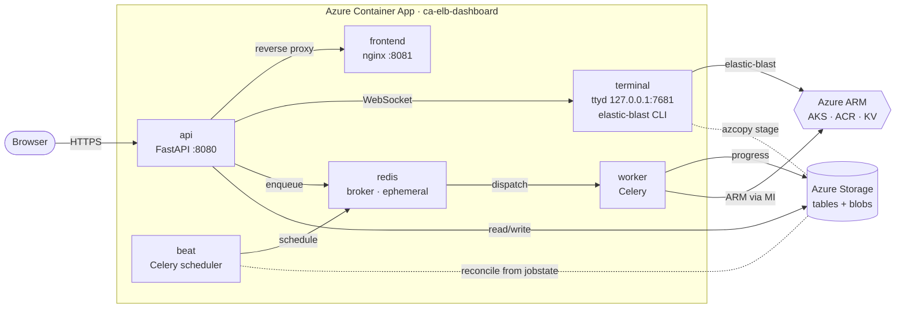

# elb-dashboard

[](https://github.com/dotnetpower/elb-dashboard/actions/workflows/docs.yml)
[](https://github.com/dotnetpower/elb-dashboard/actions/workflows/release.yml)
[](./LICENSE)
[](https://github.com/dotnetpower/elb-dashboard/releases)
[](./pyproject.toml)
[](./web/package.json)
[](https://fastapi.tiangolo.com/)
[](https://docs.celeryq.dev/)
[](https://react.dev/)
[](https://vitejs.dev/)
[](https://learn.microsoft.com/azure/container-apps/)
[](https://learn.microsoft.com/azure/azure-resource-manager/bicep/)
[](https://docs.astral.sh/uv/)
[](https://dotnetpower.github.io/elb-dashboard/)

Browser-only control plane for [ElasticBLAST on Azure](https://github.com/dotnetpower/elastic-blast-azure).

A researcher signs in through the browser, opens the embedded **Browser Terminal**
sidecar when command-line work is needed, and monitors AKS / Storage / ACR / Job
state from a glassmorphic dashboard. The user never opens a local terminal during
steady state; local commands are only for developers or operators bringing up the
control plane itself.

> Agent navigation map: [AGENTS.md](./AGENTS.md)
> · Live docs: <https://dotnetpower.github.io/elb-dashboard/>

## Pick your path

| You are a… | Start here |
|---|---|
| **Researcher** running BLAST | <https://dotnetpower.github.io/elb-dashboard/user-guide/> — no checkout required |
| **Operator** deploying the control plane | [Quick start: deploy to Azure](#quick-start-deploy-to-azure-in-one-command) ↓ |
| **Contributor** changing the code | [Get started guide](./docs/get-started.md) → [Contributing](#contributing) ↓ |
| **AI agent** | [AGENTS.md](./AGENTS.md) (route map + tripwires) → [.github/copilot-instructions.md](./.github/copilot-instructions.md) (charter) |

## Table of contents

- [Dashboard preview](#dashboard-preview)
- [Architecture at a glance](#architecture-at-a-glance)
- [Layout](#layout)
- [Quick start: deploy to Azure](#quick-start-deploy-to-azure-in-one-command)
- [Prerequisites](#prerequisites)
- [Local development](#local-development)
- [Driving a deployed environment from your laptop](#driving-a-deployed-environment-from-your-laptop)
- [Roadmap](#roadmap)
- [Authentication (production path)](#authentication-production-path)
- [Contributing](#contributing)
- [License](#license)

## Dashboard preview


A single glance shows every moving part of an ElasticBLAST run on Azure:

- **Azure Kubernetes Service Cluster** — node-pool CPU/memory live, cluster
  state, kubelet object id, and which BLAST databases are pre-warmed on each
  cluster (`16S_ribosomal_RNA 3/3`, `core_nt 0/3`). Start/stop/delete actions
  are inline.
- **Azure Container Registry** — login server, SKU, and the four pinned
  ElasticBLAST images (`ncbi/elb 1.4.0`, `elasticblast-job-submit 4.1.0`,
  `elasticblast-query-split 0.1.4`, `elb-openapi 4.14`) with build status per
  image. A one-click **Build** kicks off `az acr build` via a Celery task on
  the worker sidecar. Source of truth: [api/services/image_tags.py](./api/services/image_tags.py).
- **Storage Account** — region, SKU, HNS state, and the read-only
  `publicNetworkAccess` indicator (always **Disabled** in steady state
  — see [docs/container-apps-migration.md §Storage Network Isolation](./docs/container-apps-migration.md#storage-network-isolation-hard-requirement)).
  The container row shows blob counts and last-update times for `blast-db`,
  `queries`, and `results`; the BLAST Databases chip row reflects what is
  ready for immediate use.
- **Browser Terminal** — `terminal` sidecar process state, last `az login`
  heartbeat, and an **Open** button that launches the embedded shell
  (xterm.js over a same-origin WebSocket → loopback `ttyd`). No SSH, no
  password reveal.
- **BLAST Jobs** — submission history with status, elapsed time, and
  drill-down to the Celery task's full event history from Table Storage.
  The card is empty in this screenshot because no jobs were submitted yet.

> Subscription name and the kubelet object id are masked in this screenshot.
> The dashboard renders the real values when you sign in.

## Architecture at a glance

One Azure Container App revision (`ca-elb-dashboard`) bundles **six sidecars**.
The public ingress only targets the `api` sidecar on port 8080; everything else
talks loopback.



**State**: durable rows in Azure Storage Tables, append blobs for command
history. Sidecars are **ephemeral** — on revision restart, `beat` rebuilds the
in-flight queue from the `jobstate` table and the `terminal` re-authenticates
with the Managed Identity (user files stage to workload Storage via `azcopy`,
not to a local mount). **No managed database, no Service Bus, no Static Web
App, no Remote Terminal VM, no Azure Files shares.**

## Layout

```
api/        Backend — FastAPI for the api sidecar + Celery worker/beat (also shared Azure SDK service wrappers and HTTP boundary helpers)
web/        React + Vite + TypeScript SPA + Dockerfile + nginx.conf for the frontend sidecar
terminal/   Dockerfile + entrypoint for the terminal sidecar (ttyd + elastic-blast toolchain + exec_server)
infra/      Bicep IaC (network, identity, ACR, storage, Key Vault, Container Apps Env, Container App)
scripts/    Dev helpers + `postprovision.sh` (builds images, swaps the Container App template)
docs/       Architecture notes, per-feature change log, and the published docs site source
```

## Quick start: deploy to Azure in one command

This repo is hardened so a fresh `git clone` can deploy the full
control-plane bundle (one Container App with six sidecars, a private VNet, a
locked-down Storage account, an ACR, a Key Vault, and Log Analytics) with a
single `azd up`. **Cost is roughly USD 130/month** in `koreacentral` for the
default sizing (see [docs/container-apps-migration.md §Cost Estimate](./docs/container-apps-migration.md#cost-estimate-korea-central-usd-monthly)).

For first-time setup, especially on Windows, use the guided walkthrough first:
[docs/get-started.md](./docs/get-started.md).

### 1. Install prerequisites

```bash
# macOS / Linux
curl -fsSL https://aka.ms/install-azd.sh | bash
curl -sL https://aka.ms/InstallAzureCLIDeb | sudo bash   # or `brew install azure-cli`
sudo apt install -y jq curl                              # `brew install jq curl`
```

Verify:

```bash
./scripts/dev/preflight-check.sh
```

### 2. Sign in

```bash
az login
az account set --subscription "<your-subscription>"
```

The deployment creates or reuses the App Registration automatically during `azd up`. If your tenant blocks App Registration creation, ask an Entra administrator to create it once and set `API_CLIENT_ID` in the azd environment.

### 3. Create the azd environment

```bash
azd env new elb-dashboard
azd env set AZURE_LOCATION       koreacentral

# Optional: same-origin only (recommended once the SPA is served by the
# frontend sidecar). Leave empty for that.
# azd env set ALLOWED_ORIGINS     "https://my-other-spa.example.com"

# Optional: leave private networking off for the very first deploy so the
# postprovision hook can push images and seed secrets, then flip on a
# second `azd provision`.
azd env set LOCKDOWN_PRIVATE_NETWORKING false
```

### 4. Deploy

For the shortest fresh-clone path, run the bootstrap wrapper. It checks `az account show`, starts `az login` if needed, prepares the `elb-dashboard` azd environment so the resource group is `rg-elb-dashboard`, runs `azd up`, and opens the deployed Container App URL:

```bash
./deploy.sh
```

If you prefer the raw azd command after preparing/selecting the environment, run:

```bash
azd up
```

`azd up` runs:

The command prints an `azd up progress map` before long-running work starts,
then marks the active step as `[n/8]` while it runs.

1. **preprovision** — registers deployment Azure resource providers
  (`Microsoft.App`, `Microsoft.Authorization`, `Microsoft.ContainerRegistry`,
  `Microsoft.Storage`, etc.) and starts first-run workflow provider registration
  for Compute, ContainerService, and Quota. If `rg-elb-dashboard` already
  contains resources, the hook asks whether to delete it and continue, keep it
  and deploy to the next numbered group such as `rg-elb-dashboard-01`, or abort.
  Non-interactive runs can set `ELB_EXISTING_RG_ACTION=delete|number|abort`.
2. **provision** — runs [infra/main.bicep](./infra/main.bicep) which creates
  the platform RG, VNet (3 subnets), Log Analytics, optional App Insights, the
   shared user-assigned managed identity, the Premium ACR, the
   Standard_LRS Storage account (with state tables / blob containers),
   the Key Vault, the Container Apps Environment, and
   the Container App seeded with a hello-world bootstrap image.
3. **postprovision** — runs [scripts/dev/postprovision.sh](./scripts/dev/postprovision.sh)
   which builds the three images (`elb-api`, `elb-frontend`, `elb-terminal`)
   via `az acr build` (no local Docker needed) and runs `az deployment group
   create` to swap the Container App template to the six-sidecar layout.

When it finishes you get an HTTPS URL like
`https://ca-elb-dashboard.<subdomain>.koreacentral.azurecontainerapps.io`.

Verify the deployment in this order:

```bash
APP_URL=$(az containerapp show -g rg-elb-dashboard -n ca-elb-dashboard \
  --query properties.configuration.ingress.fqdn -o tsv)
curl -s "https://$APP_URL/api/health" | jq .       # api sidecar
curl -sI "https://$APP_URL/" | head -1             # frontend sidecar serves the SPA
```

Then open `https://$APP_URL/` in a browser, sign in with the MSAL popup, and
you should land on the Dashboard. The next things to click:

- **Cluster card → Start** — creates the first AKS node pool (one-time).
- **Browser Terminal → Open** — should drop you into the `terminal` sidecar with `elastic-blast --version` available.
- **BLAST → Submit** — walks you through a query against `16S_ribosomal_RNA`.

If any card renders `network_blocked` or `access_denied` from your laptop, see
[Driving a deployed environment from your laptop](#driving-a-deployed-environment-from-your-laptop) below.

### 5. (Recommended) Lock down the network on the second deploy

The first deploy keeps Storage / Key Vault / ACR public so `az acr build`
and Key Vault seeding can run from the operator's machine. The second
deploy flips `publicNetworkAccess` to `Disabled` on all three and adds
private endpoints:

```bash
azd env set LOCKDOWN_PRIVATE_NETWORKING true
azd provision
```

After this point the only client that can reach platform Storage / Key
Vault / ACR is the Container App, over private endpoints inside the
platform VNet (see [docs/container-apps-migration.md §Storage Network Isolation](./docs/container-apps-migration.md#storage-network-isolation-hard-requirement)).

### 6. Tear down

```bash
azd down --purge --force
```

Removes the platform RG and purges Key Vault soft-deletes.

---

## Prerequisites

| Tool         | Minimum  | Notes                                                                |
| ------------ | -------- | -------------------------------------------------------------------- |
| Azure CLI    | 2.81+    | Run `az login` first                                                 |
| azd          | 1.10+    | `curl -fsSL https://aka.ms/install-azd.sh \| bash`                   |
| uv           | 0.9+     | `curl -LsSf https://astral.sh/uv/install.sh \| sh` — drives Python tooling |
| Python       | 3.12     | Provided by `uv sync` (does not need to be installed system-wide)    |
| Node.js      | 20 LTS   | For the SPA                                                          |
| Docker       | 20.x+    | Optional — only needed for `scripts/dev/docker-compose.local.yml`    |
| jq, curl     | any      | `sudo apt install jq curl`                                           |

Deeper architecture reference: [docs/container-apps-migration.md](./docs/container-apps-migration.md).

## Local development

Local backend bring-up:

```bash
uv sync --all-groups        # creates .venv on Python 3.12 + installs runtime + dev tools
uv run pytest -q api/tests  # ~980 tests
scripts/dev/local-run.sh api
```

VS Code dev tasks and direct terminal runs through `scripts/dev/local-run.sh`
mirror local pipeline logs into `.logs/local/latest/` inside this project. The
newest 3 sessions are retained, each log chunk is capped at 1 MiB, and each
service keeps a bounded 16-chunk ring per session. Start with
`.logs/local/latest/api.log`, then check `worker.log`, `beat.log`, `web.log`,
and `smoke.log` when diagnosing warnings, errors, or pipeline health.
Docker Compose runs should go through `scripts/dev/local-run.sh compose-full`
or `compose-local`; detached compose runs also create
`compose-full-containers.log` / `compose-local-containers.log` with container
stdout/stderr and replay only the newest 200 lines by default.

If a teammate has already deployed the dashboard with `azd up` and you only
want to run the SPA / backend locally against that environment, do **not**
hand-edit `web/.env.local` with a clientId. Run `azd env refresh -e <env-name>`
to bind this clone to the existing azd environment, then start the web tier
with `scripts/dev/local-run.sh web` — it auto-exports `VITE_AZURE_CLIENT_ID`
from the deployed `API_CLIENT_ID`. Full walkthrough:
[docs/joining-existing-deployment.md](./docs/joining-existing-deployment.md).
When something is already broken, start with
[docs/troubleshooting.md](./docs/troubleshooting.md).

## Driving a deployed environment from your laptop

One-time RBAC + network setup. The local api uses `DefaultAzureCredential` →
your `az login` identity, which starts with **zero** RBAC on the workload
Storage / ACR. Without the steps below the dashboard will render
`network_blocked` / `access_denied` and DB downloads will fail with HTTP 403.

```bash
# 1. one-shot: grant your az user the minimum roles on the deployed environment.
#    Defaults match docs/auth.md (storage=elbstg01 in rg-elb-01, acr=elbacr01 in rg-elbacr-01).
#    Override with --storage / --storage-rg / --acr / --acr-rg if your deployment differs.
scripts/dev/grant-local-rbac.sh                  # add --dry-run to preview
# wait 1-5 min for RBAC propagation, then:

# 2. start the api with the local-debug Storage auto-open helper enabled —
#    this opens publicNetworkAccess for your caller IP only when needed.
LOCAL_DEBUG_AUTO_OPEN_STORAGE=true \
  AUTH_DEV_BYPASS=true \
  scripts/dev/local-run.sh api

# 3. when you're done debugging, close the network surface again:
scripts/dev/storage-public-access.sh off
```

Both helpers are idempotent; both refuse to act inside a Container App
(`CONTAINER_APP_NAME` env present). See
[`scripts/dev/README.md`](./scripts/dev/README.md) and
[`.github/copilot-instructions.md`](./.github/copilot-instructions.md) §9.

---

## Roadmap

Tracked work that is **not yet shipped**:

- Streaming upload/download proxy backing for the SPA `BlastResults`
  download/export buttons (charter §9 keeps Storage `publicNetworkAccess` off,
  so these must stream through the `api` sidecar — no SAS tokens).
- CI pipeline for `azd up` against an ephemeral subscription.
- Smaller polish items live in [docs/releases/unreleased.md](./docs/releases/unreleased.md).

## Authentication (production path)

In production (`AUTH_DEV_BYPASS=false`):

1. SPA acquires an MSAL access token for `api://<client-id>/user_impersonation`.
2. The api sidecar validates the JWT against the tenant's OIDC discovery + JWKS.
3. Backend uses the shared user-assigned Managed Identity `id-elb-dashboard-*` (mounted on the Container App, visible to all sidecars) for downstream ARM and data-plane calls. The browser token proves who called; it is not exchanged for Azure resource tokens.
4. The `terminal` sidecar inherits the same MI — `az login --identity` works out of the box. Device-code login is only needed when a user intentionally wants a personal Azure CLI session.

`AUTH_DEV_BYPASS=true` short-circuits step 2 and lets the API call Azure
with whatever credential `DefaultAzureCredential` finds (typically your
local `az login`). **Never enable this in production.**

## Contributing

PRs welcome. Before opening one:

1. **Read the rules.** [.github/copilot-instructions.md](./.github/copilot-instructions.md)
   is the project charter (Python 3.12 + `uv`, no `pip install`, no
   `requirements.txt`, no Azure Functions, Storage `publicNetworkAccess`
   stays `Disabled`, no SAS tokens to the browser, no Azure Run Command).
   [AGENTS.md](./AGENTS.md) is the route + tripwire map.
2. **Validate locally.** Every behaviour-changing PR must pass:
   ```bash
   uv run pytest -q api/tests   # ~980 tests
   uv run ruff check api        # lint
   cd web && npm run build      # SPA compiles cleanly
   ```
3. **Write a change note** under
   `docs/features_change/YYYY-MM/YYYY-MM-DD-<short-name>.md` describing
   motivation, user-facing change, API/IaC diff, and validation evidence.
4. **Conventional Commits.** `feat:`, `fix:`, `chore:`, `docs:`, … — English
   only in source, commits, docs, and UI strings (Korean is fine in PR
   conversation).
5. **No new dependency without justification** in the PR description.
6. **Release version bumps** go through [scripts/dev/bump-version.sh](./scripts/dev/bump-version.sh)
    — do not hand-edit `version` in `web/package.json` or `pyproject.toml`.
    Frontend build numbers are computed at build time from commits since the
    latest release tag.
   Full policy: [docs/copilot/version-management.md](./docs/copilot/version-management.md).

## License

[MIT](./LICENSE) © elb-dashboard maintainers. ElasticBLAST itself is
developed at NCBI under the U.S. Government public-domain notice — see the
[upstream repo](https://github.com/dotnetpower/elastic-blast-azure) and the
NCBI ElasticBLAST documentation for the runtime license.
