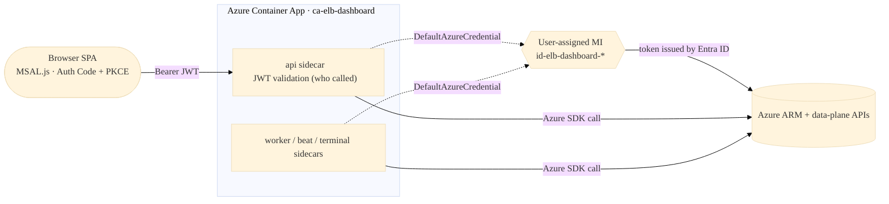
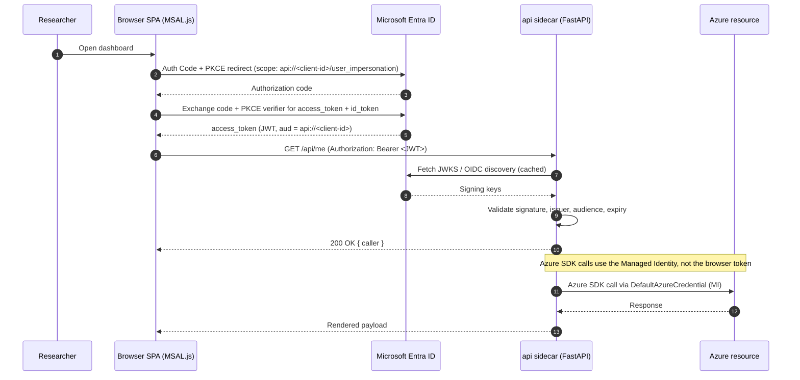

# Authentication & Authorization

This document describes the authentication flow and every RBAC role
required by the ElasticBLAST control plane.

!!! tip "TL;DR"

    Browser users sign in with MSAL.js (Auth Code + PKCE). The backend
    validates the bearer token for identity only — every Azure SDK call is
    made as the user-assigned managed identity `id-elb-dashboard-*` via
    `DefaultAzureCredential`. No service principal secrets, no on-behalf-of
    (OBO) flow, no SAS tokens to the browser.

---

## Architecture Overview



The browser token proves **who** called. Azure SDK calls use the **shared
user-assigned Managed Identity (MI) `id-elb-dashboard-*`** mounted on the
`ca-elb-dashboard` Container App (the api, worker, beat, and terminal sidecars
all pick it up via `DefaultAzureCredential`). On-Behalf-Of (OBO) is
deliberately not used.

### Sign-in handshake



**Why MI instead of OBO?**
- OBO requires `API_CLIENT_SECRET` and multi-resource consent, which are
  fragile in single-tenant research environments.
- MI simplifies deployment — no secrets to rotate.
- Acceptable trade-off: the MI needs broad permissions, but it is scoped
  to the Container App and auditable via Azure Monitor.

---

## §0 Post-Deploy Permissions Checklist (run after every `azd up`)

> **Important**: When the user-assigned MI `id-elb-dashboard-*` is recreated
> (e.g. after `azd down` followed by a fresh `azd up`) it gets a **new
> object ID**. Previous role assignments do not carry over. Run this
> checklist after each fresh provision.

### Step 1 — Capture the MI object ID

```bash
# Load azd env variables
source <(azd env get-values -e <YOUR_ENV> | sed 's/^/export /')

# Get the MI principal ID
MI_OID=$(az identity show --ids "$SHARED_IDENTITY_RESOURCE_ID" --query principalId -o tsv)
SUB=$(az account show --query id -o tsv)
echo "MI ObjectId: $MI_OID"
```

### Step 2 — Subscription-level roles (ARM management plane)

```bash
# Contributor — CRUD for AKS, Storage, ACR, Network, Key Vault
az role assignment create --assignee-object-id "$MI_OID" \
  --assignee-principal-type ServicePrincipal \
  --role "Contributor" --scope "/subscriptions/$SUB"

# Reader — list subscriptions, RGs
az role assignment create --assignee-object-id "$MI_OID" \
  --assignee-principal-type ServicePrincipal \
  --role "Reader" --scope "/subscriptions/$SUB"

# AKS Cluster User — get kubeconfig for direct K8s API calls
az role assignment create --assignee-object-id "$MI_OID" \
  --assignee-principal-type ServicePrincipal \
  --role "Azure Kubernetes Service Cluster User Role" --scope "/subscriptions/$SUB"

# User Access Administrator — runtime role assignments (AcrPull to kubelet, etc.)
# Best-effort: if missing, the code logs a recovery hint instead of failing.
az role assignment create --assignee-object-id "$MI_OID" \
  --assignee-principal-type ServicePrincipal \
  --role "User Access Administrator" --scope "/subscriptions/$SUB"
```

### Step 3 — Workload Storage Account (data plane)

```bash
# Replace with your workload storage account
WORKLOAD_STG="/subscriptions/$SUB/resourceGroups/rg-elb-01/providers/Microsoft.Storage/storageAccounts/elbstg01"

az role assignment create --assignee-object-id "$MI_OID" \
  --assignee-principal-type ServicePrincipal \
  --role "Storage Blob Data Contributor" --scope "$WORKLOAD_STG"
```

### Step 4 — Workload ACR (build + pull images)

```bash
# Replace with your workload ACR
WORKLOAD_ACR="/subscriptions/$SUB/resourceGroups/rg-elbacr-01/providers/Microsoft.ContainerRegistry/registries/elbacr01"

for role in "AcrPush" "AcrPull"; do
  az role assignment create --assignee-object-id "$MI_OID" \
    --assignee-principal-type ServicePrincipal \
    --role "$role" --scope "$WORKLOAD_ACR"
done
```

### Step 5 — Verify (wait 1-5 minutes for propagation)

```bash
az role assignment list --assignee "$MI_OID" --all \
  --query "[].{role:roleDefinitionName, scope:scope}" -o table
```

Expected: 14+ roles covering subscription, platform storage, workload storage, platform ACR, workload ACR.

---

## §1 Container App Managed Identity — Required RBAC Roles

The Container App's **shared user-assigned Managed Identity** `id-elb-dashboard-*`
is the principal that performs all Azure operations. It must be granted the
following roles.

### Subscription-Level (ARM Management Plane)

| Role | Purpose |
|------|---------|
| **Contributor** | Create/delete AKS, Storage, ACR, Network, Key Vault resources |
| **Reader** | List subscriptions, resource groups, VMs |
| **Azure Kubernetes Service Cluster User Role** | Get kubeconfig via `listClusterUserCredential` for direct K8s API calls |
| **User Access Administrator** | Assign RBAC roles at runtime (AcrPull to kubelet, etc.) — **best-effort**: code degrades gracefully if missing |

### Platform Resources (assigned by Bicep during `azd up`)

| Role | Scope | Purpose |
|------|-------|---------|
| Key Vault Secrets User | Platform Key Vault | Read App Registration values (see [infra/modules/keyvault.bicep](https://github.com/dotnetpower/elb-dashboard/blob/main/infra/modules/keyvault.bicep)) |
| Storage Blob Data Contributor | Platform Storage Account | Append-blob audit / payload blobs |
| Storage Table Data Contributor | Platform Storage Account | Job / schedule state in Table Storage |
| AcrPull + AcrPush | Platform ACR | Pull sidecar images + build new images |

> **No Azure Files SMB shares.** Earlier revisions mounted `redis-data` and
> `terminal-home` shares for sidecar persistence, but SMB mounts in Container
> Apps require a storage account key, which conflicts with the
> publicNetworkAccess=Disabled posture. Today the `redis` sidecar runs with
> `--save '' --appendonly no` (queue rebuilt from Storage state by the beat
> reconciler on revision restart) and the `terminal` sidecar's
> `/home/azureuser` is ephemeral — user files stage to workload Storage via
> `azcopy`. `Storage File Data SMB Share Contributor` is therefore no longer
> assigned. See [infra/modules/containerAppControl.bicep](https://github.com/dotnetpower/elb-dashboard/blob/main/infra/modules/containerAppControl.bicep) and
> [infra/modules/containerAppsEnvironment.bicep](https://github.com/dotnetpower/elb-dashboard/blob/main/infra/modules/containerAppsEnvironment.bicep).

### Workload Resources (manual after first `azd up`)

| Role | Scope | Purpose |
|------|-------|---------|
| **Storage Blob Data Contributor** | Workload storage account (e.g. `elbstg01`) | Upload queries, copy DBs from NCBI, list/read result blobs |
| **AcrPush + AcrPull** | Workload ACR (e.g. `elbacr01`) | Build ElasticBLAST images via ACR Build Tasks |

### Kubernetes (via kubeconfig, no additional RBAC on Azure)

Direct K8s API calls (get nodes/pods/jobs, top nodes, pod logs) use the
kubeconfig obtained via `Azure Kubernetes Service Cluster User Role`. No
additional Azure RBAC is needed for K8s data-plane operations.

---

## §2 Runtime Role Assignments (Best-Effort)

The shared MI performs RBAC assignments for other principals at
runtime. All are idempotent and soft-fail if the MI lacks
`Microsoft.Authorization/roleAssignments/write`.

### AKS Kubelet Identity

| Role | Scope | Purpose |
|------|-------|---------|
| AcrPull | ACR | Pull ElasticBLAST container images |
| Storage Blob Data Contributor | User storage account | Download BLAST DB shards to nodes |

### OpenAPI / Submit Workload Identity

| Role | Scope | Purpose |
|------|-------|---------|
| Contributor | Workload resource group | Run `elastic-blast submit`, including AKS cluster create/read/update operations |
| Storage Blob Data Contributor | User storage account | Upload query/config files and read BLAST DB blobs |
| Azure Kubernetes Service Cluster User Role | AKS cluster | Run Kubernetes API operations from the submit helper job |

### Signed-In User (convenience)

| Role | Scope | Purpose |
|------|-------|---------|
| Storage Blob Data Contributor | User storage account | Direct blob access |
| AcrPush | ACR | Trigger ACR builds |
| Key Vault Secrets Officer | Key Vault | Access VM passwords |

> If any assignment fails, the UI shows a toast with the manual
> `az role assignment create` command.

---

## §3 Signed-In User — Required Roles

The signed-in user needs minimal roles since all Azure operations go
through the shared MI:

| Role | Scope | Purpose |
|------|-------|---------|
| **Reader** | Subscription | See resources in the UI (cosmetic) |

All data-plane and mutation operations are performed by the MI.

---

## §4 Detailed Role Matrix by Feature

### Networking

| Feature | MI Role | Scope |
|---|---|---|
| Create VNet/Subnet/NSG/NIC/PublicIP | Contributor | Resource Group |

### Storage Account

| Feature | MI Role | Scope |
|---|---|---|
| Create / read containers | Contributor | Resource Group / Storage Account |
| List / upload / copy blobs (streamed through the api sidecar) | Storage Blob Data Contributor | Storage Account |

> **No SAS issuance.** Browser uploads/downloads are streamed through the api
> sidecar over the private endpoint. `Storage Blob Delegator` is intentionally
> NOT in the role list — see `docs/container-apps-migration.md` §"Browser ↔
> Storage Proxy".

### Azure Container Registry

| Feature | MI Role | Scope |
|---|---|---|
| Create registry | Contributor | Resource Group |
| Schedule ACR build | AcrPush or Contributor | Registry |

### Azure Kubernetes Service

| Feature | MI Role | Scope |
|---|---|---|
| Create/delete/start/stop cluster | Contributor | Resource Group |
| Get kubeconfig, run command | AKS Cluster User Role | Cluster |
| Direct K8s API (pods, jobs, metrics) | AKS Cluster User Role | Cluster |

### Key Vault

| Feature | MI Role | Scope |
|---|---|---|
| Create/update vault | Contributor | Resource Group |
| Store/read/delete secrets | Key Vault Secrets Officer | Vault |

---

## §5 Troubleshooting

| Error | Cause | Fix |
|---|---|---|
| `AuthorizationFailed` on ARM operations | MI lacks **Contributor** | Assign Contributor on the target RG or subscription |
| `AuthorizationPermissionMismatch` on blobs | MI lacks **Storage Blob Data Contributor** | Assign data-plane role on the storage account |
| `ForbiddenByRbac` on Key Vault | MI lacks **Key Vault Secrets Officer** | Assign on the vault |
| `does not have authorization` on RBAC | MI lacks **User Access Administrator** | Assign at target scope; or run the logged `az` command manually |
| `Forbidden` on AKS kubeconfig | MI lacks **AKS Cluster User Role** | Assign on the cluster |
| RBAC assigned but still failing | Propagation delay (typically 1–5 min; observed 403→200 within ~70s on `listClusterUserCredential`) | Wait and retry; verify with `az role assignment list --assignee <MI_OID>` |
| `No identity found` | MI not enabled | Portal → Container App → Identity → attach `id-elb-dashboard-*` |

---

## §6 Security Notes

- The MI has broad permissions by design — acceptable for a single-tenant
  research deployment where the MI is scoped to one Container App.
- The bearer token is validated but never used for downstream calls (no OBO
  flow; no `API_CLIENT_SECRET` is provisioned).
- The browser terminal is a `terminal` sidecar in the same Container App; the
  api sidecar proxies the WebSocket to loopback `ttyd` on `127.0.0.1:7681`
  after MSAL + tenant-role check. There is no SSH path, no NSG, no admin
  password, and no public IP.
- Every Storage account is `publicNetworkAccess: Disabled` and reachable only
  via private endpoint from the platform VNet — no anonymous access, no SAS
  to the browser, no temporary public-window toggle.
