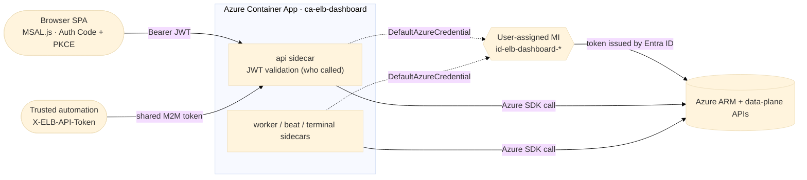
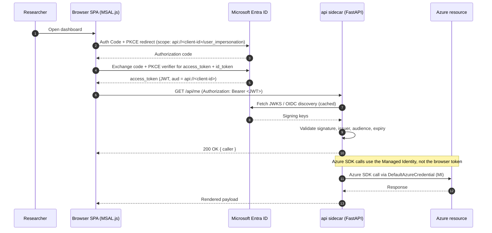

# Authentication & Authorization

This document describes the authentication flow and every RBAC role
required by the ElasticBLAST control plane.

!!! tip "TL;DR"

    Browser users sign in with MSAL.js (Auth Code + PKCE). The backend
    validates the bearer token for identity only — every Azure SDK call is
    made as the user-assigned managed identity `id-elb-dashboard-*` via
    `DefaultAzureCredential`. Trusted automation may use the shared
    `X-ELB-API-Token` while `ALLOW_OPENAPI_TOKEN_AUTH=true` (ON in the shared
    deployment defaults). No service principal secrets, no on-behalf-of (OBO)
    flow, no SAS tokens to the browser.

---

## Architecture Overview


```mermaid
%%{init: {"theme": "base", "themeVariables": {"fontFamily": "Inter, ui-sans-serif, system-ui, sans-serif"}, "flowchart": {"curve": "basis", "padding": 18}}}%%
flowchart LR
  browser(["Browser SPA<br/>MSAL.js · Auth Code + PKCE"])
  automation(["Trusted automation<br/>X-ELB-API-Token"])
  subgraph app["Azure Container App · ca-elb-dashboard"]
    api["api sidecar<br/>JWT validation (who called)"]
    sidecars["worker / beat / terminal sidecars"]
  end
  mi{{"User-assigned MI<br/>id-elb-dashboard-*"}}
  azure[("Azure ARM + data-plane APIs")]

  browser -- Bearer JWT --> api
  automation -- shared M2M token --> api
  api -. DefaultAzureCredential .-> mi
  sidecars -. DefaultAzureCredential .-> mi
  mi -- token issued by Entra ID --> azure
  api -- Azure SDK call --> azure
  sidecars -- Azure SDK call --> azure
```

The browser token proves **who** called. Azure SDK calls use the **shared
user-assigned Managed Identity (MI) `id-elb-dashboard-*`** mounted on the
`ca-elb-dashboard` Container App (the api, worker, beat, and terminal sidecars
all pick it up via `DefaultAzureCredential`). On-Behalf-Of (OBO) is
deliberately not used.

### Shared-token automation path

When `ALLOW_OPENAPI_TOKEN_AUTH=true`, any route using `require_caller` may
authenticate a trusted automation caller with `X-ELB-API-Token`. The token is
compared in constant time against the configured or runtime-cached OpenAPI
admin token and maps to a synthetic M2M caller; a wrong presented token returns
401 without falling through to bearer authentication. This path has no
caller-specific Azure RBAC identity, so deployments must control ingress and
rotate the shared token. Setting the gate to `false` restores MSAL-only
authentication. Browser behavior is unchanged.

### Sign-in handshake


```mermaid
sequenceDiagram
  autonumber
  participant U as Researcher
  participant SPA as Browser SPA (MSAL.js)
  participant Entra as Microsoft Entra ID
  participant API as api sidecar (FastAPI)
  participant Az as Azure resource

  U->>SPA: Open dashboard
  SPA->>Entra: Auth Code + PKCE redirect (scope: api://<client-id>/user_impersonation)
  Entra-->>SPA: Authorization code
  SPA->>Entra: Exchange code + PKCE verifier for access_token + id_token
  Entra-->>SPA: access_token (JWT, aud = api://<client-id>)
  SPA->>API: GET /api/me  (Authorization: Bearer <JWT>)
  API->>Entra: Fetch JWKS / OIDC discovery (cached)
  Entra-->>API: Signing keys
  API->>API: Validate signature, issuer, audience, expiry
  API-->>SPA: 200 OK { caller }

  Note over API,Az: Azure SDK calls use the Managed Identity, not the browser token
  API->>Az: Azure SDK call via DefaultAzureCredential (MI)
  Az-->>API: Response
  API-->>SPA: Rendered payload
```

**Why MI instead of OBO?**
- OBO requires `API_CLIENT_SECRET` and multi-resource consent, which are
  fragile in single-tenant research environments.
- MI simplifies deployment — no secrets to rotate.
- Acceptable trade-off: the MI needs broad permissions, but it is scoped
  to the Container App and auditable via Azure Monitor.

---

## §0 Post-Deploy Permissions Verification

> **Important**: When the user-assigned MI `id-elb-dashboard-*` is recreated
> (e.g. after `azd down` followed by a fresh `azd up`) it gets a **new
> object ID**. Previous out-of-band assignments do not carry over. `azd up`
> recreates the assignments owned by Bicep, and `deploy.sh` runs the RBAC
> doctor plus workload-RG bootstrap helper. Use this checklist after a fresh
> provision or when attaching pre-existing workload resources.

### Step 1 — Capture the MI object ID

```bash
# Load azd env variables
source <(azd env get-values -e <YOUR_ENV> | sed 's/^/export /')

# Get the MI principal ID
MI_OID=$(az identity show --ids "$SHARED_IDENTITY_RESOURCE_ID" --query principalId -o tsv)
SUB=$(az account show --query id -o tsv)
echo "MI ObjectId: $MI_OID"
```

### Step 2 — Verify deployment-owned roles

```bash
scripts/dev/check-mi-rbac.sh --strict
```

The expected subscription-wide baseline is `Reader` plus the
ABAC-constrained `Elb Workload RG Creator` custom role. Do **not** grant
subscription-wide `Contributor` or `User Access Administrator`; mutable
permissions belong on the platform or workload resource group. If the doctor
reports a missing deployment-owned assignment, review its exact command and
run the explicit opt-in repair:

```bash
scripts/dev/check-mi-rbac.sh --auto-fix
```

### Step 3 — Workload Storage Account (data plane)

```bash
# Replace with your workload storage account
WORKLOAD_STG="/subscriptions/$SUB/resourceGroups/rg-elb-01/providers/Microsoft.Storage/storageAccounts/elbstg01"

az role assignment create --assignee-object-id "$MI_OID" \
  --assignee-principal-type ServicePrincipal \
  --role "Storage Blob Data Contributor" --scope "$WORKLOAD_STG"
```

### Step 4 — Workload ACR (build + pull images)

```bash
# Replace with your workload ACR
WORKLOAD_ACR="/subscriptions/$SUB/resourceGroups/rg-elbacr-01/providers/Microsoft.ContainerRegistry/registries/elbacr01"

for role in "AcrPush" "AcrPull"; do
  az role assignment create --assignee-object-id "$MI_OID" \
    --assignee-principal-type ServicePrincipal \
    --role "$role" --scope "$WORKLOAD_ACR"
done
```

### Step 5 — Verify (wait 1-5 minutes for propagation)

```bash
az role assignment list --assignee "$MI_OID" --all \
  --query "[].{role:roleDefinitionName, scope:scope}" -o table
```

Verify the scopes, not a fixed assignment count: subscription discovery roles,
platform resource-group and resource roles, workload resource-group roles, and
data-plane roles for every attached Storage account and registry must all name
the current MI object ID.

---

## §1 Container App Managed Identity — Required RBAC Roles

The Container App's **shared user-assigned Managed Identity** `id-elb-dashboard-*`
is the principal that performs all Azure operations. It must be granted the
following roles.

### Subscription-Level (Discovery and Workload-RG Bootstrap)

| Role | Purpose |
|------|---------|
| **Reader** | Discover subscriptions, resource groups, and existing Azure resources without subscription-wide mutation rights. |
| **Elb Workload RG Creator** (custom, ABAC-constrained) | Create/read/delete workload and AKS node resource groups and assign only the five allowlisted runtime roles to service principals. It cannot grant Owner or arbitrary roles. |

Subscription-wide `Contributor` and `User Access Administrator` are
deliberately not part of the deployed identity contract.

### Platform Resource Group (assigned by Bicep during `azd up`)

| Role | Purpose |
|------|---------|
| **Contributor** | Legacy phase-1 grant retained during least-privilege soak; scopes mutable control-plane work to the dashboard RG rather than the subscription. |
| **User Access Administrator** | Assign the runtime roles needed by managed identities inside the platform RG. |
| **Managed Identity Contributor** | Create and manage user-assigned identities and federated credentials. |
| **Network Contributor** | Manage the platform VNet, subnets, NSGs, and private endpoints. |
| **Azure Kubernetes Service Contributor Role** | Manage AKS control-plane resources created in this RG. |

### Platform Resources (assigned by Bicep during `azd up`)

| Role | Scope | Purpose |
|------|-------|---------|
| Key Vault Secrets User | Platform Key Vault | Read App Registration values (see [infra/modules/keyvault.bicep](https://github.com/dotnetpower/elb-dashboard/blob/main/infra/modules/keyvault.bicep)) |
| Storage Blob Data Contributor | Platform Storage Account | Append-blob audit / payload blobs |
| Storage Table Data Contributor | Platform Storage Account | Job / schedule state in Table Storage |
| AcrPull + AcrPush | Platform ACR | Pull sidecar images + build new images |

> **No Azure Files SMB shares.** Earlier revisions mounted `redis-data` and
> `terminal-home` shares for sidecar persistence, but SMB mounts in Container
> Apps require a storage account key, which conflicts with the
> publicNetworkAccess=Disabled posture. Today the `redis` sidecar runs with
> `--save '' --appendonly no` (queue rebuilt from Storage state by the beat
> reconciler on revision restart) and the `terminal` sidecar's
> `/home/azureuser` is ephemeral — user files stage to workload Storage via
> `azcopy`. `Storage File Data SMB Share Contributor` is therefore no longer
> assigned. See [infra/modules/containerAppControl.bicep](https://github.com/dotnetpower/elb-dashboard/blob/main/infra/modules/containerAppControl.bicep) and
> [infra/modules/containerAppsEnvironment.bicep](https://github.com/dotnetpower/elb-dashboard/blob/main/infra/modules/containerAppsEnvironment.bicep).

### Workload Resources (manual after first `azd up`)

| Role | Scope | Purpose |
|------|-------|---------|
| **Contributor + User Access Administrator** | Workload/cluster resource group | Create `id-elb-openapi`, its federated credential, and the allowlisted downstream assignments. `grant-runtime-rbac.sh` supplies this bootstrap safety net. |
| **Managed Identity Contributor + Network Contributor + Azure Kubernetes Service Contributor Role** | Workload/cluster resource group | Phase-1 narrower grants that cover identity, networking, and AKS lifecycle operations while the broader Contributor grant soaks before a separate removal change. |
| **Storage Blob Data Contributor** | Workload storage account (e.g. `elbstg01`) | Upload queries, copy DBs from NCBI, list/read result blobs |
| **AcrPush + AcrPull** | Workload ACR (e.g. `elbacr01`) | Build ElasticBLAST images via ACR Build Tasks |

### Kubernetes (via kubeconfig, no additional RBAC on Azure)

Direct K8s API calls (get nodes/pods/jobs, top nodes, pod logs) use the
kubeconfig obtained via `Azure Kubernetes Service Cluster User Role`. No
additional Azure RBAC is needed for K8s data-plane operations.

---

## §2 Runtime Role Assignments (Best-Effort)

The shared MI performs RBAC assignments for other principals at
runtime. All are idempotent and soft-fail if the MI lacks
`Microsoft.Authorization/roleAssignments/write`.

### AKS Kubelet Identity

| Role | Scope | Purpose |
|------|-------|---------|
| AcrPull | ACR | Pull ElasticBLAST container images |
| Storage Blob Data Contributor | User storage account | Download BLAST DB shards to nodes |

### OpenAPI / Submit Workload Identity

| Role | Scope | Purpose |
|------|-------|---------|
| Contributor | Workload resource group | Run `elastic-blast submit`, including AKS cluster create/read/update operations |
| Storage Blob Data Contributor | User storage account | Upload query/config files and read BLAST DB blobs |
| Azure Kubernetes Service Cluster User Role | AKS cluster | Run Kubernetes API operations from the submit helper job |

### Developer Identity (local tooling only)

| Role | Scope | Purpose |
|------|-------|---------|
| Storage Blob Data Contributor | Workload storage account | Exercise data-plane routes and inspect blobs during explicit local debugging. |
| AcrPush | ACR | Trigger ACR builds from local operator tooling. |

These grants are not required for normal browser traffic in the deployed
Container App, which uses the dashboard MI. There is no terminal VM password
or user-facing Key Vault secret path.

---

## §3 Signed-In User — Required Roles

The shipped `ENFORCE_DASHBOARD_RBAC=true` entry gate requires a readable role
on the platform resource group or an ancestor scope. The UI also projects the
caller's effective roles at the selected workload scope so it can disable
actions the caller should not request:

| Role | Scope | Purpose |
|------|-------|---------|
| **Reader** (minimum) | Platform resource group or subscription | Pass `/api/me` entry authorization and load the dashboard. |
| **Reader** | Workload resource group or subscription | Browse workload resources and status. |
| **Contributor** | Workload resource group | Enable lifecycle and resource mutation controls. |
| **Storage Blob Data Contributor** | Workload Storage account | Enable submit and data-write controls. |
| **AcrPush** | Workload ACR | Enable image-build controls. |
| **Owner** or **User Access Administrator** | Target scope | Enable explicit RBAC-assignment workflows. |

Azure SDK and data-plane operations are still performed by the dashboard MI,
not with the browser bearer token. Caller-role projection is an authorization
and UX boundary; Azure independently enforces the MI's permissions on the
actual downstream operation.

---

## §4 Detailed Role Matrix by Feature

### Networking

| Feature | MI Role | Scope |
|---|---|---|
| Create VNet/Subnet/NSG/NIC/PublicIP | Contributor | Resource Group |

### Storage Account

| Feature | MI Role | Scope |
|---|---|---|
| Create / read containers | Contributor | Resource Group / Storage Account |
| List / upload / copy blobs (mediated by the api sidecar or workers) | Storage Blob Data Contributor | Storage Account |

> **No SAS issuance.** Browser query and result traffic terminates at the api
> sidecar; result files stream through it over the private endpoint. `Storage
> Blob Delegator` is intentionally NOT in the role list — see [Storage
> Isolation & Browser ↔ Storage Proxy](storage-contract.md#browser-storage-proxy-no-sas-to-the-browser).

### Azure Container Registry

| Feature | MI Role | Scope |
|---|---|---|
| Create registry | Contributor | Resource Group |
| Schedule ACR build | AcrPush or Contributor | Registry |

### Azure Kubernetes Service

| Feature | MI Role | Scope |
|---|---|---|
| Create/delete/start/stop cluster | Contributor | Resource Group |
| Get kubeconfig for direct Kubernetes API calls | AKS Cluster User Role | Cluster |
| Direct K8s API (pods, jobs, metrics) | AKS Cluster User Role | Cluster |

### Key Vault

| Feature | MI Role | Scope |
|---|---|---|
| Create/update vault | Contributor | Resource Group |
| Read configured secrets | Key Vault Secrets User | Vault |

---

## §5 Troubleshooting

| Error | Cause | Fix |
|---|---|---|
| `AuthorizationFailed` on ARM operations | MI lacks the required management-plane role | Assign the documented role on the target resource group; do not widen to subscription-level Contributor as a shortcut. |
| `AuthorizationPermissionMismatch` on blobs | MI lacks **Storage Blob Data Contributor** | Assign data-plane role on the storage account |
| `ForbiddenByRbac` on Key Vault secret reads | MI lacks **Key Vault Secrets User** | Assign on the vault |
| `does not have authorization` on RBAC | MI lacks **User Access Administrator** | Assign at target scope; or run the logged `az` command manually |
| `Forbidden` on AKS kubeconfig | MI lacks **AKS Cluster User Role** | Assign on the cluster |
| RBAC assigned but still failing | Propagation delay (typically 1–5 min; observed 403→200 within ~70s on `listClusterUserCredential`) | Wait and retry; verify with `az role assignment list --assignee <MI_OID>` |
| `No identity found` | MI not enabled | Portal → Container App → Identity → attach `id-elb-dashboard-*` |

---

## §6 Security Notes

- The MI has broad permissions by design — acceptable for a single-tenant
  research deployment where the MI is scoped to one Container App.
- The bearer token is validated but never used for downstream calls (no OBO
  flow; no `API_CLIENT_SECRET` is provisioned).
- The browser terminal is a `terminal` sidecar in the same Container App; the
  api sidecar proxies the WebSocket to loopback `ttyd` on `127.0.0.1:7681`
  after authenticated one-shot ticket issuance and Origin validation. There is
  no separate terminal app-role gate today. There is no SSH path, no NSG, no
  admin password, and no public IP.
- Every Storage account is `publicNetworkAccess: Disabled` and reachable only
  via private endpoint from the platform VNet — no anonymous access, no SAS
  to the browser, no temporary public-window toggle.
