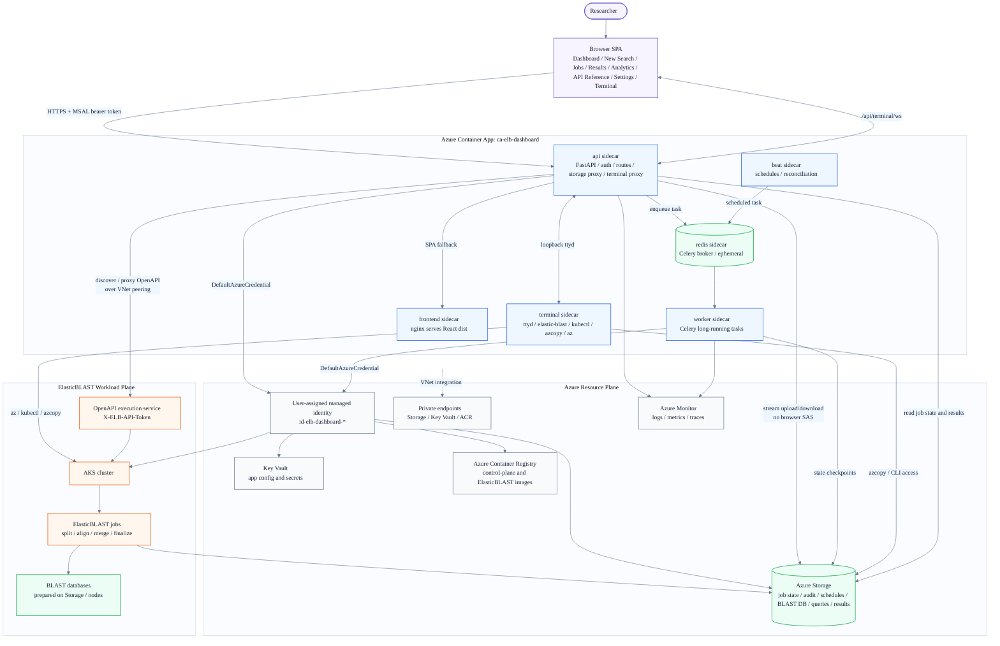

# High Level Architecture

ElasticBLAST Control Plane separates the research workflow from the cloud operations needed to run it. Researchers stay in the browser; the control plane coordinates Azure identity, storage, images, AKS jobs, terminal access, and result delivery behind the scenes.

!!! tip "TL;DR"

    One Azure Container App (`ca-elb-dashboard`) hosts six sidecars
    (`frontend`, `api`, `worker`, `beat`, `redis`, `terminal`). The api
    sidecar fronts every browser request, talks to Azure as a user-assigned
    managed identity, and dispatches long-running BLAST work to Celery
    workers. BLAST jobs themselves run on AKS. Storage stays
    `publicNetworkAccess: Disabled`; no SAS tokens reach the browser.

Use this page as the first architecture map. It explains the major boundaries and flows, then links to the deeper implementation references.

## Architecture At A Glance

## Main Boundaries

The system has three practical boundaries.

| Boundary | What Lives There | Why It Matters |
|----------|------------------|----------------|
| Browser workflow | Dashboard, New Search, Jobs, Results, Analytics, API Reference, Settings (incl. self-upgrade), and the preview-gated Terminal / Database Builder / Tools pages | Researchers operate from one browser session instead of stitching together local commands. |
| Control plane | One Azure Container App with `frontend`, `api`, `worker`, `beat`, `redis`, and `terminal` sidecars | Operational work is coordinated in one low-cost, always-on revision. |
| Workload plane | AKS, ElasticBLAST jobs, OpenAPI execution service, BLAST databases, queries, and results | Search execution remains isolated from the control plane that manages it. |

## Request Flow

The browser calls the `api` sidecar with an [MSAL][msal] bearer token. The API validates the token before doing work. For Azure operations, the backend uses the shared [user-assigned managed identity][managed-identity] rather than forwarding the user's browser token to Azure services.

Small read operations return directly from the API. Long-running work is queued through [Redis][redis] and executed by the [Celery][celery] worker. The UI polls task and job state from the API so researchers see progress instead of a blank spinner.

## BLAST Job Flow

1. The researcher submits a search from New Search or uses the API Reference / OpenAPI route.
2. The API validates the request, normalizes it, and dispatches the work.
3. When the target database is not yet staged, a prepare-DB step runs as an [AKS][aks] job that downloads and verifies the BLAST database before the search starts.
4. The workload plane runs ElasticBLAST jobs on AKS, started on demand and stopped automatically when the cluster goes idle to keep compute cost low.
5. Job state, events, and audit history are written to [Azure Storage][azure-storage].
6. Result files stay in Storage and are streamed back through the API sidecar.
7. The browser opens the Jobs, Results, and Analytics pages to inspect completion, logs, files, and result analytics.

The AKS cluster has its own lifecycle. The dashboard starts it on demand and the `beat` reconciler evaluates idle time, so a cluster left running auto-stops once no live BLAST activity remains. The Jobs and cluster cards surface a live countdown to the next auto-stop.

## Storage And Network Model

The browser never receives Storage SAS tokens and never downloads directly from private Storage endpoints. Uploads, downloads, query previews, and result files stream through the `api` sidecar.

Every workload Storage account stays `publicNetworkAccess: Disabled` from day one. The [Container App][azure-container-apps] reaches Storage through [private endpoints][private-endpoints] inside the platform network. Developers iterating from a laptop use the explicit local-debug helper (`scripts/dev/storage-public-access.sh on|off`) which opens an IP-allowlisted window for the caller and refuses to run inside a deployed Container App. There is no deployed code path that flips public access on.

## Workload Connectivity

The `api` sidecar discovers and proxies the [OpenAPI][openapi] execution service that fronts ElasticBLAST on AKS. That service is reached on its private IP, so the control-plane platform VNet is peered with the AKS cluster VNet. When the cluster runs in bring-your-own (BYO) subnet mode the AKS VNet is the dashboard platform VNet itself, so the api sidecar already reaches the private IP directly and peering is skipped as a no-op.

The OpenAPI surface is private by default. Operators who need an externally reachable HTTPS endpoint can opt into Public HTTPS, which provisions an ingress controller with a cert-manager Let's Encrypt certificate and reconciles the node-subnet NSG so the inbound 80/443 path works on BYO-subnet clusters. Calls still carry the `X-ELB-API-Token` admin header and are rate-limited by the api sidecar.

The browser terminal is not a VM. It is the `terminal` sidecar in the same Container App revision. The browser opens a [WebSocket][websocket] to the API sidecar, and the API proxies it to loopback [`ttyd`][ttyd] inside the terminal sidecar after authentication.

Advanced operators can still run `az`, `kubectl`, `azcopy`, and `elastic-blast`, but the default research path stays in the UI.

## Self-Managed Lifecycle

The control plane can upgrade itself from the browser. Settings &rarr; Updates polls release availability and the Upgrade page drives the upgrade. With native [Container App][azure-container-apps] blue/green enabled (`STRICT_BLUEGREEN`), an upgrade stages a green revision at 0% traffic, health-checks it, cuts traffic over with a confirm window, and keeps the previous blue revision warm so rollback is a seconds-fast traffic-weight flip with no image re-pull. Superseded revisions are garbage-collected. With the flag off, the legacy in-place single-revision recreate runs unchanged.

AKS compute is also self-managed for cost: clusters start on demand and the `beat` reconciler stops them when idle (see [BLAST Job Flow](#blast-job-flow)).

## Why This Shape

- One bundled Container App keeps the steady-state control-plane cost low.
- Sidecars share loopback networking, which removes external Redis and terminal hosts.
- The `api` sidecar reverse-proxies non-`/api/*` requests to the `frontend` sidecar, so the SPA is served same-origin and the browser only ever sees one hostname.
- Celery handles long-running Azure and BLAST operations without blocking HTTP requests.
- Azure Storage is enough for job state, audit history, schedules, and result access; no managed database is required.
- Managed identity keeps downstream Azure access auditable and avoids browser-to-Azure credential forwarding.

What the architecture deliberately does **not** include:

- No managed Cosmos DB / PostgreSQL; state lives in Azure Storage Tables + append blobs.
- No Azure Service Bus; the in-revision `redis` sidecar is the Celery broker.
- No Azure Static Web App; the `frontend` sidecar serves the React SPA.
- No separate Redis VM or managed Redis service.
- No Remote Terminal VM, no SSH, no admin password; the browser shell is the `terminal` sidecar over a same-origin WebSocket.
- No Azure Functions or Durable Functions; the migration is complete (see [Container Apps Migration](container-apps.md)).
- No SAS tokens issued to the browser; data-plane reads/writes go through the `api` sidecar.

## Go Deeper

- [Container Apps Migration](container-apps.md) explains the six-sidecar target architecture, resource list, sizing, and cost reasoning.
- [Auth](authentication.md) covers browser sign-in, backend token validation, managed identity, and RBAC.
- [Browser Terminal](../copilot/browser-terminal.md) describes the terminal sidecar lifecycle and loopback WebSocket model.
- [Resource Plane](../copilot/resource-plane.md) maps Azure preparation and monitoring work to Celery tasks.
- [API Reference](../user-guide/api-reference.md) explains how to call the OpenAPI execution surface from the browser or an external client.

[aks]: https://learn.microsoft.com/azure/aks/what-is-aks
[azure-container-apps]: https://learn.microsoft.com/azure/container-apps/overview
[azure-storage]: https://learn.microsoft.com/azure/storage/common/storage-introduction
[celery]: https://docs.celeryq.dev/en/stable/
[managed-identity]: https://learn.microsoft.com/entra/identity/managed-identities-azure-resources/overview
[msal]: https://learn.microsoft.com/entra/msal/javascript/browser/
[openapi]: https://www.openapis.org/
[private-endpoints]: https://learn.microsoft.com/azure/private-link/private-endpoint-overview
[redis]: https://redis.io/docs/latest/
[ttyd]: https://github.com/tsl0922/ttyd
[websocket]: https://developer.mozilla.org/docs/Web/API/WebSockets_API