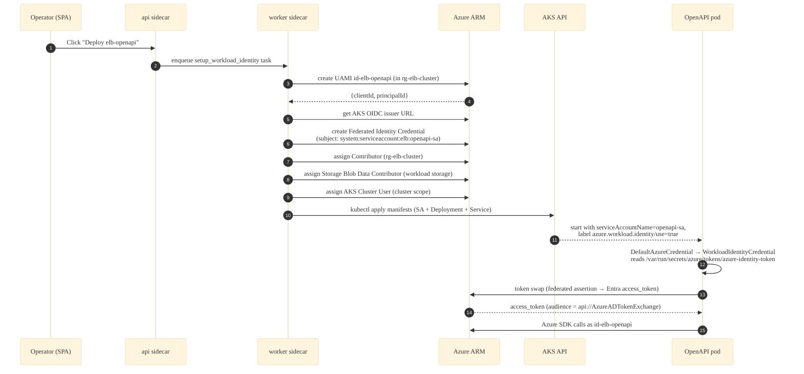
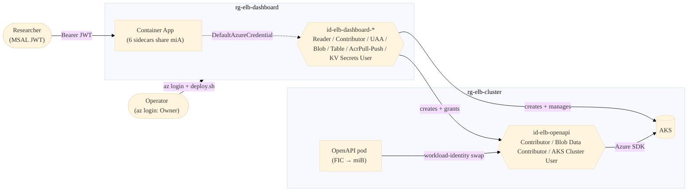

# Identity Architecture

This page is the canonical reference for **how managed identities work in the
ElasticBLAST Control Plane**. It complements
[Authentication & Authorization](authentication.md), which focuses on the
*browser-side* MSAL handshake; this page focuses on the *server-side*
identities the platform owns, how they are created, what they are allowed to
do, and how `DefaultAzureCredential` resolves to them at runtime.

!!! tip "TL;DR"

    The platform owns exactly **two identities**:

    1. **`id-elb-dashboard-*`** — User-Assigned Managed Identity (UAMI)
       created by Bicep, mounted on the Container App `ca-elb-dashboard`,
       shared by all six sidecars. Performs every Azure SDK call the
       backend makes.
    2. **`id-elb-openapi`** — User-Assigned Managed Identity created at
       runtime by the dashboard inside the AKS cluster's resource group,
       federated to the AKS OIDC issuer, mounted on the OpenAPI pod via
       [Microsoft Entra Workload ID][workload-id] so the pod can call
       Azure with no secrets.

    Neither identity uses a client secret. There is no Service Principal,
    no On-Behalf-Of (OBO) flow, no SAS token issued to the browser.

[workload-id]: https://learn.microsoft.com/azure/aks/workload-identity-overview

---

## 1. Why two identities?

The two identities exist for orthogonal reasons.

| Concern | `id-elb-dashboard-*` | `id-elb-openapi` |
|---------|---------------------|------------------|
| Where it lives | Container App `ca-elb-dashboard` (platform RG) | AKS workload RG (e.g. `rg-elb-cluster`) |
| Who creates it | Bicep ([infra/modules/identity.bicep](https://github.com/dotnetpower/elb-dashboard/blob/main/infra/modules/identity.bicep)) at `azd up` time | Python task [`api.tasks.openapi.rbac.setup_workload_identity`](https://github.com/dotnetpower/elb-dashboard/blob/main/api/tasks/openapi/rbac.py) at runtime, when the operator clicks **Deploy elb-openapi** in the SPA |
| How it authenticates | IMDS endpoint inside the Container App revision (resolved by `DefaultAzureCredential` → `ManagedIdentityCredential`) | Federated token swap: kubelet projects an SA token → Entra accepts via Federated Identity Credential → returns an Azure access token to the OpenAPI pod |
| Why not reuse the dashboard MI? | — | The OpenAPI pod runs inside AKS, not inside the Container App. It cannot reach the Container App's IMDS, and giving the dashboard MI direct kubeconfig is the wrong blast radius. |

The dashboard MI is the **control-plane principal**: it can create AKS
clusters, push images to ACR, write to platform Storage and Key Vault.
The OpenAPI MI is the **workload principal**: it can only do what the
OpenAPI pod needs (read the workload Storage account, get an AKS user
kubeconfig) and is scoped to a single AKS cluster RG.

---

## 2. The dashboard MI — `id-elb-dashboard-*`

### 2.1 How it is created

Defined by [infra/modules/identity.bicep](https://github.com/dotnetpower/elb-dashboard/blob/main/infra/modules/identity.bicep):

```bicep
resource uami 'Microsoft.ManagedIdentity/userAssignedIdentities@2023-01-31' = {
  name: identityName            // id-elb-dashboard-<8-char-token>
  location: location
  tags: union(tags, { role: 'identity' })
}
```

The resource name is templated as `id-elb-dashboard${suffix}-${take(token, 8)}`
in [`infra/main.bicep`](https://github.com/dotnetpower/elb-dashboard/blob/main/infra/main.bicep)
so a fresh `azd up` in the same subscription generates a unique name (and
a unique `principalId`) even after an `azd down`.

> **Recreation pitfall.** Every `azd down` + `azd up` cycle creates a
> *new* identity with a *new* object ID. Role assignments from the
> previous deployment do **not** carry over — the assignments are keyed
> by `{principalId, scope, roleDefinitionId}` and Azure leaves the
> orphaned entries behind. See the
> [post-deploy permissions checklist](authentication.md#0-post-deploy-permissions-checklist-run-after-every-azd-up).

### 2.2 Where it is mounted

The Container App template attaches the MI on every revision:

```bicep
// infra/modules/containerAppControl.bicep (excerpt)
identity: {
  type: 'UserAssigned'
  userAssignedIdentities: {
    '${sharedIdentityResourceId}': {}
  }
}
```

All six sidecars in the revision (`frontend`, `api`, `worker`, `beat`,
`redis`, `terminal`) inherit it because identity is set at the **revision
template** level, not per-container. The `redis` and `frontend` sidecars
do not make Azure SDK calls, but they still receive the IMDS metadata
endpoint — that is benign.

### 2.3 How code picks it up

Every Azure SDK call routes through
[`api.services.azure_clients.get_credential`](https://github.com/dotnetpower/elb-dashboard/blob/main/api/services/azure_clients.py),
which returns a process-wide
[`DefaultAzureCredential`][dac]. Resolution order at runtime:

[dac]: https://learn.microsoft.com/python/api/azure-identity/azure.identity.defaultazurecredential

```mermaid
%%{init: {"theme": "base", "themeVariables": {"fontFamily": "Inter, ui-sans-serif, system-ui, sans-serif"}, "flowchart": {"curve": "basis"}}}%%
flowchart TB
  start([DefaultAzureCredential.get_token])
  env{EnvironmentCredential?<br/>AZURE_CLIENT_ID/SECRET set?}
  wid{WorkloadIdentityCredential?<br/>AZURE_FEDERATED_TOKEN_FILE set?}
  mi{ManagedIdentityCredential?<br/>IMDS reachable?}
  azcli{AzureCliCredential?<br/>az account get-access-token works?}
  fail([raise CredentialUnavailableError])

  start --> env
  env -- no --> wid
  wid -- no --> mi
  mi -- yes --> useMi[/Use MI token<br/>(dashboard or openapi)/]
  mi -- no --> azcli
  azcli -- yes --> useCli[/Use az login token<br/>(host-mode dev)/]
  azcli -- no --> fail
  env -- yes --> useEnv[/Use service principal<br/>(never in production)/]
  wid -- yes --> useWid[/Use federated token<br/>(OpenAPI pod)/]
```

In the deployed Container App, only `ManagedIdentityCredential` succeeds
because none of the env-var or workload-identity variables are present
and `az` is not installed in the api/worker images.

When the OpenAPI pod runs inside AKS,
`WorkloadIdentityCredential` succeeds first because the kubelet projects
the service-account token at `/var/run/secrets/azure/tokens/azure-identity-token`
and sets `AZURE_FEDERATED_TOKEN_FILE` plus `AZURE_CLIENT_ID` on the pod.

In host-mode local development (`scripts/dev/local-run.sh api`), neither
of the above succeeds and the credential falls through to
`AzureCliCredential`, which means **the local backend acts as the
developer's `az login` identity**. That is why
[`scripts/dev/grant-local-rbac.sh`](https://github.com/dotnetpower/elb-dashboard/blob/main/scripts/dev/grant-local-rbac.sh)
exists — it grants the developer the same data-plane roles the MI gets
in production, scoped to the workload Storage / ACR / RG only.

### 2.4 RBAC roles granted to the dashboard MI

All assignments live in [`infra/modules/`](https://github.com/dotnetpower/elb-dashboard/tree/main/infra/modules)
and are idempotent (named via `guid(scope, principalId, roleDefinitionId)`).

!!! info "About role definition IDs"

    Each role below is an [Azure **built-in** role][builtin-roles] —
    Microsoft-managed, identical across every tenant, and **not a
    secret**. We reference them by name; the canonical GUIDs live in
    Microsoft Learn (link above) and in the per-resource Bicep modules
    linked from this table. We do not duplicate the GUIDs here so the
    Microsoft list stays the single source of truth.

| Scope | Role | Module | Why |
|-------|------|--------|-----|
| Subscription | [`Reader`][builtin-roles] | [subscriptionRoles.bicep](https://github.com/dotnetpower/elb-dashboard/blob/main/infra/modules/subscriptionRoles.bicep) (opt-in via `assignSubscriptionReader=true`) | SPA discovery wizard: `SubscriptionClient.list`, `ResourceGroups.list`, `Storage/ACR/Compute.list_by_*` |
| Platform RG `rg-elb-dashboard` | [`Contributor`][builtin-roles] | [controlPlaneRoles.bicep](https://github.com/dotnetpower/elb-dashboard/blob/main/infra/modules/controlPlaneRoles.bicep) | CRUD child resources inside the platform RG |
| Platform RG `rg-elb-dashboard` | [`User Access Administrator`][builtin-roles] | [controlPlaneRoles.bicep](https://github.com/dotnetpower/elb-dashboard/blob/main/infra/modules/controlPlaneRoles.bicep) | Assign AcrPull / Blob Data Contributor to AKS kubelet identities |
| Platform ACR | [`AcrPull`][builtin-roles] | [acr.bicep](https://github.com/dotnetpower/elb-dashboard/blob/main/infra/modules/acr.bicep) | Container App + AKS pull images |
| Platform ACR | [`AcrPush`][builtin-roles] | [acr.bicep](https://github.com/dotnetpower/elb-dashboard/blob/main/infra/modules/acr.bicep) | postprovision `az acr build` pushes |
| Platform ACR | [`Contributor`][builtin-roles] | [acr.bicep](https://github.com/dotnetpower/elb-dashboard/blob/main/infra/modules/acr.bicep) | ACR Tasks `scheduleRun/action` (worker builds runtime BLAST images) — `AcrPush` alone cannot call ACR Tasks |
| Platform Storage | [`Storage Blob Data Contributor`][builtin-roles] | [storage.bicep](https://github.com/dotnetpower/elb-dashboard/blob/main/infra/modules/storage.bicep) | Audit append blobs, BLAST result streaming |
| Platform Storage | [`Storage Table Data Contributor`][builtin-roles] | [storage.bicep](https://github.com/dotnetpower/elb-dashboard/blob/main/infra/modules/storage.bicep) | `jobstate`, `jobhistory`, `audit`, `schedule` tables |
| Key Vault | [`Key Vault Secrets User`][builtin-roles] | [keyvault.bicep](https://github.com/dotnetpower/elb-dashboard/blob/main/infra/modules/keyvault.bicep) | Read MSAL `apiClientId` and any App Registration secrets |
| AKS workload RG `rg-elb-cluster` *(conditional)* | [`Contributor`][builtin-roles] | [workloadClusterRoles.bicep](https://github.com/dotnetpower/elb-dashboard/blob/main/infra/modules/workloadClusterRoles.bicep) (skipped when `aksClusterResourceGroup` is empty) | Create `id-elb-openapi` + federated credential, read AKS |
| AKS workload RG `rg-elb-cluster` *(conditional)* | [`User Access Administrator`][builtin-roles] | [workloadClusterRoles.bicep](https://github.com/dotnetpower/elb-dashboard/blob/main/infra/modules/workloadClusterRoles.bicep) | Assign Contributor + Blob Data Contributor + AKS Cluster User to `id-elb-openapi` |

> **Deliberately not granted at subscription scope: `Contributor` /
> `User Access Administrator`.** The dashboard MI must not be able to
> create resource groups anywhere it wants, nor escalate role
> assignments outside the deployment RGs. Operators that need this for
> the *first-time-cluster-create* path use
> [`scripts/dev/grant-runtime-rbac.sh`](https://github.com/dotnetpower/elb-dashboard/blob/main/scripts/dev/grant-runtime-rbac.sh)
> (with the bootstrap-mode `--cluster-rg <name> --region <r>` flags) so
> the grant remains RG-scoped.

### 2.5 First `azd up` vs second `azd provision`

The role table above splits into two waves because `workloadClusterRoles`
needs an existing RG to scope to. The recommended flow:

1. **First `azd up`** — `aksClusterResourceGroup` parameter is empty, so
   `workloadClusterRoles` is skipped. Every other role above is granted.
2. **Operator creates AKS via the SPA wizard** — this creates
   `rg-elb-cluster` as a side effect (or pre-create it with
   `grant-runtime-rbac.sh --cluster-rg rg-elb-cluster --region <r>` so
   the MI has Contributor on it *before* the SPA tries to write).
3. **Second `azd provision`** — set `aksClusterResourceGroup` so the
   module runs. This is the steady-state grant and is what
   [`api.tasks.openapi.rbac.setup_workload_identity`](https://github.com/dotnetpower/elb-dashboard/blob/main/api/tasks/openapi/rbac.py)
   relies on.

If step 3 is skipped (operator one-shots through the SPA),
`scripts/dev/grant-runtime-rbac.sh` is the workstation safety net and
is also called as a self-healing preflight by
[`scripts/dev/cli-upgrade.sh`](https://github.com/dotnetpower/elb-dashboard/blob/main/scripts/dev/cli-upgrade.sh)
and at the end of
[`scripts/dev/postprovision.sh`](https://github.com/dotnetpower/elb-dashboard/blob/main/scripts/dev/postprovision.sh).

---

## 3. The OpenAPI workload MI — `id-elb-openapi`

### 3.1 Lifecycle



Source: [`api/tasks/openapi/rbac.py`](https://github.com/dotnetpower/elb-dashboard/blob/main/api/tasks/openapi/rbac.py).

### 3.2 Federated Identity Credential subject

The FIC subject is keyed exactly as:

```
system:serviceaccount:<namespace>:<service-account-name>
```

For the OpenAPI deploy that is `system:serviceaccount:elb:openapi-sa`.
The kubelet projects a token whose `sub` claim matches; Entra validates
the `sub` against the FIC before issuing the Azure access token.

| FIC property | Value |
|--------------|-------|
| Issuer | AKS cluster OIDC issuer URL (`oidcIssuerProfile.issuerUrl`) |
| Subject | `system:serviceaccount:elb:openapi-sa` |
| Audience | `api://AzureADTokenExchange` (Entra default) |
| Name | `openapi-pod-fic` |

If the AKS cluster was not created with `--enable-oidc-issuer
--enable-workload-identity`, the swap fails with `AADSTS70021`. The
provisioning task validates the cluster has both flags before creating
the FIC and surfaces a clear error otherwise.

### 3.3 RBAC roles granted to the workload MI

See the disclaimer in [§2.4](#24-rbac-roles-granted-to-the-dashboard-mi) —
these are also Azure built-in roles, looked up by name against
[Microsoft Learn's built-in roles list][builtin-roles].

| Scope | Role | Why |
|-------|------|-----|
| AKS workload RG | [`Contributor`][builtin-roles] | Read AKS, mount workload storage via CSI driver if needed |
| Workload Storage account | [`Storage Blob Data Contributor`][builtin-roles] | OpenAPI worker reads BLAST DBs + writes results |
| AKS cluster (resource scope) | [`Azure Kubernetes Service Cluster User Role`][builtin-roles] | Pod can call `listClusterUserCredential` if it ever needs to (rare) |

These three assignments are why the dashboard MI needs
**`User Access Administrator` on the workload RG** — the grants are
created by the dashboard MI on behalf of the operator at runtime.

### 3.4 OIDC token swap — request shape

For reference, the actual token-exchange request the workload identity
admission webhook orchestrates:

```http
POST https://login.microsoftonline.com/{tenant_id}/oauth2/v2.0/token
Content-Type: application/x-www-form-urlencoded

grant_type=client_credentials
&client_id={id-elb-openapi clientId}
&client_assertion_type=urn:ietf:params:oauth:client-assertion-type:jwt-bearer
&client_assertion={projected SA token from /var/run/secrets/azure/tokens/...}
&scope=https://management.azure.com/.default
```

The pod never sees a client secret. The projected SA token rotates
roughly every hour and Entra re-validates the FIC on each renewal.

---

## 4. Identity vs. operator vs. browser caller — who does what



| Principal | Trust source | Used for |
|-----------|--------------|----------|
| **Researcher** (browser) | Entra ID via MSAL Auth Code + PKCE | Identity verification only — `api` validates the JWT in [`api/auth.py`](https://github.com/dotnetpower/elb-dashboard/blob/main/api/auth.py) |
| **Operator** | `az login` (interactive) | Run `deploy.sh`, `cli-upgrade.sh`, `grant-runtime-rbac.sh` |
| **Dashboard MI** | IMDS inside the Container App revision | Every Azure SDK call the backend makes |
| **OpenAPI MI** | Federated SA token inside AKS | Every Azure SDK call from the OpenAPI pod |

Note that the browser JWT and the dashboard MI are **independent**. A
valid JWT lets you call `/api/*`; the MI lets the api call Azure.
Failing either layer fails the request, and audit logs separate them
cleanly (the JWT `oid` is logged as `caller`, the MI `clientId` is
logged as `actor`).

---

## 5. Deploy-time vs runtime grants

| When | Tool | Grants |
|------|------|--------|
| `azd up` (Bicep) | [`subscriptionRoles.bicep`](https://github.com/dotnetpower/elb-dashboard/blob/main/infra/modules/subscriptionRoles.bicep) + [`controlPlaneRoles.bicep`](https://github.com/dotnetpower/elb-dashboard/blob/main/infra/modules/controlPlaneRoles.bicep) + per-resource modules | Subscription `Reader`; platform RG `Contributor` + UAA; ACR `AcrPull/Push/Contributor`; Storage `Blob/Table Data Contributor`; KV `Secrets User` |
| 2nd `azd provision` *(after AKS exists)* | [`workloadClusterRoles.bicep`](https://github.com/dotnetpower/elb-dashboard/blob/main/infra/modules/workloadClusterRoles.bicep) when `aksClusterResourceGroup` is set | Cluster RG `Contributor` + UAA for the dashboard MI |
| Workstation, post-deploy | [`scripts/dev/grant-runtime-rbac.sh`](https://github.com/dotnetpower/elb-dashboard/blob/main/scripts/dev/grant-runtime-rbac.sh) | Same as `workloadClusterRoles.bicep`; can also bootstrap a missing cluster RG with `--region` |
| `deploy.sh` (post-deploy hook) | [`scripts/dev/grant-local-rbac.sh`](https://github.com/dotnetpower/elb-dashboard/blob/main/scripts/dev/grant-local-rbac.sh) | Grants the *operator* (User principal) the data-plane roles needed for host-mode local debugging |
| SPA — "Deploy elb-openapi" | [`api/tasks/openapi/rbac.py::setup_workload_identity`](https://github.com/dotnetpower/elb-dashboard/blob/main/api/tasks/openapi/rbac.py) | Creates `id-elb-openapi` + FIC + three assignments to that MI |
| SPA — "Create new AKS / Storage / ACR" | [`api/routes/resources.py`](https://github.com/dotnetpower/elb-dashboard/blob/main/api/routes/resources.py) and [`api/tasks/azure/provision.py`](https://github.com/dotnetpower/elb-dashboard/blob/main/api/tasks/azure/provision.py) | Uses the dashboard MI — requires the deploy-time grants above to already be in place |

> **Operator permissions to *run* deploy.sh:** Owner *or* (Contributor +
> User Access Administrator) at subscription scope. UAA is mandatory
> because Bicep assigns roles inside the modules.

---

## 6. Common pitfalls and recovery

### 6.1 `AuthorizationFailed` on `resourcegroups/write`

**Symptom.** SPA "Create Cluster" shows
`AuthorizationFailed … 'Microsoft.Resources/subscriptions/resourcegroups/write' over scope '/subscriptions/<sub>/resourcegroups/rg-elb-cluster'`.

**Cause.** The dashboard MI has `Reader` at subscription scope (by
design — least privilege) and Contributor only on the platform RG. When
`api.tasks.azure.provision.provision_aks` calls
`rc.resource_groups.create_or_update(<cluster_rg>)`, the write is
rejected because the RG does not exist yet and the MI has no
sub-scope write.

**Fix.** Pre-create the cluster RG and grant the MI Contributor on it
*only* (do not escalate to subscription Contributor):

```bash
bash scripts/dev/grant-runtime-rbac.sh \
  --cluster-rg rg-elb-cluster --region koreacentral --yes
```

This invokes the bootstrap mode added in
[2026-05-26-bootstrap-rbac-fresh-subscription](https://github.com/dotnetpower/elb-dashboard/blob/main/docs/features_change/2026-05/2026-05-26-bootstrap-rbac-fresh-subscription.md).
Wait 1–5 minutes for RBAC propagation, then click **Edit & retry**.

### 6.2 Role assignments from a previous deployment don't apply

**Symptom.** After `azd down && azd up`, the SPA can sign in but
`/api/storage` returns `access_denied`, `/api/acr` returns empty repos,
etc.

**Cause.** The new MI has a *new* `principalId`. Old assignments are
orphaned. Bicep re-creates the in-Bicep assignments idempotently
(because `guid(scope, newPrincipalId, …)` differs from the orphan), but
roles granted *outside* Bicep (e.g. on workload Storage, on a pre-existing
ACR, on a second subscription) need to be re-applied.

**Fix.** Run the
[post-deploy permissions checklist](authentication.md#0-post-deploy-permissions-checklist-run-after-every-azd-up).

### 6.3 OpenAPI pod logs `WorkloadIdentityCredential: failed to read token file`

**Symptom.** Pod starts but every Azure call fails with
`/var/run/secrets/azure/tokens/azure-identity-token: no such file`.

**Cause.** Either the AKS cluster does not have workload identity
enabled, or the SA / Deployment is missing the
`azure.workload.identity/use: "true"` label.

**Fix.**

```bash
# Verify cluster flags
az aks show -g rg-elb-cluster -n elb-cluster \
  --query '{oidc: oidcIssuerProfile.enabled, wi: securityProfile.workloadIdentity.enabled}'

# Enable if missing
az aks update -g rg-elb-cluster -n elb-cluster \
  --enable-oidc-issuer --enable-workload-identity
```

Re-run **Deploy elb-openapi** from the SPA after the update completes
(~5 minutes for the webhook to roll out).

### 6.4 `AADSTS70021: No matching federated identity record found`

**Symptom.** Pod runs but the token swap fails.

**Cause.** The FIC subject doesn't match the projected SA token's `sub`
claim. Almost always a mismatch between the deployed manifest's
`metadata.namespace` / `metadata.name` and the FIC subject
`system:serviceaccount:elb:openapi-sa`.

**Fix.** Inspect the projected token in the pod:

```bash
kubectl -n elb exec -it deploy/openapi -- \
  cat /var/run/secrets/azure/tokens/azure-identity-token | \
  cut -d. -f2 | base64 -d | jq .sub
```

If it returns `system:serviceaccount:<other-ns>:<other-sa>`, either
adjust the manifest namespace/SA name to match, or re-run the
provisioning task which re-creates the FIC against the *current*
namespace/SA from the manifest.

### 6.5 Local backend cannot read Storage even though MI has the role

**Symptom.** `scripts/dev/local-run.sh api` returns `access_denied` from
`/api/blast/databases` even though the deployed Container App works.

**Cause.** Locally, `DefaultAzureCredential` falls through to
`AzureCliCredential` — it uses *your* `az login` identity, not the MI.
Your user account has not been granted the data-plane roles.

**Fix.**

```bash
# One-shot: grant + open Storage firewall + flip AUTH_DEV_BYPASS=false + restart
scripts/dev/local-run.sh auth-on
# … debug …
scripts/dev/local-run.sh auth-off    # close firewall + bypass=true, keep RBAC
```

See [Storage Network Isolation](storage-contract.md) for the
storage-firewall side of this flow.

---

## 7. Audit and observability

Every authenticated request gets a `caller` and an `actor` line in the
structured JSON logs:

| Log field | Source | Example |
|-----------|--------|---------|
| `caller.oid` | MSAL JWT `oid` claim | `8c9f…` (the human researcher) |
| `caller.upn` | MSAL JWT `preferred_username` | `alice@contoso.com` |
| `actor.clientId` | Identity that made the Azure SDK call | `id-elb-dashboard-*` or `id-elb-openapi` clientId |
| `actor.scope` | ARM/data-plane scope touched | `/subscriptions/…/resourceGroups/rg-elb-cluster` |

Roles granted to either MI can be inspected at any time with:

```bash
az role assignment list \
  --assignee "$(az identity show -g rg-elb-dashboard \
                  -n id-elb-dashboard-<token> --query principalId -o tsv)" \
  --all --query "[].{role:roleDefinitionName, scope:scope}" -o table
```

`Microsoft.Authorization/roleAssignments` writes are also captured in
the subscription's Azure Activity Log; filter by `Caller` =
the dashboard MI's `clientId` to see exactly which runtime assignments
the dashboard created.

---

## 8. Related references

- [Authentication & Authorization](authentication.md) — MSAL handshake,
  JWT validation, post-deploy checklist.
- [Runtime Plan — Networking, Identity, Storage, AKS](runtime-plan.md) —
  the operator one-pager that summarises this material alongside
  networking and storage.
- [Storage Network Isolation & Browser ↔ Storage Proxy](storage-contract.md) —
  why no SAS tokens are ever issued to the browser.
- [`scripts/dev/grant-runtime-rbac.sh`](https://github.com/dotnetpower/elb-dashboard/blob/main/scripts/dev/grant-runtime-rbac.sh) — bootstrap + maintenance RBAC for the cluster RG.
- [`scripts/dev/grant-local-rbac.sh`](https://github.com/dotnetpower/elb-dashboard/blob/main/scripts/dev/grant-local-rbac.sh) — grants the developer's `az login` user the local-debug data-plane roles.
- [Microsoft Entra Workload ID on AKS][workload-id] — upstream
  documentation for the federated identity mechanism `id-elb-openapi`
  uses.
- [Built-in Azure roles][builtin-roles] — full role definition reference.

[builtin-roles]: https://learn.microsoft.com/azure/role-based-access-control/built-in-roles
