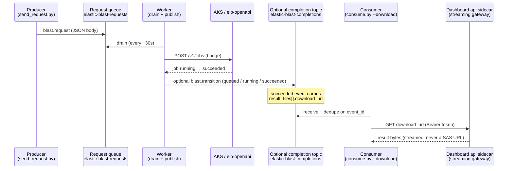

# Service Bus Examples (Producer / Monitor / Consumer)

The [`example/servicebus/`](https://github.com/dotnetpower/elb-dashboard/tree/main/example/servicebus)
folder ships three **standalone, single-file Python scripts** that reproduce the
exact JSON contract the dashboard uses for its optional
[Azure Service Bus](https://learn.microsoft.com/azure/service-bus-messaging/service-bus-messaging-overview)
BLAST integration. Each script mirrors a real code path in `api/` and can run on
its own.

This page is the run guide. For the architecture and configuration of the
integration itself, see [Service Bus BLAST Integration](service-bus-integration.md).

| Script | Mirrors | What it does |
| --- | --- | --- |
| `send_request.py` | `api.services.service_bus.send_request` | **Producer** — enqueues a BLAST request onto the `elastic-blast-requests` queue. |
| `monitor.py` | `api.services.service_bus.entity_counts` + `peek_requests` | **Monitor** — reads runtime counts and non-destructively peeks messages. |
| `consume.py` | `drain_requests` / optional completion-topic subscriber | **Consumer** — settles request-queue messages, or subscribes to the optional completion topic and downloads results. |

## End-to-end flow



## Prerequisites

- Python dependencies are already in the project virtualenv. Run each script
  with `uv run python <file>` from the repo root, or `pip install azure-servicebus azure-identity`
  in your own environment.
- Authentication uses
  [`DefaultAzureCredential`](https://learn.microsoft.com/python/api/overview/azure/identity-readme#defaultazurecredential)
  (interactive `az login` or a [managed identity](https://learn.microsoft.com/entra/identity/managed-identities-azure-resources/overview)).
  Per-action namespace roles:

  | Action | Required role |
  | --- | --- |
  | send (producer) | **Azure Service Bus Data Sender** |
  | peek / receive (monitor, consumer) | **Azure Service Bus Data Receiver** |
  | runtime counts (`monitor.py` management call) | **Azure Service Bus Data Owner** |

  The dashboard's own managed identity already holds these; a developer running
  the scripts locally needs the role granted to their own `az login` identity.

- `consume.py --download` additionally needs a dashboard bearer token to call
  the result-streaming gateway — set `ELB_BEARER_TOKEN`, or `ELB_API_CLIENT_ID`
  so the script runs `az account get-access-token` for you.

    !!! warning "`download_url` returns 401 / consent error"
        The `ELB_API_CLIENT_ID` path only works when the API app registration
        has pre-authorized the well-known Azure CLI public client
        (`04b07795-8ddb-461a-bbee-02f9e1bf7b46`) for its `user_impersonation`
        scope. [`scripts/dev/setup-app-registration.sh`][setup-script] does this
        automatically. Without it, `az account get-access-token --resource
        <api-client-id>` fails with `AADSTS65001` (consent not granted) and the
        download returns 401 — re-run that script, have an admin add the
        pre-authorization, or set `ELB_BEARER_TOKEN` to a token acquired
        interactively.

  [setup-script]: https://github.com/dotnetpower/elb-dashboard/blob/main/scripts/dev/setup-app-registration.sh

## Configuration

All three scripts read these environment variables (defaults shown):

| Variable | Default |
| --- | --- |
| `SERVICEBUS_NAMESPACE_FQDN` | `sb-elb-dashboard-krc.servicebus.windows.net` |
| `SERVICEBUS_REQUEST_QUEUE` | `elastic-blast-requests` |
| `SERVICEBUS_RESPONSE_TOPIC` | `elastic-blast-completions` |
| `SERVICEBUS_COMPLETION_SUBSCRIPTION` | `default` |

The completion-topic variables are used only by the optional push/subscribe
example path. `SERVICEBUS_COMPLETION_TOPIC` is still accepted by the standalone
consumer/monitor scripts as a legacy alias. The required submit path uses
`SERVICEBUS_REQUEST_QUEUE`.

## Message contracts

### Request message (producer → request queue)

Envelope: `content_type="application/json"`, `subject="blast.request"`,
`correlation_id=<external_correlation_id>`.

The XML-locked body targets `/api/v1/elastic-blast/submit` (`outfmt` fixed to
`5`):

```json
{
  "program": "blastn",
  "db": "core_nt",
  "query_fasta": ">query1\nACGT...",
  "taxid": 9606,
  "is_inclusive": true,
  "options": { "outfmt": 5, "word_size": 28, "dust": true, "evalue": 0.05, "max_target_seqs": 500 },
  "resource_profile": "standard",
  "external_correlation_id": "<hex>",
  "request_id": "<caller pass-through>"
}
```

A body carrying `blast_options` instead of `options` is routed to the free-form
`/v1/jobs` path, which supports a multi-token tabular `outfmt`:

```json
{
  "program": "blastn",
  "db": "core_nt",
  "query_fasta": ">query1\nACGT...",
  "blast_options": { "outfmt": "7 std staxids sstrand qseq sseq" },
  "external_correlation_id": "<hex>"
}
```

### Completion event (optional completion topic)

```json
{
  "event": "blast.transition",
  "event_id": "<sha256(correlation_id:status)>",
  "attempt": 1,
  "external_correlation_id": "<hex>",
  "openapi_job_id": "<job id>",
  "status": "queued | running | succeeded | failed",
  "ts": "2026-06-17T00:00:00+00:00",
  "result_ref": {
    "api": "GET /api/v1/elastic-blast/jobs/{id}",
    "files": "GET /api/v1/elastic-blast/jobs/{id}/files/{file_id}"
  },
  "result_files": [
    {
      "file_id": "result-001",
      "name": "batch_000-blastn-core_nt_shard_00.out.gz",
      "format": "blast_xml",
      "size": 744,
      "compressed": true,
      "media_type": "application/gzip",
      "download_url": "https://<dashboard-host>/api/v1/elastic-blast/jobs/{id}/files/result-001?token=<signed>"
    }
  ],
  "request_id": "<optional pass-through>",
  "error_code": "<optional, on failed>",
  "error_message": "<optional human-readable reason, on failed>"
}
```

!!! note "download_url is a gateway URL, never a SAS"
    `result_files` is present only on a **succeeded** event. Each `download_url`
    points at the dashboard's authenticated file-streaming gateway
    (`GET /api/v1/elastic-blast/jobs/{job_id}/files/{file_id}`). A current
    deployment **signs** the link with a scoped, expiring `?token=`, so a
    consumer that received the event downloads **by URL alone — no bearer, no
    401** (a bearer still works for legacy unsigned links). It is **never** a
    Storage Shared Access Signature (SAS) URL or a direct blob URL. Subscribers
    dedupe on the stable `event_id` because Service Bus delivery is
    at-least-once.

!!! tip "Per-file download options"
    `compressed` (stored bytes are gzip) and `media_type` let a consumer choose
    how to fetch the same result without a HEAD request. Append `&decompress=1`
    to inflate a gzip result on the fly, or `&format=csv|tsv|json` to have the
    gateway parse the hits and re-render them. A failed download returns a JSON
    error body (`{"code", "message"}`), never a partial file; a **failed** job
    event carries `error_message` (the human-readable reason) next to
    `error_code`.

## Running the examples

### 1. Offline self-test (no Azure, no network)

Every script has a `--self-test` mode that validates its JSON contract offline —
safe to run anywhere:

```bash
uv run python example/servicebus/send_request.py --self-test
uv run python example/servicebus/monitor.py      --self-test
uv run python example/servicebus/consume.py      --self-test
```

### 2. Producer — enqueue a request

```bash
# Build and print the message without sending it:
uv run python example/servicebus/send_request.py --dry-run

# Multi-token tabular request on the /v1/jobs path:
uv run python example/servicebus/send_request.py --mode v1 \
  --outfmt "7 std staxids sstrand qseq sseq" --dry-run

# Actually enqueue (needs Data Sender):
uv run python example/servicebus/send_request.py --db core_nt --program blastn
```

You can also enqueue through the dashboard route, which additionally creates the
"Recent searches" placeholder row so the job is visible in the UI immediately:

```bash
TOKEN=$(az account get-access-token --resource <api-client-id> --query accessToken -o tsv)
curl -X POST https://<dashboard-host>/api/settings/service-bus/send \
  -H "Authorization: Bearer $TOKEN" -H "Content-Type: application/json" \
  -d '{"program":"blastn","db":"core_nt","query_fasta":">q\nACGT...","request_id":"demo-1"}'
```

### 3. Monitor — counts and peeks

```bash
uv run python example/servicebus/monitor.py            # counts + peek
uv run python example/servicebus/monitor.py --peek-only # data-plane only (Receiver role)
uv run python example/servicebus/monitor.py --peek 10   # peek more request messages
```

While a job is in flight the dashboard's **Message Flow** card shows the same
queue activity (`active_total`), and the job appears in **Recent searches** and
the **Jobs** list with `submission_source: servicebus`.

### 4. Consumer — settle requests or download results

```bash
# Drain the request queue (mirrors the worker). Use --settle abandon against a
# live queue so the real worker still processes the messages:
uv run python example/servicebus/consume.py --source requests --settle abandon

# Subscribe to the optional completion topic and download results on success:
ELB_API_CLIENT_ID=<api-client-id> \
  uv run python example/servicebus/consume.py --source completions \
    --download --download-dir ./out --max 40
```

On a `succeeded` event the consumer reads `result_files`, calls each
`download_url` with the bearer token, and saves the bytes under `--download-dir`.

!!! warning "The default topic subscription is shared"
    `--source completions` reads the `default` subscription and **completes
    (removes)** the events it processes. The dashboard does not consume its own
    completion topic, so this is safe when that optional topic is configured —
    but a large backlog from earlier runs is delivered oldest-first, so raise
    `--max` to reach your event, or point the scripts at a throwaway namespace.

## Verified end-to-end run

A full live run on the bundled deployment looked like this:

1. Enqueued a `core_nt` `blastn` request via the dashboard send route.
2. The worker drained it (~30 s tick) and bridged it to `POST /v1/jobs`; the
   **Message Flow** card showed `active_total: 1` and the job appeared in
   **Recent searches** / **Jobs** with `submission_source: servicebus`.
3. The BLAST job ran on AKS and completed.
4. `consume.py --source completions --download` received the `queued` → `running`
   → `succeeded` transitions. The `succeeded` event carried five `result_files`,
   each with a dashboard `download_url`.
5. The consumer downloaded all five shard result files; each decompressed to
   valid BLAST XML (`BLASTN 2.17.0+`) for the submitted query.

## Related

- [Service Bus BLAST Integration](service-bus-integration.md) — architecture,
  configuration, and dead-letter handling.
- [API Reference](../user-guide/api-reference.md) — the `/v1/jobs` and result
  file endpoints the bridge and gateway use.
