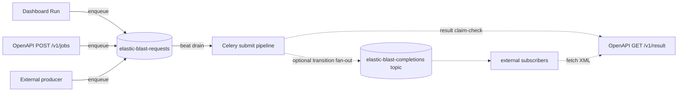
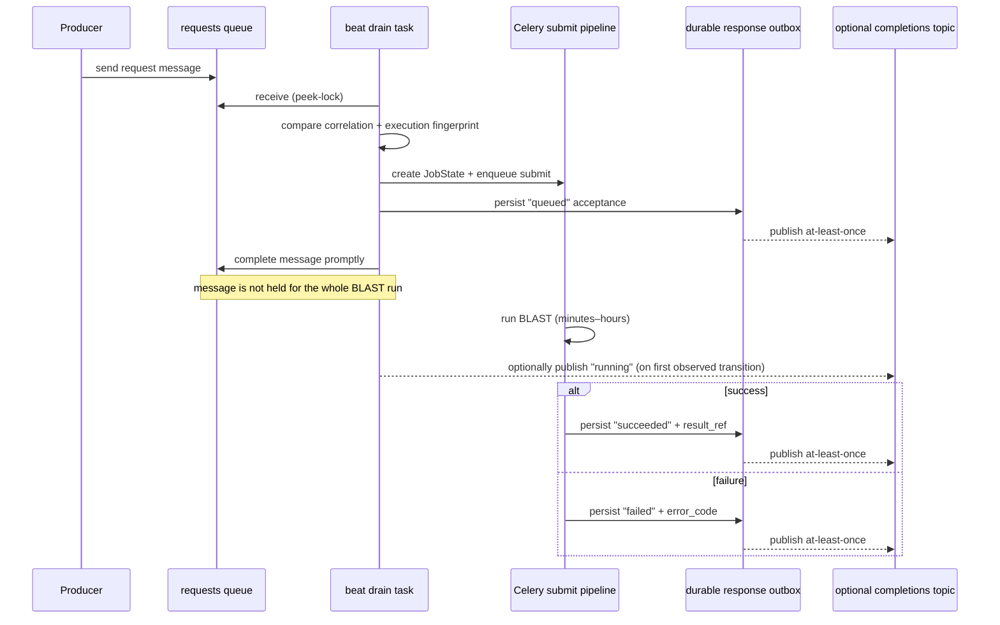

# Service Bus BLAST Integration

This is an **optional** integration that lets external systems drive BLAST runs
through an [Azure Service Bus](https://learn.microsoft.com/azure/service-bus-messaging/service-bus-messaging-overview)
queue instead of calling the dashboard or the sibling OpenAPI plane directly.
It is **disabled by default**; an operator turns it on from
**Settings → Service Bus** and points it at a namespace.

!!! note "This is not the Celery broker"
    The control plane's internal task broker stays the in-revision
    [Redis](https://redis.io/) sidecar (see
    [Container Apps Architecture](container-apps.md)). This feature is an
    **external integration surface** — a different concern from the worker
    queue — so it does not contradict the "no Service Bus broker" charter rule.

## Why a queue

When enabled, **every** BLAST submission path converges on a single request
queue: the dashboard "Run" button, the sibling OpenAPI `POST /v1/jobs`, and any
external producer. That request queue is the required Service Bus entity for
the integration. A single ingestion point gives uniform admission control,
auditing, and back-pressure, and decouples bursty producers from the
fixed-capacity worker.


```mermaid
flowchart LR
  UI[Dashboard Run] -->|enqueue| Q[(elastic-blast-requests)]
  API[OpenAPI POST /v1/jobs] -->|enqueue| Q
  EXT[External producer] -->|enqueue| Q
  Q -->|beat drain| W[Celery submit pipeline]
  W -.->|optional transition fan-out| T[(elastic-blast-completions topic)]
  T -.-> SUB[external subscribers]
  W -.->|result claim-check| R[OpenAPI GET /v1/result]
  SUB -.->|fetch XML| R
```

The completion topic is an optional push channel, not the submit transport. If
`completion_topic` is blank or the entity is not configured, request-queue drain
still runs and `publish_event` no-ops; callers can always retrieve status and
results through the dashboard/OpenAPI endpoints by correlation id or job id.

## Message contracts

### Request message — `elastic-blast-requests` queue

`content_type: application/json`. The body is the **same shape as the OpenAPI
`POST /api/v1/elastic-blast/submit` (`/v1/jobs`) request** — the drain task
validates it through the identical `ExternalBlastSubmitRequest` model, so the
two submission paths stay consistent. Minimal form (the three required fields):

```json
{
  "program": "blastn",
  "db": "core_nt",
  "query_fasta": ">seq1\nATCG..."
}
```

Full form (every accepted field):

```json
{
  "program": "blastn",
  "db": "core_nt",
  "query_fasta": ">seq1\nATCG...",
  "external_correlation_id": "caller-supplied-id",
  "taxid": 9606,
  "is_inclusive": true,
  "priority": 50,
  "batch_len": 5000,
  "idempotency_key": "caller-idem-key",
  "resource_profile": "standard",
  "options": {
    "outfmt": 5,
    "word_size": 28,
    "dust": true,
    "evalue": 0.05,
    "max_target_seqs": 500
  }
}
```

Field rules (consistent with `/v1/jobs`):

- **Required**: `program` (one of `blastn`/`blastp`/`blastx`/`psiblast`/
  `rpsblast`/`rpstblastn`/`tblastn`/`tblastx`), `db`, `query_fasta` (valid
  FASTA, ≤ 10 MB).
- `external_correlation_id` is the **idempotency / dedup key**
  (`^[A-Za-z0-9._: -]+$`, ≤ 256). Spaces are accepted because WF3 correlation
  ids include human-readable multi-word gene names. Table persistence hashes
  ids containing Table-unsafe characters, so `gene A` and `gene_A` cannot
  collapse onto the same bridge row. If omitted, the Service Bus message's
  `correlation_id` then `message_id` is used; if none exist the message is
  dead-lettered. It must be unique for every logical request. Reuse it only for
  an exact retry of the same execution payload; requests with different
  execution semantics (for example the inclusive and exclusive forms of the
  same gene/taxon query) must use different correlation ids.
- `request_id` is an optional, length-bounded tracking value echoed on completion
  events. It is not an idempotency key and does not distinguish two executions
  that reuse the same `external_correlation_id`.
- **Options** may be sent either as an `options` object (preferred — matches
  `/v1/jobs`) or as flat convenience keys (`word_size`, `evalue`, `dust`,
  `max_target_seqs`, `outfmt`) which are merged into `options`. Only the keys
  `ExternalBlastOptions` declares are honoured; `outfmt` is fixed to `5` (BLAST
  XML) by the model. Defaults: `word_size=28`, `dust=true`, `evalue=0.05`,
  `max_target_seqs=500`.
- `taxid` (int) + `is_inclusive` (bool, defaults true when a `taxid` is given)
  scope the search to a NCBI taxon.
- `submission_source` is **server-derived** (`servicebus`) — a producer cannot
  set or spoof it.
- `options.sharding_mode` (`off` \| `approximate` \| `precise`, default `off`)
  and `options.db_effective_search_space` are accepted on the queue contract so
  it stays aligned with the OpenAPI submit shape. The dashboard still treats the
  calibrated Web BLAST search space as **server-derived truth**: a caller value
  is accepted only when it matches the calibrated database snapshot; otherwise
  the Service Bus drain strips it and downgrades `precise` to
  `approximate`/`off` instead of trusting it blindly. Any other unknown key is
  ignored.

### Optional transition event — `elastic-blast-completions` topic

Deployments that want push notifications can configure a completion topic. This
does not change queue drain semantics; it only adds a fan-out copy of status
transitions for external subscribers.

Every state change of a Service-Bus-originated job is published as a **new**
message (Service Bus messages are immutable — you never "update" a queued
message). Each event:

```json
{
  "event": "blast.transition",
  "external_correlation_id": "caller-supplied-id",
  "openapi_job_id": "internal-dashboard-job-id",
  "status": "queued | running | succeeded | failed",
  "phase": "submitting | poll_running | completed | failed | ...",
  "error_code": "present only when status=failed",
  "ts": "2026-06-11T13:00:00+00:00",
  "result_ref": {
    "api": "GET /api/v1/elastic-blast/jobs/{job_id}",
    "files": "GET /api/v1/elastic-blast/jobs/{job_id}/files/{file_id}"
  }
}
```

The event carries **only a pointer** to the result, never the BLAST XML itself
(the [Claim-Check](https://learn.microsoft.com/azure/architecture/patterns/claim-check)
pattern). A subscriber receives `succeeded` and then fetches the actual output
from the OpenAPI result endpoint. This keeps every message well under the
Service Bus size limit and avoids duplicating large payloads.

## Lifecycle (state machine)

### Producer response phases and timeout contract

The producer-facing lifecycle has three distinct clocks. They must not be
collapsed into one ACK timeout:

| Phase | Evidence | Meaning |
|---|---|---|
| **Phase 0 — broker accepted** | The producer's Service Bus `send` call returned successfully. | The request is durable on the broker. It has **not** passed cluster or database admission and no dashboard response event exists yet. |
| **Phase 1 — execution accepted** | A `blast.transition` event with `status=queued`. | The drain passed admission, the OpenAPI plane accepted one idempotent execution, and the queued response is durable in the dashboard outbox. |
| **Phase 2 — terminal** | A `blast.transition` event with `status=succeeded` or `failed`. | The logical request reached its terminal producer outcome. |

During AKS start/scale or database warmup the drain deliberately does not open
the request receiver. Requests therefore remain at Phase 0 without burning
delivery count. A producer Phase 1 timeout can expire during a legitimate
multi-hour warmup even though the request is safe on the broker. Treat that
timeout as **pending/fallback**, not proof of loss: retain the original
`external_correlation_id`, keep consuming its late events, and never submit a
new logical request under a new correlation id solely because Phase 1 was late.
An exact retry uses the same correlation id and execution payload plus a fresh
`request_id`; the dashboard replays the queued ACK without starting a second
BLAST execution.

The completion subscription must exist before Phase 0. Starting the listener
process later is safe because Service Bus retains messages for an existing
subscription; creating a subscription after the event was published cannot
recover that earlier event. Subscribers must use a dedicated subscription and
deduplicate at-least-once delivery by `event_id`. A late Phase 1 or Phase 2 event
remains authoritative even after a local fail-fast fallback fired.


```mermaid
sequenceDiagram
  participant P as Producer
  participant Q as requests queue
  participant B as beat drain task
  participant S as Celery submit pipeline
  participant O as durable response outbox
  participant T as optional completions topic
  P->>Q: send request message
  B->>Q: receive (peek-lock)
  B->>B: compare correlation + execution fingerprint
  B->>S: create JobState + enqueue submit
  B->>O: persist "queued" acceptance
  O-->>T: publish at-least-once
  B->>Q: complete message promptly
  Note over B,Q: message is not held for the whole BLAST run
  S->>S: run BLAST (minutes–hours)
  B-->>T: optionally publish "running" (on first observed transition)
  alt success
    S->>O: persist "succeeded" + result_ref
    O-->>T: publish at-least-once
  else failure
    S->>O: persist "failed" + error_code
    O-->>T: publish at-least-once
  end
```

### Critical rule — receive, accept, then **complete promptly**

The drain task does **not** hold the message lock for the duration of the BLAST
run. Service Bus peek-lock is capped at **5 minutes**; a BLAST run takes
minutes to hours. Holding the lock would cause `MessageLockLost`, redelivery,
and **duplicate job execution**. Instead the task: receives → dedups → creates
the `JobState` row → enqueues the existing Celery submit task → publishes the
queued acceptance response to the durable outbox → **completes the message promptly**.
The message is not held for the BLAST run. If the initial queued-event publish
fails, the outbox retains it and the transition publisher retries it on a later
tick. Status is reported via the durable `jobstate` table and optional topic
events, never by mutating the queued message.

While AKS starts, scales, updates databases, or warms node-local caches, strict
execution admission runs **before receive**. A multi-hour lifecycle therefore
does not lock, abandon, or increment delivery count on pending requests. Once
admission opens, each drain pass locks at most the configured handler
concurrency and yields after its wall-clock budget; any untouched backlog stays
broker-owned for the next pass instead of timing out a Celery task.

Each newly claimed request re-checks admission immediately before OpenAPI
submit. Auto-stop also takes a Redis stop-intent fence that is mutually exclusive
with the queue-scoped drain lease, then re-reads pending depth before creating
the AKS stop barrier. A PEEK_LOCKed submit and an idle stop therefore cannot
cross in the decide-to-act window.

Transient OpenAPI transport, HTTP 408, 429, and 5xx failures are future-scheduled
with exponential backoff. The retry clone preserves the original correlation
and idempotency identity; only successful scheduling permits the original
message to complete. When the bounded retry attempt/age envelope is exhausted,
the dashboard persists a terminal `failed` response before dead-lettering.
Claim contention, an admission gate that closes after receive, and a temporary
response-outbox outage use the same scheduled-retry path instead of `ABANDON`,
so polling frequency cannot consume the queue's max-delivery budget.

### Idempotency

Service Bus delivers **at-least-once**, so the same request can arrive twice
(consumer crash before complete, lock expiry). The drain stores a SHA-256
fingerprint of the validated canonical execution payload. Tracking-only fields
(`request_id`, correlation/idempotency metadata, submission source, and the
date-derived result prefix) are excluded; the payload itself is never persisted
or logged by collision handling.

- **Same correlation + same fingerprint:** this is an idempotent retry. The
  existing `openapi_job_id` is reused and a queued/accepted event is republished
  with the retry message's `request_id`. The request message is completed after
  that ACK is durable in the outbox; a completion-topic outage delays delivery
  without causing another BLAST execution.
- **Same correlation + different fingerprint:** this is a correlation conflict,
  not a retry. The dashboard publishes a terminal `failed` event with
  `error_code=servicebus_correlation_conflict`, without embedding the new
  request body, then dead-letters the conflicting message. The original BLAST
  execution remains unchanged.

## Components

| Concern | Module |
|---|---|
| Config row (Table-backed) | `api/services/service_bus_pref.py` |
| Client wrapper (Entra + SAS, send/recv/peek/counts/purge) | `api/services/service_bus.py` |
| Settings routes | `api/routes/settings/service_bus.py` |
| Drain / publish / DLQ response / cleanup tasks | `api/tasks/servicebus/` |
| Durable producer response outbox | `api/services/service_bus_outbox.py` |
| Settings UI | `web/src/components/settings/sections/ServiceBusSection.tsx` |

## Authentication — two modes

| Mode | When | How |
|---|---|---|
| **Entra RBAC** (preferred) | Namespace in the same tenant as the dashboard | Shared managed identity holds `Azure Service Bus Data Sender` + `Data Receiver`; the backend connects with [`DefaultAzureCredential`](https://learn.microsoft.com/azure/developer/python/sdk/authentication/credential-chains). No secrets. |
| **SAS connection string** | External / cross-tenant namespace that only accepts SAS | Operator pastes the connection string; it is stored as a Key Vault secret and referenced, never returned to the browser. |

!!! warning "Governed (MCAP) subscriptions block SAS"
    In subscriptions under an MCAP-style governance initiative, Service Bus
    namespaces are forced to `disableLocalAuth=true`, so **SAS cannot
    authenticate** — only Entra RBAC works. `quick-deploy.sh` auto-grants the
    data roles for same-tenant (Entra) namespaces; SAS mode is only for
    external namespaces the dashboard cannot reach over Entra.

## Queue hygiene — does garbage accumulate?

In the **normal** path, no. The drain task completes each request message
within ~1 s, so nothing lingers. Abnormal paths are bounded by three native
Service Bus mechanisms set on the entities:

| Mechanism | Setting | Effect |
|---|---|---|
| Time-to-live | `default-message-time-to-live` (24h request queue / 1h completion subscription when configured) | Un-consumed messages expire automatically. Dashboard-origin sends also carry an explicit 24h message TTL (`SERVICEBUS_REQUEST_TTL_SECONDS`); an external producer controls its own message TTL. Scheduled retries preserve the original absolute expiry and never extend it. |
| Max delivery count | `max-delivery-count` = 10 | A poison message is moved to the **dead-letter queue (DLQ)** instead of blocking the main queue. |
| Dead-letter on expiration | `dead-lettering-on-message-expiration` = true | Expired messages are preserved in the DLQ for investigation rather than vanishing. |

The live queue's default TTL must be at least the configured dashboard producer
TTL. Azure Service Bus truncates a message TTL that exceeds the entity maximum;
`servicebus_health` reports `request_entity_ttl_shorter_than_producer` when the
live policy would shorten dashboard-origin requests.

Scheduled automatic retries retain the original absolute expiry. An operator
**promotion from the DLQ is different**: it is an explicit decision to retry a
terminal request and therefore creates a new main-queue message with a fresh
entity-default lifetime. Correlation/fingerprint idempotency still prevents a
second execution if the original request had already been accepted.

A dedicated DLQ response reconciler converts TTL expiry, max-delivery
exhaustion, and other terminal broker outcomes into a durable `failed` response.
It removes a DLQ message only after both the response outbox write and audit
backup succeed. Automatic cleanup and operator delete/purge use the same
response-first contract, so no deletion path can silently erase a producer
outcome.

Handler-selected dead letters carry the machine error code as the broker
`dead_letter_reason` (`servicebus_malformed_request`,
`servicebus_correlation_conflict`, `servicebus_submit_rejected_<status>`, or a
bounded retry terminal code). `handler_rejected` remains only the compatibility
fallback for handlers that do not provide a specific disposition. The reason
therefore identifies the rejection class instead of forcing operators to infer
it from a generic broker string.

### The DLQ is never auto-purged by Service Bus

This is a Service Bus design choice: TTL does **not** apply to messages already
in the DLQ, and there is no native "empty the DLQ" feature. The only way to
clear it is for a consumer to receive-and-complete the messages. This feature
therefore provides a **beat-driven cleanup task** plus manual controls.

### Cleanup policy (Settings → Service Bus → Cleanup)

Default **OFF** (per the hardening charter, new behaviour ships off). When
enabled, a beat task periodically clears DLQ messages that match **either**
condition (OR):

- older than *N* days (default 7), **or**
- DLQ count exceeds *M* (default 5000).

Matching messages are processed **oldest-first**, in **bounded batches**
(default 500 per run, so a backlog drains over several ticks without a runaway
loop). Before deletion, each message is **always** appended to an audit blob —
there is no "permanent delete" option in the automatic path, because a DLQ
message is the only evidence of why a request failed.

Manual actions (always behind a confirmation dialog showing the exact count):

- **Purge DLQ** — back up to audit blob, then delete.
- **Purge main queue** — discard un-processed requests (with a warning).

## Settings surface

- Enable toggle (master OFF switch).
- Auth mode (Entra / SAS), namespace/request-queue selection, and optional
  completion topic/subscription selection. In Entra mode the namespaces,
  queues, and topics are discovered from the subscription via ARM; in SAS mode
  the operator supplies names.
- "Test connection" button (peeks the queue — non-destructive).
- Live runtime counts: active / dead-letter message counts per entity.
- Cleanup policy editor with a dry-run preview.

## Unified ingress: consumer = writer (issue #36)

The dashboard's Service Bus consumer is the **single writer** of job state. When
it drains a request message it submits to the execution plane **and** durably
persists the `jobstate` row at that moment (reusing the proven external-jobs
sync), so a Service-Bus-submitted job is tracked immediately instead of waiting
for the periodic discovery poll. The full message lifecycle is recorded as a
trace on the job's history:

```
enqueued → received → row_created → routed → submitted → running → succeeded|failed → completion_published
```

`GET /api/blast/jobs/{job_id}?history=1` returns a derived `message_trace` with
the ordered stages plus `queue_dwell_ms` / `submit_latency_ms` / `e2e_ms`
metrics, so the dashboard can show where a message is and how long each hop took.

### Optional submit ingress + resident consumer (default-OFF)

Two behavioural switches let an operator move from the historical direct
`/v1/jobs` submit to the unified Service Bus front door, each gated default-OFF
so the live contract only changes by explicit opt-in:

- `ENABLE_SB_SUBMIT_INGRESS` — the dashboard submit API enqueues the request to
  Service Bus instead of calling `/v1/jobs` directly, returning the dashboard
  correlation id immediately. A publish failure falls back to the direct path
  (break-glass), so a Service Bus blip never drops a submit.
- `SERVICEBUS_RESIDENT_CONSUMER` — a resident long-polling consumer drains the
  queue within ~1 s instead of waiting the 30 s beat. The beat drain task stays
  registered as the fallback reconcile, so the resident loop is an accelerator,
  never a single point of failure. The resident and beat paths share the same
  execution-admission decision, queue-scoped single-flight lease, and bounded
  `SERVICEBUS_DRAIN_CONCURRENCY` resolver. Concurrency above one still requires
  the atomic correlation claim.

The optional in-deployment completion observer defaults to its dedicated
`playground-observer` subscription only. It never joins the shared `default`
subscription unless an operator explicitly includes `default` in
`SERVICEBUS_COMPLETION_SUBSCRIPTION`; that explicit footgun emits a strong
startup warning. In queue completion mode the observer remains disabled because
it would compete with the external ACK consumer.

### Application Insights request lifecycle

When server telemetry is enabled, the producer and drain consumer emit a
payload-free `servicebus_request` custom event for each queue decision. Stages
include `enqueued`, `enqueue_failed`, `accepted`, `retry_ack_replayed`,
`correlation_conflict`, `rejected`, `abandoned`, and `deferred`. These events
carry bounded scalar identifiers and outcomes only; query FASTA, options, raw
message bodies, and credentials are never recorded. Aggregate non-empty drain
ticks continue to emit a structured `traces` line with receive and settlement
counts. See [Observability](../user-guide/observability.md#service-bus-request-queue-events)
for copy-paste KQL.

### AKS lifecycle and database warmup admission

The request queue is the durable wait boundary while AKS is not safe to execute
new work. Start, scale, stop, and delete actions write a per-cluster lifecycle
barrier before enqueueing their Celery task. Both consumers check that barrier
before opening a receiver, and the per-message handler checks it again before
submitting to OpenAPI so a barrier created during a long-poll cannot leak one
request through.

Start/scale admission requires all of the following:

1. The ARM lifecycle operation has reported convergence.
2. The workload pool reports the exact requested node count.
3. Every target workload node is Kubernetes Ready.
4. Every configured post-lifecycle database warmup Job correlated to that
   lifecycle token is complete and the live database warmup state is `Ready`.

An active manual warmup Job closes the same gate even when Auto warm is not
configured. This keeps the queue as the durable wait boundary for every database
cache transition, not only lifecycle-triggered warmups.

Until then, request messages are not received and dashboard placeholders remain
`queued`. A terminal warmup failure keeps admission closed instead of allowing a
cold submit. Stop/delete barriers remain closed until a later start creates a
new lifecycle generation.

## Result return for external services (pull first, optional push)

An external service that submits via Service Bus can always use the pull path.
Deployments that configure the optional completion topic also get a push path:

| Model | Mechanism | Suits | Payload |
|---|---|---|---|
| **Correlation poll (pull)** | poll the dashboard status/result API by `external_correlation_id` | single-shot scripts / functions | existing status + result endpoints |
| **Event subscribe (optional push)** | create a Subscription on the completion topic and receive `blast.transition` events | long-lived services / workflows | event + `result_ref` (pointers) |

Every completion event carries idempotency keys so an at-least-once redelivery is
safe to dedupe:

```json
{
  "event": "blast.transition",
  "event_id": "<stable per corr+status>",
  "attempt": 1,
  "external_correlation_id": "...",
  "openapi_job_id": "...",
  "status": "succeeded",
  "ts": "...",
  "result_ref": {
    "api": "GET /api/v1/elastic-blast/jobs/{id}",
    "files": "GET /api/v1/elastic-blast/jobs/{id}/files/{file_id}"
  }
}
```

Rules a subscriber must follow:

- **Dedupe on `event_id`.** The same `(correlation_id, status)` always yields the
  same `event_id`; `attempt` ≥ 2 marks a re-publish. Treat a repeat as a no-op.
- **Results are pointers, never bytes.** A completion event never carries the
  BLAST result itself (Service Bus message size limits). Fetch the bytes through
  the dashboard API in `result_ref` — results stream through the API proxy and
  the dashboard never issues a SAS token to a caller.
- **The status poll is the canonical fallback.** If no completion topic is
  configured, or if a subscriber misses an event (downtime, network), the
  correlation poll still returns the terminal status + result, so a missed
  event is never a lost result.

## Configuration flags

| Env var | Default | Sidecars | Meaning |
|---|---|---|---|
| `SERVICEBUS_ENABLED` | _(empty)_ | api, worker, beat | Three-state deploy-time override of the saved config. **Empty/unset (default)** defers to the Settings config row, so the toggle is a runtime feature flag that survives redeploys. **Truthy** (`true`/`1`/`yes`/`on`) pins the capability on, but activation still requires the config (enabled + namespace). **Falsy** (`false`/`0`/`no`/`off`) is a deployment kill switch that forces the integration OFF regardless of the config. When OFF the drain/publish/cleanup beat tasks no-op and the submit routes do not enqueue. |
| `ENABLE_SB_SUBMIT_INGRESS` | `false` | api | When true (and Service Bus enabled) the dashboard submit API enqueues to Service Bus instead of calling `/v1/jobs` directly; a publish failure falls back to the direct path. |
| `SERVICEBUS_RESIDENT_CONSUMER` | `false` | worker | When true (and Service Bus enabled) a resident long-polling consumer drains the queue continuously (~1 s) instead of waiting the 30 s beat; the beat stays as the fallback. |
| `SERVICEBUS_ATOMIC_CLAIM` | `true` | worker | Required when drain concurrency is greater than 1. Atomically reserves each correlation id before OpenAPI submit; code falls back to serial drain if explicitly disabled. |
| `SERVICEBUS_DRAIN_SINGLEFLIGHT` | `true` | worker | Takes a queue-scoped Redis lease so the resident consumer and beat fallback do not compete for the same request queue. |
| `CELERY_SERVICEBUS_QUEUES` | `servicebus` | worker | Dedicated Celery queue for drain fallback, outbox/transition publication, DLQ response reconciliation, and Service Bus health. `worker-servicebus` consumes it independently of long general reconciliation scans. |
| `CELERY_SERVICEBUS_CONCURRENCY` | `1` | worker | Prefork concurrency of the dedicated Service Bus worker. The resident request consumer also belongs only to this parent and starts after prefork. |
| `SERVICEBUS_LIFECYCLE_INTERRUPTION_SECONDS` | `600` | worker | After a newer AKS lifecycle generation and sustained OpenAPI/Kubernetes absence, terminalise an already-accepted bridge as `cluster_lifecycle_interrupted` instead of leaving it active indefinitely. |
| `CELERY_BEAT_SERVICEBUS_DRAIN_SECONDS` | `10` (`60` in the resident-primary deployed policy) | beat | Fallback request-drain cadence. The resident consumer remains the low-latency primary path; the slower fallback interval exceeds the bounded task deadline and cannot build a stale tick backlog during a slow admission probe. |
| `CELERY_BEAT_SERVICEBUS_PUBLISH_SECONDS` | `30` | beat | Transition/outbox publisher cadence. Each tick polls at most 20 bridges and has a 60-second hard task deadline. |
| `CELERY_BEAT_SERVICEBUS_DLQ_CLEANUP_SECONDS` | `3600` | beat | DLQ cleanup cadence. |

The runtime configuration (namespace, request queue, optional completion topic,
cleanup thresholds) lives in the `servicebuspref` Azure Table row and is edited
from Settings without a redeploy. Enabling the integration there is the
activation switch: because the config is Table-backed it survives redeploys, and
all sidecars read the same row, so the toggle takes effect within a gate check
(~1 minute) without restarting the control plane. `SERVICEBUS_ENABLED` is only a
deploy-time override on top of that — left empty it defers to the config; set
falsy it is a kill switch; the integration stays OFF by default until an operator
opts in (the config defaults disabled).

## Validation

```bash
uv run pytest -q api/tests/test_service_bus_pref.py \
  api/tests/test_service_bus_drain_loop.py \
  api/tests/test_settings_service_bus.py \
  api/tests/test_servicebus_tasks.py \
  api/tests/test_message_trace.py \
  api/tests/test_submit_ingress.py \
  api/tests/test_resident_consumer.py
```
