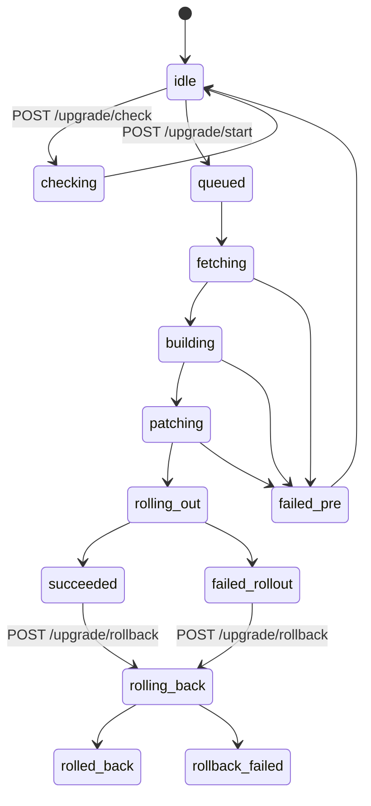

# In-app self-upgrade — design (2026-05-22)

## Motivation

Operators who run `elb-dashboard` from a local `git clone` + `azd up` have no
out-of-band CI/CD. When a new release tag (e.g. `v0.3.0`) appears upstream,
they currently have to SSH/SSH-equivalent into their workstation, rebuild
images, and re-run `postprovision.sh` to upgrade the deployed Container App.
This violates the project charter: the dashboard must be drivable from the
browser only.

This design adds an in-app upgrade path that:

* discovers candidate release tags directly from the configured git remote
  (no GitHub Actions, no manifest hosting);
* builds the new sidecar images in the platform ACR using the existing
  `az acr build` pattern, invoked from inside the deployed app;
* swaps the Container App template to the new images (Single revision mode,
  short downtime acceptable);
* keeps a rollback snapshot of the previously running images, so an operator
  can return to the prior revision with one click as long as the ACR retains
  the tags;
* provides an external escape-hatch command for the case where the new
  revision fails to boot and the api sidecar is unreachable.

## Non-goals

* No GitHub Actions, no release-manifest.json, no external CI dependency.
* No automatic upgrade — every upgrade is operator-initiated.
* No blue/green / multi-revision rollout in this phase (acceptable downtime
  ≈ new-revision startup time, typically < 1 minute).
* No standalone workload-image (`ncbi/elb`, `elb-openapi`, …) upgrade — those
  are pinned in `api.services.image_tags.IMAGE_TAGS` and ride along with
  control-plane releases.
* No prompt that asks the operator to run commands on their laptop, except
  the explicit escape-hatch flow when the deployed api is unreachable.

## Terminology — three "versions"

| Kind | Where it lives | Surfaced as |
|---|---|---|
| Control-plane release version | `web/package.json`, `pyproject.toml`, git tag `vA.B.0`, `api.__version__` | SPA header, `/api/health.version` |
| Sidecar image tag (control plane) | ACR `elb-api`, `elb-frontend`, `elb-terminal` — currently a `YYYYMMDDHHMMSS` timestamp set by `scripts/dev/postprovision.sh` | Container App `template.containers[].image` |
| Workload image tag | `api.services.image_tags.IMAGE_TAGS` constants, baked into running code | ACR job templates |

This design upgrades the **control-plane release version**. The image-tag
convention introduced here is `:vA.B.0` (plus an immutable `:vA.B.0-sha-<short>`
companion) so the running app can map a release version to an image set with
no external manifest.

## Architecture overview

```mermaid
flowchart LR
  subgraph Operator
    UI[SPA Upgrade Modal]
  end
  subgraph "Container App (current revision)"
    Api[api sidecar]
    Worker[worker sidecar]
    Beat[beat sidecar]
    Terminal[terminal sidecar<br/>git + az acr build]
  end
  subgraph Azure
    ACR[(Platform ACR)]
    ARM[(ARM / Microsoft.App)]
    Tbl[(Storage Table<br/>upgradestate)]
    Blob[(Storage Blob<br/>upgrade-history)]
  end
  Remote[(git remote — any HTTPS git)]

  UI -- GET /api/upgrade/status --> Api
  UI -- POST /api/upgrade/start --> Api
  Api -- enqueue --> Worker
  Beat -- 30m: ls-remote --> Remote
  Beat -- write --> Tbl
  Worker -- terminal_exec.stream(git clone) --> Terminal
  Worker -- terminal_exec.stream(az acr build) --> Terminal
  Terminal -- push images --> ACR
  Worker -- begin_update template --> ARM
  ARM -- new revision --> NewRev[Container App (new revision)]
  Worker -- write progress --> Tbl
  Worker -- append --> Blob
```

## State machine



`failed_pre` means the operator is still running the old revision with no
impact. `failed_rollout` means a new revision is partially in service or
crashlooping; recovery may require the escape hatch.

## Data model

### Storage Table `upgradestate` (PartitionKey=`control-plane`, RowKey=`current`)

| Field | Type | Notes |
|---|---|---|
| `running_version`, `running_sha`, `running_revision` | str | Reconciled from `api.__version__` and ARM. |
| `current_images.{api,frontend,terminal}` | str | Full image refs read from ACA template — rollback ground truth. |
| `latest_version`, `latest_sha`, `latest_checked_at` | str | Updated by `upgrade.check_latest` beat job from git ls-remote. |
| `git_remote` | str | From env `UPGRADE_GIT_REMOTE`; falls back to `origin` recorded at first deploy. |
| `state` | str | State-machine node. |
| `target_version`, `target_sha` | str | What the operator clicked. |
| `job_id`, `started_by_oid`, `started_at` | str | Audit. |
| `phase_detail`, `phase_progress` | str / int | Human-readable + 0..100. |
| `error` | str | Last error message. |
| `build_log_blob` | str | Prefix for per-component build logs. |
| `rollback_target.{api,frontend,terminal}` | str | Snapshot taken before PATCH. |
| `rollback_available_until` | datetime | Estimated ACR retention horizon. |

ETag CAS on every transition prevents concurrent operators from starting
parallel upgrades.

### Append blob `upgrade-history.log`

One JSON line per significant event: candidate-detected, start, state
transitions, build success/failure, ARM PATCH submitted, escape-hatch
command snapshot, rollback start/finish.

### Blob `upgrade-logs/<job_id>/build-{api|frontend|terminal}.log`

Raw `az acr build` stdout/stderr. Downloadable from the UI for diagnosis.

## Backend modules (SRP split)

### New package `api/services/upgrade/`

| File | Responsibility | Outbound deps |
|---|---|---|
| `remote_tags.py` | `git ls-remote --tags <url>` → semver-sorted candidates ≥ running. Optional Key Vault PAT injection for private remotes. | Key Vault client |
| `aca_template.py` | Read current `template.containers[].image` per sidecar via `ContainerAppsAPIClient.container_apps.get()`. | azure-mgmt-app |
| `git_workspace.py` | `terminal_exec.stream(["git", "clone", "--depth", "1", "--branch", tag, …])` to `/tmp/elb-upgrade-<job>/`. | terminal_exec |
| `image_builder.py` | Run `az acr build` for each of `elb-api`, `elb-frontend`, `elb-terminal`; stream stdout to build-log blob; verify resulting manifest digest in ACR. | terminal_exec, ACR data plane |
| `applier.py` | Snapshot current images → swap api/worker/beat/frontend/terminal containers to new tags → `begin_update` with `revisionSuffix=v<x>-<y>-<z>`. | azure-mgmt-app |
| `rollout_watcher.py` | Poll new revision `provisioningState` + `/api/health.version` until target matches or timeout. | azure-mgmt-app, httpx |
| `rollback.py` | Verify rollback target tags still resolve in ACR; PATCH ACA template back to snapshot with `revisionSuffix=rb-<ts>`. | applier |
| `escape_hatch.py` | Build a fully-qualified `az containerapp update` command set (no secrets) that an operator can copy/paste from any `az login`-ed shell. | — |

Rules:
* Routes never call `azure.mgmt.*` directly — go through the service.
* Each module has one responsibility and one Validation hook in its context
  header.
* Build logs go through `terminal_exec.stream`; no synchronous, buffered
  `run()` for image builds.

### `api/services/terminal_exec.py` allowlist

Add `git` to the existing `{azcopy, kubectl, elastic-blast, elb, az}`
allowlist (both in the python wrapper docs and the sidecar `exec_server.py`).
Tighten the argv validator:

* clone target path must match `^/tmp/elb-upgrade-[0-9a-f-]+/?$`;
* clone URL must match `^https?://[\w./:@-]+\.git$`;
* `az` subcommand restricted to `{acr build, containerapp show, containerapp update}`.

### New router `api/routes/upgrade.py`

Registered in `api/main.py` **above** the `frontend_proxy` catch-all
(tripwire #7).

| Method | Path | Role | Auth |
|---|---|---|---|
| `GET` | `/api/upgrade/status` | Latest state row + progress. | caller |
| `GET` | `/api/upgrade/candidates` | Semver-sorted release tags ≥ running. | caller |
| `POST` | `/api/upgrade/check` | Force a beat-equivalent refresh. | caller |
| `POST` | `/api/upgrade/start` | `{target_version, target_sha?, confirm_downtime: true}` → enqueue Celery task. | `UpgradeAdmin` |
| `GET` | `/api/upgrade/jobs/{job_id}/build-log/{component}` | Stream the per-component build log blob. | `UpgradeAdmin` |
| `POST` | `/api/upgrade/rollback` | PATCH back to `rollback_target`. | `UpgradeAdmin` |
| `GET` | `/api/upgrade/escape-hatch` | Copy-pasteable recovery command set. | `UpgradeAdmin` |
| `GET` | `/api/upgrade/history` | Tail of the append-blob log. | caller |

### New task `api/tasks/upgrade.py`

`upgrade.execute(target_version, target_sha, started_by)`:

1. CAS row to `queued`. Bail if not `idle`.
2. `state=fetching`: `git_workspace.clone()`.
3. `state=building`: `image_builder.build("api"|"frontend"|"terminal")` in
   sequence (parallel is a later optimisation); stream logs to blob.
4. `state=patching`: `aca_template.snapshot()` → row `rollback_target`;
   `escape_hatch.snapshot()` → audit blob; `applier.apply()`.
5. `state=rolling_out`: commit before ARM call may take this worker down.
6. Reconciler (in the freshly booted revision) finalises to `succeeded`
   when `/api/health.version == target_version` and the new revision is
   `Healthy`, or `failed_rollout` on 10-minute timeout.

Failures are tagged `failed_pre` (pre-PATCH, zero customer impact) or
`failed_rollout` (post-PATCH, may have downtime). **Auto-rollback is never
performed** — the operator decides.

### Beat schedule additions in `api/celery_app.py`

| Job | Interval | Purpose |
|---|---|---|
| `upgrade.check_latest` | 30 min | `remote_tags.fetch()` → row update. |
| `upgrade.reconcile` | 60 s | Finalise `rolling_out`, time out stuck states, keep `running_*` in sync with `api.__version__`. |

## Downtime budget (Single revision mode)

```
t0      operator clicks start
t0+1s   queued
t0+2s   fetching (git clone, 3-10s)
t0+15s  building elb-api          (1-3 min)
t0+3m   building elb-frontend     (1-2 min)
t0+4m   building elb-terminal     (3-5 min)
t0+9m   patching: snapshot + escape hatch + ARM begin_update
t0+9m   state=rolling_out committed
=== old revision drains, new revision boots ===
t0+9m-10m  DOWNTIME (HTTP 502/503)
t0+10m  new api up, reconciler marks succeeded
```

The build phase has **no downtime**. The actual outage is bounded by ACA's
new-revision startup time, typically < 1 minute.

## Rollback scenarios

| Situation | Operator action | System behaviour |
|---|---|---|
| `failed_pre` (git / build / PATCH refused) | None — system returns to `idle`. | Zero impact. UI shows reason and links to build log. |
| `failed_rollout` or `succeeded` but regression detected, api reachable | UI → "Rollback". | PATCH back to `rollback_target`, ~1 min downtime. ACR tag existence verified first. |
| New revision crashloops, api unreachable | Copy `escape-hatch` command from UI (if cached locally) or run pre-recorded `az containerapp update` against the known image refs. | Operator-driven; commands are pre-snapshotted in `upgrade-history.log` for paper-trail. |
| ACR tag retention expired | UI rejects rollback with `rollback_failed`. | Operator must rebuild a fresh image from a chosen tag and rerun the upgrade flow. ACR retention ≥ 90 days recommended. |

## Safety / threat model

| Threat | Mitigation |
|---|---|
| Bad tag breaks the build | `image_builder.build` fails → no PATCH → no impact. |
| Concurrent operators | Row ETag CAS, HTTP 409 on second `start`. |
| Worker dies mid-build | `reconcile` job marks `failed_pre` after 30 min in `building`. |
| Downgrade attempt | `packaging.version` comparison rejects lower-than-running. Rollback uses a separate snapshot path. |
| Large terminal build context | `tmpfs` `/tmp` in sidecar; explicit cleanup on completion. |
| Private remote PAT | KV secret `git-remote-pat`, injected into URL, masked in logs and UI. |
| `terminal_exec` allowlist bypass | argv[0] gate + new clone-path + URL regex + `az` subcommand allowlist. |
| Escape-hatch command leaking secrets | Commands carry only `sub`/`rg`/`app`/image refs. Authentication is the operator's own `az login`. |
| MI scope creep | No new role assignments — RG Contributor (existing) and acrPush (existing) cover everything. |
| Endless ACA retry on crashloop | Owned by ACA; reconciler still emits `failed_rollout` after 10 minutes for UI clarity. |

## Frontend

* Header gains a small dot + tooltip when `latest_version > running_version`
  and state is `idle`.
* `UpgradeModal` shows current/target comparison, a dropdown of candidate
  tags, mandatory "I accept ~1 minute downtime" checkbox, and (for major
  bumps) a second confirmation.
* Progress view renders state-machine nodes, with per-component "View log"
  links streaming the blob.
* When `/api/health` stops responding, the SPA shows "Container restarting,
  page will reload" and polls until the new version reports back.
* Rollback view shows the `current_images` vs `rollback_target` diff and a
  countdown to the ACR retention horizon.

## Affected files (planned)

New:
* `api/services/upgrade/{__init__,remote_tags,aca_template,git_workspace,image_builder,applier,rollout_watcher,rollback,escape_hatch}.py`
* `api/routes/upgrade.py`
* `api/tasks/upgrade.py`
* `api/tests/test_upgrade_*.py` (per-module)
* `web/src/api/upgrade.ts`
* `web/src/components/{UpgradeBadge,UpgradeModal,UpgradeProgress,UpgradeRollback}.tsx`
* `docs/features_change/2026-05/2026-05-22-self-upgrade.md` (per PR)

Changed:
* `api/main.py` — register `upgrade.router` before `frontend_proxy`.
* `api/auth.py` — add `require_role("UpgradeAdmin")` helper.
* `api/celery_app.py` — two beat entries.
* `api/services/terminal_exec.py` — allowlist + docs.
* `terminal/exec_server.py` — allowlist + argv guard.
* `web/src/api/endpoints.ts`, `web/src/components/Header.tsx`.

No Bicep changes are required — RG Contributor and acrPush role assignments
already exist for the user-assigned MI.

## Rollout plan (PR sequence)

1. **PR1 — read-only**: `remote_tags`, `aca_template`, `/api/upgrade/{status,candidates,check}`, beat check, SPA header badge. Zero operational risk.
2. **PR2 — build-only**: `git_workspace`, `image_builder`, terminal allowlist extension, build-log blob, `/api/upgrade/start` with a dry-run guard that stops just before ARM PATCH. Validates the build path without touching production.
3. **PR3 — apply + rollback + escape hatch**: `applier`, `rollout_watcher`, `rollback`, `escape_hatch`, full SPA modal/progress/rollback UI.
4. **PR4 — UX polish**: retention countdown, history page, breaking-change confirmation, per-component build-log streaming.

Each PR ships its own `docs/features_change/` note with motivation,
user-facing change, API/IaC diff summary, and validation evidence.

## Validation strategy (per PR)

* `uv run pytest -q api/tests/test_upgrade_*`
* `uv run ruff check api`
* Local smoke via the `fullstack: start` task: hit each new route with curl
  using `AUTH_DEV_BYPASS=true`.
* For PR3 only, dry-run against a sandbox subscription before merging.

## Open questions

* **Image retention SLA.** We rely on ACR retaining the previous tag for
  rollback; we will document 90 days as the recommended floor but the actual
  policy is per-deployment.
* **Build parallelisation.** PR2 builds sequentially; we can revisit
  parallel builds after the first end-to-end success.
* **Custom forks.** If an operator has local edits not represented in any
  upstream tag, the UI must surface that the in-app upgrade will overwrite
  their image set. We will at minimum show `current_images` vs the new
  images so the diff is visible.
