# Get Started

Get from a fresh clone to a working ElasticBLAST dashboard on Azure.

!!! tip "TL;DR"

    Sign in to Azure, run `./deploy.sh` from the repository root (which
    calls `azd up`), then open the printed Container App URL and sign in
    with MSAL. The helper provisions the Bicep stack, builds container
    images via `az acr build`, and applies the six-sidecar Container App
    template. Expect ~30–45 minutes for a cold deployment.

Most research teams should use the guided deployment helper. It checks Azure sign-in, prepares the Azure Developer CLI environment, registers the required providers, handles the default resource-group choice, runs `azd up`, and opens the deployed dashboard when it is ready.

```bash
git clone https://github.com/dotnetpower/elb-dashboard.git
cd elb-dashboard
./deploy.sh
```

After deployment, researchers work in the browser: choose the Azure workspace, check readiness, submit BLAST jobs, monitor progress, and open results.

## Choose Your Path

| If you need to | Start with |
| --- | --- |
| Deploy the dashboard for the first time with the default path | This page |
| Install tools manually, control every `azd` value, or debug deployment failures | [Deployment Reference](deployment-reference.md) |
| Use an already deployed dashboard | [User Guide](user-guide/index.md) |
| Understand the sidecars, network path, and job flow before deploying | [High Level Architecture](architecture/high-level.md) |

You are ready to hand the dashboard to researchers when sign-in succeeds, the Dashboard loads workspace readiness, Storage holds at least one prepared BLAST database, AKS is ready for jobs, and the browser can see ACR, terminal, warmup, and recent-search status from the deployed API.

## Before You Start

You need an [Azure subscription](https://learn.microsoft.com/azure/cloud-adoption-framework/ready/azure-setup-guide/organize-resources) where you can create the control-plane resources. The easiest first deployment uses an account with `Owner`, or `Contributor` plus `User Access Administrator`.

You also need these local tools:

- Git
- Bash
- [Azure CLI](https://learn.microsoft.com/cli/azure/): `az`
- [Azure Developer CLI](https://learn.microsoft.com/azure/developer/azure-developer-cli/overview): `azd`

Docker is not required for deployment. Python, Node.js, and `uv` are only needed for local development and maintainer validation.

If your organization blocks [Microsoft Entra App Registration](https://learn.microsoft.com/entra/identity-platform/quickstart-register-app) creation or admin consent, ask an Entra administrator to create or approve the app once. The deployment can reuse that app with `API_CLIENT_ID`.

## Deploy With The Helper

Start from the repository root:

```bash
./deploy.sh
```

The helper may ask you to sign in to Azure. It uses the active Azure CLI subscription, creates or selects the default `elb-dashboard` azd environment, and sets the common environment values for you.

If the default resource group already exists, the helper asks what to do:

- Delete and reuse `rg-elb-dashboard`.
- Deploy to a numbered group such as `rg-elb-dashboard-01`.
- Abort so you can decide later.

For an unattended run, set one of these values before starting:

```bash
export ELB_EXISTING_RG_ACTION=delete  # or number, abort
./deploy.sh
```

To prepare the environment without deploying yet:

```bash
./deploy.sh --prepare-only
```

### Environment Overrides

All overrides are optional. The defaults work for a first deployment.

| Variable | Default | What it controls |
| --- | --- | --- |
| `AZD_ENV_NAME` | `elb-dashboard` | Name of the [azd environment](https://learn.microsoft.com/azure/developer/azure-developer-cli/environment-management) under `.azure/`. |
| `AZURE_LOCATION` | `koreacentral` | Region where the control plane is provisioned. |
| `LOCKDOWN_PRIVATE_NETWORKING` | `false` | When `true`, Storage / Key Vault / ACR are reached only over private endpoints. Set after the first deployment + smoke test succeed. |
| `ALLOWED_ORIGINS` | empty | Extra origins accepted by the API (comma-separated). Empty = same-origin only. |
| `ENABLE_APPLICATION_INSIGHTS` | `false` | Provisions [Application Insights](https://learn.microsoft.com/azure/azure-monitor/app/app-insights-overview) for the Container App. |
| `ELB_EXISTING_RG_ACTION` | prompt | `delete` / `number` / `abort` for an unattended choice when `rg-elb-dashboard` already exists. |
| `ELB_RESOURCE_NAME_SUFFIX` | empty | Numbered slot suffix such as `-01` for parallel deployments (`ELB_RESOURCE_NAME_SLOT=slot01` is the azd-safe form). |
| `ELB_ALLOW_AZD_ENV_RETARGET` | `false` | When `true`, silently retargets the azd environment if the active Azure CLI subscription / tenant changes. Interactive shells get a 3-way prompt instead. |
| `ELB_AUTO_FIX_RBAC` | `true` | Lets the post-deploy doctor grant any missing resource-to-resource role assignment to the dashboard managed identity. Set `false` in security-audited tenants that require an Owner / UAA to apply roles out of band. |
| `ELB_BOOTSTRAP_CLUSTER_RG` | `true` | Pre-creates the cluster resource group (`rg-elb-cluster` by default) and grants the managed identity Contributor + UAA on it so the first **Create Cluster** click works. Set `false` to keep the legacy least-privilege posture. |
| `ELB_CLUSTER_RG_NAME` | `rg-elb-cluster` | Overrides the cluster resource-group name used by the bootstrap. |
| `ELB_CLUSTER_RG_REGION` | matches `AZURE_LOCATION` | Overrides the region used by the cluster-RG bootstrap. |
| `ELB_SKIP_LOCAL_RBAC` | `false` | Skips granting the deployer the local-debug Storage / ACR roles needed for host-mode local debugging. |

## What Happens During Deployment

`./deploy.sh` prints an *azd up progress map* (steps `0/8` through `8/8`) before long-running work starts, then marks the active step as it runs. Step 0 is local bootstrap that runs inside the helper; steps 1–8 run inside `azd up` and its provision hooks.

```text
elb-dashboard deploy
azd up progress map
------------------------------------------------------------
  0/8  Local bootstrap          login, azd env, env values
  1/8  Provider registration    required Azure providers
  2/8  Resource group choice    reuse, delete, or choose numbered RG
  3/8  Bicep provision          RG, VNet, identity, ACR, Storage, Key Vault, Container Apps Environment
  4/8  App registration         create/reuse SPA/API App Registration
  5/8  Resource validation      Storage HNS and workspace tags
  6/8  Image builds             api, frontend, terminal via az acr build
  7/8  Sidecar swap             replace bootstrap app with six-sidecar layout
  8/8  Health check             wait for /api/health and print URL
------------------------------------------------------------
```

<!-- TODO: screenshot — terminal output of the azd up progress map block above. -->
<!-- Save as: docs/images/screenshots/deploy-progress-map.png -->
<!--  -->

The deployed control plane is one [Azure Container App](https://learn.microsoft.com/azure/container-apps/overview) with six sidecars. Researchers do not need Docker or local image builds for this path.

### Detailed Walkthrough

Each step below expands to show *what it does*, *what you should see*, and *common issues*. Click any step to expand.

??? note "Step 0/8 · Local bootstrap"

    **What it does**

    - Verifies [`az`](https://learn.microsoft.com/cli/azure/) and `azd` are installed and that you are signed in. If `az login` is missing it triggers an interactive browser login.
    - Detects whether the active Azure CLI subscription / tenant matches the azd environment under `.azure/<env>/`. Mismatches get a 3-way prompt (retarget azd, switch CLI, or abort) — or fail fast in non-interactive shells unless `ELB_ALLOW_AZD_ENV_RETARGET=true`.
    - Creates or selects the `elb-dashboard` azd environment and stores `AZURE_LOCATION`, `AZURE_SUBSCRIPTION_ID`, `AZURE_TENANT_ID`, `ALLOWED_ORIGINS`, `LOCKDOWN_PRIVATE_NETWORKING`, and `ENABLE_APPLICATION_INSIGHTS`.
    - Runs a caller pre-check that confirms you carry `Owner` *or* `Contributor + User Access Administrator` at subscription scope. Without it, `azd up` would fail ~10 minutes in on a role assignment.

    **What you'll see**

    ```text
    ==> Azure CLI account
        User:         alice@contoso.onmicrosoft.com
        Subscription: My Subscription (00000000-0000-0000-0000-000000000000)
        Tenant:       11111111-1111-1111-1111-111111111111
    ==> Selecting existing azd environment: elb-dashboard
    ==> Configuring azd environment
    ==> Pre-flight: verifying caller permissions for full deployment
        ✓ caller 'alice@contoso.onmicrosoft.com' has the roles required for azd up
    ```

    <!-- TODO: screenshot — terminal showing the "==> Azure CLI account" block + caller pre-check pass. -->
    <!-- Save as: docs/images/screenshots/deploy-step0-bootstrap.png -->

    **Common issues**

    - *azd is signed in as a different user* — Sign out of either tool so both use the same tenant + user, then rerun.
    - *Pre-check failure* — Ask your Azure administrator to grant `Owner` (or `Contributor + User Access Administrator`) at subscription scope, then rerun.

??? note "Step 1/8 · Provider registration"

    **What it does**

    Runs [`scripts/dev/register-providers.sh`](https://github.com/dotnetpower/elb-dashboard/blob/main/scripts/dev/register-providers.sh) against the active subscription to register the Azure resource providers Bicep needs (`Microsoft.App`, `Microsoft.ContainerService`, `Microsoft.ContainerRegistry`, `Microsoft.Storage`, `Microsoft.KeyVault`, `Microsoft.OperationalInsights`, `Microsoft.Network`, …). Already-registered providers are no-ops; brand-new subscriptions block here for 1–5 minutes while Azure finishes registration.

    **What you'll see**

    ```text
    ==> Pre-flight provider check
    [Registering] Microsoft.App
    [OK]         Microsoft.ContainerService
    ...
    ```

    **Common issues**

    - *Insufficient permission to register providers* — You need `Owner` or `Contributor` at subscription scope. A Reader account can list registrations but cannot trigger them.

??? note "Step 2/8 · Resource group choice"

    **What it does**

    Runs [`scripts/dev/resolve-resource-group.sh`](https://github.com/dotnetpower/elb-dashboard/blob/main/scripts/dev/resolve-resource-group.sh). If `rg-elb-dashboard` is empty (or absent) it picks that name. If it already contains resources, it prompts:

    1. **Delete** and reuse `rg-elb-dashboard`.
    2. **Number** — deploy to the next free slot such as `rg-elb-dashboard-01` (and stores `ELB_RESOURCE_NAME_SLOT=slot01`).
    3. **Abort**.

    Set `ELB_EXISTING_RG_ACTION=delete|number|abort` (and optionally `ELB_RESOURCE_NAME_SUFFIX=-02`) for unattended runs.

    **What you'll see**

    ```text
    ==> Target resource group: rg-elb-dashboard-01
    ```

    <!-- TODO: screenshot — the interactive RG choice prompt with the three options. -->
    <!-- Save as: docs/images/screenshots/deploy-step2-rg-choice.png -->

??? note "Step 3/8 · Bicep provision"

    **What it does**

    Hands control to `azd up`, which deploys [`infra/main.bicep`](https://github.com/dotnetpower/elb-dashboard/blob/main/infra/main.bicep). This creates the resource group, [VNet](https://learn.microsoft.com/azure/virtual-network/virtual-networks-overview), [user-assigned managed identity](https://learn.microsoft.com/entra/identity/managed-identities-azure-resources/overview), [Azure Container Registry](https://learn.microsoft.com/azure/container-registry/container-registry-intro), [Azure Storage](https://learn.microsoft.com/azure/storage/common/storage-introduction) account, [Key Vault](https://learn.microsoft.com/azure/key-vault/general/overview), [Container Apps Environment](https://learn.microsoft.com/azure/container-apps/environment), private endpoints, and a *bootstrap* Container App that serves a placeholder image while the real images build.

    **What you'll see**

    ```text
    Subscription: My Subscription (00000000-0000-0000-0000-000000000000)
    Location: Korea Central

      You can view detailed progress in the Azure Portal:
      https://portal.azure.com/#view/HubsExtension/DeploymentDetailsBlade/...

      (✓) Done: Resource group: rg-elb-dashboard
      (✓) Done: Virtual Network: vnet-elb-...
      (✓) Done: User Assigned Managed Identity: id-elb-dashboard-...
      ...
    ```

    **Common issues**

    - *SoftDeleted Key Vault name in use* — Choose a different `AZURE_LOCATION` or purge the soft-deleted vault.
    - *Region quota* — The region must allow Container Apps + the chosen VM size for AKS. Switch `AZURE_LOCATION` if quota is exhausted.

??? note "Step 4/8 · App registration"

    **What it does**

    Creates a Microsoft Entra [App Registration](https://learn.microsoft.com/entra/identity-platform/quickstart-register-app) with SPA + API exposure if `API_CLIENT_ID` is not already set. Adds `http://localhost:8090` as a SPA redirect URI for local development. The browser-side MSAL flow uses this app to sign users in; the backend validates the bearer token against the same app.

    **What you'll see**

    ```text
    ==> Creating App Registration: elb-dashboard
        Client ID: 22222222-2222-2222-2222-222222222222
    ```

    **Common issues**

    - *Tenant blocks App Registration creation* — Ask an Entra administrator to create the app once, then rerun with `azd env set API_CLIENT_ID <client-id>`.

??? note "Step 5/8 · Resource validation"

    **What it does**

    Checks that the platform Storage account has [Hierarchical Namespace](https://learn.microsoft.com/azure/storage/blobs/data-lake-storage-namespace) enabled and that the dashboard discovery tags (`azd-env-name`, `app`, `topology`, …) made it onto every module's resources. Failures here usually mean a previous deployment was edited by hand.

??? note "Step 6/8 · Image builds"

    **What it does**

    Runs `az acr build` for the three control-plane images directly inside the deployed [Azure Container Registry](https://learn.microsoft.com/azure/container-registry/container-registry-tasks-overview) — no local Docker required:

    - `api:<tag>` — FastAPI + Celery sidecar.
    - `frontend:<tag>` — nginx serving the built React SPA.
    - `terminal:<tag>` — `ttyd` + the BLAST toolchain (`elastic-blast`, `kubectl`, `azcopy`, `az`).

    The build runs entirely in the cloud, so the only thing your laptop uploads is the build context.

    **What you'll see**

    ```text
    ==> Building image: api:20260527... (az acr build)
    ==> Building image: frontend:20260527... (az acr build)
    ==> Building image: terminal:20260527... (az acr build)
    ```

??? note "Step 7/8 · Sidecar swap"

    **What it does**

    Runs [`scripts/dev/postprovision.sh`](https://github.com/dotnetpower/elb-dashboard/blob/main/scripts/dev/postprovision.sh) which applies the six-sidecar template to `ca-elb-dashboard`: `frontend`, `api`, `worker`, `beat`, `redis`, `terminal`. Replicas are pinned to `min=1, max=1` to keep the in-revision Redis broker and ephemeral terminal home stable.

    **What you'll see**

    ```text
    ==> Applying six-sidecar template to ca-elb-dashboard
    ==> Waiting for revision to become Active
    ```

??? note "Step 8/8 · Health check"

    **What it does**

    Polls `https://<app-fqdn>/api/health` until it returns `200 OK`, then prints the URL and tries to open it in your browser (`xdg-open` / `open` / `wslview`).

    **What you'll see**

    ```text
    ==> Deployment complete: https://ca-elb-dashboard.<subdomain>.<region>.azurecontainerapps.io
    ```

??? note "Post-deploy · Local-debug RBAC + MI doctor + cluster-RG bootstrap"

    After `azd up` succeeds, `deploy.sh` runs three follow-up helpers so the dashboard works end-to-end from the very first sign-in.

    1. **Local-debug RBAC** — [`scripts/dev/grant-local-rbac.sh`](https://github.com/dotnetpower/elb-dashboard/blob/main/scripts/dev/grant-local-rbac.sh) grants the deployer `Storage Blob Data Contributor` + `Storage Table Data Contributor` (and ACR `AcrPull` when ACR is exposed) so host-mode local debugging works against the same workspace. Skip with `ELB_SKIP_LOCAL_RBAC=true`.
    2. **MI RBAC doctor** — [`scripts/dev/check-mi-rbac.sh`](https://github.com/dotnetpower/elb-dashboard/blob/main/scripts/dev/check-mi-rbac.sh) enumerates every `{scope, role}` pair the dashboard managed identity needs and (with `--auto-fix`, the default) grants anything missing. Set `ELB_AUTO_FIX_RBAC=false` for read-only mode that just prints the gap and the exact `az role assignment create` command.
    3. **Cluster-RG bootstrap** — When the cluster resource group (default `rg-elb-cluster`) does not exist, [`scripts/dev/grant-runtime-rbac.sh`](https://github.com/dotnetpower/elb-dashboard/blob/main/scripts/dev/grant-runtime-rbac.sh) pre-creates it and grants the managed identity `Contributor + User Access Administrator` on it only. This closes the gap where the SPA's first **Create Cluster** click would otherwise fail with `AuthorizationFailed`. Interactive shells get a `[Y/n]` prompt (default `Y`); non-interactive runs proceed unless `ELB_BOOTSTRAP_CLUSTER_RG=false`.

    **What you'll see**

    ```text
    ==> Granting local-debug RBAC to the deployer
    ==> Running MI RBAC doctor (--auto-fix: missing resource-to-resource roles
        will be granted under 'alice@contoso.onmicrosoft.com'; opt-out with ELB_AUTO_FIX_RBAC=false)
    ==> The dashboard MI does not yet have access to a cluster RG.
        The SPA's first "Create Cluster" click will fail with
        AuthorizationFailed (resourceGroups/write at sub scope) unless
        the cluster RG is pre-created and the MI is granted Contributor.
    Pre-create the cluster RG + grant MI roles now? [Y/n] Y
    ==> Deployment complete: https://ca-elb-dashboard.<subdomain>.<region>.azurecontainerapps.io
        Cluster RG 'rg-elb-cluster' is ready. Wait 1–5 min for RBAC propagation,
        then click 'Create Cluster' in the dashboard.
    ```

    <!-- TODO: screenshot — final "Deployment complete:" line + cluster-RG bootstrap summary. -->
    <!-- Save as: docs/images/screenshots/deploy-post-complete.png -->

## Open The Dashboard

When deployment finishes, open the URL printed by the helper:

```text
https://ca-elb-dashboard.<subdomain>.<region>.azurecontainerapps.io
```

The browser opens the ElasticBLAST on Azure sign-in page. Click **Sign in with Microsoft**, then use an account from the same tenant that owns the App Registration.


After sign-in, the Dashboard should load Azure workspace readiness from the deployed API sidecar. The top header shows the active subscription and workload resource group, and the page is organised into a **Cluster Plane** (AKS), a **Resource Plane** (ACR, Storage, Terminal sidecar), and — further down — the sidecar runtime panel. On a brand-new deployment the AKS card reads **Not Provisioned** and the BLAST Databases row shows `access blocked` (the workload Storage account is private; the dashboard streams through the API sidecar, but the database catalogue still needs to be prepared).

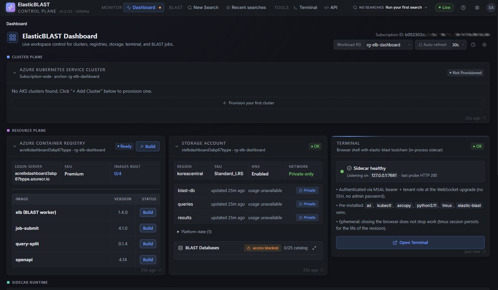

On a new workspace, the **Getting Started** dialog also appears after sign-in. This dialog is the first-search readiness checklist, not another `azd` deployment step: the control plane is deployed, but the workload runtime still needs to be prepared before BLAST can run.


From this state, complete the workload setup in the browser before submitting a BLAST job. A complete BLAST-ready workspace needs these runtime pieces:

1. Create an AKS cluster from the Cluster Plane card.
2. Get and warm a BLAST database from the BLAST Databases dialog.
3. Build the ElasticBLAST container images in ACR, including `elb-openapi`.
4. Deploy or update the `elb-openapi` service to AKS before using the [API Reference](user-guide/api-reference.md) or OpenAPI execution surface.

If sign-in works locally but not in Azure, the deployed Container App origin may need to be added as a SPA redirect URI. See [Deployment Reference](deployment-reference.md#redirect-uri-after-deployment).

## First Browser Run

The Dashboard is the browser landing page after sign-in. On first load it scans accessible subscriptions for tagged ElasticBLAST workspaces:

- If exactly one workspace is found, it is selected automatically.
- If multiple workspaces are found, choose the one researchers should use.
- If no workspace is found, the setup wizard opens so you can select the subscription, resource group, Storage account, and ACR.

The setup wizard only connects the dashboard to the Azure workspace. It does not make the workspace BLAST-ready by itself. After the workspace is selected, use the Dashboard readiness flow to prepare the runtime pieces: build the ElasticBLAST images in ACR, deploy `elb-openapi` when needed, prepare a BLAST database in Storage, create or start AKS, and warm the selected database before the first search.

You can re-run the setup wizard later from the Dashboard resource settings panel if the subscription, resource group, Storage account, or ACR changes.

## Make The Workspace BLAST-Ready

A deployed dashboard is ready for real searches only after the workload resources are ready:

1. Storage account: prepare at least one BLAST database copied from NCBI into the workload Storage account.
2. Database layout: let the prepare flow create the available shard layouts so the submit form can choose an appropriate sharded execution path.
3. ACR: build the ElasticBLAST runtime images required by submit, split, merge, and OpenAPI execution, including `elb-openapi`.
4. AKS: create or start a workload cluster with enough nodes and memory for the chosen database.
5. OpenAPI service: deploy or update `elb-openapi` to AKS when the API Reference or OpenAPI execution surface will be used.
6. Warmup: keep the selected database warm on AKS before submitting work, so the first search does not pay the full database staging cost.

The Dashboard should guide this sequence. The setup wizard is the resource-selection gate; the BLAST readiness flow is the operational gate before New Search.

### Create The Workload AKS Cluster

Use **Cluster Plane** to create the workload cluster. On a fresh deployment the card shows **Not Provisioned** with a single primary action — click **+ Provision your first cluster** to open the create dialog. (On subsequent visits the same action is labelled **+ Add Cluster**.)

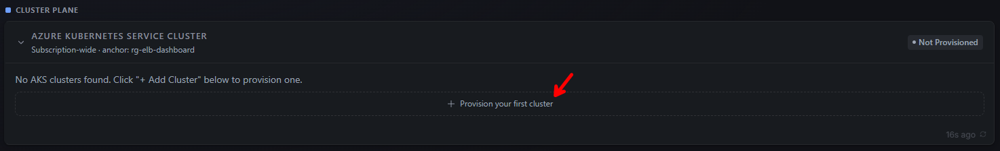

The **Create AKS Cluster** dialog pre-fills sensible defaults. Pick a **Cluster classification** to apply a tier preset (it adjusts the workload SKU and node count and tags the cluster with `elb-tier` so the dashboard can group multi-cluster fleets), then review the workload and system pools. The green check panel below the pools is the pre-flight gate — VM SKU availability, compute quota, the cluster resource group, the dashboard managed identity's RBAC on it, and the runtime UAA role must all pass before the **Create Cluster** button enables. The estimated hourly / monthly cost is shown at the bottom so the cost is explicit before any compute is created.

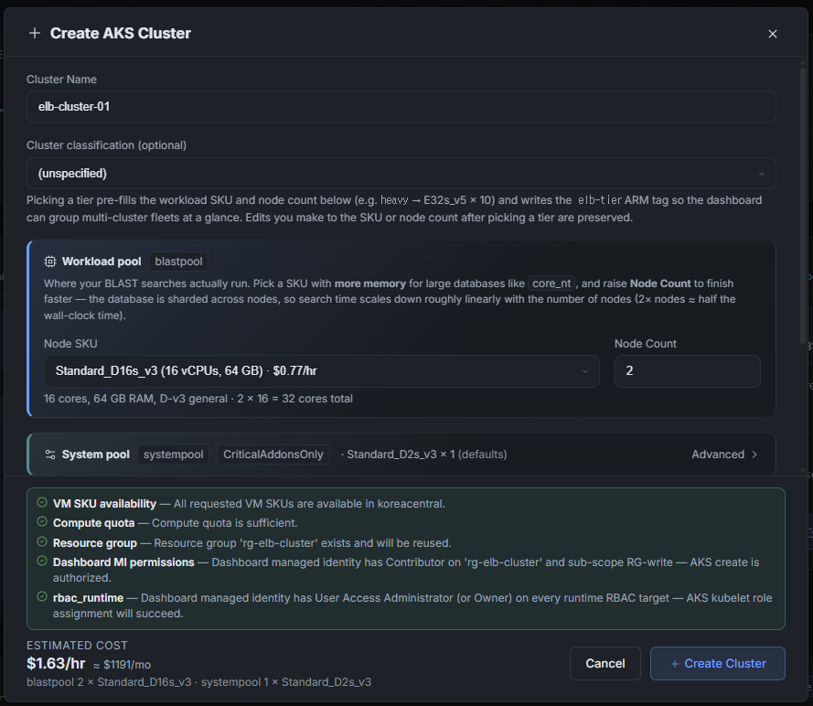

Scroll down for the **Region** and **Resource Group** fields. When `./deploy.sh` ran its cluster-RG bootstrap, the `rg-elb-cluster` resource group was pre-created and the dashboard managed identity was granted `Contributor + UAA` on it only — the dialog detects this and reuses the same RG. Multiple AKS clusters can share that resource group; the in-card warning reminds you that the cluster lands in `rg-elb-cluster`, not in the dashboard's own workload RG `rg-elb-dashboard`, so to manage it later you switch the dashboard's Workload RG selector to `rg-elb-cluster`.

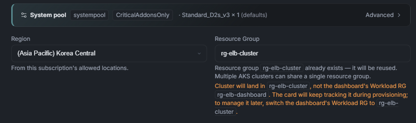

Click **+ Create Cluster** to submit. The footer switches to a **Provisioning · in progress** state with an elapsed-time counter and a **Stop** button. The modal closes automatically as soon as Azure accepts the cluster-create request — the actual provisioning continues in the background and the Cluster Plane card tracks it from there. If validation fails, the error appears inline with your inputs preserved so you can adjust SKU, count, or region without retyping.

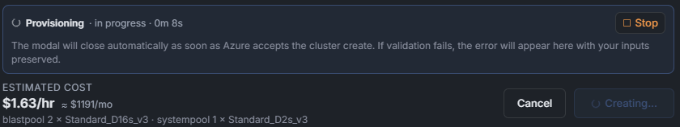

Once the modal closes, the Cluster Plane card itself becomes the live progress view. The card header switches to a **Loading** badge, the row shows the cluster name and target RG, and a five-step progress bar tracks the actual AKS create — typically **Step 3/5 · Creating AKS cluster (5–10 min)**, with separate `systempool · Creating · 1n` and `blastpool · Creating · 2n` chips for each node pool. Use **Open in Azure portal** for the underlying ARM deployment, or **Stop provisioning** to cancel.


When AKS reports the cluster as running and the dashboard's post-provision RBAC + add-on checks finish, the card flips to a green **OK** badge, surfaces an **Add Cluster** action, and shows a one-line "Cluster `elb-cluster-01` is ready." banner. The row now exposes the steady-state telemetry the dashboard uses to gate New Search: K8s version, node count, visible BLAST DBs, CPU / MEM peak, API P95 latency, error count, and a Jobs summary. From here you can move on to preparing a BLAST database — the cluster is BLAST-ready but still has zero databases visible.

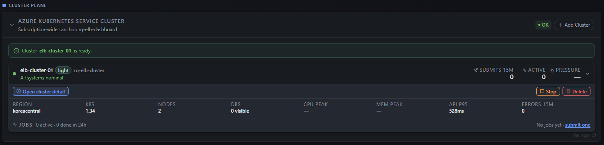

### Build The ElasticBLAST ACR Images

While the cluster is provisioning, kick off the ACR image builds in parallel — they have no dependency on AKS. The **Azure Container Registry** card in the Resource Plane shows the four images the BLAST runtime needs (`elb (BLAST worker)`, `job-submit`, `query-split`, `openapi`) with their pinned versions and a per-image **Build** action; the card-level **Build** button on the top right builds all four at once.

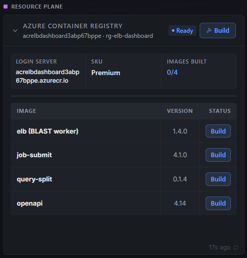

The build runs entirely inside [ACR Tasks](https://learn.microsoft.com/azure/container-registry/container-registry-tasks-overview) — your laptop only uploads the build context. While the worker picks up the task, every row flips to **Queued** and the card-level status shows `Build task queued; waiting for the worker to start an ACR run…` with an elapsed counter. Rows turn green individually as each image finishes and `IMAGES BUILT` climbs `0/4 → 4/4`. You can leave this view and come back — the card polls quietly in the background.

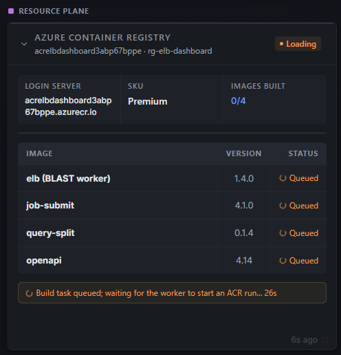

### Prepare A BLAST Database

Use the **Storage Account** card in the Resource Plane as the entry point. The card surfaces the workload Storage account, the `blast-db` / `queries` / `results` containers, and a **BLAST Databases** row at the bottom showing the catalogue count (e.g. `0/25 catalog`). On a brand-new deployment that row reads **access blocked** because the workload Storage account is private; click the expand icon at the right of the row (red arrow) to open the database dialog through the API sidecar proxy.

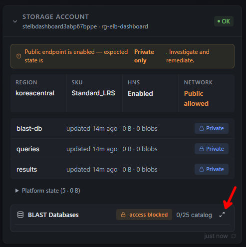

The **BLAST Databases** dialog lists the NCBI catalogue grouped by category (Small / Test first, then Nucleotide, Protein, …) with the NCBI snapshot timestamp at the top. Pick a small database such as **16S ribosomal RNA** and click **Get** — the dashboard downloads the shards from NCBI into the private `blast-db` container without ever issuing a SAS URL to the browser. Multiple `Get` actions can run in parallel.

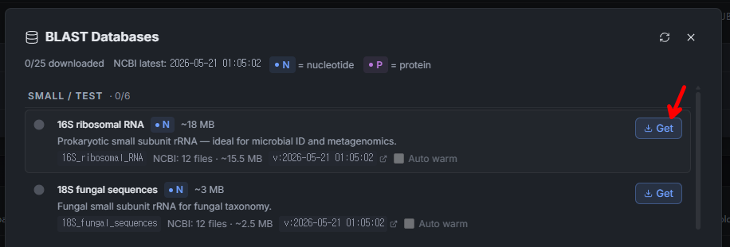

Once a database is fully copied, its row turns green with a **Ready** badge and surfaces metadata the submit form will use: downloaded size, file count, the latest NCBI snapshot version, and the available shard layouts (e.g. **Sharded · 1 layouts**). Tick **Auto warm** so the dashboard will keep the database hot on every cluster you connect — this is the cheapest way to avoid paying the full database staging cost on the first search.

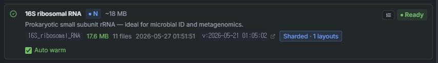

### Warm The Database On The Cluster

Auto warm enqueues the warmup automatically, but the first run is worth watching end-to-end so you understand what "ready" actually means. From the **Cluster Plane** card, find the cluster you provisioned and click **Open cluster detail** (red arrow) to drill into its live view.

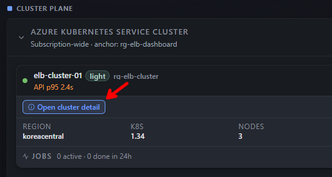

The cluster detail modal shows the four headline cards (NODES, K8S, POOLS, OS), per-node CPU / memory bars grouped by SYSTEM (`systempool`) and USER (`blastpool`) pools, expandable **Nodes** / **Active Pods** sections, and a read-only **Run kubectl command** input (limited to `get`, `top`, `describe`, `logs`). The **DB Warmup** panel at the bottom is the live picture of database staging: capacity summary (`Warm cache capacity · 2 nodes · Standard_D16s_v3 · X% memory used · min YY GiB free`), and one row per database showing the readiness chips (`Storage DB ready`, `Shard layouts · 1`, `AKS cache copying · 0/1`) plus a copy-progress line. Transient `azcopy` retries are surfaced (e.g. `azcopy attempt 3/3 failed, retrying in 20s…`) so a slow first warm is visible instead of looking stuck; **Rewarm** re-triggers the copy and **Release** drops the cache to free node memory.


Once the warmup row flips to all-green (`AKS cache copying · N/N`) the database is ready for that cluster and the Cluster Plane card's `DBS` counter increments. At that point New Search will accept that database without first paying the staging cost.


### Deploy The OpenAPI Service

The OpenAPI execution surface — the `elb-openapi` service that powers the [API Reference](user-guide/api-reference.md) page and the OpenAPI submit / status routes — is a separate deployment on the same AKS cluster. It is not required for browser-only BLAST submissions through New Search, but it must be deployed before any external client (curl, Postman, an automation script) can drive BLAST through REST. Skip this section if you only need the dashboard UI.

Open the **API** entry in the top navigation. On a fresh cluster the page shows an **OpenAPI service not found** banner identifying the cluster the discovery probe ran against (e.g. `elb-cluster-01`). Click **Deploy elb-openapi** to roll out the `elb-openapi:4.14` image you already built in ACR — the dashboard applies the deployment + internal LoadBalancer to the `elb` namespace and watches it through to a ready state. Use **Retry Discovery** if you deployed manually from the terminal sidecar and just need the page to re-probe.


## Submit Your First BLAST Search

With ACR images built, a warmed database, and the cluster green, the workspace is ready for an end-to-end smoke test. The dashboard's readiness signals at the top of the page should all be in steady state before you proceed:

- Active subscription and workspace are selected in the header.
- Cluster Plane shows the cluster as **OK** with `DBS` &gt; 0.
- ACR card shows `IMAGES BUILT · 4/4`.
- BLAST Databases shows the chosen database as **Ready** and warmed (`AKS cache ready · N/N`).

Then submit and track the first job:

1. Open **New Search**, paste a small FASTA query, and pick the warmed database.
2. Submit the job and follow it from **Recent searches** until it completes.
3. Open the result to confirm hits are rendered and that the download links stream through the API sidecar (no SAS URL in the browser).

The first full BLAST smoke test creates an [AKS](https://learn.microsoft.com/azure/aks/intro-kubernetes) workload cluster and can add cost. Run it only when your tenant policy allows AKS to stay running long enough for the job lifecycle, and make sure someone owns cleanup before starting.

!!! tip "Fastest safe smoke test"
	Use a small database such as `16S_ribosomal_RNA`, build the required ACR images first, prepare the database in Storage, warm it on AKS, and confirm the cleanup path before creating larger AKS compute.

## Cost And Cleanup

The control plane has a standing Azure cost before BLAST workload usage. The optional smoke test adds AKS compute cost.

Stop or delete AKS clusters when they are not actively running searches. To remove the whole control plane, run this from the same repository environment used for deployment:

```bash
azd down --purge --force
```

## More Detail

- [Joining An Existing Deployment](joining-existing-deployment.md) walks a second teammate through binding a fresh clone to a deployment that already exists, including RBAC.
- [Troubleshooting](troubleshooting.md) lists the most common sign-in, RBAC, and dashboard error symptoms with the fix for each.
- [Deployment Reference](deployment-reference.md) covers tool installation, manual `azd` deployment, redirect URI setup, smoke testing, network lockdown, cleanup, and troubleshooting.
- [User Guide](user-guide/index.md) explains day-to-day operation from the browser.
- [Dashboard](user-guide/dashboard.md) explains the readiness signals to check before a search.