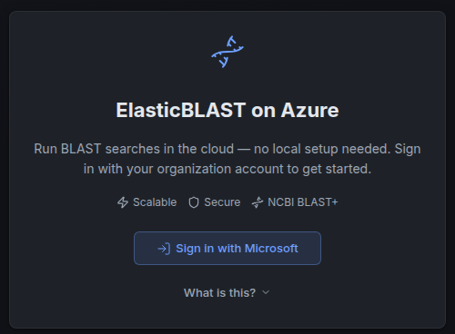
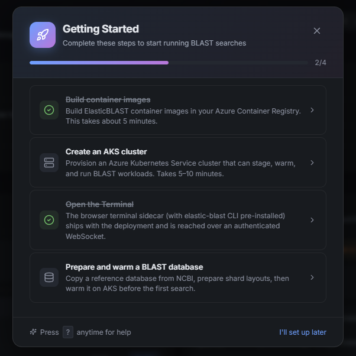
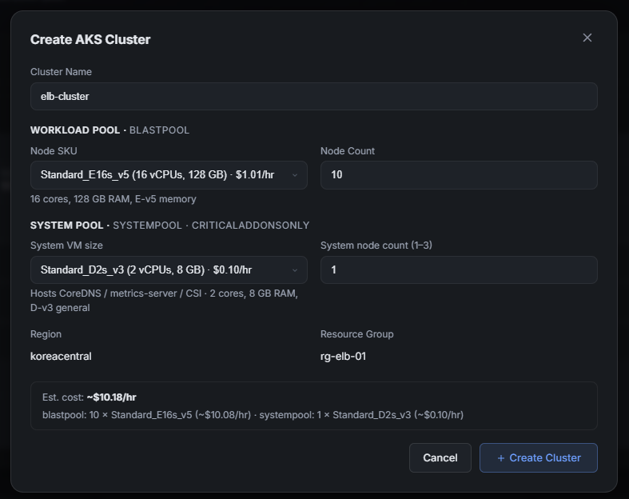
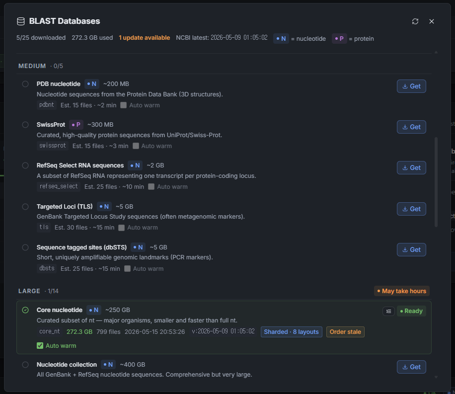

# Get Started

Get from a fresh clone to a working ElasticBLAST dashboard on Azure.

!!! tip "TL;DR"

    Sign in to Azure, run `scripts/dev/deploy.sh` (which calls `azd up`),
    then open the printed Container App URL and sign in with MSAL. The
    helper provisions the Bicep stack, builds container images via
    `az acr build`, and applies the six-sidecar Container App template.
    Expect ~30–45 minutes for a cold deployment.

Most research teams should use the guided deployment helper. It checks Azure sign-in, prepares the Azure Developer CLI environment, registers the required providers, handles the default resource-group choice, runs `azd up`, and opens the deployed dashboard when it is ready.

```bash
git clone https://github.com/dotnetpower/elb-dashboard.git
cd elb-dashboard
./deploy.sh
```

After deployment, researchers work in the browser: choose the Azure workspace, check readiness, submit BLAST jobs, monitor progress, and open results.

## Choose Your Path

| If you need to | Start with |
| --- | --- |
| Deploy the dashboard for the first time with the default path | This page |
| Install tools manually, control every `azd` value, or debug deployment failures | [Deployment Reference](deployment-reference.md) |
| Use an already deployed dashboard | [User Guide](user-guide/index.md) |
| Understand the sidecars, network path, and job flow before deploying | [High Level Architecture](architecture/high-level.md) |

You are ready to hand the dashboard to researchers when sign-in succeeds, the Dashboard loads workspace readiness, Storage holds at least one prepared BLAST database, AKS is ready for jobs, and the browser can see ACR, terminal, warmup, and recent-search status from the deployed API.

## Before You Start

You need an [Azure subscription](https://learn.microsoft.com/azure/cloud-adoption-framework/ready/azure-setup-guide/organize-resources) where you can create the control-plane resources. The easiest first deployment uses an account with `Owner`, or `Contributor` plus `User Access Administrator`.

You also need these local tools:

- Git
- Bash
- [Azure CLI](https://learn.microsoft.com/cli/azure/): `az`
- [Azure Developer CLI](https://learn.microsoft.com/azure/developer/azure-developer-cli/overview): `azd`

Docker is not required for deployment. Python, Node.js, and `uv` are only needed for local development and maintainer validation.

If your organization blocks [Microsoft Entra App Registration](https://learn.microsoft.com/entra/identity-platform/quickstart-register-app) creation or admin consent, ask an Entra administrator to create or approve the app once. The deployment can reuse that app with `API_CLIENT_ID`.

## Deploy With The Helper

Start from the repository root:

```bash
./deploy.sh
```

The helper may ask you to sign in to Azure. It uses the active Azure CLI subscription, creates or selects the default `elb-dashboard` azd environment, and sets the common environment values for you.

If the default resource group already exists, the helper asks what to do:

- Delete and reuse `rg-elb-dashboard`.
- Deploy to a numbered group such as `rg-elb-dashboard-01`.
- Abort so you can decide later.

For an unattended run, set one of these values before starting:

```bash
export ELB_EXISTING_RG_ACTION=delete  # or number, abort
./deploy.sh
```

To prepare the environment without deploying yet:

```bash
./deploy.sh --prepare-only
```

## What Happens During Deployment

The helper and `azd up` run the deployment in clear stages:

1. Confirm Azure CLI and azd sign-in.
2. Prepare the `elb-dashboard` azd environment.
3. Register required [Azure resource providers](https://learn.microsoft.com/azure/azure-resource-manager/management/resource-providers-and-types).
4. Choose the target resource group.
5. Provision [Azure Container Apps](https://learn.microsoft.com/azure/container-apps/overview), [Azure Storage](https://learn.microsoft.com/azure/storage/common/storage-introduction), [Azure Container Registry](https://learn.microsoft.com/azure/container-registry/container-registry-intro), [managed identity](https://learn.microsoft.com/entra/identity/managed-identities-azure-resources/overview), [Key Vault](https://learn.microsoft.com/azure/key-vault/general/overview), and network resources.
6. Create or reuse the Microsoft Entra App Registration.
7. Build the control-plane images in ACR.
8. Swap the app into the bundled sidecar layout.
9. Wait for `/api/health` and print the dashboard URL.

The deployed control plane is one Azure Container App. Researchers do not need Docker or local image builds for this path.

## Open The Dashboard

When deployment finishes, open the URL printed by the helper:

```text
https://ca-elb-dashboard.<subdomain>.<region>.azurecontainerapps.io
```

The browser opens the ElasticBLAST on Azure sign-in page. Click **Sign in with Microsoft**, then use an account from the same tenant that owns the App Registration.



After sign-in, the Dashboard should load Azure workspace readiness from the deployed API sidecar.

On a new workspace, the **Getting Started** dialog appears after sign-in. This dialog is the first-search readiness checklist, not another `azd` deployment step: the control plane is deployed, but the workload runtime still needs to be prepared before BLAST can run.



From this state, complete the workload setup in the browser before submitting a BLAST job. A complete BLAST-ready workspace needs these runtime pieces:

1. Create an AKS cluster from the Cluster Plane card.
2. Get and warm a BLAST database from the BLAST Databases dialog.
3. Build the ElasticBLAST container images in ACR, including `elb-openapi`.
4. Deploy or update the `elb-openapi` service to AKS before using the [API Reference](user-guide/api-reference.md) or OpenAPI execution surface.

If sign-in works locally but not in Azure, the deployed Container App origin may need to be added as a SPA redirect URI. See [Deployment Reference](deployment-reference.md#redirect-uri-after-deployment).

## First Browser Run

The Dashboard is the browser landing page after sign-in. On first load it scans accessible subscriptions for tagged ElasticBLAST workspaces:

- If exactly one workspace is found, it is selected automatically.
- If multiple workspaces are found, choose the one researchers should use.
- If no workspace is found, the setup wizard opens so you can select the subscription, resource group, Storage account, and ACR.

The setup wizard only connects the dashboard to the Azure workspace. It does not make the workspace BLAST-ready by itself. After the workspace is selected, use the Dashboard readiness flow to prepare the runtime pieces: build the ElasticBLAST images in ACR, deploy `elb-openapi` when needed, prepare a BLAST database in Storage, create or start AKS, and warm the selected database before the first search.

You can re-run the setup wizard later from the Dashboard resource settings panel if the subscription, resource group, Storage account, or ACR changes.

## Make The Workspace BLAST-Ready

A deployed dashboard is ready for real searches only after the workload resources are ready:

1. Storage account: prepare at least one BLAST database copied from NCBI into the workload Storage account.
2. Database layout: let the prepare flow create the available shard layouts so the submit form can choose an appropriate sharded execution path.
3. ACR: build the ElasticBLAST runtime images required by submit, split, merge, and OpenAPI execution, including `elb-openapi`.
4. AKS: create or start a workload cluster with enough nodes and memory for the chosen database.
5. OpenAPI service: deploy or update `elb-openapi` to AKS when the API Reference or OpenAPI execution surface will be used.
6. Warmup: keep the selected database warm on AKS before submitting work, so the first search does not pay the full database staging cost.

The Dashboard should guide this sequence. The setup wizard is the resource-selection gate; the BLAST readiness flow is the operational gate before New Search.

Use **Cluster Plane** to create the workload cluster. Click **Add Cluster**, choose a workload VM size and node count, then confirm the estimated hourly cost before creating AKS.



Use **BLAST Databases** to prepare search databases. Click the database icon in the Dashboard, choose a database, and click **Get** to copy it from NCBI into Storage. For prepared databases, the same dialog shows downloaded size, shard layouts, readiness, stale updates, and whether auto warm is enabled.



## First Check In The Browser

Use the Dashboard before submitting work:

1. Confirm the active subscription and workspace.
2. Check Storage, ACR, AKS, database, and terminal readiness.
3. Build missing ElasticBLAST runtime images from the ACR card.
4. Prepare or choose a BLAST database from the Storage card, including the shard layouts created by the prepare flow.
5. Start database warmup for the database and cluster you will use.
6. Submit a small BLAST search from New Search.
7. Track the job from Recent searches and open the result when it completes.

The first full BLAST smoke test creates an [AKS](https://learn.microsoft.com/azure/aks/intro-kubernetes) workload cluster and can add cost. Run it only when your tenant policy allows AKS to stay running long enough for the job lifecycle, and make sure someone owns cleanup before starting.

!!! tip "Fastest safe smoke test"
	Use a small database such as `16S_ribosomal_RNA`, build the required ACR images first, prepare the database in Storage, warm it on AKS, and confirm the cleanup path before creating larger AKS compute.

## Cost And Cleanup

The control plane has a standing Azure cost before BLAST workload usage. The optional smoke test adds AKS compute cost.

Stop or delete AKS clusters when they are not actively running searches. To remove the whole control plane, run this from the same repository environment used for deployment:

```bash
azd down --purge --force
```

## More Detail

- [Joining An Existing Deployment](joining-existing-deployment.md) walks a second teammate through binding a fresh clone to a deployment that already exists, including RBAC.
- [Troubleshooting](troubleshooting.md) lists the most common sign-in, RBAC, and dashboard error symptoms with the fix for each.
- [Deployment Reference](deployment-reference.md) covers tool installation, manual `azd` deployment, redirect URI setup, smoke testing, network lockdown, cleanup, and troubleshooting.
- [User Guide](user-guide/index.md) explains day-to-day operation from the browser.
- [Dashboard](user-guide/dashboard.md) explains the readiness signals to check before a search.