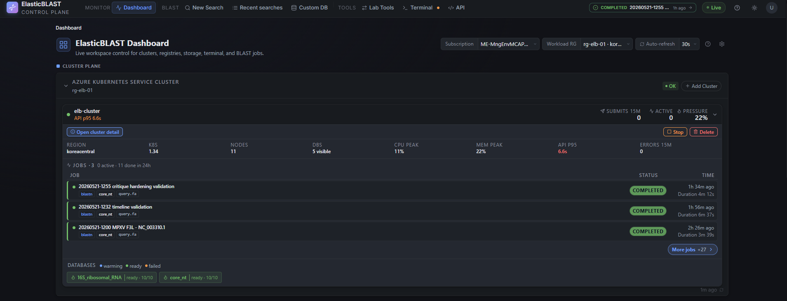
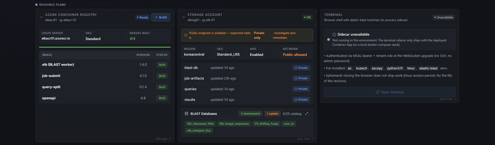
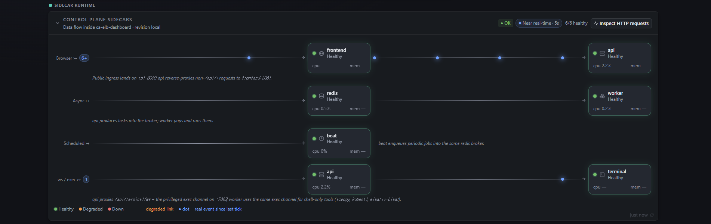

# ElasticBLAST Control Plane

Run large BLAST searches on Azure without becoming the cloud operator.

!!! abstract "Key Facts"

    - **What it is**: a browser-only control plane for [ElasticBLAST](https://blast.ncbi.nlm.nih.gov/doc/elastic-blast/) on Microsoft Azure.
    - **Where it runs**: one Azure Container App named `ca-elb-dashboard` with six sidecars (`frontend`, `api`, `worker`, `beat`, `redis`, `terminal`); BLAST jobs run on Azure Kubernetes Service.
    - **How users sign in**: MSAL.js (Auth Code + PKCE) in the browser; the backend reaches Azure as a user-assigned managed identity. No client secrets.
    - **Storage posture**: every workload Storage account stays `publicNetworkAccess: Disabled`; all uploads/downloads stream through the `api` sidecar. No SAS tokens are issued to the browser.
    - **Open source**: MIT licensed at [github.com/dotnetpower/elb-dashboard](https://github.com/dotnetpower/elb-dashboard).

[ElasticBLAST](https://blast.ncbi.nlm.nih.gov/doc/elastic-blast/) is built for serious sequence search, but the cloud work around it can pull a researcher away from the question they actually care about. Clusters, storage accounts, container images, database preparation, permissions, and job logs all have to line up before a search can run well.

ElasticBLAST Control Plane brings those moving parts into one browser workflow. It helps research teams prepare the [Azure](https://azure.microsoft.com/) workspace, check readiness, submit BLAST jobs, monitor progress, and find results without turning every search into an infrastructure session.

Use it when a query has outgrown a local workstation, but the team still needs a calm, visible path from input sequence to completed result.

For example, a researcher can bring a FASTA query to the dashboard, confirm that the Azure workspace is ready, submit the search, and return to results without learning the underlying cluster, Storage, image, and job-control commands first.

[Start with Get Started](get-started.md){ .md-button .md-button--primary }
[See the Architecture](architecture/high-level.md){ .md-button }

!!! note "ElasticBLAST on Azure"
	[ElasticBLAST on Azure](https://github.com/dotnetpower/elastic-blast-azure) is the Azure-portable runtime this dashboard automates. It adapts ElasticBLAST execution to Azure infrastructure; ElasticBLAST Control Plane adds the browser workflow for preparing, running, monitoring, and retrieving those jobs.

## Who It Is For

Use this control plane when a research team needs to run repeatable BLAST work on Azure, but does not want every researcher to learn the deployment topology, storage network rules, command-line flags, and result file layout before they can ask a biological question.

It is especially useful when:

- Searches are too large or too frequent for a workstation.
- Multiple people need the same readiness view, job history, and result access path.
- Operators need Azure controls, but researchers need a browser-first workflow.
- The team wants private Storage access without handing browser clients direct Storage URLs or SAS tokens.

## Before And With The Control Plane

| Without the control plane | With ElasticBLAST Control Plane |
|---------------------------|----------------------------------|
| Researchers assemble local commands, environment variables, and file paths before each run. | Researchers submit from a browser workflow with the active Azure workspace already visible. |
| Operators check cluster, storage, images, database preparation, and logs across separate tools. | The Dashboard brings readiness signals into one place before work is submitted. |
| Result files have to be found, downloaded, and shared through storage tooling. | Results stay behind the control plane and are streamed through the API sidecar. |
| Failures often mean switching context into Azure, [Kubernetes](https://kubernetes.io/docs/concepts/overview/), storage, and terminal sessions. | Job state, degraded signals, logs, and advanced terminal access stay reachable from the same browser session. |

## What It Helps With

- Replace scattered pre-flight checks with one Dashboard readiness view for compute, storage, runtime images, BLAST databases, and terminal access.
- Start BLAST searches from the browser instead of assembling commands across local terminals.
- Follow running jobs in one place, including degraded or failed states that need attention.
- Keep query uploads and result downloads inside the control plane without exposing Storage links directly to the browser.
- Leave the browser terminal available for advanced workflows without making it the default path.
- Give maintainers a documented path into the architecture, deployment, authentication, and troubleshooting details.

The Dashboard is the main pre-flight surface. It shows whether the workspace is ready enough to submit work, then keeps recent searches, degraded states, and follow-up actions visible after submission.

=== "Cluster plane"

	

	Cluster readiness, recent searches, and database preparation stay visible before a researcher submits work.

=== "Resource plane"

	

	Resource cards collect the Azure services that usually require separate portal or CLI checks.

=== "Live Monitoring"

	

	Runtime monitoring shows whether the bundled sidecars that keep the browser workflow alive are healthy.

## A Researcher-First Workflow

1. Open the Dashboard and choose the active Azure workspace.
2. Check whether the required compute, storage, images, and databases are ready.
3. Submit a BLAST search from the browser.
4. Watch progress from Recent searches.
5. Open, inspect, and download results when the job completes.

The goal is not to hide Azure. It is to keep Azure in the background until it matters.

## Why It Is Different

- One [Azure Container Apps](https://learn.microsoft.com/azure/container-apps/overview) deployment bundles the frontend, API, worker, scheduler, [Redis](https://redis.io/docs/latest/) broker, and browser terminal sidecars.
- Azure calls use [managed identity](https://learn.microsoft.com/entra/identity/managed-identities-azure-resources/overview), so the browser token is used for user identity rather than being forwarded as an Azure control-plane credential.
- Query uploads, result downloads, and result previews stream through the API sidecar; the browser does not receive direct [Azure Storage](https://learn.microsoft.com/azure/storage/common/storage-introduction) URLs or SAS tokens.
- The browser terminal remains available for advanced `az`, `kubectl`, `azcopy`, and `elastic-blast` workflows, but the default research path stays in the UI.

## Start Here

If you are new to the project, start with [Get Started](get-started.md). It keeps the first path short: deploy, sign in, check readiness, and run a first BLAST smoke test.

If you are already operating an environment, use these entry points:

- [User Guide](user-guide/index.md) shows how to operate the control plane from the browser.
- [Dashboard](user-guide/dashboard.md) explains the readiness view and the signals to check before submitting work.
- [Deployment Reference](deployment-reference.md) keeps the detailed deployment, validation, and troubleshooting notes for maintainers.
- [Change Log](changelog.md) lists recent feature notes and keeps the implementation history searchable.

## For Platform Maintainers

- [High Level Architecture](architecture/high-level.md) gives the first-pass system map: browser, Container App sidecars, Azure resource plane, AKS workload plane, storage, identity, and job flow.
- [Container Apps Migration](architecture/container-apps.md) describes the six-sidecar deployment architecture.
- [Deployment Reference](deployment-reference.md) covers manual `azd` deployment, redirect URI setup, smoke testing, network lockdown, and cleanup.
- [Auth](architecture/authentication.md) explains browser sign-in and backend token validation.
- [BLAST SearchSP Discovery](research/blast-searchsp-discovery.md) tracks SearchSP compatibility work.
- [Web BLAST Compatibility Plan](research/web-blast-compatibility-plan.md) describes the web compatibility implementation plan.
- The Agent Reference section documents the repository layout, browser terminal, resource plane, monitoring UI, and glass UI conventions.

## Documentation Capture

- [Screenshot Workflow](contributor-guide/screenshot-workflow.md) defines the repeatable capture process, viewports, masking rules, and acceptance checks for future documentation screenshots.

## Source Repository

The source lives at [dotnetpower/elb-dashboard](https://github.com/dotnetpower/elb-dashboard). Some internal reference pages link to source files in that repository.

## Frequently Asked Questions

### What does ElasticBLAST Control Plane do?

It gives research teams a browser-only workflow for running ElasticBLAST
sequence-similarity searches on Microsoft Azure. Researchers submit jobs,
monitor AKS workloads, and retrieve results from a web dashboard without
using SSH, local CLIs, or browser-issued SAS tokens.

### How does it run on Azure?

The control plane is a single Azure Container App named `ca-elb-dashboard`
with six sidecars: `frontend` (React/Vite SPA on nginx), `api` (FastAPI on
uvicorn), `worker` and `beat` (Celery), `redis` (in-revision broker), and
`terminal` (loopback ttyd with the elastic-blast toolchain). BLAST jobs
themselves run on Azure Kubernetes Service (AKS).

### How do users sign in, and how does the backend reach Azure?

Browser users sign in with MSAL.js using the Auth Code + PKCE flow. The
backend validates the bearer token only for identity verification — every
Azure SDK call is made as the user-assigned managed identity
`id-elb-dashboard-*` via `DefaultAzureCredential`. There are no service
principal secrets and no on-behalf-of (OBO) flows.

### Are SAS tokens issued to the browser?

No. Every workload Storage account stays `publicNetworkAccess: Disabled`;
uploads and downloads of queries and results stream through the `api`
sidecar (1 MiB chunks, 4 MiB block uploads, semaphore-capped to four
concurrent transfers). The browser never receives a SAS URL.

### Who actually downloads BLAST databases from NCBI — the `api` sidecar, the `terminal` sidecar, or AKS?

None of them transfer the bytes. The `api` sidecar's
`POST /api/storage/prepare-db` route orchestrates the work by issuing per-file
Azure Blob server-side copies (`start_copy_from_url`) from the public
[NCBI BLAST S3 mirror](https://registry.opendata.aws/ncbi-blast-databases/)
straight into the workload Storage account's `blast-db` container. Azure
Storage itself performs the copy; the `api` sidecar only kicks off the
operations, polls `copy.status` in a background daemon every 60 s, and
only promotes the new `source_version` once every file reaches `success`
(atomic generation cut-over). The `terminal` sidecar and AKS are not
involved in the download path — AKS only enters later for the warmup
`vmtouch` DaemonSet and the BLAST job pods themselves.

### Does it support AWS or GCP?

No. The upstream ElasticBLAST supports multiple clouds, but this control
plane is Azure-only by charter. See the
[High Level Architecture](architecture/high-level.md) page for the
boundaries.

### What is the deployment workflow?

A single `azd up` from a fresh clone provisions the Bicep stack, builds
the container images with `az acr build`, and swaps the Container App
template to the six-sidecar layout via `postprovision.sh`. The
[Get Started](get-started.md) page walks through it end to end.
