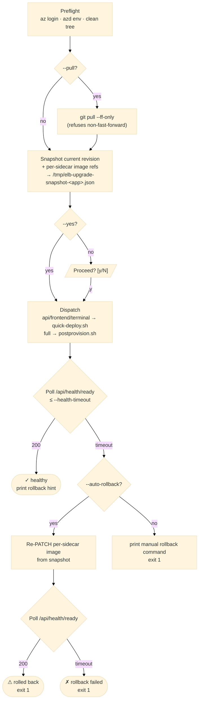

# CLI Rolling Update (`git pull` + build + deploy)

This page is the workstation-driven path for rolling out new code to a
deployed dashboard. It is paired with the script
[`scripts/dev/cli-upgrade.sh`](https://github.com/dotnetpower/elb-dashboard/blob/main/scripts/dev/cli-upgrade.sh).

!!! success "Quick rolling update (TL;DR)"

    Pick the path that matches who you are. Both deploy all six sidecars
    (api / worker / beat / frontend / terminal / redis) by rebuilding the
    three custom images (`elb-api`, `elb-frontend`, `elb-terminal`) and
    swapping the Container App template via [`postprovision.sh`](https://github.com/dotnetpower/elb-dashboard/blob/main/scripts/dev/postprovision.sh).

    === "Operator (not editing code)"

        You are deploying a tagged release from `origin/main` (or a
        release branch) without local edits. This is the safest path —
        the SPA header `vA.B.<build> · <short-sha>` will match exactly
        what is in git, so future "what shipped?" questions are trivial.

        ```bash
        # 1. Land the release on your workstation.
        git fetch --tags origin
        git checkout main && git pull --ff-only

        # 2. Preview the plan (no build, no PATCH).
        scripts/dev/cli-upgrade.sh full --dry-run

        # 3. Deploy.
        scripts/dev/cli-upgrade.sh full --yes
        ```

        - No `--allow-dirty`: the script refuses to proceed if the tree
          is dirty, which is exactly the guardrail you want.
        - `--pull` is intentionally **not** passed in step 3 — you
          already pulled in step 1 and saw what landed.

    === "Code contributor (deploying local edits)"

        You are iterating on `api/`, `web/`, `terminal/`, or `infra/` and
        want to ship the working tree. **Commit first** so the SPA header
        SHA matches the deployed code (`az acr build` packages whatever
        is on disk regardless of git state — see
        [§ "Working tree, git, and the SPA header"](#working-tree-git-and-the-spa-header)).

        ```bash
        # 1. Commit (or stash, then unstash after deploy).
        git add -A && git commit -m "feat(scope): summary"

        # 2. Preview the plan.
        scripts/dev/cli-upgrade.sh full --dry-run

        # 3. Deploy.
        scripts/dev/cli-upgrade.sh full --yes
        ```

        If you absolutely must deploy uncommitted edits (e.g. quick
        production hotfix you will commit immediately after), add
        `--allow-dirty` to acknowledge the SHA mismatch:

        ```bash
        scripts/dev/cli-upgrade.sh full --allow-dirty --yes
        ```

        Then **commit the same diff right after the deploy succeeds**,
        and record the commit SHA in the per-feature change note under
        `docs/features_change/`.

        Only edited `api/` code (no `infra/`, `terminal/`, or sidecar
        layout change)? The faster `api` scope rebuilds one image and
        patches api+worker+beat in ~60 s:

        ```bash
        scripts/dev/cli-upgrade.sh api --yes
        ```

    For either path: snapshot + `/api/health` poll + auto-rollback still
    run. Tune the budget with `--health-timeout 300` when the terminal
    sidecar was rebuilt or the app was scaled to zero.

!!! tip "Prefer the in-browser upgrade when possible"

    The browser-driven [In-app Upgrade](../user-guide/upgrades.md) does the
    same thing without a workstation: it polls the configured git remote
    for a new release tag, runs `az acr build` for the three sidecar
    images, PATCHes the Container App template, and auto-rolls back on
    failure. Use the CLI path only when that flow is **not** available.

## When to use which path

| Situation | Use |
|-----------|-----|
| `UPGRADE_GIT_REMOTE` is configured and the SPA is reachable | [In-app Upgrade](../user-guide/upgrades.md) — no shell needed. |
| In-app upgrade is disabled (`UPGRADE_GIT_REMOTE` unset) or no `UpgradeAdmin` is available | `cli-upgrade.sh <scope>` from a workstation that has `az login`. |
| Sidecar layout / probes / scale rules changed (anything outside container images) | `cli-upgrade.sh full` — runs the full [`postprovision.sh`](https://github.com/dotnetpower/elb-dashboard/blob/main/scripts/dev/postprovision.sh) template swap. |
| The SPA is down — the browser cannot drive a rollback | `cli-upgrade.sh rollback` against the snapshot file. |
| You only edited code in `api/` and want a 60-second cycle | `quick-deploy.sh api` directly (no snapshot envelope). |

## What the script does (envelope around `quick-deploy.sh` / `postprovision.sh`)



## Working tree, git, and the SPA header

`az acr build` packages the **current working tree** (filtered by
`.dockerignore`) as the build context. It does not care whether files
are staged, committed, or pushed — whatever is on disk at build time
goes into the image. `--allow-dirty` only suppresses the dirty-tree
**guardrail**; it does not change what gets packaged.

The SPA header `vA.B.<build> · <short-sha>` is resolved on the build
host by [`scripts/dev/quick-deploy.sh`](https://github.com/dotnetpower/elb-dashboard/blob/main/scripts/dev/quick-deploy.sh)
and [`scripts/dev/postprovision.sh`](https://github.com/dotnetpower/elb-dashboard/blob/main/scripts/dev/postprovision.sh)
and passed to `az acr build` as `--build-arg`. The short-sha comes from
`git rev-parse --short HEAD`, i.e. the last **commit**. Consequence:

| Pre-deploy git state | Code shipped | SPA header SHA | Traceability |
|----------------------|--------------|----------------|--------------|
| Clean (committed)    | HEAD         | matches HEAD   | ✅ trivial — `git show <sha>` reproduces it |
| Dirty (`--allow-dirty`) | working tree | matches **previous** HEAD | ⚠ header lies — diff exists only on your laptop |

Verification when you want to confirm a specific file made it into the
deployed image:

```bash
az containerapp exec \
  --name "$CONTAINER_APP_NAME" --resource-group "$AZURE_RESOURCE_GROUP" \
  --container api --command "sha256sum /app/api/main.py"
sha256sum api/main.py    # local comparison
```

Same hash → shipped as intended. Different → check
[`.dockerignore`](https://github.com/dotnetpower/elb-dashboard/blob/main/.dockerignore)
or whether a later build stage overwrote the file.

## Preflight checklist

The script enforces these automatically and refuses to proceed if any fails:

| Check | What it guards against |
|-------|------------------------|
| `az account show` succeeds | Stale or missing `az login` |
| `AZURE_RESOURCE_GROUP`, `ACR_NAME`, `ACR_LOGIN_SERVER`, `CONTAINER_APP_NAME`, `CONTAINER_APP_FQDN` are set (auto-loaded from `azd env get-values`) | Pointing at the wrong app |
| `git status --porcelain` is empty | Building with uncommitted edits silently shipping debug code (override with `--allow-dirty`) |
| `--pull` only on the branch you started on | Accidental `pull` of a feature branch into `main` |
| `git pull --ff-only` | Non-fast-forward pulls leaving a merge commit you did not intend |
| Snapshot of current revision + image refs taken before any PATCH | Losing the previous tags to roll back to |
| Workload Storage parity: refuses when `publicNetworkAccess=Disabled` AND no Private Endpoint exists | Deploying into a state where the Container App has no network path to Storage (worker would fail every minute on `403 AuthorizationFailure`). Override with `--skip-parity-check`. |

## Recommended workflow

### Routine code-only update (api sidecar)

```bash
# 1. Pull, build, deploy api+worker+beat, then auto-rollback on /api/health failure.
scripts/dev/cli-upgrade.sh api --pull

# 2. Watch the new revision's logs (optional).
scripts/dev/cli-upgrade.sh api --pull --logs
```

### Frontend SPA bundle change

```bash
# Vite build args (VITE_AZURE_CLIENT_ID etc.) are picked up by quick-deploy.sh
# from azd env values automatically — no manual env juggling.
scripts/dev/cli-upgrade.sh frontend --pull
```

### Sidecar layout / Bicep / terminal base image changed

```bash
# Runs the full 3-image rebuild + template swap (5-10 min).
scripts/dev/cli-upgrade.sh full --pull
```

### Roll back from a workstation

```bash
# Read the snapshot taken on the most recent upgrade run on this workstation
# and re-PATCH every sidecar back to those image refs.
scripts/dev/cli-upgrade.sh rollback --yes
```

The snapshot file is per-app (`/tmp/elb-upgrade-snapshot-<app>.json` by
default; override with `ELB_UPGRADE_SNAPSHOT`). If you move workstations
between the upgrade and the rollback, copy the snapshot file across — or
fall back to the manual rollback below.

## Manual rollback (when the script is unavailable)

The script's safety net is a single `az containerapp update --container-name <name> --image <previous-image>`
per sidecar. Reproduce it by hand:

```bash
# 1. Find the previous active revision (the one BEFORE the broken one).
az containerapp revision list \
  --name "$CONTAINER_APP_NAME" --resource-group "$AZURE_RESOURCE_GROUP" \
  --query "sort_by([], &properties.createdTime)[-2:].{name:name, active:properties.active, created:properties.createdTime}" \
  -o table

# 2. Pull its per-sidecar image refs.
az containerapp revision show \
  --name "$CONTAINER_APP_NAME" --resource-group "$AZURE_RESOURCE_GROUP" \
  --revision "<previous-revision-name>" \
  --query "properties.template.containers[].{name:name, image:image}" \
  -o table

# 3. PATCH each container back to the captured image.
az containerapp update \
  --name "$CONTAINER_APP_NAME" --resource-group "$AZURE_RESOURCE_GROUP" \
  --container-name api --image "$ACR_LOGIN_SERVER/elb-api:<previous-tag>"
# (repeat for worker, beat, frontend, terminal as needed)

# 4. Wait for /api/health.
curl -fsS "https://$CONTAINER_APP_FQDN/api/health"
```

## Health-check budget

The script polls `https://<fqdn>/api/health/ready` every 5 seconds for
`--health-timeout` seconds (default **180**). Tune it with
`--health-timeout 300` when:

- The terminal sidecar was rebuilt (cold container, large layer).
- The Container App was scaled to zero before the upgrade (revision warmup).
- A managed-identity refresh is in progress (typically <30 s).

`/api/health/ready` is the **deep readiness probe** — it checks the Redis
broker, the Managed Identity credential, the terminal sidecar's loopback
exec server, and a cheap `list_tables(top=1)` call against the workload
Storage Table data plane. A `200` means the api sidecar is up AND every
critical downstream is actually reachable. On any 503 the script dumps
the response body to stderr so you can see which component is `down`
before the auto-rollback kicks in.

The cheap `/api/health` (liveness) endpoint stays in place for Container
Apps platform probes — never use it as a deploy verification gate, it
does not call Azure at all.

## Common failure modes

| Symptom | Most likely cause | Fix |
|---------|-------------------|-----|
| `ACR no longer carries the snapshotted tags` (rollback) | ACR retention policy purged the previous tag. | Bump retention before next upgrade: `az acr config retention update --registry "$ACR_NAME" --status enabled --days 180 --type UntaggedManifests`. Re-build the older release locally to restore the missing tag. |
| `Auto-rollback` says PATCH succeeded but `/api/health` still 5xx | The previous tag *also* depends on a sidecar image that was purged, OR Storage / Key Vault private endpoint is down. | Inspect `az containerapp logs show --container api --type system --tail 100` and `az containerapp logs show --container api --tail 100`. |
| `git pull --ff-only failed` | A teammate force-pushed or the working branch is diverged. | Rebase locally and resolve manually; do not pass `--allow-dirty` to bypass. |
| `403` on `az containerapp update` | Caller's `az login` identity lacks `Contributor` on the Container App. | Use the deploying account, or have the deployer add a `Container Apps Contributor` role assignment. |
| New revision crash-loops with `ImagePullBackOff` | Build succeeded but ACR pull permission for the Container App's MI is broken. | Run [`scripts/dev/postprovision.sh`](https://github.com/dotnetpower/elb-dashboard/blob/main/scripts/dev/postprovision.sh) once to re-grant `AcrPull`. |
| Health check passes but the SPA fails to load | `VITE_API_BASE_URL` leaked from `web/.env.local` into the frontend build. | The script unsets it; if you bypassed it, `cli-upgrade.sh frontend --pull` will overwrite. |
| Preflight rejects with `Storage '...' is unreachable from the Container App` | Workload Storage is `publicNetworkAccess=Disabled` (most often left over from a local-debug `storage-public-access.sh off` / `local-run.sh storage-off` / `auth-off`) AND the deployment never created Private Endpoints (`LOCKDOWN_PRIVATE_NETWORKING=false`). | Quick: `scripts/dev/storage-public-access.sh on --account <acct> --rg <rg>`. Proper: `azd env set LOCKDOWN_PRIVATE_NETWORKING true && azd provision`. Last-resort override: `--skip-parity-check` (workload will still fail Storage calls). |
| `/api/health/ready` returns 503 with `azure_storage: down` in the body | The api sidecar can reach Azure AD but not the Storage data plane. Same cause as the preflight rejection above, OR transient Azure outage, OR the workload Managed Identity is missing `Storage Table Data Contributor` on the workload storage account. | Confirm MI role: `az role assignment list --assignee <mi-principalId> --scope <storage-id>`. If correct, run the Storage recovery from the row above. |

## What this script does **not** do

- **No `azd provision`.** Infra under `infra/*.bicep` is not re-applied.
  Use `azd up` (or `azd provision && cli-upgrade.sh full`) for Bicep
  changes.
- **No multi-revision blue/green.** The bundled Container App is
  `minReplicas: 1, maxReplicas: 1, revisionsMode: single`. Rollback is
  a fast re-PATCH, not a `revision activate`.
- **No cross-tenant deploy.** The script honours the current `az login`
  context — there is no tenant-switching flag.
- **No automatic `git push`.** It only pulls. Whatever you build is the
  tip of the branch on the workstation at that moment.

## Related references

- [Deployment Reference](../deployment-reference.md) — the prerequisites, Bicep modules, and the full `azd up` flow.
- [In-app Upgrades](../user-guide/upgrades.md) — the browser-driven equivalent.
- [Runtime Plan](../architecture/runtime-plan.md) — RBAC + identity matrix the `az containerapp update` PATCH depends on.
- [Container Apps Architecture](../architecture/container-apps.md) — sidecar layout and the `quick-deploy.sh` constraints.
