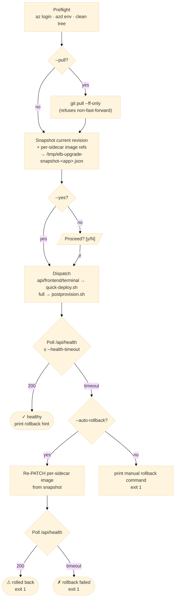

# CLI Rolling Update (`git pull` + build + deploy)

This page is the workstation-driven path for rolling out new code to a
deployed dashboard. It is paired with the script
[`scripts/dev/cli-upgrade.sh`](https://github.com/dotnetpower/elb-dashboard/blob/main/scripts/dev/cli-upgrade.sh).

!!! success "Quick rolling update (TL;DR)"

    When your local tree is already the code you want to ship (either
    `git pull` is done, or your uncommitted edits **are** the release),
    deploy all six sidecars in one shot:

    ```bash
    # 1. Preview the plan — no build, no PATCH.
    scripts/dev/cli-upgrade.sh full --allow-dirty --dry-run

    # 2. Run it for real. Builds 3 images (elb-api, elb-frontend,
    #    elb-terminal) and swaps the Container App template covering all
    #    6 sidecars (api / worker / beat / frontend / terminal / redis).
    scripts/dev/cli-upgrade.sh full --allow-dirty --yes
    ```

    - `full` triggers the full image rebuild + [`postprovision.sh`](https://github.com/dotnetpower/elb-dashboard/blob/main/scripts/dev/postprovision.sh) template swap.
    - `--allow-dirty` acknowledges that uncommitted edits are intentional.
    - `--yes` skips the interactive confirm prompt.
    - Omit `--pull`: the script refuses to `git pull` on a dirty tree, and
      you already have the code you want to ship locally.
    - Snapshot + `/api/health` poll + auto-rollback still run; tune the
      budget with `--health-timeout 300` if the terminal sidecar was rebuilt.

    Only edited `api/` code and nothing under `infra/` or `terminal/`?
    Use the faster `api` scope instead (~60 s, one image):

    ```bash
    scripts/dev/cli-upgrade.sh api --allow-dirty --yes
    ```

!!! tip "Prefer the in-browser upgrade when possible"

    The browser-driven [In-app Upgrade](../user-guide/upgrades.md) does the
    same thing without a workstation: it polls the configured git remote
    for a new release tag, runs `az acr build` for the three sidecar
    images, PATCHes the Container App template, and auto-rolls back on
    failure. Use the CLI path only when that flow is **not** available.

## When to use which path

| Situation | Use |
|-----------|-----|
| `UPGRADE_GIT_REMOTE` is configured and the SPA is reachable | [In-app Upgrade](../user-guide/upgrades.md) — no shell needed. |
| In-app upgrade is disabled (`UPGRADE_GIT_REMOTE` unset) or no `UpgradeAdmin` is available | `cli-upgrade.sh <scope>` from a workstation that has `az login`. |
| Sidecar layout / probes / scale rules changed (anything outside container images) | `cli-upgrade.sh full` — runs the full [`postprovision.sh`](https://github.com/dotnetpower/elb-dashboard/blob/main/scripts/dev/postprovision.sh) template swap. |
| The SPA is down — the browser cannot drive a rollback | `cli-upgrade.sh rollback` against the snapshot file. |
| You only edited code in `api/` and want a 60-second cycle | `quick-deploy.sh api` directly (no snapshot envelope). |

## What the script does (envelope around `quick-deploy.sh` / `postprovision.sh`)



## Preflight checklist

The script enforces these automatically and refuses to proceed if any fails:

| Check | What it guards against |
|-------|------------------------|
| `az account show` succeeds | Stale or missing `az login` |
| `AZURE_RESOURCE_GROUP`, `ACR_NAME`, `ACR_LOGIN_SERVER`, `CONTAINER_APP_NAME`, `CONTAINER_APP_FQDN` are set (auto-loaded from `azd env get-values`) | Pointing at the wrong app |
| `git status --porcelain` is empty | Building with uncommitted edits silently shipping debug code (override with `--allow-dirty`) |
| `--pull` only on the branch you started on | Accidental `pull` of a feature branch into `main` |
| `git pull --ff-only` | Non-fast-forward pulls leaving a merge commit you did not intend |
| Snapshot of current revision + image refs taken before any PATCH | Losing the previous tags to roll back to |

## Recommended workflow

### Routine code-only update (api sidecar)

```bash
# 1. Pull, build, deploy api+worker+beat, then auto-rollback on /api/health failure.
scripts/dev/cli-upgrade.sh api --pull

# 2. Watch the new revision's logs (optional).
scripts/dev/cli-upgrade.sh api --pull --logs
```

### Frontend SPA bundle change

```bash
# Vite build args (VITE_AZURE_CLIENT_ID etc.) are picked up by quick-deploy.sh
# from azd env values automatically — no manual env juggling.
scripts/dev/cli-upgrade.sh frontend --pull
```

### Sidecar layout / Bicep / terminal base image changed

```bash
# Runs the full 3-image rebuild + template swap (5-10 min).
scripts/dev/cli-upgrade.sh full --pull
```

### Roll back from a workstation

```bash
# Read the snapshot taken on the most recent upgrade run on this workstation
# and re-PATCH every sidecar back to those image refs.
scripts/dev/cli-upgrade.sh rollback --yes
```

The snapshot file is per-app (`/tmp/elb-upgrade-snapshot-<app>.json` by
default; override with `ELB_UPGRADE_SNAPSHOT`). If you move workstations
between the upgrade and the rollback, copy the snapshot file across — or
fall back to the manual rollback below.

## Manual rollback (when the script is unavailable)

The script's safety net is a single `az containerapp update --container-name <name> --image <previous-image>`
per sidecar. Reproduce it by hand:

```bash
# 1. Find the previous active revision (the one BEFORE the broken one).
az containerapp revision list \
  --name "$CONTAINER_APP_NAME" --resource-group "$AZURE_RESOURCE_GROUP" \
  --query "sort_by([], &properties.createdTime)[-2:].{name:name, active:properties.active, created:properties.createdTime}" \
  -o table

# 2. Pull its per-sidecar image refs.
az containerapp revision show \
  --name "$CONTAINER_APP_NAME" --resource-group "$AZURE_RESOURCE_GROUP" \
  --revision "<previous-revision-name>" \
  --query "properties.template.containers[].{name:name, image:image}" \
  -o table

# 3. PATCH each container back to the captured image.
az containerapp update \
  --name "$CONTAINER_APP_NAME" --resource-group "$AZURE_RESOURCE_GROUP" \
  --container-name api --image "$ACR_LOGIN_SERVER/elb-api:<previous-tag>"
# (repeat for worker, beat, frontend, terminal as needed)

# 4. Wait for /api/health.
curl -fsS "https://$CONTAINER_APP_FQDN/api/health"
```

## Health-check budget

The script polls `https://<fqdn>/api/health` every 5 seconds for
`--health-timeout` seconds (default **180**). Tune it with
`--health-timeout 300` when:

- The terminal sidecar was rebuilt (cold container, large layer).
- The Container App was scaled to zero before the upgrade (revision warmup).
- A managed-identity refresh is in progress (typically <30 s).

`/api/health` is the cheap liveness probe — it never calls Azure or
Storage, so a `200` means the api sidecar process is up and the
new image's Python is importable. For deeper signal, follow up with
the auth-gated `/api/health/azure-discovery` once you can sign in
(see [`api/routes/health.py`](https://github.com/dotnetpower/elb-dashboard/blob/main/api/routes/health.py)).

## Common failure modes

| Symptom | Most likely cause | Fix |
|---------|-------------------|-----|
| `ACR no longer carries the snapshotted tags` (rollback) | ACR retention policy purged the previous tag. | Bump retention before next upgrade: `az acr config retention update --registry "$ACR_NAME" --status enabled --days 180 --type UntaggedManifests`. Re-build the older release locally to restore the missing tag. |
| `Auto-rollback` says PATCH succeeded but `/api/health` still 5xx | The previous tag *also* depends on a sidecar image that was purged, OR Storage / Key Vault private endpoint is down. | Inspect `az containerapp logs show --container api --type system --tail 100` and `az containerapp logs show --container api --tail 100`. |
| `git pull --ff-only failed` | A teammate force-pushed or the working branch is diverged. | Rebase locally and resolve manually; do not pass `--allow-dirty` to bypass. |
| `403` on `az containerapp update` | Caller's `az login` identity lacks `Contributor` on the Container App. | Use the deploying account, or have the deployer add a `Container Apps Contributor` role assignment. |
| New revision crash-loops with `ImagePullBackOff` | Build succeeded but ACR pull permission for the Container App's MI is broken. | Run [`scripts/dev/postprovision.sh`](https://github.com/dotnetpower/elb-dashboard/blob/main/scripts/dev/postprovision.sh) once to re-grant `AcrPull`. |
| Health check passes but the SPA fails to load | `VITE_API_BASE_URL` leaked from `web/.env.local` into the frontend build. | The script unsets it; if you bypassed it, `cli-upgrade.sh frontend --pull` will overwrite. |

## What this script does **not** do

- **No `azd provision`.** Infra under `infra/*.bicep` is not re-applied.
  Use `azd up` (or `azd provision && cli-upgrade.sh full`) for Bicep
  changes.
- **No multi-revision blue/green.** The bundled Container App is
  `minReplicas: 1, maxReplicas: 1, revisionsMode: single`. Rollback is
  a fast re-PATCH, not a `revision activate`.
- **No cross-tenant deploy.** The script honours the current `az login`
  context — there is no tenant-switching flag.
- **No automatic `git push`.** It only pulls. Whatever you build is the
  tip of the branch on the workstation at that moment.

## Related references

- [Deployment Reference](../deployment-reference.md) — the prerequisites, Bicep modules, and the full `azd up` flow.
- [In-app Upgrades](../user-guide/upgrades.md) — the browser-driven equivalent.
- [Runtime Plan](../architecture/runtime-plan.md) — RBAC + identity matrix the `az containerapp update` PATCH depends on.
- [Container Apps Architecture](../architecture/container-apps.md) — sidecar layout and the `quick-deploy.sh` constraints.
