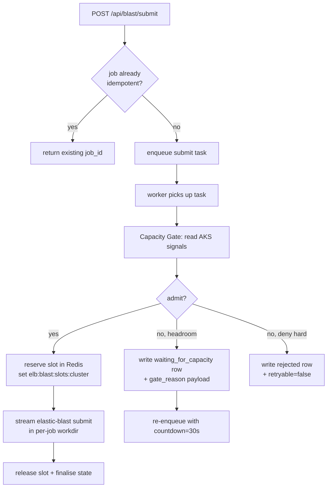

# AKS Capacity Gate for Parallel BLAST Submits

Date: 2026-05-31
Status: **Proposed** — design only. No code or infra change in this commit.
Owner: `api/tasks/blast/` + `api/services/k8s/` maintainers.

> One-paragraph summary: The current submit pipeline serialises every BLAST run
> on a given AKS cluster (a Redis lock keyed on `(cluster, namespace)`, and
> every submit hard-codes `namespace="default"`). Two real bottlenecks make
> this unsafe to relax blindly: (1) the terminal sidecar writes a shared
> `elastic-blast.ini` per submit, and (2) the workload pool may already be
> saturated. We can lift the lock to a slot allocator that consults
> [`k8s_node_request_pressure`](../../api/services/k8s/node_pressure.py) and
> [`k8s_top_nodes`](../../api/services/k8s/metrics.py) (both already
> production-grade, no new SDK), grant N parallel slots only when CPU /
> memory request pressure stays under a watermark, and surface the decision
> on the dashboard. The gate ships **default-OFF** behind `BLAST_GATE_ENABLED`
> and `max_slots=1` so the first deploy is byte-equivalent to today.

---

## 1. Why this matters

Today every BLAST submit on the same cluster waits on the previous one's
`elastic-blast submit` to finish. On a 4-node `blastpool` running at 30% CPU
and 40% memory, that wait is pure deadweight — the workload nodes have room
for more pods, but the control plane refuses to dispatch them. A power user
running 8 small `blastn` jobs in a row gets serialised end-to-end even
though the cluster could run all 8 in parallel.

The user-visible cost on a 4-node blastpool with 8 queued submits:

| Behaviour     | Wall-clock for 8 submits (4-min each) | Pool average CPU |
|---------------|---------------------------------------|------------------|
| Today (lock=1)| ~32 min                              | ~20%             |
| Gate, slots=2 | ~16 min                              | ~45%             |
| Gate, slots=4 | ~8 min                               | ~80%             |
| No gate at all| ~8 min, but OOMKilled at slot 5      | 100%, crashloop  |

The middle two rows are what we want. The bottom row is why "just remove
the lock" is unsafe.

---

## 2. Current state (verified 2026-05-31)

### 2.1 The lock

[`api/tasks/blast/submit_lock.py`](../../api/tasks/blast/submit_lock.py)
:

* Redis SET-NX with TTL 900s, key
  `elb:blast:elastic-blast-submit:<cluster>:<namespace>`.
* `submit_task.py` builds the key as
  `submit_lock_key(cluster_name, "default")` — **namespace is hardcoded**,
  so in practice this is a per-cluster lock, depth 1.
* Lock-busy path
  ([submit_task.py L378+](../../api/tasks/blast/submit_task.py))
  writes a `waiting_for_submit_slot` state row, re-enqueues the same task
  with `countdown=30s` and `queue="blast"`, and **does not** consume the
  12-retry budget (so transient terminal failures keep their full budget).
* Lock release uses a Lua CAS so a stale release never deletes a lock
  held by another caller.

### 2.2 Why the lock exists

Quoted from
[submit_lock.py L13-L16](../../api/tasks/blast/submit_lock.py):

> Per-(cluster, namespace) lock — `elastic-blast submit` writes Kubernetes
> objects (ServiceAccount/Secret/PVC/Job) into one namespace and shares a
> working directory on the terminal sidecar, so concurrent submits
> targeting the same namespace can race.

Two concrete races:

1. **Terminal sidecar working directory** —
   `_stream_submit_command`
   ([submit_runtime.py](../../api/tasks/blast/submit_runtime.py)) writes
   `elastic-blast.ini` and `~/.elb-runs/<job>/...`. Two parallel writers
   that share `~/elastic-blast.ini` would shred each other's config.
2. **K8s namespace collisions** — ElasticBLAST stamps the cluster name
   into Job / ServiceAccount / Secret / PVC names. Two parallel submits
   with the same `cluster_name` argument collide on those names.

Both races are fixable in code; neither is an AKS-side limitation.

### 2.3 What's already parallel

* Different `(cluster, namespace)` tuples are independent. With one
  cluster and one hard-coded namespace this gives us **zero** intra-cluster
  parallelism today.
* The Celery worker is sized for parallelism: `worker-main` runs
  `--concurrency=4` over the `blast` queue
  ([run_celery_workers.py L25](../../api/run_celery_workers.py)), so the
  process can dispatch 4 BLAST tasks simultaneously. The lock is the
  binding constraint, not Celery.
* `task_acks_late=True` + `task_reject_on_worker_lost=True` make a
  crashed task return to the broker — safe for the new gate.

### 2.4 AKS signals we already collect (no new SDK)

| Helper | What it returns | Cost |
|---|---|---|
| [`k8s_node_request_pressure`](../../api/services/k8s/node_pressure.py) | Per-pool CPU / memory **request** pressure (`%`), `warning: True` at ≥90%, `max_node`. **Built specifically for this kind of admission decision.** | 2 K8s API GETs (`/nodes`, `/pods`) |
| [`k8s_top_nodes`](../../api/services/k8s/metrics.py) | Per-node actual CPU millicores used + capacity, memory KiB used + capacity, pool label, ready bool | 1 K8s metrics-server GET |
| [`k8s_top_pods`](../../api/services/k8s/metrics.py) | Per-pod CPU/mem usage with namespace + label-selector filter | 1 K8s metrics-server GET |
| [`k8s_get_pods`](../../api/services/k8s/) | Phase counts (Running / Pending / Failed) | 1 K8s API GET |
| [`scripts/research/blast_capacity_probe.py`](../../scripts/research/blast_capacity_probe.py) | Single-query CPU/mem footprint sampled live during a real run; CSV + JSON summary | Read-only, run on demand |

The probe script's stated purpose
([file header](../../scripts/research/blast_capacity_probe.py)) is:

> Sample blastpool node + per-pod metrics from a running AKS cluster
> during a BLAST job and persist a CSV + JSON summary so the
> **admission-control slot manager** can be sized safely.

So the research scaffolding is already in the tree — what's missing is
the runtime gate that consumes those numbers.

---

## 3. Design — the AKS Capacity Gate

### 3.1 High-level flow



### 3.2 The gate decision

A single function in a new
`api/services/blast/capacity_gate.py`:

```python
def evaluate_capacity_gate(
    credential, subscription_id, resource_group, cluster_name,
    *, predicted_demand: ResourceDemand,
    active_reservations: list[Reservation],
) -> GateDecision:
    pressure = k8s_node_request_pressure(...)   # cached 30s
    top_nodes = k8s_top_nodes(...)              # cached 15s
    pending_pods = k8s_count_pending_pods(...)  # cached 15s

    # Hard denies — never admit, even if the gate is disabled
    if not pressure["reachable"]:
        return GateDecision(admit=False, reason="aks_unreachable", retryable=True)
    if pending_pods > 0:
        return GateDecision(admit=False, reason="pods_pending", retryable=True)

    # Per-pool watermark check (use the warning threshold the helper
    # already computes — 90% — but slide it down to 75% for admit)
    blastpool = pressure["pools"].get(BLAST_POOL_NAME, {})
    if blastpool.get("cpu_request_pct", 0) >= GATE_CPU_WATERMARK_PCT:
        return GateDecision(admit=False, reason="cpu_watermark", retryable=True,
                            measured_pct=blastpool["cpu_request_pct"])
    if blastpool.get("memory_request_pct", 0) >= GATE_MEM_WATERMARK_PCT:
        return GateDecision(admit=False, reason="memory_watermark", retryable=True,
                            measured_pct=blastpool["memory_request_pct"])

    # Reservation accounting — what we've already promised this minute
    reserved_cpu_m = sum(r.cpu_m for r in active_reservations)
    reserved_mem_b = sum(r.mem_b for r in active_reservations)
    available_cpu_m, available_mem_b = _pool_headroom(top_nodes, BLAST_POOL_NAME)
    if predicted_demand.cpu_m > (available_cpu_m - reserved_cpu_m):
        return GateDecision(admit=False, reason="reserved_cpu_exhausted", retryable=True)
    if predicted_demand.mem_b > (available_mem_b - reserved_mem_b):
        return GateDecision(admit=False, reason="reserved_memory_exhausted", retryable=True)

    # Slot ceiling — hard cap so a runaway demand estimator can't burst
    if len(active_reservations) >= GATE_MAX_SLOTS_PER_CLUSTER:
        return GateDecision(admit=False, reason="slot_cap_reached", retryable=True)

    return GateDecision(admit=True, headroom_cpu_m=available_cpu_m - reserved_cpu_m,
                        headroom_mem_b=available_mem_b - reserved_mem_b,
                        slots_in_use=len(active_reservations))
```

### 3.3 Slot accounting (replaces the bool lock)

Instead of `SET key NX EX 900`, slots live in a **Redis hash**:

```
HSET elb:blast:slots:<cluster> <job_id> '{"reserved_at":"…","cpu_m":…,"mem_b":…}'
EXPIRE elb:blast:slots:<cluster> 1800   # safety in case a worker dies
```

Reservation is atomic via a small Lua script that reads the hash,
evaluates `len(hash) < max_slots`, and only writes on success — preventing
the classic check-then-act TOCTOU between two workers.

Release on success / failure removes the field with `HDEL`. The TTL on
the hash itself is the safety net for crash-without-release.

The existing per-(cluster, namespace) Redis lock stays around as a
**Phase 2 isolation primitive**: while a single submit is rewriting
`elastic-blast.ini` inside the terminal sidecar, it still holds the lock
for that file path only. That collapses naturally once we move each
submit into its own `~/elb-runs/<job_id>/` directory (§4.2).

### 3.4 Predicted demand — the cold-start problem

We can't admit safely without a number for "how much CPU / memory will
this submit ask for?". Three tiers, in order of preference:

1. **Per-(database, program) history** — if we've run `blastn` against
   the same DB before, use the p95 of the last N samples from
   `api.services.state.job_state` (already records `runtime_metrics`).
2. **Per-program defaults** — a small table that mirrors what the
   capacity probe found for representative workloads:
   `{blastn: 2_GiB, blastp: 6_GiB, blastx: 8_GiB, tblastn: 4_GiB, …}`.
3. **Hard fallback** — `BLAST_GATE_DEFAULT_DEMAND_MIB` (default 4096) +
   `BLAST_GATE_DEFAULT_DEMAND_CPU_M` (default 1000). Conservative on
   purpose: a first-time submit reserves more than it usually needs, the
   feedback loop tightens the estimate after the first real run.

The probe script becomes a one-time bootstrap: run it once per new DB,
let it populate the per-(program, db) table, then steady-state uses tier
1.

### 3.5 Configuration knobs

All ship **default-OFF / safe-equivalent** per Charter §12a Rule 4
("new guards ship default-OFF"):

| Env var | Default | Effect when default |
|---|---|---|
| `BLAST_GATE_ENABLED` | `false` | Gate code is bypassed entirely — `submit_task` keeps using the existing per-cluster lock with the existing 30s requeue path. **First Container Apps deploy is byte-equivalent to today.** |
| `BLAST_GATE_MAX_SLOTS_PER_CLUSTER` | `1` | When enabled, behaves like today (depth=1) but with richer telemetry. Flip to 2 after soak. |
| `BLAST_GATE_CPU_WATERMARK_PCT` | `75` | Slightly below the `_HIGH_PRESSURE_PCT = 90` warning the existing pressure helper already uses, so we never get within striking distance of the operator-visible "danger" line. |
| `BLAST_GATE_MEM_WATERMARK_PCT` | `75` | Same rationale. |
| `BLAST_GATE_DEFAULT_DEMAND_MIB` | `4096` | Conservative cold-start estimate. |
| `BLAST_GATE_DEFAULT_DEMAND_CPU_M` | `1000` | 1 vCPU per submit. |
| `BLAST_GATE_SIGNAL_CACHE_S` | `30` | How long the AKS metrics read is cached. Lower = fresher, higher = cheaper. |
| `BLAST_GATE_SLOT_TTL_S` | `1800` | Safety expiry on the slot hash. |

---

## 4. Code changes (sketch — not implemented in this commit)

### 4.1 New module — `api/services/blast/capacity_gate.py`

* Pure function `evaluate_capacity_gate(...)` (above).
* Pure helpers `_pool_headroom`, `_load_active_reservations`,
  `_predict_demand`, `_reserve_slot`, `_release_slot`.
* No FastAPI / Celery imports — call sites stay in `api/tasks/blast/`.
* Reservation persistence via the existing
  `api.services.redis_clients.get_broker_redis_client()` pool — must not
  open a new connection pool per call (see the
  [`submit_lock.py` warning](../../api/tasks/blast/submit_lock.py)).

### 4.2 Per-job isolation — `api/tasks/blast/submit_runtime.py`

* Replace the single `~/elastic-blast.ini` workdir with
  `~/elb-runs/<job_id>/elastic-blast.ini` and pass `--cwd` to the
  terminal exec call.
* Add a post-submit cleanup that removes the per-job directory once the
  `elastic-blast submit` exit code is processed (whether success or fail).
* `_ensure_terminal_kubeconfig_context` stays shared — kubeconfig is
  read-only after Az CLI login.

### 4.3 Submit task wiring — `api/tasks/blast/submit_task.py`

* Before `acquire_submit_lock`, call `evaluate_capacity_gate(...)` when
  `BLAST_GATE_ENABLED=true`.
* On `admit=False, retryable=True`: write
  `waiting_for_capacity` state row with the structured `gate_reason` and
  `gate_measured_pct` fields, requeue with `countdown=30s` — same shape
  as the existing `waiting_for_submit_slot` path, **does not** consume
  retry budget.
* On `admit=False, retryable=False`: write `rejected_capacity` row,
  surface `Retry-After: 600` in the submit response, do not requeue.
* On `admit=True`: persist a reservation via `_reserve_slot(...)`, then
  proceed to the existing lock acquisition (now per-job, not per-cluster)
  and the existing `_stream_submit_command` path. On any exit (success,
  failure, terminal error) the slot is released in a `finally`.

### 4.4 New endpoint — `api/routes/blast/capacity.py`

```
GET /api/blast/capacity?subscription_id=…&resource_group=…&cluster_name=…
```

Returns:

```json
{
  "enabled": true,
  "slots": { "in_use": 2, "max": 4 },
  "pool": "blastpool",
  "cpu_request_pct": 62,
  "memory_request_pct": 51,
  "watermark_cpu_pct": 75,
  "watermark_memory_pct": 75,
  "pending_pods": 0,
  "decision_preview": "admit",
  "decision_reason": null,
  "predicted_demand": { "cpu_m": 1000, "mem_mi": 4096 },
  "active_reservations": [
    { "job_id": "…", "reserved_at": "…", "cpu_m": 1000, "mem_mi": 4096 }
  ]
}
```

Hits same `cached_snapshot_with_cluster_gate` cache as the other
`/api/monitor/aks/*` endpoints — degrades to `{"degraded": True,
"degraded_reason": "aks_unreachable"}` rather than 500.

### 4.5 SPA card — `web/src/components/cards/ClusterBento/CapacityGateCell.tsx`

* Renders in the existing `ClusterBento` grid as a sibling of the
  `KpiInline "CPU"` / "Memory" tiles (which already exist in the
  mockups).
* Shows `2/4 slots in use · 62% CPU pressure · admit ready`.
* Yellow band when `decision_preview` is a soft deny (`cpu_watermark`,
  `memory_watermark`, `reserved_*_exhausted`).
* Red band when `decision_preview` is a hard deny (`aks_unreachable`,
  `pods_pending`).

No new chart libraries; reuse the existing `KpiInline` component and
`var(--accent)` / `var(--warning)` / `var(--danger)` tokens from the
glass UI palette.

---

## 5. Telemetry — what we observe before flipping defaults

Three new structured log events (existing `RequestIdMiddleware`
guarantees they're correlated to the submit request):

* `blast_gate_admit{job_id, slots_in_use, headroom_cpu_m, headroom_mem_mi, predicted_cpu_m, predicted_mem_mi}`
* `blast_gate_deny{job_id, reason, measured_pct, retryable}`
* `blast_gate_release{job_id, wall_clock_s, actual_cpu_m_peak, actual_mem_mi_peak}` — last two fields cross-checked against the post-run probe output, this is how the demand model tightens.

Three new
[`api.services.audit`](../../api/services/audit.py) append-blob rows for
the same events, so an operator can `az storage blob download` the
audit log and run analysis offline.

Three new entries in the
[`/api/monitor/sidecars`](../../api/routes/monitor/sidecars.py) SSE
stream (counters): `gate_admit_total`, `gate_deny_total{reason}`,
`gate_wait_seconds_p95`.

---

## 6. Safety strategy — phased rollout

Charter §12a Rule 1 covers RBAC narrowing, but the spirit applies here
too: behaviour that could surprise a Reader / Contributor must ship in
two phases.

### Phase 1 (release N) — gate enabled, depth = 1

* `BLAST_GATE_ENABLED=true`, `BLAST_GATE_MAX_SLOTS_PER_CLUSTER=1`.
* Submit behaviour is byte-equivalent to today (one in flight per
  cluster), but every decision is now logged + audited.
* Dashboard `CapacityGateCell` renders read-only telemetry.
* Soak: 7+ days. Success criterion = no spurious denies (denies should
  only occur when the existing lock-busy path would have triggered).

### Phase 2 (release N+1) — depth = 2

* `BLAST_GATE_MAX_SLOTS_PER_CLUSTER=2`.
* Workload nodes should report ≤ 80% CPU / mem pressure at the
  steady-state peak.
* Watch for: OOMKilled pods, `Pending` pods >0 for >60s,
  `RescaleScheduled` events from the cluster autoscaler. Any one of
  those means roll back to depth = 1 and tighten the demand model.

### Phase 3 (release N+2 or later) — depth = pool capacity

* `BLAST_GATE_MAX_SLOTS_PER_CLUSTER` = `agentpool.max_count` from
  `_serialise_cluster`.
* The watermark (75%) is now the real binding constraint, not the slot
  ceiling. The gate will admit up to whatever the pressure model allows.

Each phase is a separate PR with the
[per-feature change note](../features_change/) under
`docs/features_change/YYYY-MM/` summarising the metrics from the
previous phase.

---

## 7. Explicit non-goals

* **Multi-cluster job placement.** Routing a job to the least-loaded of
  several clusters is a real product feature, but it depends on the gate
  landing first to have honest per-cluster headroom numbers. Separate
  epic.
* **AKS pool autoscale.** The gate **does not** scale the
  `blastpool`. It admits within current capacity. Scaling stays a
  cluster-autoscaler / `agent_pool_profiles[].max_count` concern. The
  gate's `deny: slot_cap_reached` event is precisely the signal that
  autoscale should bump `max_count`.
* **Cross-namespace submits.** The hard-coded `namespace="default"` is
  intentional today — `elastic-blast` expects one tenant per namespace
  and the existing audit trail assumes the same. Multi-namespace is a
  separate change.
* **Predicting demand from FASTA / DB size.** Out of scope for this
  proposal. Tier 1 (history) + Tier 2 (per-program defaults) is enough
  to start; FASTA-based modelling is a probe-script improvement.
  **Update (§9, 2026-06-03):** the live run shows DB *memory requirement*
  is not optional after all — it is the dominant hard failure — so a
  DB→memory lookup feeding a `db_memory_infeasible` reject is promoted to
  the next gate increment. FASTA-length modelling remains deferred.
* **Charging per-submit cost.** The gate makes parallel submits
  observable but does not introduce billing. Cost telemetry is a
  separate epic on `api/services/cost/`.

---

## 8. Open questions for the next review

1. Should `evaluate_capacity_gate` consult the running-pod **actual**
   usage (`k8s_top_nodes`) in addition to the **request** pressure, or
   is request pressure alone enough? Request pressure is what the
   scheduler binds on, but actual usage is what tells us if the request
   estimates are honest. The probe script already correlates both;
   reusing that correlation here is straightforward but adds one more
   K8s API call per decision.
2. Where does the `predicted_demand` history table live? Three options:
   (a) a new Storage Table `blast_demand_history`, (b) annotate the
   existing per-job state row, (c) a Redis sorted set keyed by
   `(program, db)`. Lean toward (c) for read latency, with (a) as a
   periodic flush.
3. Should the gate be **per-pool** instead of **per-cluster**? Today
   `BLAST_POOL_NAME` is a constant; a future cluster with `blastpool-a`
   + `blastpool-b` would want independent slot accounting. The slot key
   already includes the pool name in the design, so this is forward-compatible.
4. Should we expose `BLAST_GATE_FORCE_ADMIT=true` as a per-submit
   escape hatch for an operator manually saying "I know what I'm doing"?
   The answer is probably no — the rejection path is the safe one — but
   it bears explicit refusal in the design.

---

## 9. Empirical validation (live cluster, 2026-06-03)

The design above was written from first principles on 2026-05-31. On
2026-06-03 we ran the real `/v1/jobs` path against a live
[AKS](https://learn.microsoft.com/azure/aks/) cluster to measure what the
cluster actually does under a burst, and the numbers materially change two
of the design assumptions (§7 "predicting demand from DB size" and §2.2's
race inventory). The reusable harness is
[scripts/e2e/concurrency/](../../scripts/e2e/concurrency/) (`run.sh` +
`harness.py` + `watch_pods.sh` + `extract_queries.py`).

### 9.1 Test bed

| Item | Value |
|---|---|
| Cluster | `elb-cluster-02` / `rg-elb-cluster` (subscription `b052302c…`) |
| `blastpool` | 10 × `Standard_E16s_v5` (16 vCPU / 128 GB), **autoscale off** → 160 vCPU hard ceiling |
| Service under test | `elb-openapi:4.18`, 2 replicas, Mode B inline-FASTA submit |
| Queries | 16S templates from `web/src/pages/blastSubmit/queryExamples.ts` (≈1.5 kb each) |
| Pod shape (per shard) | container `blast` requests `cpu=6, mem=4Gi`, limits `cpu=8, mem=126Gi`; image `ncbi/elb:1.4.0`; DB on node-local **`hostPath` volume `blast-dbs` at `/blast/blastdb`** |

### 9.2 What we measured

1. **`core_nt` is not runnable on this pool at all.** `elastic-blast submit`
   rejects it before any pod is created:
   `"core_nt memory requirements exceed memory available on Standard_E16s_v5.
   Please select machine type with at least 251.7GB."` The submit returns
   HTTP `202` (`status="dispatching"`) and only *then* flips to
   `status="failed", phase="submit_failed"`. So **`202` is an accept of the
   request, not an admission of the job** — concurrent capacity for `core_nt`
   on a 128 GB pool is **zero**.
2. **Single small-DB job succeeds reliably.** One 16S submit:
   dispatch ≈ 45 s → running ≈ 15 s → `succeeded`, ≈ 78 s wall.
3. **Peak concurrent RUNNING jobs under a 10-job burst = 2–3.** Submitting 10
   16S jobs at once: all 10 returned `202` but the submit call itself took
   ≈ 39–46 s (elb-openapi serialises admission). The authoritative 3 s pod
   watcher peaked at **3** `app=blast` pods (= 3 distinct `elb-job-id`s)
   Running; the slower 12 s status poll never saw more than 2. elb-openapi
   dispatches in small batches (~70 s cycle) and holds the rest in its own
   priority queue (the last 1–3 jobs stayed `dispatching` for most of the
   run). The 160-vCPU node ceiling was never the binding constraint —
   **elb-openapi's internal dispatch concurrency (~2–3) was.**
4. **Concurrent same-DB submits fail on a DB-staging race.** Almost every
   burst 16S job failed with
   `"BLAST Database error: No alias or index file found for nucleotide
   database [16S_ribosomal_RNA] in search path
   [/blast/blastdb:/blast/blastdb:/blast/blastdb_custom:]"`, crash-looping
   to `BackoffLimitExceeded`. Final burst tally: ≈ 7–8 `failed`, ≈ 1–2
   `succeeded`, 2 never dispatched. The same 16S query succeeds every time
   in isolation, so this is not a query problem — it is a **race on the
   node-local `hostPath` DB cache**: when several jobs land on a node whose
   `/blast/blastdb` has not finished staging `16S_ribosomal_RNA`, `blastn`
   reads an incomplete DB directory and aborts. (`core_nt` avoided this only
   because it had been pre-staged across all nodes by an earlier run.)

### 9.3 How this changes the design

* **DB memory requirement becomes a first-class gate input, not a non-goal.**
  §7 deferred "predicting demand from DB size" as out of scope, but the
  dominant *hard* failure on this cluster is exactly DB-memory-vs-node:
  `core_nt` needs 251.7 GB on a 128 GB node. The gate's Stage-2
  `predict_demand` MUST be able to surface a job's memory requirement and the
  decision tree needs a new **non-retryable** reason
  `db_memory_infeasible` (predicted job memory > max node allocatable in the
  pool) so an impossible job is rejected with a clear message instead of
  burning a dispatch→`submit_failed` cycle. This is the single highest-value
  smartness the gate can add.
* **The slot key must be per-(cluster, DB), not just per-cluster.** §2.2
  listed two races (shared terminal working dir, K8s name collisions); the
  live run surfaces a **third**: concurrent jobs against the *same* DB race
  on the node-local `hostPath` cache. Until DBs are pre-staged on every node
  (or moved to a `ReadWriteMany` volume), the safe rule is **serialise
  submits that share a DB** — i.e. fold the DB id into `slot_hash_key`
  (`elb:blast:slots:<cluster>:<db>`) so two different DBs can run in parallel
  but two same-DB jobs cannot collide on staging.
* **`max_slots=1` is empirically the right conservative default.** The
  optimistic §1 table (slots=4 → ~80 % CPU, fast) is *not* reachable for a
  same-DB burst on this topology today — raising the slot cap just multiplies
  staging-race failures. Keep `BLAST_GATE_MAX_SLOTS_PER_CLUSTER=1` until the
  DB-staging race is fixed; only then does a higher cap (bounded by
  elb-openapi's own ~2–3 dispatch concurrency) become safe. This validates the
  Charter §12a Rule 4 default-OFF posture rather than contradicting it.

> Net: the next gate increment should (1) add the `db_memory_infeasible`
> hard-reject using a DB→memory lookup, and (2) make the slot key
> DB-scoped — **before** any change that raises `max_slots`.

### 9.4 Result integrity is orthogonal to the capacity gate

The 2026-06-03 burst (§9.2) was measured through the raw elb-openapi
`/v1/jobs` path, which is fine for **timing** but does **not** exercise the
dashboard's NCBI-parity machinery. Two corrections follow, and neither
weakens the gate design above — they bound what the harness numbers mean.

* **"`core_nt` is not runnable on this pool" (§9.2 #1) is specific to the
  non-sharded submit.** That HTTP `202` → `submit_failed` was the standard
  `elastic-blast submit` memory pre-check (`core_nt` needs 251.7 GB on a
  128 GB node). In **local-SSD partition mode** the same DB is split into 10
  disjoint shards (one per node) by
  [`azure_traits.py`](https://github.com/dotnetpower/elastic-blast-azure)
  `usable_ram_gb` logic — each shard fits, and a pre-staged `core_nt` run
  completed in ≈ 106 s. So the gate's `db_memory_infeasible` reason must key
  on **per-shard** memory in partition mode, not the whole-DB figure, or it
  will wrongly hard-reject a job that the sharded path runs fine.
* **Sharding does not change e-values when the precise path is used.**
  Splitting a DB into N shards normally inflates each shard's e-value ≈ N×
  (the per-shard search space is 1/N of the whole). The dashboard removes
  this entirely: [api/services/blast/config.py](../../api/services/blast/config.py)
  injects `-searchsp <db_effective_search_space>` (single-query) or falls
  back to `-dbsize <db_total_letters>` into **every** shard's `blastn`, so
  each shard computes full-DB statistics and the merge is a pure
  concat-and-resort. This is **shard-count-independent**: `num_nodes` can
  stay at 10 (full parallelism) with **byte-identical NCBI web BLAST**
  e-values. The calibrated `core_nt` value
  (`32,156,241,807,668`, 2026-05-09 snapshot) lives in
  [api/services/web_blast_searchsp.py](../../api/services/web_blast_searchsp.py);
  the precise-mode contract is enforced by
  [api/services/sharding_precision.py](../../api/services/sharding_precision.py).
* **The deployed elb-openapi `4.18` injects the calibrated `-searchsp`
  server-side for `core_nt`, so even raw `/v1/jobs` harness runs are
  e-value-correct (live-verified 2026-06-03).** An earlier draft of this note
  claimed the raw path leaves scores per-shard (≈ N× too significant); that is
  true only for the older local checkout (`3.7.3`) of
  [elastic-blast-azure](https://github.com/dotnetpower/elastic-blast-azure).
  The **deployed** `acrelbdashboard3abp67bppe.azurecr.io/elb-openapi:4.18`
  builds the job `config.ini` with `options = -outfmt 5 -searchsp
  32156241807668` and `db-partitions = 10` for `core_nt` regardless of the
  request body — confirmed by inspecting the live `elb-openapi-job` configmap
  for a harness submission that sent only `blast_options={'outfmt': '5'}`. All
  10 shard pods therefore carry the identical full-DB search space, the merge
  is concat-and-resort, and the burst-run scores are NCBI-parity, not
  per-shard.
* **Caveat — calibration drift is the real correctness risk, not sharding.**
  The injected value `32,156,241,807,668` was calibrated against the
  **2026-05-09** `core_nt` snapshot (`1,041,443,571,674` letters). The live
  cluster DB is the **2026-05-26** snapshot
  (`number_of_letters = 1,058,342,797,689`, `number_of_sequences =
  125,940,211`) — a ≈ 1.6 % search-space drift. Because E scales linearly with
  search space, the **hit list, bit scores, and ranking stay identical to
  NCBI**, but the absolute E-value column drifts ≈ 1.6 % until the searchsp is
  recalibrated to the current snapshot. The recalibration trigger is already
  documented in
  [api/services/web_blast_searchsp.py](../../api/services/web_blast_searchsp.py)
  (`revalidate_when` = "DB snapshot changes"). For byte-identical NCBI E-values
  the searchsp must track the snapshot NCBI is currently serving.

> Net for capacity work: keep `num_nodes` fixed and raise throughput only
> with search-space-neutral levers (`MAX_ACTIVE_SUBMISSIONS`, `batch_len`,
> submit-phase pipelining). Lowering `num_nodes` to reduce shard count is
> **not** a free concurrency lever — it is integrity-neutral *only* on the
> precise path, and the precise path already makes shard count irrelevant to
> correctness, so there is no integrity reason to touch it.

### 9.5 Concurrency ceiling with `num_nodes = 10` (live, 2026-06-03)

The performance question — "max throughput while preserving NCBI parity" — is
purely a **scheduling** question, because parity is already guaranteed by the
auto-injected full-DB `-searchsp` (§9.4). The binding constraint is the
per-shard **CPU request** against node allocatable, measured live on the
`blastpool` (`10 × Standard_E16s_v5`):

| Quantity | Value (live) |
| --- | --- |
| Per-shard `blast` container request | `cpu = 6`, `memory = 4G` |
| Per-shard `blast` container limit | `cpu = 8`, `memory = 126Gi` |
| Node allocatable | `cpu = 15740m`, `memory ≈ 120.7Gi` |
| Idle-node resident memory (shard DB page cache) | ≈ 27.8 GB (22 %) |
| Single `core_nt` wall time (pre-staged) | ≈ 107 s |

Each `core_nt` job places **one shard on every node** (10 shards / 10 nodes),
so the per-node packing is what bounds concurrency:

* **CPU request is binding:** `floor(15740m / 6000m) = 2` shard pods per node.
  → **exactly 2 concurrent `core_nt` jobs fit** (`2 × 6 = 12 CPU ≤ 15.74`); a
  3rd job's shards request `18 CPU/node > 15.74` and stay `Pending`.
* **Memory is not binding:** request `4G` is nominal; the real footprint is
  the mmap'd shard (~28 GB resident, reclaimable page cache). `2 × 28 ≈ 56 GB
  < 120.7Gi`, so two co-scheduled shards per node fit comfortably.

To exceed 2 concurrent `core_nt` jobs without touching `num_nodes` you must
either lower the per-shard CPU request (slower per job) or add nodes — **not**
reduce shard count. Raising `MAX_ACTIVE_SUBMISSIONS` above 2 for `core_nt`
buys nothing on this 10-node pool; the 3rd job simply waits in `Pending`.
`MAX_ACTIVE_SUBMISSIONS = 2` is the throughput-optimal value for `core_nt`
here, and it is integrity-neutral (every job still gets the full-DB searchsp).

> Live env note: the deployed `elb-openapi` has only `ELB_NUM_NODES=10` /
> `ELB_CORE_NT_SHARDS=10` set — `MAX_ACTIVE_SUBMISSIONS` is unset (default 1),
> so today the cluster serialises `core_nt` admission to one job at a time even
> though two would schedule. Bumping it to 2 is the single safe throughput win.

---

## 10. References

* [api/tasks/blast/submit_lock.py](../../api/tasks/blast/submit_lock.py) — current per-(cluster, namespace) Redis lock + Lua release.
* [api/tasks/blast/submit_task.py](../../api/tasks/blast/submit_task.py) — submit pipeline, lock-busy requeue path.
* [api/services/k8s/node_pressure.py](../../api/services/k8s/node_pressure.py) — per-pool request pressure helper.
* [api/services/k8s/metrics.py](../../api/services/k8s/metrics.py) — `k8s_top_nodes` / `k8s_top_pods`.
* [scripts/research/blast_capacity_probe.py](../../scripts/research/blast_capacity_probe.py) — single-query CPU/mem probe; demand-model bootstrap.
* [api/run_celery_workers.py](../../api/run_celery_workers.py) — `worker-main --concurrency=4 --queues=default,acr,azure,blast,storage`.
* [api/celery_app.py](../../api/celery_app.py) — `task_acks_late=True`, retry semantics.
* [.github/copilot-instructions.md §12a](../../.github/copilot-instructions.md) — phased rollout discipline + default-OFF guard rule.
* [docs/features_change/2026-05/2026-05-22-submit-parallelism-and-fast-poll.md](../features_change/2026-05/2026-05-22-submit-parallelism-and-fast-poll.md) — the historical PR that lifted the lock from single-key to per-(cluster, namespace).
* [docs/features_change/2026-05/2026-05-22-submit-lock-requeue.md](../features_change/2026-05/2026-05-22-submit-lock-requeue.md) — the lock-busy requeue / retry-budget contract that the new gate inherits.
* [scripts/e2e/concurrency/](../../scripts/e2e/concurrency/) — the live burst/sequential harness that produced §9's measurements.
* [Kubernetes Resource Management documentation](https://kubernetes.io/docs/concepts/configuration/manage-resources-containers/) — requests vs limits semantics behind the pressure helper.
* [Azure Kubernetes Service Cluster Autoscaler documentation](https://learn.microsoft.com/en-us/azure/aks/cluster-autoscaler) — the layer the gate hands off to when it detects `slot_cap_reached`.

---

## 11. Status board

| Stage | Description | Status |
|---|---|---|
| Stage 0 | Design proposal (this document) | **Proposed** (2026-05-31) |
| Stage 1 | `api/services/blast/capacity_gate.py` + unit tests | Not started |
| Stage 2 | Per-job terminal workdir isolation | Not started |
| Stage 3 | `submit_task` wiring + `BLAST_GATE_ENABLED` env flag | Not started |
| Stage 4 | `/api/blast/capacity` endpoint + dashboard cell | Not started |
| Stage 5 | Telemetry (logs + audit + sidecar counters) | Not started |
| Stage 6 | Phase 1 deploy (depth=1, telemetry only) | Not started |
| Stage 7 | Phase 2 (depth=2) after soak | Not started |
| Stage 8 | Phase 3 (depth=pool max) after soak | Not started |
