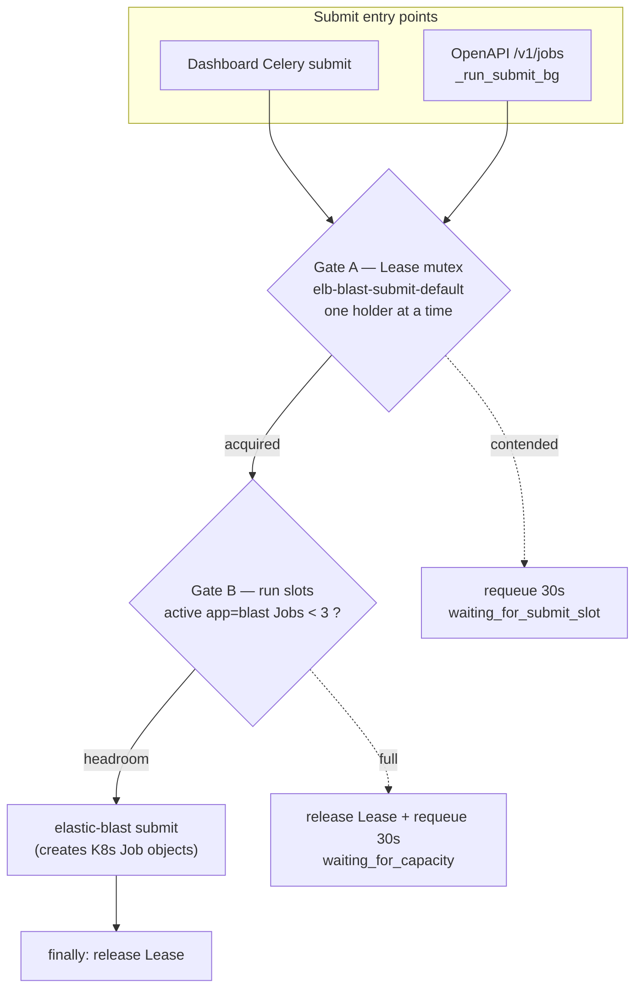
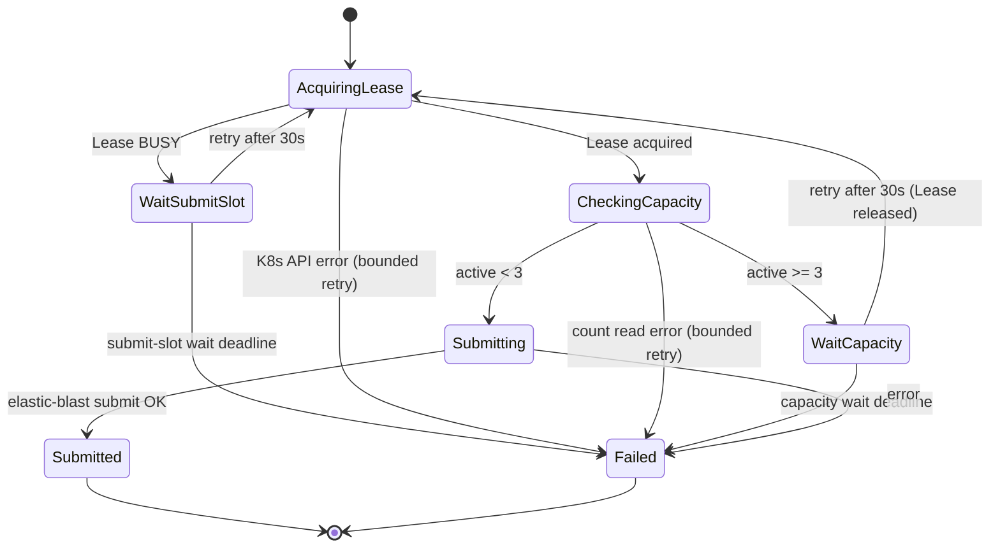

# Cross-Path BLAST Submit Coordination (Dashboard + OpenAPI)

Date: 2026-06-04 (updated 2026-06-05)
Status: **Implemented + ACTIVATED** — both code halves are deployed and the
cross-path coordination is live: the dashboard and the sibling `elb-openapi`
service both run `BLAST_COORD_BACKEND=k8s` and acquire the same per-namespace
Lease (`elb-blast-submit-default`) on the shared AKS cluster (activated
2026-06-05).
- **Phase 0 (this repo, dashboard)** — shipped behind the
  `BLAST_COORD_BACKEND` flag: `api/services/blast/coordination.py` (backend
  resolver + `assert_coordination_invariants`), `api/services/k8s/submit_lease.py`
  (Gate A Lease), `api/services/k8s/blast_status.py`
  (`k8s_count_active_blast_submissions`, Gate B), `api/services/blast/k8s_gate.py`,
  wired into `submit_task.py` and the split fan-out. The dashboard Container App
  `ca-elb-dashboard` now has `BLAST_COORD_BACKEND=k8s` set on the `api`,
  `worker`, and `beat` sidecars (revision `0000132`, healthy; the startup
  `assert_coordination_invariants` chain `submit_exec(600) <
  CELERY_TASK_SOFT_TIME_LIMIT(3300) < CELERY_TASK_TIME_LIMIT(3600)` and
  `submit_exec(600) < lease_ttl(900)` passes).
- **Phase 1 (sibling `dotnetpower/elastic-blast-azure`, `docker-openapi`)** —
  shipped **and deployed** (`submit_coordination.py`, `submit_exec_timeout <
  lease_ttl` cap; commits `32e5119e` + `3d3fd56a`, tracking issue #1). Image
  `elb-openapi:4.21` (built 2026-06-05, contains `submit_coordination.py` and is
  imported by `main.py`) is rolled out on `elb-cluster-02`, and the `elb-openapi`
  Deployment has `BLAST_COORD_BACKEND=k8s`. The pod resolves `backend=k8s`,
  `max_run=3`, `lease_ttl=900`, `submit_exec=780`, `lease_name=
  elb-blast-submit-default` — matching the dashboard's pinned namespace,
  ceiling, and Lease name. RBAC is satisfied — `elb-openapi-sa` is bound to
  `cluster-admin`, so Leases (get/create/update) and Jobs (list) are permitted.
- **Rollout ordering honoured**: the sibling image was built + deployed and
  confirmed resolving `backend=k8s` BEFORE the dashboard was flipped, so the §10
  transient over-admit window never opened.

Owner: `api/tasks/blast/` + `api/services/k8s/` maintainers, plus the sibling
`dotnetpower/elastic-blast-azure` `docker-openapi` maintainers.

> One-paragraph summary: There are **two independent ways** to submit a BLAST
> job — the dashboard's Celery `submit` task (serialised by a Redis lock in the
> Container App's in-revision Redis sidecar) and the `elb-openapi` service's
> `POST /v1/jobs` (serialised by an in-pod dispatcher with
> `MAX_ACTIVE_SUBMISSIONS`). Each path coordinates **with itself** but the two
> share no lock and no counter, so mixed submits to the same cluster +
> namespace can run `elastic-blast submit` concurrently and race on the
> namespace's Kubernetes objects and the shared `elb-scripts` ConfigMap. This
> note designs a shared coordination layer with two gates — a **Kubernetes
> Lease** mutex (submit serialisation) and a **cluster-job count** ceiling (run
> concurrency, target 3) — both keyed on truth that lives **in the AKS cluster**
> rather than in the dashboard, so the OpenAPI path is unaffected when the
> dashboard is down.

This note is a companion to
[AKS Capacity Gate for Parallel BLAST Submits](aks-capacity-gate.md). That note
designs the *single-path* (dashboard-only) capacity gate using Redis slots; this
note generalises the problem to *both* paths and relocates the coordination
truth from Redis to the cluster. Where the two overlap (run-concurrency
accounting), this note supersedes the Redis-hash slot store with a
cluster-job-count source of truth.

---

## 1. The problem — two uncoordinated queues

### 1.1 Dashboard "New Search" path (this repo)

`POST /api/blast/submit` → Celery `api.tasks.blast.submit` (single worker,
serial dispatch over the `blast` queue):

* Per-`(cluster, namespace)` **Redis lock**
  ([`api/tasks/blast/submit_lock.py`](../../api/tasks/blast/submit_lock.py)),
  key `elb:blast:elastic-blast-submit:<cluster>:<namespace>`, `SET NX EX 900`,
  Lua-CAS release. `submit_task.py` hard-codes `namespace="default"`.
* Lock-busy → re-enqueue `countdown=30s`, state `waiting_for_submit_slot`, does
  **not** consume the retry budget.
* **Critical scope**: the lock is released in a `finally` as soon as the
  `elastic-blast submit` shell call returns (it created the Kubernetes Job
  objects, seconds–minutes). It does **not** cover the actual BLAST compute.
  So the dashboard serialises *submission* but allows **many** BLAST batch jobs
  to run in parallel (Kubernetes schedules them by node capacity).

### 1.2 OpenAPI `/v1/jobs` path (sibling `elastic-blast-azure`)

The `elb-openapi` service runs **as a pod on the AKS cluster**.
`POST /v1/jobs` → in-memory `_jobs` dict + ConfigMap persistence → an in-pod
dispatcher thread:

* `_claim_next_job` enforces `MAX_ACTIVE_SUBMISSIONS`
  (env `ELB_OPENAPI_MAX_ACTIVE_SUBMISSIONS`, **default 1**),
  `_ACTIVE_STATES = {dispatching, submitting, running}`.
* A job stays `running` until it completes/fails, so OpenAPI serialises the
  **entire job lifecycle** — effectively ~1 BLAST at a time end-to-end, much
  stricter than the dashboard.

### 1.3 The gap (Critical)

| | Dashboard | OpenAPI |
|---|---|---|
| Coordination store | Container App **redis sidecar** (loopback, ephemeral) | **elb-openapi pod** process memory + ConfigMap |
| Concurrency model | submission serial, compute N-parallel | whole-lifecycle serial, 1 |
| Sees the other path? | no | no |

* The two paths share **no lock and no counter**. OpenAPI never touches the
  dashboard's Redis; the dashboard never reads OpenAPI's `_jobs`.
* Result: two `elastic-blast submit` invocations can run **simultaneously** on
  the same cluster + `default` namespace, racing on namespace Kubernetes objects
  (ServiceAccount / Secret / PVC / Job) and **overwriting the shared
  `elb-scripts` ConfigMap** — exactly the race the dashboard's Redis lock exists
  to prevent, but which OpenAPI bypasses.
* OpenAPI's "1 at a time" invariant is silently **violated** by dashboard
  submits it cannot see.

> **A third, internally un-gated path exists inside the dashboard.** The
> storage-query **split** submission
> ([split_pipeline.py](../../api/tasks/blast/split_pipeline.py)
> `_dispatch_split_child_submits`) runs `elastic-blast submit` per child shard
> via the terminal sidecar in a loop and **never calls `acquire_submit_lock`** —
> it bypasses today's Redis lock entirely. So even *within this repo* there are
> two submit paths (gated regular submit + un-gated split children). Any
> coordination design that only wires the gate into the regular `submit` branch
> leaves the split fan-out racing. §7.1 makes gating this loop an explicit Phase 0
> task.

> Each path's queueing is internally correct. **Across** paths there is none.

---

## 2. Requirement that shapes the whole design

> "OpenAPI must keep working when the dashboard is down."

This single requirement rules out the obvious fix ("make OpenAPI take the
dashboard's Redis lock"):

* The dashboard's Redis is an **in-revision sidecar** bound to loopback
  `127.0.0.1:6379` and is ephemeral. The on-AKS `elb-openapi` pod cannot
  physically dial it, and exposing it would break the network-isolation posture
  (charter §9) and re-introduce a shared broker the charter forbids (§14).
* Even if reachable: if the coordination store lives **inside** the dashboard,
  then when the dashboard dies the store dies, leaving OpenAPI to choose between
  fail-closed (stops submitting — violates the requirement) or fail-open
  (ignores the lock — defeats the lock). Both are wrong.

**Conclusion:** the coordination truth must live in infrastructure that **both**
paths depend on anyway and that survives the dashboard — i.e. the **AKS cluster
itself**. The objects we are protecting (namespace Job/Secret/PVC, the
`elb-scripts` ConfigMap) already live there, so co-locating the lock is natural.

---

## 2a. Relationship to the existing (wired) capacity gate

This repo **already ships** a Stage-3 single-path capacity gate, wired into
[`submit_task.py`](../../api/tasks/blast/submit_task.py) behind
`BLAST_GATE_ENABLED` (default OFF):

* `BLAST_GATE_ENABLED=false` (today's default) → the per-`(cluster, namespace)`
  **Redis submit lock** path (`acquire_submit_lock`).
* `BLAST_GATE_ENABLED=true` → the **Redis-slot capacity gate**
  ([`api/services/blast/capacity_gate.py`](../../api/services/blast/capacity_gate.py)):
  `evaluate_capacity_gate` + atomic `reserve_slot`/`release_slot`. In this mode
  the submit lock is **not** taken — the two are mutually exclusive branches of
  one `if gate_enabled:` block.

The new `k8s` coordination backend is therefore a **third** branch, not a
replacement for either. To avoid an undefined two-flag combination, the precedence
is defined explicitly (Phase 0 must implement exactly this order):

```text
backend = BLAST_COORD_BACKEND (default "redis")
if backend == "k8s":
    use Gate A (Lease) + Gate B (cluster count)   # BLAST_GATE_ENABLED is IGNORED
elif BLAST_GATE_ENABLED truthy:
    use the existing Redis-slot capacity gate     # unchanged
else:
    use the existing Redis submit lock            # unchanged (today's default)
```

`BLAST_COORD_BACKEND=k8s` **wins** over `BLAST_GATE_ENABLED` and the Redis slot
store is not consulted in that mode (its truth cannot survive a dashboard outage,
which is the whole point of §2). A test must assert that `k8s` + `GATE_ENABLED=true`
resolves to the Lease path and never calls `reserve_slot`.

---

## 3. Two gates, two concurrency axes

Two *different* notions of concurrency must not be conflated:

| Axis | Limits | Target | Mechanism |
|---|---|---|---|
| **(A) Submit concurrency** | the `elastic-blast submit` call that *creates* namespace objects | **1** (serial) | **Gate A — Kubernetes Lease mutex** |
| **(B) Run concurrency** | BLAST jobs actually *running* on nodes | **3** | **Gate B — cluster-job count ceiling** |

The user requirement "max 3 parallel" is axis **(B)**. Submission (A) stays
serial because two concurrent `elastic-blast submit` to the same namespace race;
submission is short (seconds–minutes) so serialising it is not a bottleneck.



**Why check Gate B while holding Gate A:** the mutex serialises submitters, so
when submitter *N* counts cluster jobs, submitter *N-1* has already created its
Job object in etcd and released the Lease. That eliminates the "just submitted
but not yet visible" admit race without any extra reservation bookkeeping —
**but only for a marker that `elastic-blast submit` creates *synchronously*.**
The actual `app=blast` batch Jobs are **not** such a marker on Azure (see §5.1):
in `cloud_job_submission` mode they are created by an in-cluster `app=submit`
job **after** `elastic-blast submit` returns, so they are invisible at
Lease-release time and the guarantee fails. Gate B must therefore count the
**`app=finalizer` / `elb-job-id`** marker, which both Azure submit paths create
*synchronously* at the end of `submit()` and which lives for the whole job
lifecycle (§5.1).

---

## 4. Gate A — submit mutex (Kubernetes Lease)

### 4.1 Object

```yaml
apiVersion: coordination.k8s.io/v1
kind: Lease
metadata:
  name: elb-blast-submit-default        # one per namespace; cluster identity is the cluster itself
  namespace: default
spec:
  holderIdentity: "<source>-<job_id>"    # e.g. dashboard-ab12 / openapi-9f3c
  leaseDurationSeconds: 900              # matches today's Redis TTL
  acquireTime:  <RFC3339>
  renewTime:    <RFC3339>
```

The Lease name maps 1:1 to today's `submit_lock_key`:
`elb-blast-submit-<namespace>`. Different namespaces → different Lease names →
parallel, preserving the existing per-`(cluster, namespace)` semantics.

> **`holderIdentity` must be a *globally unique* token per acquisition, not a
> truncated id.** The same-holder renew branch in §4.2
> (`if lease.holderIdentity == holder: renew`) treats an identity match as "this
> is my own Lease, safe to renew and proceed". If `holderIdentity` is a short
> hash like `dashboard-ab12` and two *different* dashboard submits ever collide
> on that suffix, submitter B would read submitter A's live Lease, see its own
> identity, **renew it, and proceed concurrently** — a silent concurrent-submit
> exactly inside the window the mutex protects. The Redis lock avoids this by
> using a per-acquisition random token; the Lease must do the same. Phase 0 uses
> `<source>-<full-uuid>` (or the full Celery task id / OpenAPI job uuid), never a
> truncation, and a test asserts two distinct submits never produce equal
> `holderIdentity`.

### 4.2 Acquire (optimistic concurrency)

```text
acquire(holder, ttl=900):
  lease = GET lease
  if not found:
     CREATE lease{holderIdentity=holder, acquireTime=now, renewTime=now}
       on 409 (race) -> return BUSY
     return OK
  if lease.holderIdentity == holder:          # same-job retry -> renew (idempotent)
     PATCH renewTime=now  (resourceVersion-conditional)
     return OK
  expired = now > lease.renewTime + leaseDurationSeconds
  if expired:
     PATCH holderIdentity=holder, acquireTime=now, renewTime=now
        (resourceVersion-conditional CAS)
       on 409 -> return BUSY                    # someone grabbed the expired lease first
     return OK
  return BUSY
```

* CAS = Kubernetes `resourceVersion`-conditional update — replaces the Redis Lua
  CAS. Two submitters racing for an expired Lease: only one wins (409 for the
  loser). `create` collisions also resolve via 409.
* **Expiry is computed against a clock, and the two paths have *different*
  clocks.** `expired = now > lease.renewTime + leaseDurationSeconds` uses the
  **caller's** wall clock (the dashboard MI host vs the in-cluster `elb-openapi`
  pod). If those clocks skew, a clock-ahead caller can judge a still-valid Lease
  expired and take it over → two concurrent submits (the §9 *TTL mismatch* race).
  The `resourceVersion` CAS only guarantees one *writer* wins, **not** that the
  takeover was legitimate. v1 mitigations: (a) add a skew margin
  (`now > renewTime + ttl + SKEW`, e.g. 30 s) before treating a Lease as
  expired, and (b) prefer the apiserver-stamped `renewTime` over local time for
  the comparison. Phase 0 records the chosen margin as a constant.
* Same-`job_id` retry only renews its own Lease (mirrors the Redis lock's
  token-identity check).
* **`BUSY` vs `ERROR` must be distinguished.** The pseudocode returns OK/BUSY,
  but a real K8s API failure (apiserver unreachable, 5xx, kubeconfig expired) is
  **not** `BUSY` — mapping it to `BUSY` would silently requeue every 30 s on a
  genuine outage and never surface. An API error maps to the existing
  `terminal_unavailable`-style retry path (bounded `_retry_or_fail`), so the
  outage becomes a visible terminal state. Only a real holder-conflict (live,
  non-expired Lease owned by another holder, or a 409 CAS loss) is `BUSY` →
  requeue 30 s `waiting_for_submit_slot`.

### 4.3 Renew / release

* `elastic-blast submit` is typically seconds–minutes, so a single 900 s TTL is
  enough — **no mid-submit heartbeat in v1**. (An optional 90 s `renewTime`
  heartbeat is a v2 hardening if submit ever approaches the TTL — see §9.)
* **Load-bearing ordering invariant: `submit exec timeout` < `Lease TTL`.** The
  thing that *actually* prevents a TTL overrun from turning into a concurrent
  submit is not the soft "900 s is ample" claim — it is that the submit
  subprocess is itself hard-capped **below** the TTL. Today
  [`_stream_submit_command`](../../api/tasks/blast/submit_runtime.py) and the
  split-child submit ([split_pipeline.py](../../api/tasks/blast/split_pipeline.py))
  both pass `timeout_seconds=600`, and the TTL is 900, so an overrunning submit
  is **killed at 600 s** (failed submit) before the Lease can be reclaimed at
  900 s. This invariant is silent and unenforced — lowering
  `BLAST_SUBMIT_LEASE_TTL_SECONDS` below 600 (or raising the exec timeout above
  the TTL) would re-open the expiry-takeover→concurrent-submit race with green
  tests. Phase 0 must (a) assert `lease_ttl > submit_exec_timeout` at startup and
  (b) cover it with a test, so the ordering is a checked contract, not a
  coincidence.
* **The invariant chain also includes the Celery time limits — the conditional
  release only runs if the task exits *gracefully*.** The release lives in a
  `finally`, which Python runs on a normal return or a catchable exception, but
  **not** on a `SIGKILL`. Celery's hard `task_time_limit` (default 3600 s,
  env-overridable via `CELERY_TASK_TIME_LIMIT`,
  [celery_app.py](../../api/celery_app.py)) **SIGKILLs the worker child**, so a
  submit task killed by the hard limit **skips the `finally`** and the Lease is
  orphaned until its 900 s TTL — every other submitter blocked that whole time.
  Today the chain is safe (`submit_exec 600 < soft 3300 < hard 3600`): the
  subprocess's own 600 s timeout (a catchable `TimeoutError`) fires long before
  the soft limit, so `finally` always runs. But all four numbers are
  **env-configurable and independently tunable**, so the safety is a coincidence,
  not a contract. Phase 0's startup assertion must check the **full chain**
  `submit_exec_timeout < CELERY_TASK_SOFT_TIME_LIMIT < CELERY_TASK_TIME_LIMIT`
  **and** `submit_exec_timeout < lease_ttl`, so that a graceful, `finally`-running
  failure is guaranteed before any hard kill. (The soft limit raises a catchable
  `SoftTimeLimitExceeded`, which still runs `finally`; only the hard limit does
  not — so keeping the submit's own subprocess timeout below the soft limit is
  what makes the release reliable.)
* Release in a `finally`, but **conditionally** — exactly like the Redis lock's
  Lua-CAS token check, not an unconditional clear:

  ```text
  release(holder):
     lease = GET lease
     if lease.holderIdentity != holder:   # someone else already took over
        return                            # do NOT clobber the newer holder
     PATCH holderIdentity="" (resourceVersion-conditional); on 409 -> retry GET once
  ```

  This matters because a submit that overran the 900 s TTL may have been
  reclaimed by a second holder (§4.2 expiry-takeover). An **unconditional**
  `PATCH holderIdentity=""` in `finally` would then erase the *new* holder's
  lease while it is still submitting → exactly the concurrent-submit race the
  Lease exists to prevent. The holder-identity guard + `resourceVersion` CAS
  closes it. A holder that crashes without releasing is still reclaimed by TTL
  expiry. PATCH-to-empty is preferred over delete for object reuse +
  observability.

### 4.4 RBAC

| Principal | Grant |
|---|---|
| `elb-openapi` pod ServiceAccount (in-cluster) | `Role` on `coordination.k8s.io/leases` (`get, create, update, patch`) in `default` + `RoleBinding` |
| Dashboard MI (via kubeconfig) | Same verbs. The dashboard uses an ARM admin kubeconfig today, but a least-privilege grant adds the same `Role`. |

The postprovision capability probe (charter §12a Rule 3) gains one Lease
`get`/`create` call so a missing grant fails fast.

### 4.5 A new **write** K8s helper is required (not just a read helper)

Every existing `api/services/k8s/` helper is **read-only** (`get`/`list` for
monitoring). Gate A needs `create`/`patch` on `coordination.k8s.io/leases`, so
`submit_lease.py` introduces the **first mutating** K8s call path in this repo.
Two consequences Phase 0 must handle:

* The helper builds its own typed request against the Lease API (the monitoring
  helpers' read-only client wrappers cannot be reused verbatim for a PATCH with
  a `resourceVersion` precondition).
* The dashboard's current ARM **admin** kubeconfig already carries these verbs,
  so Phase 0 works without an RBAC change — but that reliance must be recorded
  so a future least-privilege kubeconfig (charter §12a RBAC-narrowing) adds the
  §4.4 `Role` in the **same** PR, or Gate A silently starts failing closed.
  Until the probe (above) covers Lease writes, a missing grant surfaces only at
  submit time.

---

## 5. Gate B — run concurrency (cluster-job count, ceiling 3)

### 5.1 Count definition

```text
active_submissions(cluster, ns) =
    number of distinct elb-job-id values among NON-TERMINAL K8s Jobs
    labelled app=finalizer in ns
    (one finalizer Job per elastic-blast submit, created synchronously)
```

* **Unit = one `elastic-blast submit` = one distinct `elb-job-id`**, counted via
  the **`app=finalizer`** marker — **not** `app=blast`, and **not** a raw Job
  count. This is a load-bearing correction verified against the upstream AKS
  templates ([`blast-batch-job-aks`](https://github.com/dotnetpower/elastic-blast-azure)
  vs `elb-finalizer-aks`):
  * **`app=blast` is N-per-submit, not 1.** The batch job name embeds `JOB_NUM`
    (`${PROGRAM}-batch-${DB}-job-${JOB_NUM}-...`); one search fans out to one
    `app=blast` Job **per batch/shard**, all sharing a single `elb-job-id`.
    Counting raw `app=blast` Jobs would let a single multi-batch search trip the
    ceiling of 3 by itself.
  * **`app=blast` is created asynchronously on Azure.** With
    `cloud_job_submission` enabled, `elastic-blast submit` applies an
    `app=submit` *job-submission* Job and returns; that Job then creates the
    `app=blast` batch Jobs **later, in-cluster**. So at Lease-release time the
    batch Jobs do not exist yet → counting them **over-admits** (the §3 race).
  * **`app=setup` is not reliable either** — the init/PV Jobs are skipped when a
    cluster is reused (`cluster_initialized`), so they undercount on warm
    clusters.
  * **`app=finalizer` is the correct marker:** `submit()` deploys exactly one
    `elb-finalizer-<short>` Job (`app=finalizer`, `elb-job-id=<id>`)
    **synchronously, in both the cloud-job-submission and direct paths**, and it
    stays non-terminal until the whole search completes. So it is 1:1 with an
    active search, visible the instant `submit()` returns, and lives for the
    lifecycle — exactly the properties Gate B needs.
* Counting is **distinct-by-`elb-job-id`** so that even if the marker ever
  became >1 Job, a single submit still consumes exactly one slot.
* A finalizer Job that is `Pending`/`Running` still **holds a run slot** (it is
  committed work). This is intentionally *separate* from the UI status label,
  where Pending vs Running must be split (a distinct fix tracked in
  [blast_status.py](../../api/services/k8s/blast_status.py); see §9).
* **A failed/partial submit can orphan its finalizer → phantom slot.** Because
  the finalizer is created *synchronously and first-ish* (before the async
  `app=blast` batch Jobs exist in `cloud_job_submission` mode, §3), a submit that
  errors **after** the finalizer is applied but **before/while** the batch Jobs
  are created leaves a non-terminal `app=finalizer` Job with **no live batch work
  behind it**. Under H4's finalizer-count it keeps holding a Gate B slot
  indefinitely (capacity leak 3→2), and — critically — "finalizer with zero
  `app=blast` Jobs" is **also the normal transient state** of a *healthy* submit
  mid-async-creation, so the two cannot be told apart by job-count alone. Phase 0
  needs an explicit GC/liveness rule: treat a finalizer as occupying a slot only
  while its `elb-job-id` shows liveness (matching `app=submit`/`app=blast` Jobs
  present **or** age below a `FINALIZER_GRACE_SECONDS` bound that covers the async
  batch-creation lag); past that, a lone finalizer is reconciled (warn-badge +
  operator delete, never silent auto-fail — same posture as the stuck-pod row in
  §9). Without this rule the switch from `app=blast` to `app=finalizer` counting
  trades over-admission for a slow capacity leak.
* **A split search consumes *multiple* slots.** The dashboard's storage-query
  split fans out one `elastic-blast submit` — hence one **finalizer** — **per
  child shard** ([split_pipeline.py](../../api/tasks/blast/split_pipeline.py)
  `_dispatch_split_child_submits`). So a 5-way split search occupies up to 5
  slots and a single user search can saturate or exceed the ceiling of 3.
  "3 parallel" therefore means **3 finalizers (= 3 submits), not 3 user
  searches**. Phase 0 must decide and document one of: (a) children count
  individually (simplest, but one split search can starve others), (b) the
  ceiling is raised for split workloads, or (c) split children are accounted as
  one logical unit. v1 picks (a) and records the starvation limitation (§9
  fairness row).

### 5.2 Where it runs

Inside the Gate A critical section, immediately before `elastic-blast submit`,
identical for both paths:

```text
with lease (Gate A):
    n = active_submissions(cluster, ns)        # cluster is the source of truth
    if n >= BLAST_MAX_RUN_CONCURRENCY (=3):
        release lease
        requeue 30s, state = waiting_for_capacity
        return
    run elastic-blast submit                   # new Job object visible to the next counter
release lease (finally)
```

* Dashboard counts via the existing `_fetch_blast_pods_and_jobs` machinery
  (new helper `k8s_count_active_blast_submissions`); OpenAPI counts via
  in-cluster `kubectl get jobs -l app=finalizer -o json`. **Both must count the
  same marker and dedup by `elb-job-id`** — if one path counts `app=finalizer`
  distinct-`elb-job-id` and the other counts raw `app=blast` Jobs, they compute
  *different* numbers for the same cluster state and the shared "3" is a fiction.
  Pin one selector + one dedup rule in a constant shared by both repos.

> **The admission count MUST bypass the monitoring cache.**
> [`_fetch_blast_pods_and_jobs`](../../api/services/k8s/blast_status.py) is
> **memoised ~3 s** (it exists to share roundtrips across one `/api/blast/jobs`
> render). Reusing it for admission would let a Job created up to 3 s ago stay
> invisible, **defeating the "check Gate B while holding Gate A" guarantee** in
> §3 and over-admitting. `k8s_count_active_blast_submissions` must do a **fresh,
> uncached** list (a direct API read, no `resourceVersion=0` watch-cache hint) so
> the count reflects the previous holder's just-created Job. The 3 s memo is fine
> for the UI; it is **not** fine for an admission decision.
>
> **Count-read failure is fail-closed.** If the list call raises (apiserver
> timeout/5xx), the gate must **not** fail-open (admit blind → over-admit). It
> requeues `waiting_for_capacity` (Lease released first) so the existing
> `BLAST_CAPACITY_WAIT_MAX_SECONDS` deadline eventually surfaces a persistent
> outage as a terminal `capacity_timeout`, rather than silently admitting past
> the ceiling.

> **Unverified external contract — must be confirmed before Phase 0 relies on
> it.** The marker label (`app=finalizer`) and a stable per-submit `elb-job-id`
> are produced by **upstream elastic-blast**, not by this repo. If upstream
> changes the label or the finalizer is ever made optional, Gate B silently
> miscounts. Phase 0 must (a) confirm against a live cluster
> (`kubectl get jobs -l app=finalizer -o json` shows exactly one Job per submit
> with a distinct `elb-job-id`, created the instant submit returns), (b) pin the
> exact selector in a constant shared by the counter and the tests, and (c)
> treat a zero-match-but-`app=blast`-Jobs-exist result as a *fail-safe* (do not
> admit blindly when the finalizer selector returns nothing yet search pods are
> clearly running). Note the existing auto-stop probe keys on `app=blast`
> (`probe_live_blast_activity`); Gate B deliberately keys on `app=finalizer`
> instead because that is the 1-per-submit, synchronously-created, lifecycle-long
> marker (§5.1) — do not "unify" the two onto `app=blast` without re-introducing
> the N-per-submit + async-visibility defects.
> **Cross-feature marker divergence with auto-stop — a finalizer-tail teardown
> risk.** The AKS auto-stop idle gate already runs a live K8s probe
> ([auto_stop_live.py](../../api/services/auto_stop_live.py)
> `probe_live_blast_activity`) that **additively** counts `app=blast` Jobs so an
> OpenAPI-submitted run the dashboard cannot see still blocks a stop. But Gate B
> occupancy is now defined on `app=finalizer` (§5.1), and the two markers do not
> have the same lifetime: the `app=blast` batch Jobs finish **before** the
> `app=finalizer` Job (which then merges/cleans up), and in `cloud_job_submission`
> mode they appear **after** submit returns. So there is a tail window where
> `app=blast` count is 0 (auto-stop sees "idle") while the finalizer is still
> running (Gate B still counts the slot occupied) → **auto-stop can scale the
> cluster down while a finalizer is finishing a run Gate B considers active.**
> Resolution direction: align auto-stop's live predicate to also treat a
> non-terminal `app=finalizer` (or any live `elb-job-id`) as "in use", so the
> teardown gate and the admission gate share one liveness definition. Until then,
> record the finalizer-tail teardown window as a known cross-feature limitation.
> (Note this is *additive* on auto-stop's side and never *forces* a stop, so the
> failure mode is a premature scale-down of a finishing job, not a stranded
> cluster.)
### 5.3 Where "3" comes from

| Approach | Value | Recommended |
|---|---|---|
| Fixed env | `BLAST_MAX_RUN_CONCURRENCY=3` (identical key in both repos) | ✅ v1 |
| Node-derived | `min(3, floor(ready_nodes / nodes_per_job))` | v2 (optional) |

v1 = fixed env `3`. The two repos only have to agree on one integer.

---

## 6. Unified submit state machine (contract shared by both paths)



* Dashboard reuses the existing `waiting_for_submit_slot` /
  `waiting_for_capacity` states (Celery requeue `countdown=30`, retry budget
  untouched).
* **Both wait states need a deadline, not just `waiting_for_capacity`.** Today
  the `waiting_for_submit_slot` (Gate A contention) re-enqueue
  ([submit_task.py](../../api/tasks/blast/submit_task.py)) is deliberately
  *unbounded* — it requeues every 30 s and **does not consume `max_retries`**.
  Under the new design a stuck/long Lease holder (or a crash that pins the Lease
  for the full TTL) makes every other submitter loop on `waiting_for_submit_slot`
  **forever and invisibly**. Phase 0 carries a `submit_slot_wait_deadline_ts`
  (mirroring the existing `warmup_wait_deadline_ts` pattern) so Gate A contention
  also reaches a terminal `submit_slot_timeout` instead of looping silently.
  `BLAST_CAPACITY_WAIT_MAX_SECONDS` only bounds Gate B; Gate A needs its own.
* OpenAPI's `_claim_next_job` gains both conditions ((a) Lease acquirable + (b)
  cluster `active < 3`) before dispatch; if either fails the job stays `queued`
  and the next dispatcher tick (5 s) retries.

---

## 7. Repo-level changes (Phase 0 here, cross-repo tracked)

### 7.1 This repo (`elb-dashboard`)

1. `api/services/k8s/submit_lease.py` (new): `k8s_acquire_submit_lease /
   renew / release` per §4.2, reusing the existing k8s session helpers.
2. `api/services/k8s/blast_status.py`: add
   `k8s_count_active_blast_submissions(cluster, ns)` per §5.1.
3. `api/tasks/blast/submit_task.py`: select the coordination backend via a new
   flag **`BLAST_COORD_BACKEND={redis|k8s}`**, default `redis` (current
   behaviour preserved — charter §12a Rule 4 default-OFF). `k8s` uses the Lease
   + cluster-count gates.
4. **`api/tasks/blast/split_pipeline.py` (`_dispatch_split_child_submits`): wire
   the same gate into the split fan-out.** This loop currently submits each child
   ungated (§1.3). Under the `k8s` backend each child `elastic-blast submit` must
   acquire/release the Lease and check Gate B just like the regular path, or the
   split path re-opens the race the design closes. (Children submit sequentially
   within the parent task, so they don't race *each other* — but they race other
   paths and each consumes a Gate B slot, §5.1.) Easiest safe form: extract the
   acquire→count→submit→release sequence into a shared helper used by both the
   regular branch and this loop.
5. Run-concurrency uses the cluster-count ceiling (§5); the Redis slot hash from
   [aks-capacity-gate.md](aks-capacity-gate.md) is **not** used in the `k8s`
   backend, because its truth must survive a dashboard outage.
6. Tests: Lease acquire / CAS-conflict / expiry-takeover / same-holder-renew /
   **conditional-release-does-not-clobber-new-holder** / **acquire API-error maps
   to retry not BUSY**; uncached count / **count-failure fail-closed**; split
   children are gated; state machine; the §2a precedence (`k8s` wins over
   `BLAST_GATE_ENABLED`, `reserve_slot` not called); a dashboard-death simulation
   (Redis down, `k8s` backend still submits).

### 7.2 Sibling repo (`elastic-blast-azure`) — tracked, not in this change

1. `_run_submit_bg`: acquire the same-named Lease + cluster `active < 3` before
   `elastic-blast submit`, release in `finally`.
2. `_claim_next_job`: gate on (Lease acquirable + cluster `active < 3`) instead
   of `MAX_ACTIVE_SUBMISSIONS` alone. The `active` count is the **same**
   `app=finalizer` distinct-`elb-job-id` count the dashboard uses (§5.1/§5.2),
   **not** a raw `kubectl get jobs -l app=blast` count — the two repos must share
   one selector + one dedup rule or they disagree on "3".
3. ServiceAccount Lease RBAC (`Role` + `RoleBinding`).
4. `BLAST_MAX_RUN_CONCURRENCY=3` (same key/value as the dashboard).

> **Lease hold must cover only the submit subprocess, not the whole job
> lifecycle.** OpenAPI keeps a job in `running` (`_ACTIVE_STATES`) until the
> BLAST compute finishes, but the Lease must be **released the moment
> `elastic-blast submit` returns** (in `finally` around that call), decoupled
> from OpenAPI's own `running` state. If the Lease were held for the whole
> lifecycle, Gate A would serialise *compute*, collapsing the 3-parallel target
> (Gate B) back to 1. Gate A = submit-window only; Gate B = run concurrency.

A cross-repo tracking issue is required (charter §13 cross-repo consistency).

---

## 8. Configuration knobs (identical keys in both repos)

| Env | Default | Meaning |
|---|---|---|
| `BLAST_COORD_BACKEND` | `redis` (this repo) | `k8s` switches to the Lease + cluster-count gates (rollout flag) |
| `BLAST_MAX_RUN_CONCURRENCY` | `3` | Gate B ceiling |
| `BLAST_SUBMIT_LEASE_TTL_SECONDS` | `900` | Lease validity (matches today's Redis TTL) |
| `BLAST_CAPACITY_WAIT_MAX_SECONDS` | `1800` | Deadline that bounds the `waiting_for_capacity` requeue loop |
| `ELB_OPENAPI_MAX_ACTIVE_SUBMISSIONS` | (superseded by Gate B; set to `3` or remove) | OpenAPI legacy in-pod ceiling |

---

## 9. Failure modes & self-critique

| Dimension | Risk | Design response |
|---|---|---|
| **Dashboard down** (the driving requirement) | coordination tied to the dashboard would freeze OpenAPI | Truth = cluster etcd. OpenAPI uses its in-cluster ServiceAccount; unaffected. ✅ |
| **Unbounded wait loop** | the 3 slots stay pinned by **stuck Pending jobs**, so new submits requeue `waiting_for_capacity` forever | (a) `BLAST_CAPACITY_WAIT_MAX_SECONDS` deadline → hard-fail `capacity_timeout` with a clear message; (b) a separate reconcile **stuck-pod badge** (warn-only, never auto-fail — an unreachable job must not strand the cluster). **Known limitation:** the deadline fails only the *waiting* submitter, not the stuck slot holder, so a permanently-stuck job permanently lowers effective capacity (3→2) with no auto-recovery — operator must delete the stuck Job. |
| **Flag precedence** | `BLAST_COORD_BACKEND=k8s` + `BLAST_GATE_ENABLED=true` set together → undefined which gate runs | Precedence pinned in §2a: `k8s` wins and the Redis slot store is never consulted. A test asserts `reserve_slot` is not called in `k8s` mode. ✅ |
| **Concurrency race** | two submitters grab an expired Lease | `resourceVersion` CAS → exactly one wins (409). `create` collisions also 409. ✅ |
| **Gate A wait unbounded** | a stuck/crashed Lease holder pins the mutex; every other submitter loops `waiting_for_submit_slot` every 30 s with **no deadline** (today's re-enqueue does not consume `max_retries`) → invisible forever | Phase 0 adds a `submit_slot_wait_deadline_ts` (mirrors `warmup_wait_deadline_ts`) so Gate A contention terminates as `submit_slot_timeout`. `BLAST_CAPACITY_WAIT_MAX_SECONDS` bounds only Gate B (§6). |
| **Clock skew across paths** | expiry is judged on the **caller's** clock; dashboard-MI vs openapi-pod skew → premature takeover → concurrent submit | Add a skew margin before treating a Lease expired and/or compare against apiserver-stamped `renewTime` (§4.2). The CAS only picks one *writer*, not a *legitimate* one. |
| **Per-namespace ceiling vs global "3"** | Gate B counts per-`(cluster, ns)`, but "max 3 parallel" is a **global** intent; with >1 namespace each gets its own 3 → up to 3×N cluster-wide | Moot today (`namespace` is hard-coded `default`), but the design claims per-ns generality. **Caution — the two gates must share one scope.** Gate A is per-namespace (`elb-blast-submit-<ns>`, §4.1), so it only serialises submitters *within* a namespace. "Fixing" the global cap by counting Gate B **cluster-wide** while Gate A stays per-ns is **unsound**: two submitters in different namespaces hold different Leases *concurrently*, both run the cluster-wide count, both see headroom, both admit → the "check Gate B while holding Gate A" serialisation (§3) is broken across namespaces. A cluster-wide ceiling needs a **cluster-wide single-name Lease** too. Phase 0 options: (a) keep **both** per-namespace, or (b) make **both** cluster-wide; never mix. |
| **Orphaned finalizer = phantom slot** | a submit that fails after the finalizer Job is applied but before its batch work materialises leaves a non-terminal `app=finalizer` Job holding a Gate B slot forever; H4's finalizer-count makes this a capacity leak (3→2), and it is indistinguishable from a healthy submit mid-async-batch-creation | Liveness-bounded counting: a lone finalizer occupies a slot only while its `elb-job-id` shows matching `app=submit`/`app=blast` Jobs **or** is younger than `FINALIZER_GRACE_SECONDS` (covers async creation lag); older lone finalizers are reconciled (warn-badge + operator delete, never silent auto-fail) (§5.1). |
| **Holder-identity collision** | `holderIdentity=<source>-<shortid>`: two distinct submits colliding on the short id → the same-holder *renew* branch lets the second renew the first's live Lease and proceed → concurrent submit inside the mutex | `holderIdentity` is a **globally unique per-acquisition token** (`<source>-<full-uuid>` / full task id), never a truncation; a test asserts two distinct submits never produce equal identities (§4.1). |
| **Celery hard-kill skips release** | the conditional release is in a `finally`; Celery's hard `task_time_limit` SIGKILLs the worker child → `finally` never runs → Lease orphaned until its 900 s TTL, blocking every other submitter | Extend the startup ordering assertion to the **full chain** `submit_exec_timeout < CELERY_TASK_SOFT_TIME_LIMIT < CELERY_TASK_TIME_LIMIT` **and** `< lease_ttl`, so a graceful (`finally`-running) failure always precedes any hard kill. Safe today (600 < 3300 < 3600) but all four are env-configurable, so the invariant must be checked not assumed (§4.3). |
| **Auto-stop / Gate B marker divergence** | auto-stop's live probe counts `app=blast`; Gate B occupancy counts `app=finalizer`. The batch Jobs finish (and, on Azure, appear) at different times than the finalizer → auto-stop can scale the cluster down during the finalizer tail that Gate B still counts as an occupied slot | Align auto-stop's live predicate to also treat a non-terminal `app=finalizer` / live `elb-job-id` as "in use" so teardown and admission share one liveness definition (§5.1). Additive + never force-stops, so the worst case is a premature scale-down of a finishing job, not a stranded cluster. |
| **Visibility race** | job not yet visible right after submit → over-admit | Gate B is checked **while holding** Gate A; the previous submit's **`app=finalizer`** marker is created **synchronously** by `submit()` and is in etcd before the Lease is released. (The `app=blast` batch Jobs are *not* a safe marker on Azure — they are created asynchronously in `cloud_job_submission` mode, §5.1.) Requires an **uncached, consistent** count read — the existing `_fetch_blast_pods_and_jobs` 3 s memo would re-open this race, so `k8s_count_active_blast_submissions` does a fresh list (§5.2). ✅ |
| **Wrong count unit** | counting raw `app=blast` Jobs → one multi-batch submit creates N Jobs and trips the ceiling of 3 by itself; or counts async-invisible batch Jobs → over-admit | Count **distinct `elb-job-id` of the `app=finalizer` Job** (1 per submit, synchronous, lifecycle-long), not raw `app=blast` Jobs (N per submit, async on Azure) and not pods (§5.1). Verified against the upstream AKS templates. |
| **Cross-path count mismatch** | dashboard counts `app=finalizer` distinct-`elb-job-id`, OpenAPI counts raw `app=blast` → same cluster, different numbers → the shared "3" is a fiction | Both repos pin the **same selector + same dedup-by-`elb-job-id`** in a shared constant (§5.2, §7.2). |
| **Lease release clobber** | holder A overruns the TTL, holder B takes over, then A's `finally` clears the Lease → erases B mid-submit | Release is **conditional**: GET, verify `holderIdentity == self`, then `resourceVersion`-CAS PATCH to empty (§4.3). Mirrors the Redis Lua-CAS token release. ✅ |
| **Acquire error vs busy** | a K8s API outage misread as `BUSY` → silent 30 s requeue forever | `BUSY` is only a live holder-conflict / 409 CAS loss; any API error maps to the bounded `_retry_or_fail` path so the outage surfaces (§4.2). ✅ |
| **Count-read failure** | the cluster count call raises → admit blind | Fail-**closed**: release Lease, requeue `waiting_for_capacity`; the `BLAST_CAPACITY_WAIT_MAX_SECONDS` deadline surfaces a persistent outage as `capacity_timeout` (§5.2). ✅ |
| **Split fan-out bypass** | the split-child loop submits ungated (§1.3) → a whole class of submits skips the gate | Phase 0 wires the same acquire→count→submit→release into `_dispatch_split_child_submits` (§7.1.4), ideally via a shared helper. **Semantics:** one split search = N Jobs = N slots, so it can saturate the ceiling (see fairness row). |
| **Idempotency** | a retry double-occupies a Lease / slot | Lease only renews for the same holder; the count is distinct-by-`elb-job-id`; `elastic-blast submit` is itself `already_done`-idempotent. ✅ |
| **Partial failure** | submit creates some objects then crashes | `finally` releases the Lease; on crash the TTL expires; leftover objects are reconciled and re-submission is idempotent. |
| **Fairness / starvation** | 30 s polling retry is not FIFO → a job can starve; **and** a split search consuming N slots can monopolise all 3; **and** the two paths poll at different cadences | Accepted in v1 (submission is short). The slot unit is the K8s Job, so a 5-way split occupies 5 slots and a single user search can saturate the ceiling (§5.1). **Cadence asymmetry:** OpenAPI's dispatcher re-checks every **5 s** while the dashboard requeues every **30 s**, so under sustained contention the OpenAPI path acquires the Lease ~6× more often and can systematically out-compete dashboard submits. Capacity-blocked waiters also re-acquire+release Gate A every 30 s, thrashing the mutex against genuine submitters. If observed, align the two cadences and/or extend to a `created_at`-ordered queue (OpenAPI already has a priority queue) and/or account split children as one logical unit. **Recorded as an explicit limitation.** |
| **Observability** | unclear why a submit is waiting | State row exposes `gate=A_busy|B_full`, `active_submissions=n/3`, `lease_holder`, `wait_elapsed` — identical fields on both paths. |
| **RBAC missing** | no Lease permission blocks all submits | Postprovision capability probe gains a Lease `get`/`create` (charter §12a Rule 3). |
| **TTL mismatch** | a submit exceeding 900 s lets a second submitter in → concurrent submit | submit creates objects only (not compute), so 900 s is ample. **Verified:** the dashboard's `acquire_submit_lock` is taken immediately before `_stream_submit_command` ([submit_task.py](../../api/tasks/blast/submit_task.py)), *after* the warmup fan-out and the (up-to-45-min) `waiting_for_warmup` re-enqueue loop — so DB warmup is **outside** the locked/Lease region and does not consume the TTL. If warmup is ever folded into the locked region, add the §4.3 heartbeat. |

---

## 10. Phased rollout (charter §12a Rule 4 — default-OFF)

> **Current position (2026-06-05): Phase 0 + Phase 1 deployed and ACTIVATED.**
> Both paths run `BLAST_COORD_BACKEND=k8s`: the dashboard Container App
> (`api`/`worker`/`beat` sidecars, revision `0000132`) and the sibling
> `elb-openapi:4.21` Deployment on `elb-cluster-02`. The sibling was built,
> deployed, and confirmed resolving `backend=k8s` with the matching Lease name
> `elb-blast-submit-default` BEFORE the dashboard was flipped, so the
> load-bearing ordering caveat below is satisfied — the transient over-admit
> window never opened. Both paths now acquire the same per-namespace Lease and
> count the same `app=finalizer` population, so the shared ceiling of 3 is
> honoured cross-path.

> **When does this actually fix the cross-path race?** Not at Phase 0. Phase 0
> only re-implements the dashboard's *own* serialisation on a cluster-resident
> backend; the dashboard and OpenAPI still do **not** share a gate until the
> sibling-repo changes (§7.2) are deployed in Phase 1. The Critical defect in
> §1.3 (two `elastic-blast submit` racing the same namespace) is only closed
> once **both** paths acquire the same-named Lease — i.e. end of Phase 1. Phase 0
> in isolation is a no-op for the stated goal; its value is being the safe,
> test-covered foundation the sibling change builds on.

1. **Phase 0** (this repo): add the `k8s` backend behind
   `BLAST_COORD_BACKEND=redis` default → behaviour unchanged. Tests cover all
   three backends (redis-lock, redis-slot, k8s) and the §2a precedence.
   **Open the cross-repo tracking issue now** (charter §13) — the sibling change
   is the load-bearing half and must not be discovered late.
2. **Phase 1**: force `=k8s` in dogfood for one release cycle; observe `gate=*`
   distribution in App Insights; **land + deploy the sibling-repo Lease changes
   so both paths share the Lease — this is the step that actually closes §1.3.**
   **Ordering caveat — a transient over-admit window exists *within* Phase 1.**
   While the dashboard runs `=k8s` but the sibling is **not yet deployed**, the
   dashboard holds Gate A and counts cluster Jobs, but OpenAPI still creates
   Jobs **without** holding the same Lease, so the dashboard's
   count-while-holding-A can be stale and Gate B over-admits past 3. Deploy the
   sibling Lease change **before** (or in the same rollout as) forcing `=k8s`,
   or accept that the ceiling is best-effort until both paths share the Lease.
   This window is a *smaller* version of the §1.3 Critical, not a new one.
3. **Phase 2**: flip the default to `k8s` (separate PR), raise
   `BLAST_MAX_RUN_CONCURRENCY` if node capacity allows; keep the Redis
   `submit_lock` one more cycle, then remove.

> **Rollback symmetry.** Flipping `BLAST_COORD_BACKEND=k8s` *back* to `redis`
> mid-flight has the mirror of the Phase-1 window: in-flight Leases are abandoned
> (reclaimed only at TTL) while new submits coordinate via Redis again, so during
> the overlap a Lease-coordinated submit and a Redis-coordinated one don't see
> each other → transient race until the last pre-rollback Lease expires. This is
> the same *smaller-than-§1.3* class as the Phase-1 caveat; drain in-flight
> submits (or wait one Lease-TTL) before treating a rollback as race-free.

---

## 11. Open questions

* ~~Is any DB-warmup work performed **inside** the dashboard's locked submit
  region?~~ **Resolved:** no — verified that `acquire_submit_lock` is taken
  after the warmup fan-out and the `waiting_for_warmup` re-enqueue loop, so the
  Lease TTL is not a correctness bound on warmup (§9 TTL mismatch row).
* Should "3" eventually be node-derived (§5.3 v2) rather than a fixed env?
* Does the sibling `elb-openapi` pod's ServiceAccount already carry any
  `coordination.k8s.io` grant, or is a fresh `Role` required?
* What `FINALIZER_GRACE_SECONDS` actually covers the async batch-creation lag in
  `cloud_job_submission` mode? Needed to distinguish a healthy
  finalizer-with-no-batch-Jobs-yet from an orphaned one (§5.1 phantom-slot row).
  Measure on a live cluster.
* Should auto-stop's live probe ([auto_stop_live.py](../../api/services/auto_stop_live.py))
  be migrated from `app=blast` to the same `app=finalizer` / `elb-job-id`
  liveness marker Gate B uses, so the teardown gate and the admission gate agree
  on "in use" (§5.1 finalizer-tail teardown row)? If kept separate, document the
  finalizer-tail scale-down window as accepted.
* ~~Is the upstream `app=blast` label + `elb-job-id` contract stable~~ **Refined:**
  Gate B must count the **`app=finalizer`** marker, not `app=blast` (§5.1) —
  `app=blast` is N-per-submit and, in `cloud_job_submission` mode, created
  asynchronously after submit returns. Confirm on a live cluster that exactly one
  `app=finalizer` Job appears per submit, synchronously, before Phase 0 makes it
  load-bearing for admission.
* Do both submit paths resolve to the **same kubeconfig-context default
  namespace**? `elastic-blast` applies its Jobs with no explicit `-n`, so they
  land in the context's default namespace; the Lease is pinned to `default`. If
  a deployment's kubeconfig sets a non-`default` namespace, the Jobs and the
  Lease diverge and coordination silently breaks. Pin the namespace explicitly
  in Phase 0.
