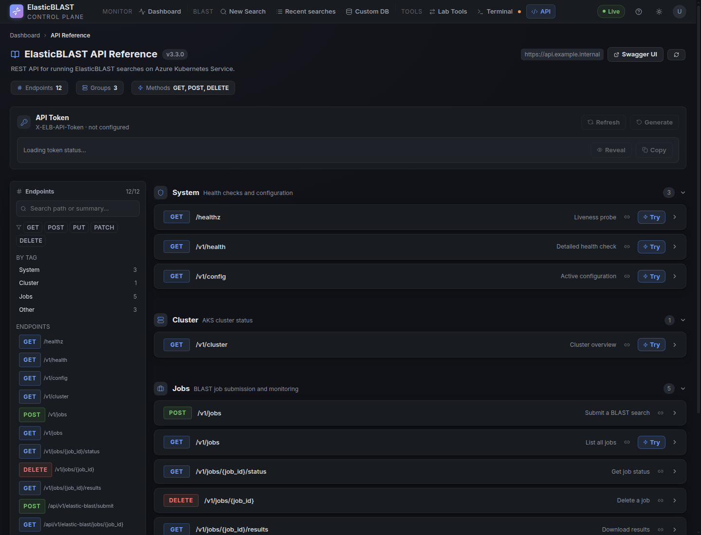

# API Reference

The API Reference page is for developers and platform maintainers who need to inspect or test the ElasticBLAST OpenAPI surface directly. Most researchers should keep using the Dashboard, New Search, Jobs, and Results pages for day-to-day work.



## When To Use It

Use the API Reference when you need to:

- Confirm which endpoints are available in the deployed OpenAPI service.
- Check request and response shapes before wiring an external workflow.
- Run a safe read-only `Try` request such as health, config, cluster status, or job listing.
- Open Swagger UI for a fuller OpenAPI explorer.

For submitting production BLAST searches, prefer the New Search page unless you are validating an integration path.

## Finding Endpoints

The left sidebar groups endpoints by method and tag. Use it to move quickly between system checks, cluster status, job submission, job monitoring, and result download routes.

The main panel shows each endpoint as a compact row with:

- HTTP method and path.
- A short operation summary.
- A `Try` action when the route can be exercised from the browser.
- A disclosure control for request and response details.

## Authentication

The API token panel shows whether the `X-ELB-API-Token` value is configured for the sibling OpenAPI service. External clients must send this token in the request header when calling the OpenAPI endpoint directly.

Use **Copy** in the token panel, then add the copied value as an HTTP header:

```http
X-ELB-API-Token: <copied-token>
```

For example:

```bash
curl -H "X-ELB-API-Token: <copied-token>" \
	"https://api.example.internal/v1/jobs"
```

The API Reference page's `Try` buttons use the same token internally. When you click `Try` from the browser, the dashboard forwards the request with the configured `X-ELB-API-Token`; you do not need to paste the token into the `Try` request manually.

Keep the token hidden in screenshots, demos, and shared notes. Regenerate it only when rotating integration credentials or recovering from a suspected exposure.

The dashboard itself still uses the signed-in Azure identity for access. The OpenAPI token is for calls forwarded to the AKS-hosted OpenAPI execution service.

## Safe Screenshot Practice

Before publishing API Reference screenshots, make sure the page does not expose subscription IDs, tenant-specific hostnames, raw API tokens, or private resource names. The screenshot above uses a masked example API endpoint and does not reveal a token value.
