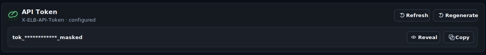
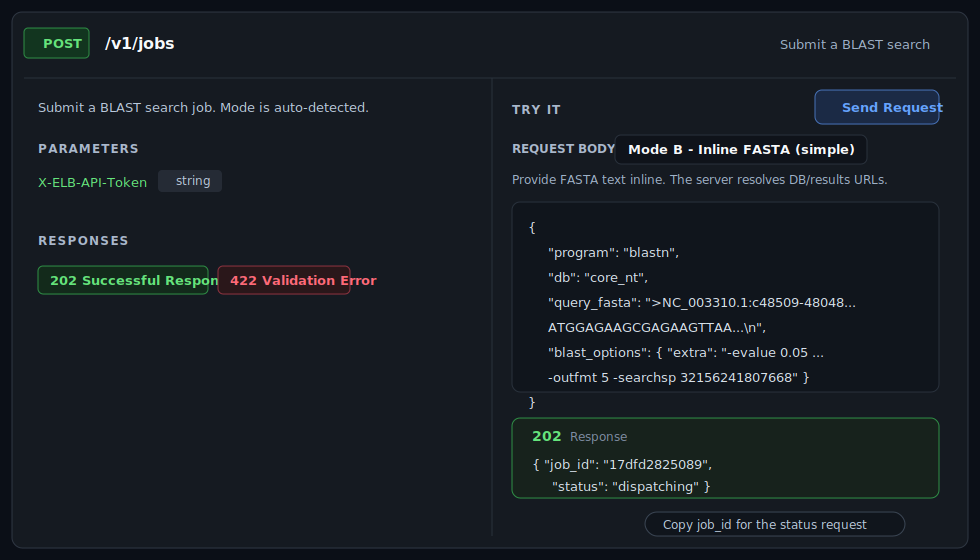
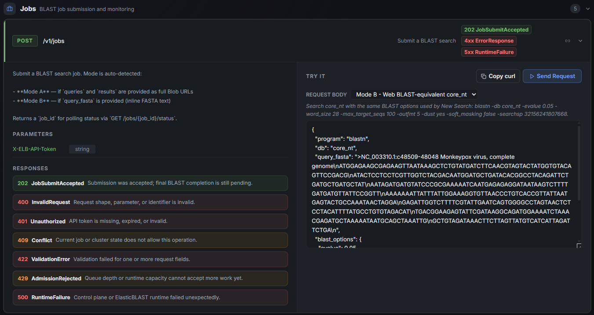
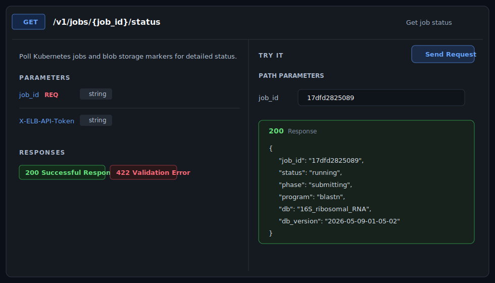

# API Reference

The API Reference page is for developers and platform maintainers who need to inspect, test, or integrate with the ElasticBLAST [OpenAPI](https://www.openapis.org/) surface directly. Most researchers should keep using the Dashboard, New Search, Jobs, and Results pages for day-to-day work.

!!! tip "Quick jumps"

    - **[When To Use It](#when-to-use-it)** · **[Setup checklist](#before-the-api-page-works)** · **[Auth + token](#authentication)**
    - **[Submit example](#submit-example-post-v1jobs)** · **[Status example](#status-example-get-v1jobsjob_idstatus)** · **[Result example](#result-example-get-v1jobsjob_idresults)**
    - **[External façade](#external-elasticblast-facade)** · **[Response contract](#response-contract)** · **[Error codes](#error-codes)** · **[Troubleshooting](#troubleshooting)**


## When To Use It

| Goal | Best surface |
| --- | --- |
| Run a normal BLAST search and inspect results | New Search, Recent searches, and Results |
| Check whether the OpenAPI service is available | API Reference |
| Generate or copy the API token | API Reference token panel |
| Test one endpoint from the browser | API Reference endpoint cards |
| Wire an external workflow or notebook | API Reference plus copied `curl` examples |
| Explore the raw OpenAPI schema | Swagger UI from the API Reference hero |

For submitting production BLAST searches, prefer the New Search page unless you are validating an integration path. API calls can create AKS workload, consume prepared databases, and produce result files just like the UI path.

## Before The API Page Works

The API Reference page is a live view of the OpenAPI execution service running on [Azure Kubernetes Service (AKS)](https://learn.microsoft.com/azure/aks/what-is-aks). If the page is empty or shows a setup state, check these prerequisites in order:

| Requirement | Where to fix it | What it unlocks |
| --- | --- | --- |
| Workspace config is saved | Dashboard setup wizard or resource settings | Subscription, resource group, [Azure Storage](https://learn.microsoft.com/azure/storage/common/storage-introduction), and [Azure Container Registry (ACR)](https://learn.microsoft.com/azure/container-registry/container-registry-intro) discovery |
| AKS is running | Dashboard Cluster Plane | Service discovery and job execution |
| `elb-openapi` image exists | Dashboard ACR card | OpenAPI pod deployment |
| OpenAPI service is deployed | API Reference deploy/update panel | `/openapi.json`, endpoint cards, and Swagger UI |
| API token is configured | API token panel | External `X-ELB-API-Token` calls and in-page `Try` requests |
| BLAST database is prepared and warm | Dashboard BLAST Databases and warmup controls | Successful, faster submit/result workflows |

If the page says **Configure Subscription and Workload RG**, go back to the Dashboard and complete workspace selection first. If it says **OpenAPI service not found**, build the `elb-openapi` image and deploy the service from the panel shown on this page.

## Page Tour

The API Reference page is organized as a compact work surface:

- Hero: shows API version, endpoint count, groups, HTTP methods, base URL, Swagger UI link, and refresh.
- Token panel: shows `X-ELB-API-Token` status and provides Generate, Regenerate, Reveal, and Copy actions.
- API response contract panel: explains the additive `operation`, `target`, `admission`, and `meta` fields used by asynchronous dashboard-backed responses.
- Sidebar: groups endpoints by tag and method so long specs stay navigable.
- Endpoint cards: show method, path, summary, path/query/body fields, request examples, response schema, `Try`, and copy-link controls.
- Response viewer: shows HTTP status, response JSON, and copy actions after a request runs.

The left sidebar groups endpoints by method and tag. Use it to move quickly between system checks, cluster status, job submission, job monitoring, and result download routes.

Expanded response cards show the response shape, next action, key fields, and a JSON example when the OpenAPI document publishes a schema or when the dashboard provides a curated example for high-value routes such as `GET /v1/cluster`. If a route does not publish a response schema, the card says so instead of showing an empty success panel.

## Safe Try Policy

The `Try` button is useful, but endpoint risk is not equal:

| Endpoint kind | Examples | Guidance |
| --- | --- | --- |
| Read-only | `GET /v1/health`, `GET /v1/config`, `GET /v1/cluster`, `GET /v1/jobs` | Safe to test while debugging readiness. |
| Job state read | `GET /v1/jobs/{job_id}/status`, `GET /api/v1/elastic-blast/jobs/{job_id}` | Safe when using the correct OpenAPI job id. |
| Data download | `GET /v1/jobs/{job_id}/results`, `GET /api/v1/elastic-blast/jobs/{job_id}/files/{file_id}` | Downloads can be large; choose `content=xml` or one file when possible. |
| Mutating or cost-bearing | `POST /v1/jobs`, `POST /api/v1/elastic-blast/submit`, OpenAPI deploy/update actions | Use only after AKS, database, sharding, and warmup readiness are understood. |
| Destructive | `DELETE /v1/jobs/{job_id}` | Avoid casual Try; this cancels/deletes tracked job state. |

## Authentication

The API token panel shows whether the `X-ELB-API-Token` value is configured for the sibling OpenAPI service. External clients must send this token in the request header when calling the OpenAPI endpoint directly.



Use **Copy** in the token panel, then add the copied value as an HTTP header:

```http
X-ELB-API-Token: <copied-token>
```

For example:

```bash
curl -H "X-ELB-API-Token: <copied-token>" \
	"https://api.example.internal/v1/jobs"
```

The API Reference page's `Try` buttons use the same token internally. When you click `Try` from the browser, the dashboard forwards the request with the configured `X-ELB-API-Token`; you do not need to paste the token into the `Try` request manually.

Keep the token hidden in screenshots, demos, and shared notes. Regenerate it only when rotating integration credentials or recovering from a suspected exposure.

The dashboard itself still uses the signed-in Azure identity for access. The OpenAPI token is for calls forwarded to the AKS-hosted OpenAPI execution service.

## Submit, Status, Results: Browser Flow

This is the shortest end-to-end API Reference path for a test job.

1. Confirm the Dashboard has a prepared database such as `core_nt`.
2. Confirm AKS is running and the selected database is warm or warming.
3. Open API Reference and confirm the token panel says `configured`.
4. Expand `POST /v1/jobs`, choose the inline FASTA example, and click **Send Request**.
5. Copy the returned short `job_id`.
6. Expand `GET /v1/jobs/{job_id}/status`, paste that OpenAPI job id, and poll until `status` becomes `completed`.
7. Expand `GET /v1/jobs/{job_id}/results`, paste the same job id, choose a `content` mode, and download the artifact.



## Submit Example: `POST /v1/jobs`

Use `POST /v1/jobs` when you want the core OpenAPI service contract. The inline FASTA mode is the easiest way to test because the server uploads the query and resolves Storage paths for you.



The endpoint card lists every response code the OpenAPI service can return for `POST /v1/jobs`. See [Error Codes](#error-codes) below for the full meaning of each `4xx` and `5xx` row, including the response body shape used for `500 RuntimeFailure`.

The example below uses the same `core_nt` monkeypox query shown in the result XML sample later in this guide. Keep the FASTA as a single JSON string with `\n` between FASTA lines.

```json
{
  "program": "blastn",
  "db": "core_nt",
  "query_fasta": ">NC_003310.1:c48509-48048 Monkeypox virus, complete genome\nATGGAGAAGCGAGAAGTTAATAAAGCTCTGTATGATCTTCAACGTAGTACTATGGTGTACAGTTCCGACG\nATACTCCTCCTCGTTGGTCTACGACAATGGATGCTGATACACGGCCTACAGATTCTGATGCTGATGCTAT\nAATAGATGATGTATCCCGCGAAAAATCAATGAGAGAGGATAATAAGTCTTTTGATGATGTTATTCCGGTT\nAAAAAAATTATTTATTGGAAAGGTGTTAACCCTGTCACCGTTATTAATGAGTACTGCCAAATAACTAGGA\nGAGATTGGTCTTTTCGTATTGAATCAGTGGGGCCTAGTAACTCTCCTACATTTTATGCCTGTGTAGACAT\nTGACGGAAGAGTATTCGATAAGGCAGATGGAAAATCTAAACGAGATGCTAAAAATAATGCAGCTAAATTG\nGCTGTAGATAAACTTCTTAGTTATGTCATCATTAGATTCTGA",
  "blast_options": {
    "evalue": 0.05,
    "max_target_seqs": 100,
    "outfmt": "5"
  },
  "priority": 50,
  "idempotency_key": "core-nt-monkeypox-smoke-001",
  "resource_profile": "standard"
}
```

That request maps to this BLAST command shape after the service resolves Storage paths:

```bash
blastn -db core_nt -evalue 0.05 -max_target_seqs 100 -outfmt 5 -query query.fasta -out results.out
```

!!! warning "Large databases need a large-memory node or sharding"

    `resource_profile` is free-form metadata only — it is echoed back on the job
    status but does **not** select a machine type or enable sharding. A
    full-database BLAST against a large database such as `core_nt` (~250 GB)
    needs a cluster node with enough memory (for example `Standard_E32s_v5`,
    256 GB). On a smaller node the submit fails its memory pre-flight with
    `BLAST database ... memory requirements exceed memory available on selected machine type`.
    To run `core_nt` on a smaller node, submit from the Dashboard with the
    **Sharded throughput** execution profile (it partitions the database so each
    shard fits node memory), recreate the cluster with a larger machine type, or
    choose a smaller database.

A successful submission returns `202` with a short OpenAPI `job_id`. Copy that value for polling; do not use the Dashboard UUID from a `/blast/jobs/<uuid>` page URL.

```json
{
  "job_id": "17dfd2825089",
  "status": "queued",
  "queue_position": 1,
  "submission_source": "external_api",
  "created_at": "2026-05-21T06:15:30.125000+00:00",
  "blast_version": "2.17.0+",
  "db_name": "core_nt",
  "db_version": "2026-05-20-00-00-00",
  "message": "Poll GET /v1/jobs/17dfd2825089/status for progress.",
  "status_url": "/v1/jobs/17dfd2825089/status"
}
```

For an external client, send the same request with the API token header:

```bash
curl -X POST "https://api.example.internal/v1/jobs" \
	-H "Content-Type: application/json" \
	-H "X-ELB-API-Token: <copied-token>" \
	--data-binary @- <<'JSON'
{
  "program": "blastn",
  "db": "core_nt",
  "query_fasta": ">NC_003310.1:c48509-48048 Monkeypox virus, complete genome\nATGGAGAAGCGAGAAGTTAATAAAGCTCTGTATGATCTTCAACGTAGTACTATGGTGTACAGTTCCGACG\nATACTCCTCCTCGTTGGTCTACGACAATGGATGCTGATACACGGCCTACAGATTCTGATGCTGATGCTAT\nAATAGATGATGTATCCCGCGAAAAATCAATGAGAGAGGATAATAAGTCTTTTGATGATGTTATTCCGGTT\nAAAAAAATTATTTATTGGAAAGGTGTTAACCCTGTCACCGTTATTAATGAGTACTGCCAAATAACTAGGA\nGAGATTGGTCTTTTCGTATTGAATCAGTGGGGCCTAGTAACTCTCCTACATTTTATGCCTGTGTAGACAT\nTGACGGAAGAGTATTCGATAAGGCAGATGGAAAATCTAAACGAGATGCTAAAAATAATGCAGCTAAATTG\nGCTGTAGATAAACTTCTTAGTTATGTCATCATTAGATTCTGA",
  "blast_options": {
    "evalue": 0.05,
    "max_target_seqs": 100,
    "outfmt": "5"
  },
  "priority": "normal",
  "idempotency_key": "core-nt-monkeypox-smoke-001",
  "resource_profile": "standard"
}
JSON
```

Use `idempotency_key` for automation so a retry returns the same job handle instead of creating duplicate BLAST work.

## Status Example: `GET /v1/jobs/{job_id}/status`

After copying the OpenAPI job id, expand `GET /v1/jobs/{job_id}/status`, paste the value into the **OpenAPI job id** path parameter, and click **Send Request**.



The response shows the current job lifecycle state. Early responses commonly move from `queued` to `dispatching`, `submitting`, and `running`. Completed jobs report `completed` and can be used with result routes.

```json
{
  "job_id": "17dfd2825089",
  "status": "running",
  "phase": "running",
  "queue_position": null,
  "created_at": "2026-05-21T06:15:30.125000+00:00",
  "updated_at": "2026-05-21T06:18:14.402000+00:00",
  "last_progress_at": "2026-05-21T06:18:14.402000+00:00",
  "program": "blastn",
  "db": "https://stexample.blob.core.windows.net/blast-db/core_nt/core_nt",
  "resource_profile": "standard",
  "error": "",
  "kubernetes": {
    "summary": {
      "total": 4,
      "succeeded": 1,
      "failed": 0,
      "active": 3
    }
  }
}
```

For an external client:

```bash
curl -H "X-ELB-API-Token: <copied-token>" \
	"https://api.example.internal/v1/jobs/17dfd2825089/status"
```

Interpret status values conservatively:

| Status | Meaning | Next action |
| --- | --- | --- |
| `queued` | Accepted but waiting behind active work | Poll after a short delay. |
| `dispatching` / `submitting` | The service is preparing ElasticBLAST execution | Keep polling status. |
| `running` | AKS BLAST jobs are active or finalizing | Watch `kubernetes.summary` and keep polling. |
| `completed` | Result files are available | Call a result endpoint. |
| `failed` / `cancelled` | Work stopped before success | Use `error` and operator logs for diagnosis. |

## Result Example: `GET /v1/jobs/{job_id}/results`

Use `GET /v1/jobs/{job_id}/results` after status is `completed`. The endpoint streams files through the OpenAPI service; it does not return Storage SAS URLs.

The `content` query parameter chooses the artifact shape:

| `content` | Response | Use when |
| --- | --- | --- |
| `full` | ZIP with every shard `*.out.gz` / `*.out` file | You need all raw shard outputs. |
| `merged` | ZIP containing `merged_results.out.gz` | You need the merged artifact but want to keep it compressed. |
| `xml` | Gunzipped `application/xml` from `merged_results.out.gz` | You want a direct BLAST XML response for parsing. |

Browser path:

1. Expand `GET /v1/jobs/{job_id}/results`.
2. Paste the OpenAPI job id.
3. Set `content` to `xml` for the smallest inspectable output, or `full` for all shard outputs.
4. Click **Send Request** and save the returned file.

External client examples:

```bash
# Direct XML for parsers
curl -L -H "X-ELB-API-Token: <copied-token>" \
	"https://api.example.internal/v1/jobs/17dfd2825089/results?content=xml" \
	-o blast-results-17dfd2825089.xml

# Merged compressed output in a ZIP
curl -L -H "X-ELB-API-Token: <copied-token>" \
	"https://api.example.internal/v1/jobs/17dfd2825089/results?content=merged" \
	-o blast-results-17dfd2825089-merged.zip

# Full shard archive
curl -L -H "X-ELB-API-Token: <copied-token>" \
	"https://api.example.internal/v1/jobs/17dfd2825089/results?content=full" \
	-o blast-results-17dfd2825089.zip
```

When `content=xml` succeeds, the response body is BLAST XML. The example below shows a shortened result body with one hit and the required closing tags:

```xml
<?xml version="1.0" encoding="utf-8"?>
<BlastOutput>
  <BlastOutput_program>blastn</BlastOutput_program>
  <BlastOutput_version>BLASTN 2.17.0+</BlastOutput_version>
  <BlastOutput_reference>Zheng Zhang, Scott Schwartz, Lukas Wagner, and Webb Miller (2000), "A greedy algorithm for aligning DNA sequences", J Comput Biol 2000; 7(1-2):203-14.</BlastOutput_reference>
  <BlastOutput_db>core_nt</BlastOutput_db>
  <BlastOutput_query-ID>Query_1</BlastOutput_query-ID>
  <BlastOutput_query-def>NC_003310.1:c48509-48048 Monkeypox virus, complete genome</BlastOutput_query-def>
  <BlastOutput_query-len>462</BlastOutput_query-len>
  <BlastOutput_param>
    <Parameters>
      <Parameters_expect>0.05</Parameters_expect>
      <Parameters_sc-match>1</Parameters_sc-match>
      <Parameters_sc-mismatch>-2</Parameters_sc-mismatch>
      <Parameters_gap-open>0</Parameters_gap-open>
      <Parameters_gap-extend>0</Parameters_gap-extend>
      <Parameters_filter>L;</Parameters_filter>
    </Parameters>
  </BlastOutput_param>
  <BlastOutput_iterations>
    <Iteration>
      <Iteration_iter-num>1</Iteration_iter-num>
      <Iteration_query-ID>Query_1</Iteration_query-ID>
      <Iteration_query-def>NC_003310.1:c48509-48048 Monkeypox virus, complete genome</Iteration_query-def>
      <Iteration_query-len>462</Iteration_query-len>
      <Iteration_hits>
        <Hit>
          <Hit_num>1</Hit_num>
          <Hit_id>gi|2967863541|emb|OZ254294.1|</Hit_id>
          <Hit_def>Monkeypox virus isolate 24MPX2634V genome assembly, complete genome: monopartite</Hit_def>
          <Hit_accession>OZ254294</Hit_accession>
          <Hit_len>196741</Hit_len>
          <Hit_hsps>
            <Hsp>
              <Hsp_num>1</Hsp_num>
              <Hsp_bit-score>828.419</Hsp_bit-score>
              <Hsp_score>448</Hsp_score>
              <Hsp_evalue>0</Hsp_evalue>
              <Hsp_query-from>1</Hsp_query-from>
              <Hsp_query-to>462</Hsp_query-to>
              <Hsp_hit-from>48487</Hsp_hit-from>
              <Hsp_hit-to>48026</Hsp_hit-to>
              <Hsp_query-frame>1</Hsp_query-frame>
              <Hsp_hit-frame>-1</Hsp_hit-frame>
              <Hsp_identity>462</Hsp_identity>
              <Hsp_positive>462</Hsp_positive>
              <Hsp_gaps>0</Hsp_gaps>
              <Hsp_align-len>462</Hsp_align-len>
              <Hsp_qseq>ATGGAGAAGCGAGAAGTTAATAAAGCTCTGTATGATCTTCAACGTAGTACTATGGTGTACAGTTCCGACGATACTCCTCCTCGTTGGTCTACGACAATGGATGCTGATACACGGCCTACAGATTCTGATGCTGATGCTATAATAGATGATGTATCCCGCGAAAAATCAATGAGAGAGGATAATAAGTCTTTTGATGATGTTATTCCGGTTAAAAAAATTATTTATTGGAAAGGTGTTAACCCTGTCACCGTTATTAATGAGTACTGCCAAATAACTAGGAGAGATTGGTCTTTTCGTATTGAATCAGTGGGGCCTAGTAACTCTCCTACATTTTATGCCTGTGTAGACATTGACGGAAGAGTATTCGATAAGGCAGATGGAAAATCTAAACGAGATGCTAAAAATAATGCAGCTAAATTGGCTGTAGATAAACTTCTTAGTTATGTCATCATTAGATTCTGA</Hsp_qseq>
              <Hsp_hseq>ATGGAGAAGCGAGAAGTTAATAAAGCTCTGTATGATCTTCAACGTAGTACTATGGTGTACAGTTCCGACGATACTCCTCCTCGTTGGTCTACGACAATGGATGCTGATACACGGCCTACAGATTCTGATGCTGATGCTATAATAGATGATGTATCCCGCGAAAAATCAATGAGAGAGGATAATAAGTCTTTTGATGATGTTATTCCGGTTAAAAAAATTATTTATTGGAAAGGTGTTAACCCTGTCACCGTTATTAATGAGTACTGCCAAATAACTAGGAGAGATTGGTCTTTTCGTATTGAATCAGTGGGGCCTAGTAACTCTCCTACATTTTATGCCTGTGTAGACATTGACGGAAGAGTATTCGATAAGGCAGATGGAAAATCTAAACGAGATGCTAAAAATAATGCAGCTAAATTGGCTGTAGATAAACTTCTTAGTTATGTCATCATTAGATTCTGA</Hsp_hseq>
              <Hsp_midline>||||||||||||||||||||||||||||||||||||||||||||||||||||||||||||||||||||||||||||||||||||||||||||||||||||||||||||||||||||||||||||||||||||||||||||||||||||||||||||||||||||||||||||||||||||||||||||||||||||||||||||||||||||||||||||||||||||||||||||||||||||||||||||||||||||||||||||||||||||||||||||||||||||||||||||||||||||||||||||||||||||||||||||||||||||||||||||||||||||||||||||||||||||||||||||||||||||||||||||||||||||||||||||||||||||||||||||||||||||||||||||||||||||||||||||||</Hsp_midline>
            </Hsp>
          </Hit_hsps>
        </Hit>
      </Iteration_hits>
      <Iteration_stat>
        <Statistics>
          <Statistics_db-num>1</Statistics_db-num>
          <Statistics_db-len>196741</Statistics_db-len>
        </Statistics>
      </Iteration_stat>
    </Iteration>
  </BlastOutput_iterations>
</BlastOutput>
```

If `content=merged` or `content=xml` returns `404`, the job may be complete but the merger has not published `merged_results.out.gz` yet, or the run used a result mode that only produced shard files. Try `content=full` to inspect available raw outputs.

## External ElasticBLAST Facade

The OpenAPI service also exposes a higher-level external integration contract under `/api/v1/elastic-blast`. Use it when a non-UI client wants stable submit, status, and file-download semantics without knowing the lower-level `/v1/jobs` result packaging modes.

### Submit

```bash
curl -X POST "https://api.example.internal/api/v1/elastic-blast/submit" \
	-H "Content-Type: application/json" \
	-H "X-ELB-API-Token: <copied-token>" \
	--data-binary @- <<'JSON'
{
  "program": "blastn",
  "db": "core_nt",
  "query_fasta": ">NC_003310.1:c48509-48048 Monkeypox virus, complete genome\nATGGAGAAGCGAGAAGTTAATAAAGCTCTGTATGATCTTCAACGTAGTACTATGGTGTACAGTTCCGACG\nATACTCCTCCTCGTTGGTCTACGACAATGGATGCTGATACACGGCCTACAGATTCTGATGCTGATGCTAT\nAATAGATGATGTATCCCGCGAAAAATCAATGAGAGAGGATAATAAGTCTTTTGATGATGTTATTCCGGTT\nAAAAAAATTATTTATTGGAAAGGTGTTAACCCTGTCACCGTTATTAATGAGTACTGCCAAATAACTAGGA\nGAGATTGGTCTTTTCGTATTGAATCAGTGGGGCCTAGTAACTCTCCTACATTTTATGCCTGTGTAGACAT\nTGACGGAAGAGTATTCGATAAGGCAGATGGAAAATCTAAACGAGATGCTAAAAATAATGCAGCTAAATTG\nGCTGTAGATAAACTTCTTAGTTATGTCATCATTAGATTCTGA",
  "options": {
    "outfmt": 5,
    "word_size": 28,
    "dust": true,
    "evalue": 0.05,
    "max_target_seqs": 100
  },
  "priority": "normal",
  "idempotency_key": "external-core-nt-monkeypox-001",
  "resource_profile": "standard",
  "external_correlation_id": "notebook-core-nt-run-42"
}
JSON
```

Example response:

```json
{
  "job_id": "17dfd2825089",
  "status": "queued",
  "created_at": "2026-05-21T06:15:30.125000+00:00",
  "db_name": "core_nt",
  "db_version": "2026-05-20-00-00-00",
  "submission_source": "external_api",
  "external_correlation_id": "notebook-core-nt-run-42",
  "queue_position": 1
}
```

### Status

```bash
curl -H "X-ELB-API-Token: <copied-token>" \
	"https://api.example.internal/api/v1/elastic-blast/jobs/17dfd2825089"
```

Completed response example:

```json
{
  "job_id": "17dfd2825089",
  "status": "success",
  "created_at": "2026-05-21T06:15:30.125000+00:00",
  "updated_at": "2026-05-21T06:24:10.817000+00:00",
  "completed_at": "2026-05-21T06:24:10.817000+00:00",
  "blast_version": "2.17.0+",
  "db_name": "core_nt",
  "db_version": "2026-05-20-00-00-00",
  "elapsed_seconds": 520,
  "queue_wait_seconds": 15,
  "run_seconds": 487,
  "execution": {
    "shard_count": 4,
    "shards_succeeded": 4,
    "shards_active": 0,
    "shards_failed": 0
  },
  "result": {
    "files": [
      {
        "file_id": "result-001",
        "filename": "batch_001.xml.gz",
        "format": "blast_xml",
        "size_bytes": 18420
      }
    ]
  }
}
```

### Download A Result File

Use the `file_id` returned under `result.files[]`:

```bash
curl -L -H "X-ELB-API-Token: <copied-token>" \
	"https://api.example.internal/api/v1/elastic-blast/jobs/17dfd2825089/files/result-001" \
	-o batch_001.xml.gz
```

The file route returns `409` until the external job status is `success`. It streams the result file through the OpenAPI service and does not expose a browser-facing SAS URL.

## Response Contract

The OpenAPI service and the dashboard wrapper both treat BLAST submission as asynchronous work. A `2xx` response means the request was accepted or a current state was returned; it does not mean the BLAST run has completed successfully.

Dashboard API responses keep their existing top-level fields and add four compatibility fields for new clients:

- `operation`: control-plane work to poll, including `operation_id`, `state`, `poll_after_seconds`, and links such as `/api/operations/{operation_id}`.
- `target`: the BLAST job resource identity. It separates the Dashboard UUID from the short OpenAPI `job_id`.
- `admission`: the point-in-time queue and capacity decision. Treat this as a snapshot, not a completion guarantee.
- `meta`: request correlation data such as `request_id` for logs and support.

Use the right identifier for the endpoint you are calling. The status endpoint is named `GET /v1/jobs/{job_id}/status` for OpenAPI compatibility, but that path parameter means **OpenAPI job id**, not Dashboard job UUID.

| Identifier | Example | Use with |
| --- | --- | --- |
| OpenAPI job id | `17dfd2825089` | `/v1/jobs/{job_id}/status`, `/v1/jobs/{job_id}/results`, `/api/v1/elastic-blast/jobs/{job_id}` |
| Dashboard job UUID | `bb61858a-8cb6-4590-a2e3-c144662851f7` | `/blast/jobs/<uuid>` and `/api/blast/jobs/{uuid}` |

The API Reference page labels the status path parameter as **OpenAPI job id** and shows a `job_id = OpenAPI id` hint next to job-scoped status routes.

```json
{
  "job_id": "bb61858a-8cb6-4590-a2e3-c144662851f7",
  "job_id_kind": "dashboard",
  "status": "queued",
  "operation_status_url": "/api/operations/task-123",
  "operation": {
    "operation_id": "task-123",
    "operation_type": "blast.submit",
    "state": "queued",
    "poll_after_seconds": 5
  },
  "target": {
    "resource_type": "blast_job",
    "job_id_kind": "dashboard",
    "dashboard_job_id": "bb61858a-8cb6-4590-a2e3-c144662851f7",
    "openapi_job_id": "17dfd2825089"
  },
  "admission": {
    "decision": "accepted",
    "reason": "queued_for_blast_execution"
  },
  "meta": {
    "request_id": "01HX7V8W4D9Y3F9PZQ2QK4N7RA"
  }
}
```

The in-page response contract panel uses the same model:

| Field | Meaning | Client behavior |
| --- | --- | --- |
| `operation` | Control-plane work accepted by the dashboard | Poll `operation.links.self` or the documented status URL until terminal. |
| `target` | BLAST resource identity | Use the OpenAPI id for OpenAPI routes and Dashboard UUID for Dashboard routes. |
| `admission` | Queue/capacity decision at accept time | Treat as a snapshot; it is not a completion guarantee. |
| `meta` | Correlation and support metadata | Keep `request_id` in client logs. |

## Error Codes

The OpenAPI service and the dashboard backend both return JSON error bodies. Every error response shares the same envelope so clients can route on `status` and surface `detail` directly to users:

```json
{
  "detail": "<human-readable message or field-level error list>",
  "request_id": "<correlation id, when emitted by the dashboard>"
}
```

`422 ValidationError` returns `detail` as a list of per-field objects produced by FastAPI's request validator. All other codes use a string `detail`. The dashboard backend stamps `request_id` on every response (success and error) — quote that value in support tickets so the request can be correlated to logs.

| Code | Label | When it is returned | Response body | Client action |
| --- | --- | --- | --- | --- |
| `202` | `JobSubmitAccepted` | `POST /v1/jobs` or `POST /api/v1/elastic-blast/submit` accepted the request and queued BLAST work. Completion is still pending. | Submit payload with `job_id`, `status`, and `status_url`. | Poll the status endpoint until terminal (`completed` / `success` / `failed` / `cancelled`). |
| `400` | `InvalidRequest` | Request shape, query parameter, or identifier is malformed. Typical causes: Dashboard UUID used where an OpenAPI job id is required, unknown `content` value on result routes, missing required path parameter. | `{"detail": "<message>"}` | Fix the identifier or parameter and resubmit. For status routes, use the short id returned by `POST /v1/jobs`. |
| `401` | `Unauthorized` | `X-ELB-API-Token` is missing, expired, or does not match the configured OpenAPI token secret. Dashboard MSAL routes use this when the bearer token cannot be validated. | `{"detail": "<reason>"}` | Copy the current token from the API token panel (or refresh the MSAL session for dashboard routes) and retry. Regenerate the token only when rotating credentials. |
| `404` | `NotFound` | Job id, file id, or result artifact does not exist. Result routes also return `404` when the job is `completed` but the merger has not published `merged_results.out.gz` yet. | `{"detail": "<message>"}` | Confirm the id is the OpenAPI short id. For result routes, poll status until terminal and try `content=full` if `content=xml` is missing. |
| `409` | `Conflict` | Current job, cluster, or shard state does not allow this operation. Examples: external file download requested before status reached `success`; submit attempted while a conflicting job with the same `idempotency_key` is already running. | `{"detail": "<reason>"}` | Poll status until the precondition is met, or supply a fresh `idempotency_key`. |
| `422` | `ValidationError` | One or more request fields failed schema validation (FastAPI request body / query parsing). | `{"detail": [{"loc": [...], "msg": "...", "type": "..."}, ...]}` | Inspect each `loc` path, correct the offending field, and resubmit. |
| `429` | `AdmissionRejected` | Queue depth or runtime capacity cannot accept more work yet. A `Retry-After` header is included when the service can suggest a wait window. | `{"detail": "<reason>"}` plus optional `Retry-After`. | Wait for `Retry-After` (or the dashboard's poll hint) and reduce concurrent submissions before retrying. |
| `500` | `RuntimeFailure` (server error) | Unexpected failure inside the control plane or ElasticBLAST runtime — for example an Azure SDK call raised, the OpenAPI pod crashed, or a Celery task hit an unhandled exception. **The response body includes the failure detail** so clients and operators can see what went wrong without reading server logs. | `{"detail": "<error message>", "request_id": "<rid>"}` — for handled cases the route supplies a focused message (e.g. `failed to create ACR: <sanitised reason>`); the catch-all handler returns `"internal server error"` with the same `request_id`. | Capture `request_id`, the endpoint path, the job id (if any), and the `detail` text. If `detail` already names the cause (quota, permission, missing resource), act on it; otherwise share the bundle with the operator. Retry only after a transient cause is confirmed. |
| `502` / `503` / `504` | Upstream / availability errors | Dashboard could not reach the OpenAPI pod, AKS API server, or Storage; or the pod is restarting. | `{"detail": "<reason>"}` plus optional `Retry-After`. | Check Dashboard cluster card and OpenAPI deployment status; retry after the upstream recovers. |

!!! note "500 always carries content"

    A `500` response is never an empty body — the dashboard's global exception handler always returns JSON with `detail` and `request_id`, and the OpenAPI service's `RuntimeFailure` row contains the failure message. If your client treats `5xx` as "no detail available", update it to log the `detail` and `request_id` from the response body.

## Troubleshooting

This table is symptom-first; for the JSON shape and meaning of each status code see [Error Codes](#error-codes) above.

| Symptom | Likely cause | What to do |
| --- | --- | --- |
| `Configure Subscription and Workload RG` | No saved workspace config | Re-run Dashboard setup wizard. |
| OpenAPI service not found | AKS service or deployment is missing | Build `elb-openapi`, then use the deploy panel on this page. |
| Cluster stopped | AKS exists but is not running | Start the cluster from Cluster Plane before using API Reference. |
| Token not configured | OpenAPI token secret has not been generated | Use Generate in the API token panel. |
| `401` on `Try` or external call | Missing or wrong `X-ELB-API-Token` | Copy the current token and retry. |
| `400` on status | Dashboard UUID used where OpenAPI job id is required | Use the short id returned by `POST /v1/jobs`. |
| `404` on results | Job not complete, wrong job id, or merged result not published | Poll status; try `content=full` if `content=xml` is missing. |
| `409` on external file route | External job has not reached `success` | Poll `/api/v1/elastic-blast/jobs/{job_id}` first. |
| `429` | Queue/capacity rejected work | Honour `Retry-After` or the dashboard poll window and reduce concurrent submissions. |
| `5xx` with empty-looking body | Client logged only the status code | Read the response body — `500` always includes a `detail` string and `request_id`. Capture both for support. |

## Safe Screenshot Practice

Before publishing API Reference screenshots, make sure the page does not expose subscription IDs, tenant-specific hostnames, raw API tokens, or private resource names. The screenshot above uses a masked example API endpoint and does not reveal a token value.
