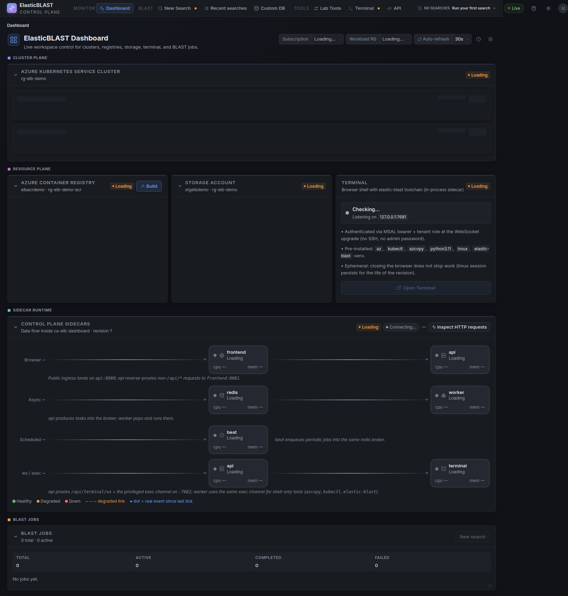
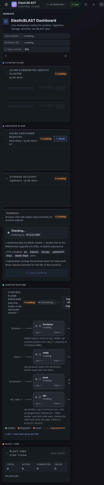

# Dashboard

The Dashboard is the operator landing page for the ElasticBLAST control plane. It summarizes platform readiness across AKS, Storage, ACR, sidecars, terminal access, and recent BLAST activity.

## Overview

Use the Dashboard to check whether the workspace is ready for BLAST work before opening a new search. The top controls select the active subscription and workload resource group, and the page groups readiness by operational plane:

- Cluster Plane shows AKS cluster readiness and node pool signals.
- Resource Plane shows ACR images, Storage network posture, BLAST database readiness, and terminal availability.
- Sidecar Runtime shows the local Container Apps sidecar flow used by the control plane.
- BLAST Jobs shows current search activity and recent job counts.

Cards can show healthy, degraded, loading, or unavailable states. A degraded state usually means the dashboard can still render but the backing Azure resource, sidecar, or API call needs attention before a workflow should continue.

## Mobile Layout

On narrow screens, the same cards stack vertically so the readiness flow stays readable. Use the navigation menu at the top left to move between Dashboard, New Search, Recent searches, Custom DB, Lab Tools, Terminal, and API views.

## Screenshot Targets

Screenshots for this page are defined by these manifest targets:

- `dashboard-overview-desktop`
- `dashboard-mobile`

Refresh these images after visible dashboard layout changes, navigation changes, or readiness-state presentation changes.