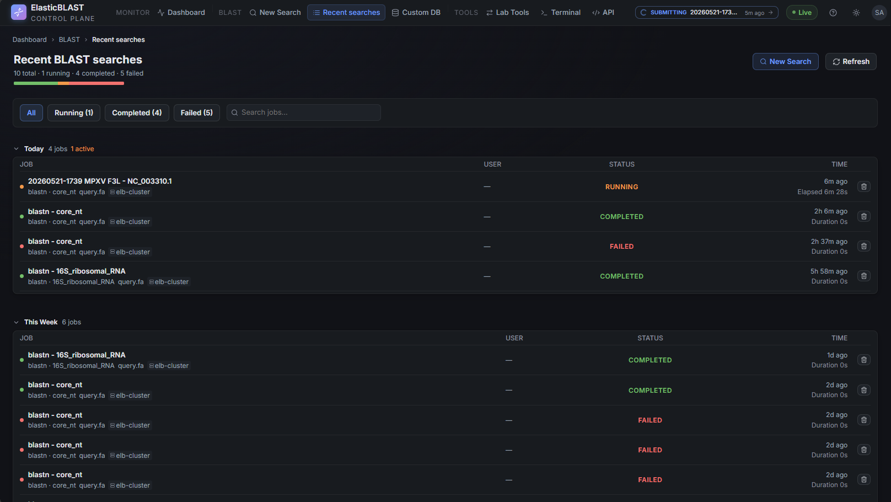

# Recent Searches

The Recent searches page lists every BLAST job the workspace knows about, grouped by date, and provides the path into result detail, log analytics, and cleanup. It is reached from the sidebar **Recent searches** entry or any `/blast/jobs` link.

## Overview

The page header shows the totals — `<n> total · <n> running · <n> completed · <n> failed` — with a coloured progress strip that summarises completion versus running and failed states across all visible jobs. Two actions sit on the right:

- **New Search** — opens [New Search](new-search.md). Disabled when no AKS cluster is running, with a tooltip explaining whether the cluster needs to be started or provisioned.
- **Refresh** — re-fetches the job list. The list also refreshes automatically while running jobs are present.

Below the header is the **filter bar**: status chips (`all`, `running`, `completed`, `failed`) with live counts and a search box that filters by job title, database, query name, or job id. The filter and search apply on the client; the URL is not changed.

## Job Rows

Each job row shows, at a glance:

| Element | What it means |
| --- | --- |
| Coloured status dot | Phase colour — running (warning), completed (success), failed (danger), other (muted). |
| Job title | Falls back to the job id when no title was supplied at submit. Click to open [Results](results.md). |
| `program · database` line | The BLAST program and the search set chosen on the New Search page. |
| Query name | Shown only when it differs from the title. |
| Elapsed / Duration | For running jobs, live elapsed time. For completed jobs, total wall-clock duration. |
| Cluster name | The AKS workload cluster the job ran on. |
| Owner UPN | Short form (left of `@`); helps distinguish jobs in shared workspaces. |
| Child-job badge | For split runs, shows `<n> child jobs`. |
| Trash icon | Opens a confirmation dialog and deletes the job; cleanup runs in the background. |

The rows are grouped into date sections — **Today**, **Yesterday**, **This week**, **Earlier**. The Earlier section is collapsed by default so long histories stay readable.

## States You Will See

| List state | When it appears | What to do |
| --- | --- | --- |
| Loading skeleton | Initial fetch or after **Refresh**. | Wait — usually under a second on a healthy workspace. |
| `No jobs yet` | Workspace has never submitted a BLAST job, or the visible cluster has none. | Click **New Search**, or check the Dashboard if the cluster looks stopped. |
| `No matching jobs` | Filter + search returned an empty set. | Clear the filter chips or the search box. |
| Degraded notice | The backend returned partial data (for example, the storage probe failed). | Open the Dashboard to see which resource is degraded; the list still shows what it could load. |

Failed jobs are not hidden — they are kept in the list with a `failed` status so the team can triage. Use the trash icon only when the run is no longer interesting; deletion also removes the associated job state and result files.

## Opening A Job

Click the job title to open `/blast/jobs/<jobId>`. From there:

- The job header shows program, database, query metadata, the cluster, and timing.
- The **Descriptions / Graphic Summary / Alignments / Taxonomy** tabs render the BLAST output.
- The **Files** tab lists raw result blobs in Storage (download streams through the API; the browser never sees a SAS URL).
- The **Run details** tab shows the execution timeline and per-pod status.
- The header's **Download all** combo, **Duplicate**, and **Edit search** actions hand off to the right places.

See [Results](results.md) for the full tour of the detail page.

## Screenshot Targets

Screenshots for this page are defined by this manifest target:

- `jobs-desktop`

Capture the page with at least one completed and one running demo job so the status mix is visible. Avoid publishing a screenshot showing private query names or full UPNs.
