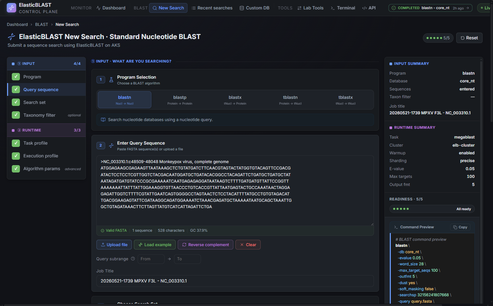
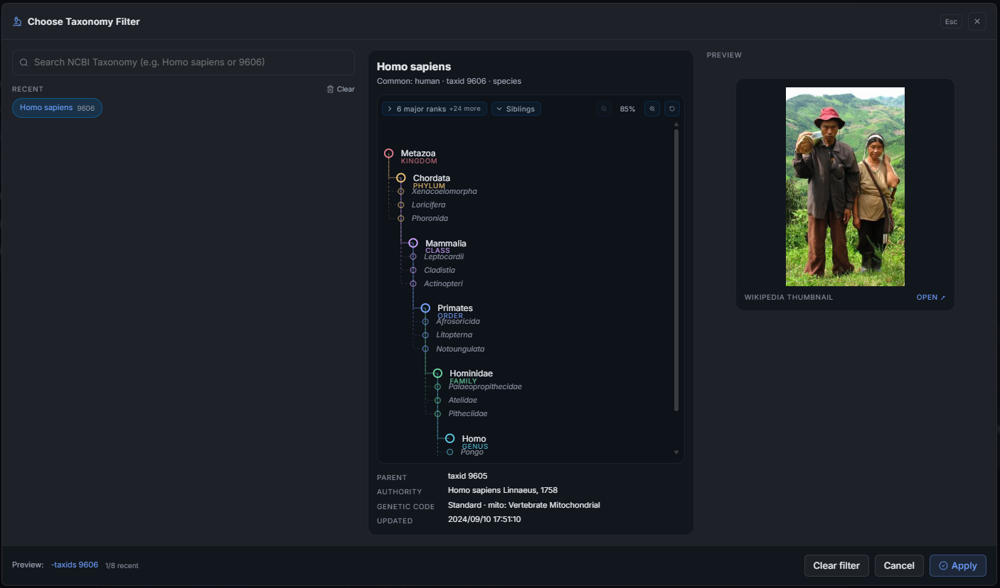

# New Search

New Search is where a researcher defines a BLAST run, chooses the database and compute shape, reviews preflight checks, and submits the job. The page is opened from the **New Search** button on the Dashboard or from any `/blast/submit` link.

## Overview

The page is a single guided form. A vertical **stepper** on the left tracks readiness, the centre column holds the configuration sections, and a sticky **submit footer** at the bottom shows the live command preview, draft auto-save state, and the submit / preflight actions.

The stepper is organised in two groups:

| Group | Step | Required? |
| --- | --- | --- |
| Input | 1. Program | Required |
| Input | 2. Query sequence | Required |
| Input | 3. Search set (database) | Required |
| Input | 4. Taxonomy filter | Optional |
| Runtime | 5. Task profile | Required (defaulted) |
| Runtime | 6. Execution profile (cluster, sharding, warmup) | Required |
| Runtime | 7. Algorithm parameters | Optional |

A step shows a check mark when its current value passes validation. The footer's **Submit** button is enabled only when every required step is ready.

## Choose A Program And Query

The **Program** step selects the BLAST program (`blastn`, `blastp`, `blastx`, `tblastn`, `tblastx`). The choice determines which databases are valid, which algorithm parameters apply, and which task profiles are available.

The **Query sequence** step accepts FASTA input three ways:

- Paste sequences directly into the text area.
- Drag a `.fa`, `.fasta`, `.fna`, or `.faa` file onto the upload zone.
- Pick a curated example via **Load example sequence** — useful when capturing screenshots or smoke-testing a new cluster.

Validation runs on every change. The status line under the editor shows the parsed record count, total length, and any syntax errors. Submission is blocked until the FASTA parses cleanly.

## Pick A Search Set (Database)

The **Search set** step lists databases prepared on the workspace Storage account, scoped to the BLAST program you selected. Each row shows the short name (for example `core_nt`, `nt`, `nr`, `16S_ribosomal_RNA`), the total size, file count, the latest version timestamp, and whether the database is **already warmed** on the active AKS cluster.

If a database you expect is missing or is not yet prepared, open **BLAST Databases** from the Dashboard and use **Get** to copy it from NCBI first. The prepare flow also records the shard layout that the execution profile needs.

For a first smoke test, prefer a small database such as `16S_ribosomal_RNA`. For real research workloads, choose `core_nt`, `nt`, or `nr` only after confirming the cluster has enough node memory and the database is warm.

## Taxonomy Filter (Optional)

Use **Taxonomy filter** to restrict the search by NCBI taxonomy ID. Type a tax id (for example `10239` for viruses) and choose between **Inclusive** (limit to the taxon) and **Exclusive** (exclude the taxon). The lineage tree on the right confirms what will be searched. Recently used taxa are surfaced as quick-pick chips so you can reuse the same filter across runs.

## Runtime: Task, Execution, And Parameters

The **Task profile** step picks an optimisation preset for the chosen program. For `blastn` the presets follow the NCBI Web BLAST defaults (`megablast`, `dc-megablast`, `blastn`). Each preset pre-fills word size, low-complexity filtering, and gap settings.

The **Execution profile** step is where you choose the AKS cluster, sharding mode, and warmup behaviour:

| Control | What it controls |
| --- | --- |
| AKS cluster | Which workload cluster runs the BLAST pods. Stopped or missing clusters disable submit. |
| Sharding mode | `off`, `approximate`, or `exact` — must match what the prepared database supports. Unavailable modes are greyed out with an explanation. |
| Auto warm | Asks the worker to pre-warm the database on the chosen cluster before BLAST starts. Already-warm databases skip this step. |

The **Algorithm parameters** step exposes the underlying BLAST flags — `evalue`, `max_target_seqs`, `outfmt`, `word_size`, and the low-complexity filter. Leave the defaults unless you have a specific reason to change them; the command preview will reflect every change immediately.

For a per-field reference of every option on this page — UI field, OpenAPI body field, BLAST+ CLI flag, default, allowed values, and validation rules — see [BLAST Options Reference](blast-options.md).

## Preflight And Command Preview

The submit footer always shows the **command preview** built from the current form. The preview mirrors the `blastn` / `blastp` / ... invocation that ElasticBLAST will run on the cluster, with Storage paths still placeholdered. Use it as a fast sanity check before submitting.

Click **Run preflight** to ask the API to validate the request against the live workspace: AKS readiness, database availability, sharding compatibility, warmup feasibility, and ACR image presence. Preflight results are shown inline above the preview; any failure tells you which Dashboard control to fix.

The footer also shows the draft auto-save status (for example `Saved 12s ago`) so you can close the tab and come back without losing your configuration.

## Submit

When every required step is green and preflight is clean, click **Submit search**. A confirmation toast appears and the browser navigates to `/blast/jobs/<jobId>` so you can watch the run on the [Results](results.md) page.

If you need to start from a previous run, open that job's header on the Results page and use **Duplicate** or **Edit search** — the Submit page picks up the snapshot on next mount and you only adjust the parts that changed.

## Screenshot Targets

Screenshots for this page are defined by this manifest target:

- `new-search-desktop`

Capture the page with a valid draft (program selected, FASTA pasted, database chosen, cluster selected) so the command preview is meaningful. Avoid showing private FASTA content, subscription identifiers, or cluster names in published images.
