# Observability

The Observability page is for operators and on-call developers who need to answer "is the control plane healthy right now?" and "where did that error come from?" The dashboard ships with a built-in answer for the **right now** part; for **deeper history, distributed traces, and exception search** you turn on [Azure Application Insights](https://learn.microsoft.com/azure/azure-monitor/app/app-insights-overview) from Settings.

!!! tip "Quick jumps"

    - **[When to use which surface](#when-to-use-which-surface)** · **[Sidecar runtime band](#sidecar-runtime-band)** · **[HTTP request inspector](#http-request-inspector)**
    - **[Enable Application Insights](#enable-application-insights)** · **[What lands in App Insights](#what-lands-in-application-insights)** · **[Application Map](#application-map)** · **[Investigate Performance](#investigate-performance)** · **[Investigate Failures](#investigate-failures)** · **[End-to-end transaction details](#end-to-end-transaction-details)**
    - **[AKS Cluster Monitoring (optional)](#aks-cluster-monitoring-optional)** · **[ElasticBLAST execution dashboard](#elasticblast-execution-dashboard-grafana)** · **[Troubleshooting](#troubleshooting)**

## When To Use Which Surface

| Question | Best surface |
| --- | --- |
| Is every sidecar healthy right now? | Sidecar runtime band on the Dashboard |
| Which sidecar is hot on CPU or memory? | Sidecar runtime band (per-sidecar `cpu %` / `mem` cells) |
| Did the browser see HTTP errors in the last few minutes? | HTTP request inspector (top-right **Inspect HTTP requests** button) |
| Which component or dependency is unhealthy across the whole topology? | Application Insights → Application map |
| Why did `/api/blast/jobs` return `500` ten minutes ago? | Application Insights (request + dependency + exception view) |
| Show me a Celery worker exception trace | Application Insights (exception telemetry from the worker sidecar) |
| Correlate a `request_id` across api / worker / beat | Application Insights (filter on `customDimensions.request_id`) |
| Long-term latency or error-rate trend | Application Insights (workbooks, KQL queries) |
| Pod / node / kubelet metrics from inside the AKS cluster | AKS → Monitor (free tabs) — [enable Managed Grafana](#aks-cluster-monitoring-optional) only for a learning tour or an active in-cluster incident |

The built-in surfaces are **always on** and require no setup — they are the first thing to check when something feels slow. Application Insights is **opt-in** and is the right tool when the in-page window is too short or you need cross-sidecar correlation.

## Built-In Dashboard Surfaces

These two cards are part of the Dashboard. They use the dashboard's own `/api/monitor/sidecars` and `/api/monitor/sidecar-requests` endpoints and do not depend on App Insights at all — they keep working even when telemetry export is turned off.

### Sidecar Runtime Band

The Sidecar runtime band sits at the bottom of the Dashboard and visualises the six-sidecar layout (`frontend`, `api`, `worker`, `beat`, `redis`, `terminal`) inside the running `ca-elb-dashboard` revision. Each tile shows the sidecar's health dot, current CPU %, and memory usage; the connecting lines describe the in-revision data flow (browser → `api`, `api` → `redis` → `worker`, `beat` → `redis`, `api` ↔ `terminal`).

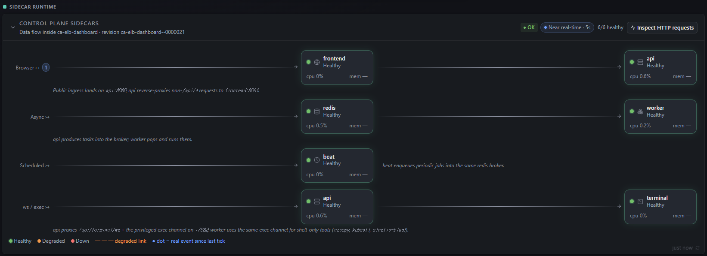

Key things to read off the card:

| Cell | Meaning | What "bad" looks like |
| --- | --- | --- |
| Health dot (green / amber / red) | Per-sidecar liveness rolled up from the in-revision Redis health channel | A red `down` dot or a degraded link styled as a dashed line between two tiles |
| `cpu %` | Recent CPU sampled by the cgroup reporter every few seconds | A sidecar pegged near 100 % for sustained windows |
| `mem` | Resident memory against the sidecar's request | Approaching the configured limit (visible in Settings → Sizing) |
| `Near real-time · 5s` chip | Refresh cadence | "Stale" or no refresh means the dashboard cannot reach the monitor endpoint |
| `Inspect HTTP requests` button | Opens the HTTP request inspector overlay | — |

The band intentionally hides on narrow screens because it is admin-only telemetry. Open the dashboard on a larger viewport (or rotate a tablet) to see it.

### HTTP Request Inspector

Clicking **Inspect HTTP requests** opens a modal that streams the most recent requests served by the `api` sidecar. The top chart plots per-request latency on a log scale with the SLA line (default 2,000 ms) overlaid; the table below lists each request with method, path, caller, status, duration, and response size.

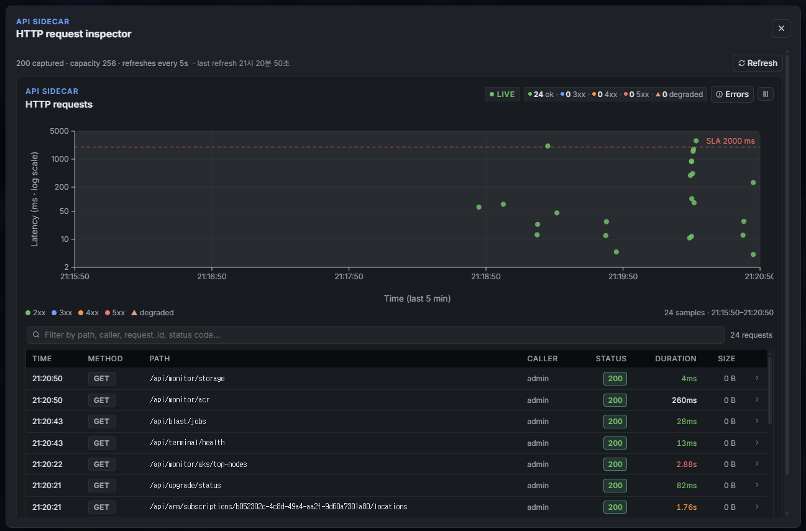

Use it for:

- **Quick error triage** — the **Errors** chip in the top-right filters the table to non-2xx rows so you can see what failed in the last few minutes without leaving the dashboard.
- **SLA bursts** — points above the dashed `SLA 2000 ms` line are the first signal that a Storage or AKS call is slowing down.
- **Per-path investigation** — the filter box accepts substrings of path, caller, `request_id`, or status code. Combine with the chip totals (`24 ok · 0 3xx · 0 4xx · 0 5xx · 0 degraded`) to confirm an absence of errors before closing a ticket.

The inspector keeps the most recent **256 requests** in memory and refreshes every 5 seconds. For anything older than that buffer — or for requests served by other sidecars (`worker`, `beat`) — switch to Application Insights.

## Enable Application Insights

The built-in surfaces stop helping when you need history. **Settings → Telemetry** wires the Container App and the SPA to an Application Insights component so traces, requests, dependencies, and exceptions persist for the configured retention window.

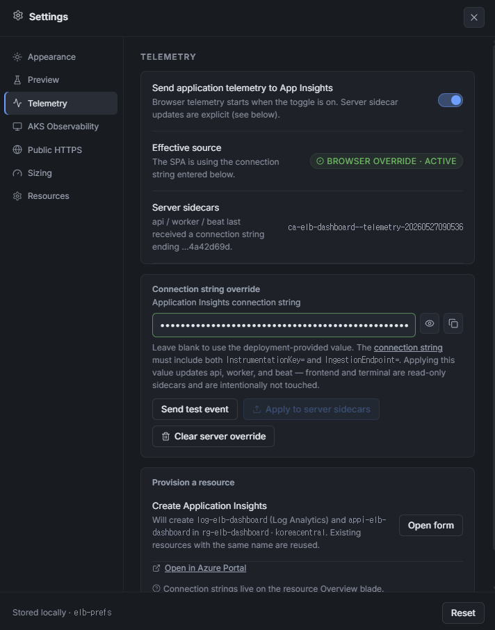

The panel is split into three rows:

1. **Send application telemetry to App Insights** — a master toggle. When on, the SPA initialises the [Application Insights JavaScript SDK](https://learn.microsoft.com/azure/azure-monitor/app/javascript) and starts sending page views, dependencies, and unhandled errors from the browser. The toggle is per-browser (stored in `localStorage["elb-prefs"]`) so individual operators can turn telemetry on for themselves without affecting other users.
2. **Effective source** + **Server sidecars** — read-only status lines. **Effective source** tells you whether the SPA is using the deployment-provided connection string or a manual override entered in this panel. **Server sidecars** shows the last connection string suffix that was applied to `api` / `worker` / `beat` and the revision name that landed it (e.g. `ca-elb-dashboard--telemetry-…`).
3. **Connection string override** — the manual entry field. Pasting a full Application Insights [connection string](https://learn.microsoft.com/azure/azure-monitor/app/sdk-connection-string) (it must contain both `InstrumentationKey=` and `IngestionEndpoint=`) takes precedence over the deployment value. The `frontend` and `terminal` sidecars are intentionally read-only and are never patched from this panel.

Three buttons drive server-side actions on the override row:

- **Send test event** — fires a single `telemetry-test` event from the browser using the SPA-side connection string. Look it up in App Insights → **Logs** with `customEvents | where name == "telemetry-test"` to confirm ingestion.
- **Apply to server sidecars** — enqueues a Celery task (`api.tasks.azure.apply_app_insights_to_deployment`) that patches the `APPLICATIONINSIGHTS_CONNECTION_STRING` environment variable on the `api`, `worker`, and `beat` sidecars. Container Apps performs a revision swap; the new revision is named with a `--telemetry-…` suffix that matches the **Server sidecars** status line.
- **Clear server override** — reverses the apply by removing the override env var. The sidecars fall back to whatever the deployment template provided originally (typically the App Insights component created by `azd up`).

### Provision A New Resource

If there is no Application Insights component yet — or you want a dedicated one separate from the `azd`-created default — use the **Provision a resource** card at the bottom of the panel. **Open form** asks for the subscription, resource group, name, region, and Log Analytics workspace, and **Create Application Insights** enqueues `api.tasks.azure.provision_app_insights` which creates both `appi-elb-dashboard` and its backing `log-elb-dashboard` workspace under `rg-elb-dashboard` / `koreacentral` by default. Existing resources with the same name are reused, so this is safe to re-run.

Once the task completes, the new connection string appears in the override field and you can immediately **Apply to server sidecars**. The **Open in Azure Portal** link opens the component's Overview blade, where the connection string also lives.

## What Lands In Application Insights

Once both the SPA toggle and the server-side override are on, you will see telemetry from every sidecar that runs Python (`api`, `worker`, `beat`) plus browser telemetry from the SPA. The most useful tables to query in App Insights → **Logs** are:

| Table | Source | Useful for |
| --- | --- | --- |
| `requests` | `api` sidecar (FastAPI requests) and SPA `fetch()` calls | Latency P50/P95/P99, error rate, slowest paths |
| `dependencies` | Outbound calls from `api` / `worker` (Azure SDK, Storage, AKS, ACR) | Which Azure API call slowed down a request |
| `exceptions` | Unhandled exceptions from any Python sidecar | Stack traces correlated to the failing `request_id` |
| `customEvents` | `telemetry-test` from the panel and any `track_event` calls | Confirming ingestion and feature-flag instrumentation |
| `traces` | Structured log records (`LOGGER.info / warning / error`) | Reading the full request lifecycle — auth, route, task enqueue, task result |

Every record carries `customDimensions.request_id` (set by the dashboard's request middleware), `cloud_RoleName` (the sidecar name), and `operation_Id` for distributed-trace correlation. The fastest way to debug a 500 you saw in the HTTP request inspector is:

```kusto
union requests, exceptions, dependencies, traces
| where customDimensions.request_id == "<rid-from-response-body>"
| order by timestamp asc
```

That returns a single timeline that crosses sidecars (api → worker, api → Azure SDK, etc.) and includes the matching exception stack if any.

### Feature Lifecycle Events

Beyond raw requests and traces, the worker and beat sidecars emit a **feature event** at the terminal transition of every long-running operation — warmup, cluster provisioning, BLAST database preparation, and BLAST job submission. Each event is a single record on the `api.events` logger that carries the [customEvent name attribute](https://learn.microsoft.com/azure/azure-monitor/app/opentelemetry-add-modify), so it lands in **both** the `traces` table (as a structured log line) and the `customEvents` table (as a named event). When telemetry is disabled the same call is a local log line only — there is **zero Azure ingestion cost**, and no code path forces it on.

Query the catalogue from App Insights → **Logs**:

```kusto
customEvents
| where name in ("warmup", "cluster_provision", "prepare_db", "blast")
| project timestamp, name, tostring(customDimensions.event_status),
          tostring(customDimensions.phase), tostring(customDimensions.job_id),
          tostring(customDimensions.error_code)
| order by timestamp desc
```

Only **terminal** transitions emit an event (`event_status` ∈ `completed` / `failed` / `cancelled`), so a per-tick progress update never floods the table. The `phase` dimension carries the fine-grained machine string the dashboard switches on, and `error_code` is populated on failures.

| `customEvents.name` | Emitted by | `event_status` values | Key `phase` values (machine strings) |
| --- | --- | --- | --- |
| `warmup` | `api.tasks.storage.warmup_database` | `completed`, `failed` | `completed`, `failed` (preceded by non-terminal `starting` → `downloading` → `sharding` → `planning_node_warmup`) |
| `cluster_provision` | `api.tasks.azure.provision` | `completed`, `failed` | `completed`, `failed` (5-step pipeline: `creating_cluster` → `ensuring_resource_group` → `arm_create_or_update` → `ensuring_rbac` → `completed`) |
| `prepare_db` | `api.tasks.storage.prepare_db_via_aks` | `completed`, `failed` | `completed` (promoted) / `partial` (some shards failed); `error_code` + `outcome` dimensions explain partials |
| `blast` | `api.tasks.blast.*` (submit / cancel / poll) | `completed`, `failed`, `cancelled` | `completed`, `submit_failed`, `cancelled`, `submit_retryable_failure`, `config_invalid`, `terminal_unavailable`, `status_unavailable` |

To see only failures across every feature in one query:

```kusto
customEvents
| where tostring(customDimensions.event_status) == "failed"
| project timestamp, name, tostring(customDimensions.phase),
          tostring(customDimensions.error_code), tostring(customDimensions.job_id)
| order by timestamp desc
```

!!! note "Non-terminal phases live in `jobstate`, not customEvents"

    The intermediate phases (`downloading`, `arm_create_or_update`, `submitting`, …) are written to the Azure Table `jobstate` row and the per-job history that the dashboard renders live. They also reach App Insights as `traces` whenever the surrounding code logs them, but only the terminal transition is promoted to a named `customEvent`. Use the `jobstate`-backed dashboard job timeline for live progress and `customEvents` for "did this operation ultimately succeed or fail, and why?".

### Application Map

**Application Insights → Investigate → Application map** is the topology view. It draws every cloud role the dashboard emits telemetry from (the SPA, plus every Python sidecar) and every outbound dependency they call, with the average latency and call count on each edge. It is the right place to start when an alert fires and you do not yet know *which* component is unhealthy.

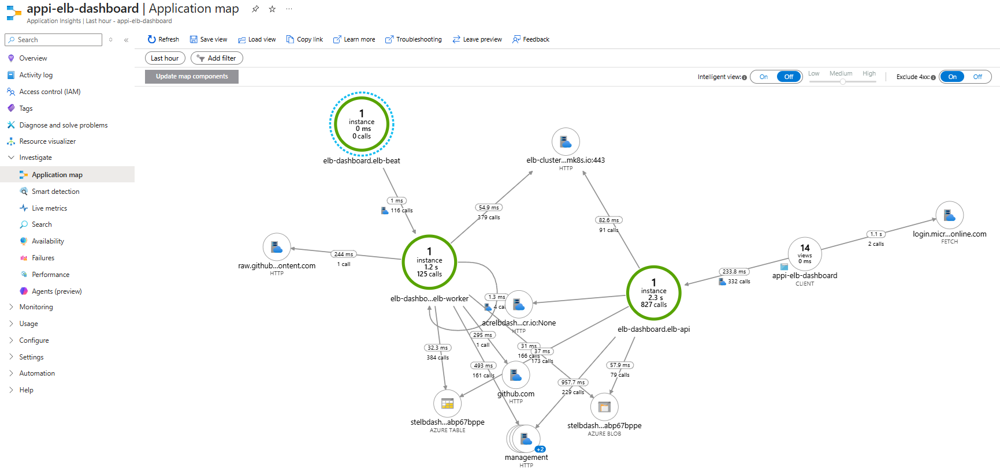

What the nodes and edges mean:

- **`appi-elb-dashboard` (CLIENT)** — the SPA itself. Edges leaving this node are browser-side `fetch()` calls. The arrow to `login.micr…online.com` is MSAL sign-in; the arrow into `elb-dashboard.elb-api` is every API call from the SPA.
- **`elb-dashboard.elb-api` / `elb-worker` / `elb-beat`** — one node per Python sidecar (`cloud_RoleName` value). The count inside the circle is the number of distinct instances seen in the window — for the bundled Container App it should always be **`1`** because the revision is pinned at `minReplicas: 1, maxReplicas: 1`. A count greater than 1 means there was a revision rollover during the window.
- **Outbound HTTP nodes** — `management.azure.com` (ARM), `acrelbdash…cr.io` (ACR), `elb-cluster…mk8s.io:443` (AKS API server), `github.com` / `raw.github…content.com` (manifest and rendering downloads).
- **Storage nodes** — `stelbdash…abp67bppe` appears twice, once as **AZURE TABLE** (job/audit state) and once as **AZURE BLOB** (queries / results / database files). They are the same Storage account; App Insights groups by data-plane API.
- **Edge labels** — the headline number is the average call duration for the window; the `N calls` line is the total. Wide / thick edges represent the busiest paths.

Reading the map:

1. Use the **Time range** in the top-left (`Last hour` by default) to scope the picture.
2. **Intelligent view** automatically highlights nodes with anomalous latency or failure rates against the baseline. Leave it **On** when triaging an unknown problem; turn it **Off** when you want to compare absolute numbers.
3. The **Low / Medium / High** slider next to it controls the sensitivity of the highlighting.
4. **Exclude 4xx** is **On** by default. Keep it on for capacity / latency work (a 404 is not the api sidecar's fault), turn it off when investigating a misuse of the API.
5. Click any node to open a side panel with that role's `requests`, `dependencies`, and `exceptions` counts, plus shortcuts to **Investigate failures**, **Investigate performance**, and **Go to details**. Click an edge to filter the same panel to just the calls that traverse that edge.

The map is also a good sanity check after a deploy: if a dependency you expected (for example a new ACR or a new AKS service IP) does not appear, the new code never made a request to it during the window — usually a sign the feature flag is off or the workload is not exercising the new path.

### Investigate Performance

For a guided latency view that does not require KQL, open **Application Insights → Investigate → Performance**. The blade is the right starting point when the HTTP request inspector chip says "p95 climbing" or a researcher reports that a specific endpoint feels slow.

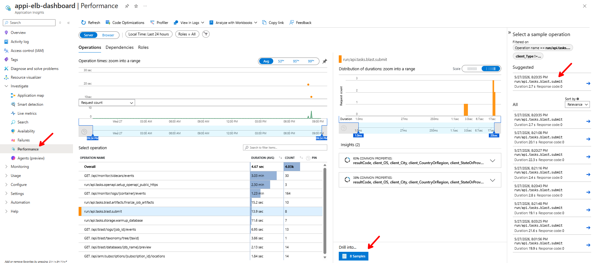

How to read the blade:

1. **Roles toggle (top-left, `Server` / `Browser`)** — Server shows Python sidecars (`elb-dashboard.elb-api`, `elb-dashboard.elb-worker`); Browser shows the SPA. Keep it on **Server** for backend latency analysis.
2. **Time range** — defaults to the last 24 hours. Narrow it to the window the researcher mentioned so the distribution histogram is meaningful.
3. **Operation times** chart — average duration plotted over the window. Bumps that line up with a deploy are worth investigating.
4. **Select operation** table — every distinct operation seen in the window, sorted by average duration and total count. Long-running Celery tasks appear with their full Python path (e.g. `run/api.tasks.blast.submit`, `run/api.tasks.openapi.setup_openapi_public_https`), and FastAPI routes appear with the templated path (e.g. `GET /api/monitor/sidecars/events`).
5. **Distribution of durations** (middle) — histogram of every invocation of the operation selected on the left. The `Avg / 50ᵗʰ / 95ᵗʰ / 99ᵗʰ` toggle at the top of the operations chart switches the headline number; the histogram itself is unfiltered. Brush a range on the histogram to zoom into one duration bucket.
6. **Suggested / All samples sidebar (right)** — concrete invocations whose duration falls inside the brushed range. Each row shows the timestamp, duration, and response code.
7. **Drill into → N Samples** — opens the end-to-end transaction view for the sampled invocation. This is the path that takes you from "this operation is slow on average" to "this specific request was slow, here's the dependency that took 12 seconds."

Workflow tip: when triaging a slow operation, switch the operations chart to **95ᵗʰ** percentile, find the tallest bar in the operations table, brush the right-hand spike in the duration histogram, and click **N Samples** in the bottom-right. That sequence narrows hours of telemetry to the handful of slow runs that actually need a trace read.

### Investigate Failures

**Application Insights → Investigate → Failures** is the matching view for errors. Open it when the HTTP request inspector shows a non-zero `5xx` chip or the dashboard surfaces a "task failed" toast.

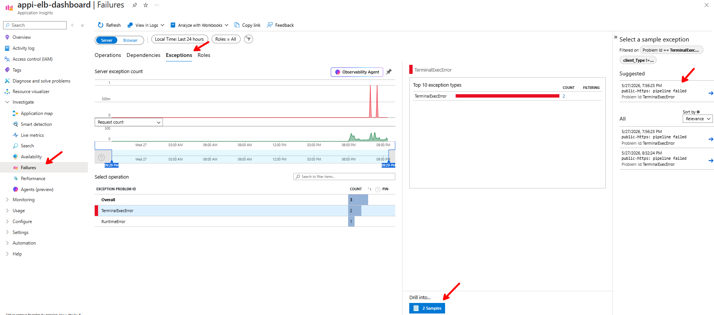

The layout mirrors Performance but with three tabs at the top — **Operations**, **Dependencies**, and **Exceptions** — each scoped to the same time range and `Server` / `Browser` toggle:

| Tab | Counts what | Best for |
| --- | --- | --- |
| **Operations** | Requests / operations that ended in a `4xx` or `5xx` | Finding the endpoint or Celery task that is failing most often |
| **Dependencies** | Outbound calls (Azure SDK, Storage, AKS, GitHub raw) that returned a failure | Confirming a failure is upstream (ARM throttling, ACR push 429, GitHub raw 404) rather than in our code |
| **Exceptions** | Unhandled Python exceptions grouped by **Exception Problem Id** | Mapping a recurring symptom to a specific exception class + call site |

On the **Exceptions** tab the `Server exception count` chart spikes at every failure, the **Top 10 exception types** chart on the right ranks the noisiest exception classes, and the **Select operation** table groups by Problem Id (e.g. `TerminalExecError`, `RuntimeError`). The **Suggested / All samples** sidebar on the far right lists concrete occurrences with timestamp and short message.

Clicking **Drill into → N Samples** (or any sample row) opens the end-to-end transaction details for that exception:

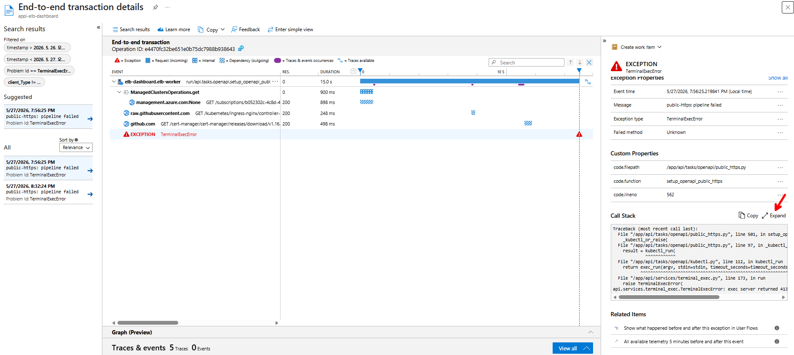

Key panels in this view:

- **End-to-end timeline (left)** — every span the operation produced, in order: the originating request (`run/api.tasks.openapi.setup_openapi_public_https`), each outbound dependency (`management.azure.com`, `raw.githubusercontent.com`, `github.com`), and the failure marker (red triangle) at the moment the exception was raised. Hovering a bar shows the exact duration and HTTP status.
- **Exception properties (right)** — `Event time`, `Message` (e.g. `public-https: pipeline failed`), `Exception type` (e.g. `TerminalExecError`), and `Failed method`. Use the `Message` value as the first thing to grep for in a triage thread.
- **Custom properties** — the dashboard tags every exception with `code.filepath`, `code.function`, and `code.lineno`. That triple takes you straight to the line in the repository without having to read the traceback (here: `api/tasks/openapi/public_https.py::setup_openapi_public_https:562`).
- **Call Stack** — the full Python traceback. Click **Expand** to see the whole frame chain. Operators should copy this into the support ticket as-is; it is the highest-signal artifact for a developer.
- **Related Items** — "Show what happened before and after" and "All available telemetry 5 minutes before and after" pivot to the same operation's neighbours, which is how you confirm whether the failure was isolated or part of a wider incident (a Storage outage, an AKS API throttle, etc.).

Together, **Application map** answers "what depends on what right now", **Performance** explains "what is slow", **Failures → Exceptions → end-to-end** explains "what crashed and where in the code", and the built-in HTTP request inspector tells you whether the problem is happening *right now*.

### End-To-End Transaction Details

Both **Performance** and **Failures** drill into the same **End-to-end transaction details** view, and it is also reachable from **Search results** when you start from a raw query. The view fans out a single operation into every span it produced — the originating request at the top, then nested dependencies in call order.

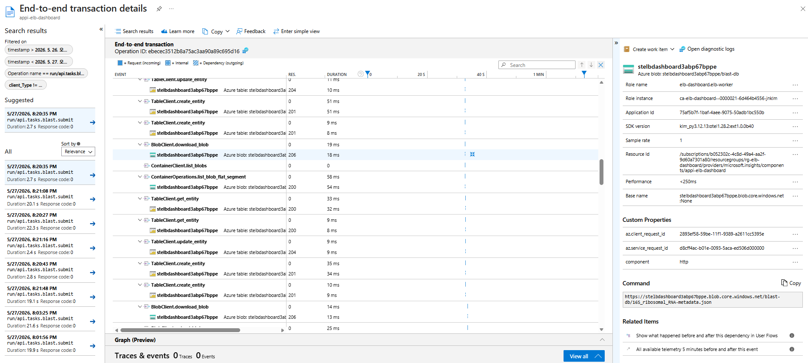

What to read off the screen:

- **Search results panel (far left)** — every other operation that matched the same filter (`Operation name == run/api.tasks.blast.submit` here). Use it to compare a slow run against a fast neighbour.
- **Timeline (centre)** — each span as `<client>.<method>` with its `Res(ponse)` code and `Duration`. The header colour chips at the top (`Request`, `Internal`, `Dependency`) match the row glyphs so you can scan for outbound storage calls vs in-process work.
- **Properties panel (top-right)** — `Role name` (`elb-dashboard.elb-worker` for Celery tasks), `Role instance` (the Container App replica name, e.g. `ca-elb-dashboard--0000021-…`), `SDK version`, and `Resource Id` of the App Insights component itself. Sample rate stays at `1` for the dashboard's default config (no sampling).
- **Custom Properties** — per-span attributes the Azure SDK emits: `az.client_request_id` matches the `x-ms-client-request-id` header sent to Azure, `az.service_request_id` is the value Azure echoed back, and `component=http` flags the span as an outbound HTTP dependency. Quote `az.service_request_id` when opening an Azure support ticket — it lets the service team find the exact request on their side.
- **Command panel (lower-right)** — the actual URL the SDK called, including the container path. For Storage spans this is the most useful field because it shows *which* blob (here, `blast-db/16S_ribosomal_RNA-metadata.json`) the operation touched, which a stack trace alone never reveals.
- **Related Items (bottom-right)** — "Show what happened before and after" pivots to the same role-instance's neighbour requests in a 5-minute window, which is how you confirm whether a slow span was part of a wider stall or an isolated blip.

## AKS Cluster Monitoring (Optional)

Application Insights covers the **control plane** sidecars (the dashboard's own api / worker / beat). It does **not** show you what is happening *inside* the AKS workload cluster — BLAST pod node placement, kubelet CPU pressure, container restart loops, kube-system events. Azure provides a separate monitoring surface for that on the AKS resource itself: **AKS → Monitor**, which can be one click away from a real-time [Managed Grafana](https://learn.microsoft.com/azure/managed-grafana/overview) dashboard when the cluster is wired up with [Azure Monitor managed service for Prometheus](https://learn.microsoft.com/azure/azure-monitor/essentials/prometheus-metrics-overview) and [Container insights](https://learn.microsoft.com/azure/azure-monitor/containers/container-insights-overview).

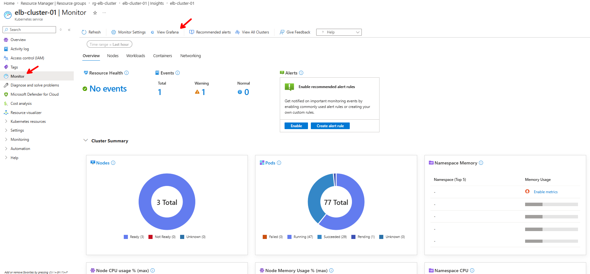

The built-in **Monitor** blade is free and always available. Its five tabs (**Overview / Nodes / Workloads / Containers / Networking**) read directly from the AKS API server, so they show the same node count, pod phases (Running / Succeeded / Pending / Failed), and namespace breakdowns the dashboard's Cluster Plane reads. Use this blade when you want a quick "is the cluster generally healthy" answer without leaving the portal.

Clicking **View Grafana** at the top of the blade jumps to the Managed Grafana workspace pre-loaded with the official Microsoft Kubernetes dashboards. From there you can drill into per-pod CPU/memory, container log streams, kubelet metrics, and per-node disk/network — **in real time, at second-level granularity**, which neither the dashboard nor App Insights provides for cluster-internal workloads.

!!! warning "Not enabled by default — and we do not recommend turning it on for routine work"

    Enabling the full Managed Grafana + Prometheus + Container insights stack adds **a Managed Grafana workspace, an Azure Monitor workspace for Prometheus, and a Log Analytics workspace ingestion stream**, each of which is billed independently. For the bundled control plane the BLAST cluster runs in short bursts, so most of that telemetry sits idle and the meter keeps ticking. Day-to-day operations are well served by **Cluster Plane on the dashboard** plus **App Insights** for the api/worker sidecars — leave the AKS Monitor → Grafana pipeline **off** unless you are actively debugging an in-cluster performance issue that the dashboard's K8s metrics cannot answer.

!!! tip "Worth enabling once for learning"

    That said, we strongly recommend enabling it **once** on a non-production cluster (or temporarily on the test cluster) just to explore what is available. Click **Monitor Settings** at the top of the blade, accept the recommended Container insights + Prometheus + Grafana defaults, wait a few minutes for data to flow, and then walk through the Microsoft-curated dashboards in Grafana (Kubernetes / Compute Resources / Node, Kubernetes / Compute Resources / Pod, Kubernetes / Networking / Cluster). It is the fastest way to understand which metrics the AKS control plane already exposes for free — and when an incident later forces you to enable it for real, you will already know which dashboards to open.

    After the learning tour, **delete the Grafana workspace and turn off Container insights** to stop ongoing ingestion charges. Re-enabling it later is a one-click operation on the same Monitor blade.

!!! warning "Container Insights does not survive a cluster delete + recreate"

    The `omsagent` (Container Insights) addon lives on the AKS cluster resource, so **deleting and recreating the cluster drops it** — the new cluster comes up with cluster observability off even if the previous one had it enabled. The dashboard's own [Application Insights](https://learn.microsoft.com/azure/azure-monitor/app/app-insights-overview) telemetry (api / worker / beat) is unaffected because it lives on the Container App, not the cluster.

    To restore it after a recreate, re-enable Container Insights from **Settings → AKS Observability** (one click; it re-applies the `omsagent` addon pointing at the platform Log Analytics workspace).

    Operators who want this to happen automatically for **dashboard-provisioned** clusters can set `AKS_PROVISION_ENABLE_CONTAINER_INSIGHTS=true` on the api / worker sidecars. The provision task then re-enables Container Insights on every cluster it creates, using the `LOG_ANALYTICS_WORKSPACE_RESOURCE_ID` injected by the deployment. It is **off by default**: the addon ships node/pod telemetry to the same `log-elb-dashboard` workspace the control plane uses, which is capped at 1 GiB/day, so a busy BLAST cluster could exhaust the quota and starve the dashboard's own traces. Opt in only after sizing the workspace (or pointing the addon at a dedicated one). Clusters created by `elastic-blast submit` directly are outside this path and still need the manual re-enable.

### ElasticBLAST Execution Dashboard (Grafana)

If you do choose to enable Managed Grafana — either during the learning tour above or for a real in-cluster incident — the repo ships a curated dashboard JSON tailored to the ElasticBLAST workload at [grafana/dashboards/elb-blast-execution.json](https://github.com/dotnetpower/elb-dashboard/blob/main/grafana/dashboards/elb-blast-execution.json). It is a single Prometheus-backed view of a running BLAST job and is designed for the **Azure Monitor managed Prometheus default scrape set (cAdvisor + node-exporter + kubelet)** — no kube-state-metrics required.

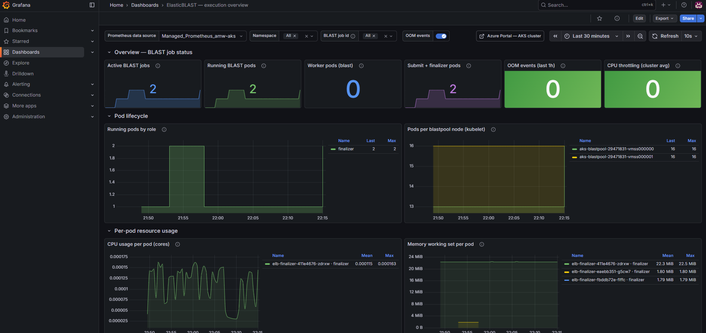

Three rows at a glance:

- **Overview — BLAST job status** — counters for Active BLAST jobs, Running BLAST pods, Worker / Submit / Finalizer pods, OOM events in the last hour, and cluster-average CPU throttling.
- **Pod lifecycle** — `Running pods by role` (timeline of how many `blast` / `submit` / `finalizer` pods exist) and `Pods per blastpool node` (kubelet bin-packing per VMSS instance).
- **Per-pod resource usage** — `CPU usage per pod (cores)` and `Memory working set per pod (MiB)` so you can spot a single BLAST shard hitting its limit.

Scroll past those three rows for the **Node pool — blastpool** section, which is the same dashboard's real-time node-level view. Use it when the per-pod row above says "everything looks fine" but the cluster as a whole still feels slow — that usually means the VMSS instance underneath is saturated.

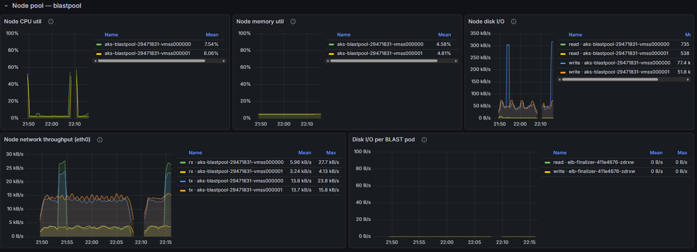

Five panels per VMSS instance (`aks-blastpool-<id>-vmss000000`, `vmss000001`, …):

- **Node CPU util** and **Node memory util** — node-wide percentages, with the per-instance legend on the right. Idle BLAST nodes typically sit in the single-digit % range (the screenshot shows 7.5 % / 6 % CPU and ~4.7 % memory); a sustained spike on one instance while others stay flat is the classic "one shard pinned to one node" pattern.
- **Node disk I/O** — read / write bytes per second per node. Bursts in the hundreds of kB/s are normal during BLAST DB warmup (vmtouch / shard copy); a flatline while pods are supposed to be running is a warning sign.
- **Node network throughput (eth0)** — `rx` / `tx` per node. Useful for spotting Storage download bottlenecks (high `rx` during warmup) and result upload tails (high `tx` after the BLAST run).
- **Disk I/O per BLAST pod** — same series as above but scoped to the `elb-*` pods, so you can attribute disk traffic to a specific finalizer / submitter / blast shard.

Together, the **pod-level** rows (execution overview) and the **node-level** row (`Node pool — blastpool`) give you a live, second-resolution picture of where capacity is going while a BLAST job runs.

Filters at the top of the dashboard (`Prometheus data source`, `Namespace`, `BLAST job id`, `OOM events` toggle) scope every panel — pod-level and node-level — to one job or one namespace at a time, and the **Azure Portal — AKS cluster** chip pivots back to the Monitor blade. Both views ship inside the single `elb-blast-execution.json` definition and import with one command:

```bash
az grafana dashboard create \
  --name <managed-grafana-name> \
  --resource-group <managed-grafana-rg> \
  --definition @grafana/dashboards/elb-blast-execution.json \
  --overwrite true
```

The same warnings from the section above apply — this dashboard is a *consumer* of the Managed Grafana + Prometheus pipeline, not a replacement for it, so the ingestion meter still ticks while it is connected.

## Troubleshooting

| Symptom | Likely cause | What to do |
| --- | --- | --- |
| Sidecar runtime band is missing | Narrow viewport — the band is hidden below a width threshold | Use a wider window or rotate the device. |
| All sidecar tiles say `unknown` and the chip shows "Stale" | The browser cannot reach `/api/monitor/sidecars` (auth, network, or the api sidecar is down) | Check the browser network tab; verify the api sidecar is healthy in Azure Portal → Container Apps → Revisions. |
| HTTP request inspector is empty | The api sidecar recently restarted and the in-memory ring buffer is empty | Generate a request (refresh the dashboard) and watch it appear. For historical data, switch to App Insights. |
| Telemetry toggle is on but nothing appears in App Insights | Connection string is invalid, or the SPA is on an older bundle that has not picked up the override | Confirm the **Effective source** line says `BROWSER OVERRIDE · ACTIVE`, click **Send test event**, then search `customEvents` in App Insights. |
| **Apply to server sidecars** succeeded but server logs still missing | Connection string was applied to a revision that has not finished rolling out | Wait for the new `ca-elb-dashboard--telemetry-…` revision to become active in the Container Apps revisions blade. |
| **Provision a resource** fails with a permission error | The dashboard's user-assigned managed identity lacks `Contributor` on the target resource group | Grant the missing role at the resource-group scope and retry. |

## Safe Screenshot Practice

Before publishing screenshots from this page, scrub:

- **Connection strings** — the override field masks the value by default; use the eye icon only when typing and never screenshot the revealed state.
- **Tenant-specific request URLs** — subscription IDs, ACR names, and storage account names commonly appear in the HTTP request inspector table. Crop or redact the path column when sharing externally.
- **Caller column** — the `CALLER` cell shows the signed-in user's principal. Replace with a generic name in shared screenshots.

The screenshots embedded above already follow these rules: the request paths show only generic monitor / blast routes, the caller is `admin`, and the connection string is masked.
