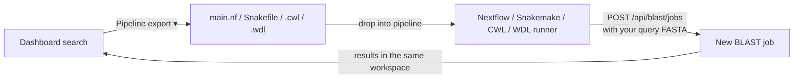

# Pipeline Export

Publication-grade research rarely lives in a single web UI — it lives in
[Nextflow](https://www.nextflow.io/), [Snakemake](https://snakemake.readthedocs.io/),
[CWL](https://www.commonwl.org/), or [WDL](https://openwdl.org/) pipelines on a lab's HPC
or in nf-core / Galaxy. **Pipeline Export** lets you take any BLAST search you ran from the
dashboard and drop it into one of those pipelines, re-submitting the *exact* same parameter
set through the dashboard API — without falling back to the `elastic-blast` CLI on a personal
machine.

## What you get

On a job's result page, the header carries a **Pipeline export ▾** menu with four formats:

| Format | Downloaded file | Run with |
| --- | --- | --- |
| Nextflow | `main.nf` | `nextflow run main.nf --query my.fasta` |
| Snakemake | `Snakefile` | `snakemake -j1 --config query=my.fasta` |
| CWL | `blast_submit.cwl` | any CWL runner (e.g. `cwltool blast_submit.cwl --query my.fasta`) |
| WDL | `blast_submit.wdl` | any WDL runner (e.g. Cromwell / miniwdl) |

Each module pins the source job's **program**, **database**, and **algorithm options**
(E-value, word size, max_target_seqs, low-complexity filtering, taxonomy include/exclude,
sharding mode, effective search space, resource profile). The **query FASTA is the only
runtime input** — so the same module can be re-run against any number of query files.

## How it works

The generated module makes a single authenticated `POST /api/blast/jobs` call with the
pinned body, merging in the query FASTA you supply at run time. Nothing else is embedded:

* **No storage URL and no SAS token** are written into the file — the data plane stays
  private behind the dashboard API.
* **No bearer token** is baked in. The module reads credentials from the environment at run
  time (see below), so the file is safe to commit to a pipeline repo.
* **`idempotency_key` is deliberately not pinned** — every pipeline run is a fresh job, not a
  replay of the source job.

### Runtime environment

The module reads three environment variables when it runs:

| Variable | Meaning |
| --- | --- |
| `ELB_BASE_URL` | Base URL of your dashboard, e.g. `https://ca-elb-dashboard.<region>.azurecontainerapps.io` |
| `ELB_TOKEN` | A valid bearer token for the dashboard API (the same identity the browser uses) |
| `ELB_QUERY_FASTA` | Path to the query FASTA (the runners above set this for you from `--query`) |

```bash
export ELB_BASE_URL="https://ca-elb-dashboard.<region>.azurecontainerapps.io"
export ELB_TOKEN="<your dashboard bearer token>"
nextflow run main.nf --query my.fasta
```

The call returns the dashboard's standard submit envelope (the new job's `job_id` and status
URLs), which the pipeline step prints to stdout. Poll `GET /api/blast/jobs/{job_id}` (or open
the dashboard) to follow the new run — its results land in the same workspace as any other
dashboard search.

## End-to-end loop



1. Run a search from **New Search**, tune the parameters until you are happy with the result.
2. On the result page, open **Pipeline export ▾** and download the module for your pipeline
   manager.
3. Commit the module to your pipeline repo and wire the query FASTA as its input.
4. Each pipeline run re-submits the search through the dashboard API; results appear back in
   the dashboard workspace, fully tracked and reproducible.

## Notes and limits

* The export pins the parameters the dashboard recorded for the source job. If the job has no
  recorded database (an incomplete or external record), the export returns a clear `422` and
  the menu surfaces "Pipeline export is not available for this search yet".
* The generated module is intentionally dependency-light — it uses only the Python standard
  library to make the HTTPS call, so it runs anywhere `python3` is available.
* A typed Python CLI (`elb-dashboard-cli`) generated from the OpenAPI spec is tracked
  separately and is **not** part of this export; this page covers the workflow-manager module
  files only.
