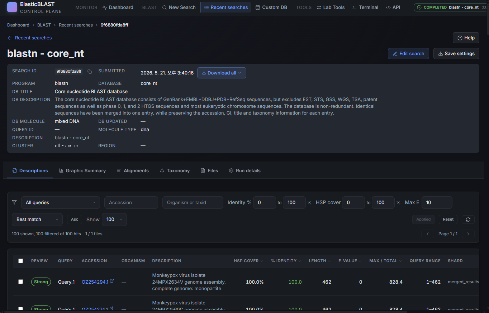

# Results

The Results page is the detail view for a single BLAST search. It opens when you click a row on [Recent searches](jobs.md) or follow a `/blast/jobs/<jobId>` link from a submit toast.

## Overview

The page is built around three regions:

1. **Job header** — NCBI-style metadata about the search.
2. **Sticky tab bar** — switches the body between Descriptions, Graphic Summary, Alignments, Taxonomy, Files, and Run details.
3. **Body** — the table, panel, or timeline for the active tab.

## Job Header

The header is laid out in four lines, top to bottom:

1. A `< Recent searches` back link plus a **Help** menu with links to NCBI BLAST documentation.
2. Job title with **Cancel**, **Edit search**, and **Duplicate** actions on the right. Cancel is shown only while the search is still running.
3. `Search ID: …` and `Created: …` with **Copy ID** and a **Download all results ▾** combo (BLAST XML, JSON, TSV, ZIP archive).
4. `Program: blastn   Database: …   Query: …   Molecule: dna   Query length: …` — the four facts a researcher checks first to confirm "yes, this is my search".

Cluster, region, and storage account live on the **Run details** tab, not in the header.

## Tabs

| Tab | What it shows |
| --- | --- |
| Descriptions | NCBI-style **"Sequences producing significant alignments"** table — hit accession, definition, length, score, E-value, identity, coverage. Sort and per-hit links to NCBI. |
| Graphic Summary | The familiar coloured-bar plot showing where each hit aligns along the query. |
| Alignments | Pairwise alignment view for each hit, with score/E-value/identity per HSP. |
| Taxonomy | Organism rollup of the current hit set, grouped by lineage. |
| Files | The raw result files in Storage — merged XML, per-shard outputs, support files, and (for failed runs) debug logs. Click **Download** to stream a file through the API. |
| Run details | Execution timeline, per-pod / per-shard status, sharding mode, warmup state, and the resolved BLAST command. |

The active tab is encoded in `?tab=…` so deep links survive a reload and browser back/forward work as expected.

## Run States You Will See

| Body state | When it appears | What to do |
| --- | --- | --- |
| Result tables (Descriptions / Graphic / Alignments / Taxonomy) | The merged result file is published and parsable. | Read the hits; download from the header combo when needed. |
| `Search failed during the <step> step.` | The job ended in a failed state. | Open **Run details** for diagnostics; use the terminal only if you need to inspect logs directly. |
| `Running` placeholder | The job is still executing and no result file has been published yet. | Stay on the page — it polls automatically and switches to the result view when artefacts appear. |
| `Cannot load results — missing Azure configuration.` | No subscription or storage account is selected. | Open the Dashboard and finish the setup wizard. |
| Storage locked panel | `publicNetworkAccess` is `Disabled` and the browser is outside the platform VNet (typical for a developer laptop). | This is the expected production posture. Either run the operation from inside the deployed Container App or use the local-debug helper documented in [Storage Network Isolation](../../../.github/copilot-instructions.md#9-storage-network-isolation-hard-requirement). |
| `No result files` | The run completed without publishing any usable artefacts. | Check **Run details** for shard-level errors; consider re-submitting with a smaller query. |

Failed runs still expose **Edit search** and **Duplicate** in the header so you can re-submit with a tweaked configuration.

## Downloading Results

The **Download all results** combo in the header streams a packaged artefact through the API. The combo offers BLAST XML, JSON, TSV (descriptions), and a ZIP that bundles every shard output.

For individual files, switch to the **Files** tab and download row-by-row. Downloads always go through the API sidecar — the browser never receives a Storage SAS URL.

## Screenshot Targets

Screenshots for this page are defined by this manifest target:

- `results-desktop`

Use a completed demo job with a small query (for example the monkeypox sample used in the [API Reference](api-reference.md)) so the Descriptions tab is populated. Mask UPNs, subscription IDs, full storage account names, and any private query identifiers before publishing.
