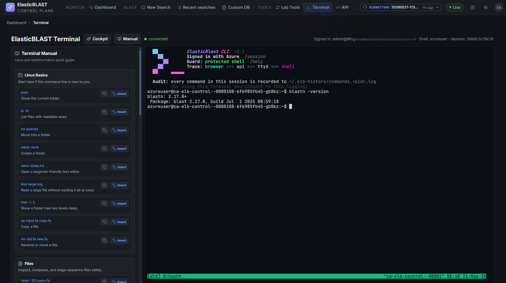

# Browser Terminal

The Browser Terminal puts a shell inside the same network and identity boundary as the control plane, so operators never need to install Azure tools on a laptop. It is reached from the sidebar **Terminal** entry or any `/terminal` link.

## When To Use It

Use the browser terminal when you genuinely need a shell — for example:

- Running `elastic-blast` or `kubectl` commands the dashboard does not expose yet.
- Inspecting AKS pod logs or `kubectl describe` output for a failed job.
- Driving `azcopy` between the workspace Storage account and a curated dataset.
- Running `az` queries against the workspace under the shared user-assigned managed identity.

For everything researchers do day-to-day — submitting a search, watching a job, downloading results — keep using the Dashboard, [New Search](new-search.md), [Recent searches](jobs.md), and [Results](results.md). The dashboard wraps the same operations safely (no token paste, no command typos, no destructive defaults).

## Overview



The page has two regions:

- **Terminal pane** (centre) — an [xterm.js](https://xtermjs.org/) view connected through a WebSocket proxy to the `terminal` sidecar's loopback [ttyd](https://github.com/tsl0922/ttyd). Standard keyboard shortcuts work; output scrollback is kept for 10,000 lines.
- **Side panel** (right) — a **Cockpit** view by default, with a **Manual** view available from the panel toggle. The cockpit surfaces curated workflows, command snippets, terminal health, and Azure CLI sign-in status; the manual pulls full how-tos for `elastic-blast`, `kubectl`, and `azcopy`. Snippet rows let you **Copy** to the clipboard or **Insert** directly into the live terminal.

Status pills near the prompt show the connection state — `connecting`, `connected`, `disconnected`, or `error` — and the caller display name plus the shell user the session is running as.

## How The Connection Works

The browser cannot send `Authorization` headers on a WebSocket upgrade, so the page uses a two-step exchange:

1. `POST /api/terminal/ticket` — the api sidecar validates your MSAL bearer and returns a short-lived single-use ticket.
2. `WebSocket /api/terminal/ws?ticket=<ticket>` — the api proxies bytes to the `terminal` sidecar's loopback ttyd (`127.0.0.1:7681`).

The `terminal` sidecar ships with the validated ElasticBLAST toolchain (`elastic-blast`, `kubectl`, `azcopy`, `az`, `BLAST+`). `$HOME` is persisted on an Azure Files share, so scripts, history, and `az login` state survive Container App revisions. The terminal is never exposed directly to the internet — only the api sidecar can reach it.

## Sign In For Azure Commands

The cockpit shows the current Azure CLI sign-in state and refreshes it on demand. If `az` commands fail with `Please run 'az login' to setup account`, run the suggested device-code login from the cockpit hint:

```bash
az login --use-device-code
```

The browser tab keeps focus while you complete the device-code flow. When sign-in completes, the cockpit pill flips to **Signed in** and shows the active tenant and subscription.

The terminal uses the shared user-assigned managed identity for SDK calls made by the api / worker. The interactive `az` shell sign-in is for ad-hoc CLI commands you type into this terminal — it does not change the identity the dashboard backend uses.

## Safety Rules

The terminal is a real shell — treat it like one:

- Read commands before you press Enter, especially ones the cockpit marks with a destructive impact badge.
- Never paste tokens, subscription IDs, or full SAS URLs into a shared screen.
- Prefer the cockpit's curated snippets over typing flag combinations from memory.
- Use `kubectl --context …` deliberately; the session inherits whatever `kubeconfig` the sidecar shipped with.
- Close the tab when you are done. Tickets expire automatically, but tidy disconnects are still better.

## Troubleshooting

| Symptom | Likely cause | What to do |
| --- | --- | --- |
| Connection stays on `connecting` | Ticket exchange timed out (default 8 s). | Refresh the page; if it persists, check the api sidecar health from the Dashboard. |
| `Terminal unavailable` page | The terminal bundle failed to load (route is feature-flagged). | Click **Reload Terminal**; if the feature flag is off in your deployment, the link will stay hidden. |
| `error` status with `403` | MSAL bearer rejected. | Sign back in to the dashboard tab and reopen `/terminal`. |
| `az` commands say `Please run 'az login'` | The shell session is not signed in. | Run `az login --use-device-code` from the cockpit hint. |
| Commands run but Storage is unreachable | Production Storage has `publicNetworkAccess: Disabled` — the sidecar reaches it via the platform private endpoint. | Run the command from inside the deployed Container App, not from a laptop tunnelling to a dev cluster. |

## Screenshot Targets

Screenshots for this page are defined by this manifest target:

- `terminal-desktop`

Before capture: connect a fresh session, clear the scrollback, and run something harmless like `elastic-blast --version` or `az account show --query name`. Mask subscription IDs, UPNs, account names, and tokens. Do not publish a screenshot of an active `az login` device-code prompt.
